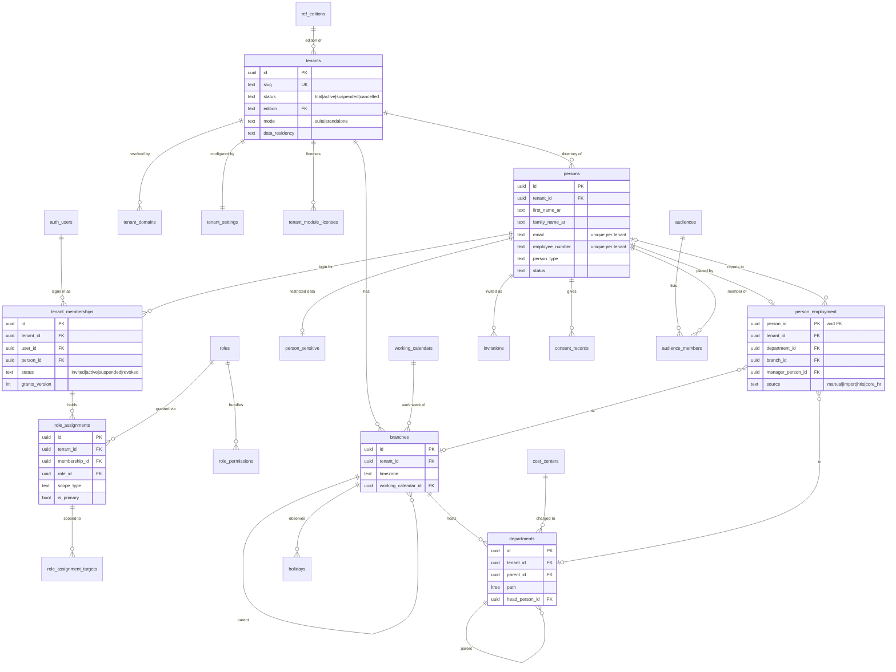
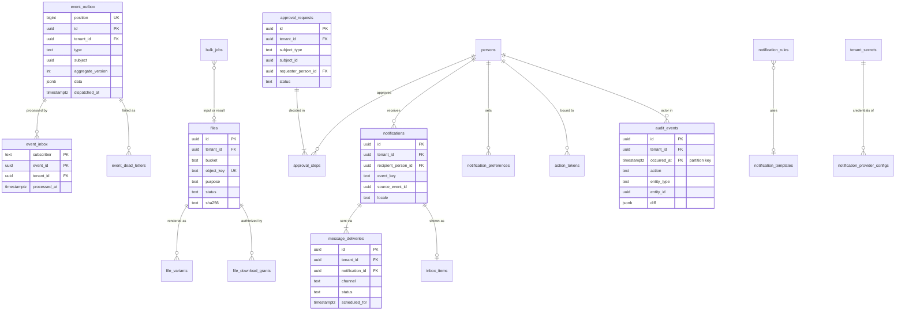
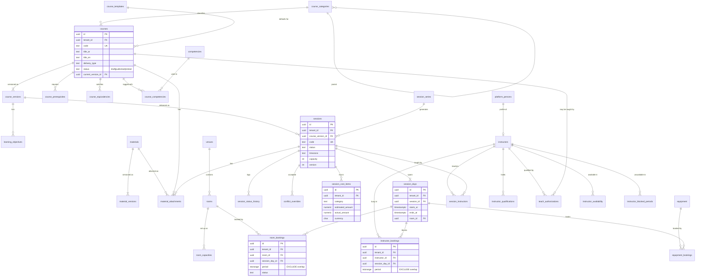
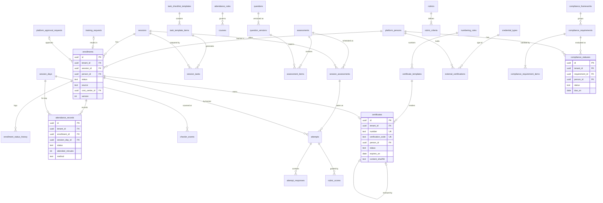
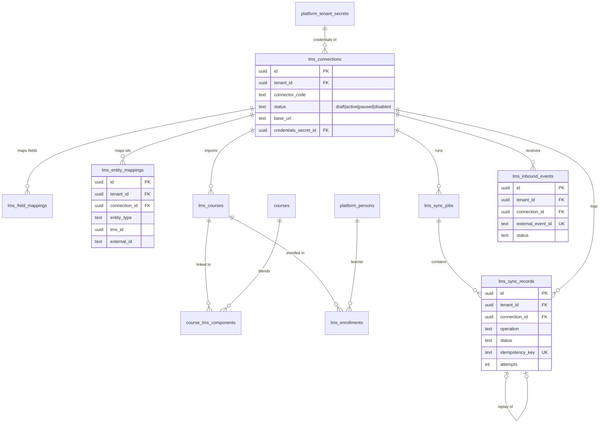

# Jadarat TMS — R1 Logical Data Model

**Status:** Proposed · **Date:** 30 Sep 2026 · **Backlog:** T-M1-B13 · **Related:** BRD §10 (DR-1…7), Appendix C, §6 (R1 requirements), §13; Feature list R1 (96 features); `docs/delivery/BACKLOG.md` epics M2–M6; ADR 0001 (schemas and ownership), ADR 0002 (tenancy/RLS), ADR 0003 (identities, roles, scopes), ADR 0004–0008; `docs/architecture/migration-conventions.md`

This is a **logical** model: it fixes tables, key columns, keys, relationships, important constraints/indexes and status values for R1. Column types are indicative; the SQL migrations written per epic (M2–M6) are the physical source of truth and may add columns without changing this document's decisions. Tables for R2+ features are listed only where R1 must reserve a shape (§6).

---

## 1. Conventions (decisions)

### 1.1 Schemas and ownership (ADR 0001)
| Schema | Owner | Contents |
|---|---|---|
| `platform` | Jadarat Platform (shared by all suite modules) | Tenancy, editions, org structure, calendars, people directory, memberships, roles, audiences, consent, approvals, files metadata, events, notifications, audit, secrets, bulk jobs, saved views |
| `tms` | Jadarat TMS module | Catalog, scheduling, resources, instructors, requests, enrollment, logistics, attendance, assessments, credentials, compliance, session costs, LMS integration, report snapshots |
| `private` | Platform (security) | Security-definer/helper functions (`current_tenant_id()`, storage helpers, `normalize_ar()`), never exposed through the API |
| `graphile_worker` | Third-party (ADR 0005) | Job queue; infrastructure, no tenant access |

- `tms` may reference `platform` tables by FK; `platform` never references `tms` (it stores `subject_type` + `subject_id` without FK where it must point back, e.g., approvals, files owner, audit).
- Neither schema is exposed through the Data API (ADR 0002 §5).

### 1.2 Table classes
| Class | Marker | Rule |
|---|---|---|
| Tenant-scoped | **T** | `tenant_id` + restrictive `tenant_isolation` policy (ADR 0002 §6) + isolation tests. Default for everything. |
| Global reference | **G** | No `tenant_id`; RLS enabled with `select … using (true)` for `authenticated`; written only by migrations/platform console (admin path). Name prefix `ref_`. On the catalog-check allow-list. |
| Infrastructure | **I** | No access for `authenticated`/`anon`; used by specific roles (`app_queue`) or the admin path. On the allow-list with a reason. |

### 1.3 Keys
- Every **T** table: `id uuid primary key default gen_random_uuid()`, `tenant_id uuid not null default private.current_tenant_id() references platform.tenants(id)`, and `unique (tenant_id, id)` — the **composite key** used as the target of all foreign keys between tenant tables: `foreign key (tenant_id, x_id) references <parent>(tenant_id, id)` (ADR 0002 §6). Pure link tables use `primary key (tenant_id, a_id, b_id)`.
- UUID v4 now; switch the default to `uuidv7()` when PostgreSQL 18 is available on every deployment target (no schema change — verify Supabase PG version).
- Business codes (course code, session code, certificate number, employee number) are separate `text` columns with tenant-scoped unique indexes; they are never primary keys.
- External system IDs live only in mapping tables (`tms.lms_entity_mappings`, DR-7), plus `source`/`source_ref` on directory projections.

### 1.4 Standard columns
| Group | Columns | Applies to |
|---|---|---|
| **[std]** | `created_at timestamptz not null default now()`, `created_by uuid` (acting **person** id; null for system/integration actors), `updated_at timestamptz not null default now()`, `updated_by uuid`, `version integer not null default 1` | All mutable **T** tables. All [std] columns maintained by the trigger `private.stamp_row()` from the verified claims (callers cannot set or forge them; `id` is immutable — T-M2-01); walking-skeleton tables still use `private.set_updated_at()` until they gain the [std] columns; `version` is the optimistic-concurrency token (ETag, ADR 0011) and the event `aggregateversion` (ADR 0004). No FK on `created_by`/`updated_by` (full actor detail lives in the audit log). |
| **[sd]** | `deleted_at timestamptz`, `deleted_by uuid` | Business entities that users can "delete" (DR-6). Trigger `private.stamp_soft_delete()` records when and by whom (callers only set or clear `deleted_at`). Unique indexes are partial (`where deleted_at is null`). Services exclude deleted rows by default; hard delete only by retention/erasure jobs with audit. |
| **[ao]** | `created_at`, `created_by` only; no `UPDATE`/`DELETE` grants | Append-only history/log tables (status histories, check-in events, consent records, audit). |

Status values that represent lifecycle (e.g., `archived`, `retired`) are **not** soft delete; they stay visible in history and reports.

### 1.5 Bilingual text — decision: `*_ar` / `*_en` columns
User-facing text that learners see exists as two columns (`title_ar`, `title_en`), as BRD DR-3 states, with `check (coalesce(title_ar, title_en) is not null)` for required names and display fallback to the tenant default language.

Why columns rather than one `jsonb` (`{"ar": …, "en": …}`):
- the product has exactly two peer languages (NFR-L10N-01/12) — no open-ended locale list to model;
- per-language generated search columns, trigram indexes and `not null`/length checks are straightforward on columns;
- typed Drizzle models and zod schemas stay simple; exports/imports map 1:1 to "Arabic name / English name" headers (IAM-04);
- Arabic-only tenants simply leave `*_en` null.

`jsonb` is used only where labels are part of a tenant-defined structure (custom-field options, question options, certificate layout, template variables). Rich text (`description_ar/en`) is stored as server-sanitized HTML (allow-listed tags; editor chosen in M3).

### 1.6 Money
`<name>_amount numeric(19,4)` + `<name>_currency char(3)` (FK to `platform.ref_currencies`, ISO 4217). Where a converted value is stored: `fx_rate_to_base numeric(18,8)`, `fx_rate_on date`, `<name>_base_amount numeric(19,4)` (DR-4). Rounding to the currency's `minor_units` (3 for OMR/BHD/KWD — NFR-L10N-09) happens when amounts are finalized and in presentation. No floating-point types for money.

### 1.7 Time
- Instants: `timestamptz` (UTC), suffix `_at` (DR-2).
- Calendar dates without time: `date`, suffix `_on` (holiday dates, expiry dates, hire date).
- Wall-clock patterns: `time` + IANA `timezone text` on the owning row (branch, session, series); recurrence as RFC 5545 `rrule text` evaluated in that timezone.
- Intervals used for overlap checks: `tstzrange` (`period`), with GiST exclusion constraints (`btree_gist`).
- Hijri values are never stored as dates; they are derived for display (ADR 0007). Exception: `hijri_month/hijri_day` rules for Hijri-based holidays and Hijri year keys in certificate numbering.

### 1.8 Status columns
`text` + named `check` constraint (`<table>_status_check`), mirrored by a zod enum in `packages/contracts`; values are lower snake_case (§5). Chosen over PostgreSQL `enum` types because values must evolve with expand/contract migrations (removing/renaming enum labels is not supported). Status transitions are enforced in services (state machines) and logged in history tables where the BRD asks for reasons.

### 1.9 People and membership references (ADR 0002/0003)
- Business rows reference **`platform.persons`** via `(tenant_id, person_id)` — learners, instructors, managers, approvers, owners.
- `auth.users` is referenced only by `platform.tenant_memberships`, `platform.session_context`, `platform.platform_staff`, `platform.file_download_grants` and access-control helpers. A person may exist without a login.
- Role assignments hang off **memberships**, not persons.

### 1.10 Custom fields (ADM-11)
Definitions in `platform.custom_field_definitions`; values in a `custom_fields jsonb not null default '{}'` column on persons, courses, sessions, enrollments, instructors and venues, validated by the application against the definitions; GIN (`jsonb_path_ops`) index; expression indexes for fields marked filterable when needed.

### 1.11 Search (CAT-10, NFR-L10N-05)
Generated stored columns using the immutable `private.normalize_ar()` (ADR 0007 §9): `search_text` (normalized AR+EN titles, codes, tags) with `to_tsvector('simple', …)` GIN index and a `gin_trgm_ops` index on normalized titles/names. Arabic stemming decided in the M3 search spike.

### 1.12 Personal and secret data
- Column comments carry a classification tag: `pii:direct`, `pii:indirect`, `sensitive` (special category/restricted, e.g., DOB, gender, national ID), `secret`. Export (FR-AUD-02, R2), erasure (FR-AUD-04, R2) and log scrubbing tooling read these tags.
- National IDs, bank details and credentials are stored encrypted by the application (ADR 0010 §5) as `*_ciphertext bytea` + `*_key_id`, with an HMAC `*_hash` when uniqueness/search is needed.
- Restricted attributes live in separate tables (`platform.person_sensitive`) so ordinary queries cannot select them accidentally.

### 1.13 Indexing rules
- Every composite FK has a matching index starting with `tenant_id`.
- List screens get a composite index matching their filter + sort, starting with `tenant_id` (e.g., `(tenant_id, starts_at)` on session days).
- Partial indexes for "active" subsets (`where deleted_at is null`, `where status in (…)`).
- Materialized views are **not** used for tenant data (RLS does not apply to them); reporting uses `security_invoker` views and snapshot tables with RLS.

### 1.14 Relation to the walking-skeleton migrations
The M1 walking skeleton (`supabase/migrations/20260930120000…120400`) already creates roles (`app_server`, `app_worker`, `tenant_guard`), `private` helpers (`current_tenant_id()` with claim validation, `try_uuid()`, `set_updated_at()`), the access-token hook and minimal forms of `tenants`, `tenant_domains`, `persons`, `tenant_memberships`, `session_context` and `audit_events`. M2 migrations **expand** these tables to the shape in §2 (additive columns; e.g., persons name parts, `tenants.edition` FK to `ref_editions`, `[std]` columns such as `version`, audit `actor_type`/`before`/`after`) — never by recreating them. Monthly partitioning of `audit_events` is introduced before production data exists (converting a populated table later is costly). The `app_queue` role (ADR 0004/0005) is added with the worker migrations.

---

## 2. Schema `platform`

Legend: **Cl.** = class (§1.2). Features in the last column are R1 feature IDs unless marked.

### 2.1 Tenancy, editions, console
| Table | Cl. | Key columns | Keys / constraints / indexes | Features |
|---|---|---|---|---|
| `tenants` | T (self) | id, slug, status `trial/active/suspended/cancelled`, edition (→ `ref_editions.code`), mode `suite/standalone`, name_ar/en, legal_name_ar/en, cr_number, vat_number, industry, hq_country_code, default_locale, arabic_only, default_timezone, default_currency, fiscal_year_start_month, authorized_signatory_ar/en, data_residency, trial_ends_at, [std] | PK id (no tenant_id); unique slug; policy `id = current_tenant_id()`; check month 1–12 | ADM-01/02, DEP-01/05, STE-01, SUB-01 |
| `tenant_domains` | T | hostname, kind `subdomain/custom`, verified_at | unique lower(hostname) (global — a host maps to one tenant) | ADR 0002 |
| `tenant_settings` | T | tenant_id (PK), security_policy jsonb (password, lockout, session/inactivity timeout, max concurrent sessions, MFA enforcement by role), calendar_display `gregorian/hijri/dual`, numerals `latn/arab`, quiet_hours jsonb, attendance_defaults jsonb (QR rotation 60 s, geofence 200 m), instructor_qualification_rule `hard/soft`, settings_version | zod-validated jsonb; one row per tenant | IAM-12/13, SCH-07, NTF-07, ATT-02/03, INS-03 |
| `tenant_branding` | T | tenant_id (PK), logo_full/icon/light/dark_file_id, primary/secondary/accent_color, font_ar_code, font_latin_code, contrast_ok | colors `check (~ '^#[0-9a-f]{6}$')`; FKs to `files` | ADM-07 |
| `tenant_module_licenses` | T | module_code `tms/core_hr/…`, status, valid_from, valid_until | PK (tenant_id, module_code) | STE-01 |
| `tenant_feature_overrides` | T | feature_key, enabled, reason | PK (tenant_id, feature_key) | ADM-13 |
| `tenant_usage_daily` | T | usage_on, metric, value | PK (tenant_id, usage_on, metric) | ADM-14, SUB-01 |
| `ref_editions` | G | code (PK), name_ar/en, limits jsonb, features text[] | — | SUB-01, ADM-13 |
| `platform_staff` | I | user_id (PK → auth.users), status | — | ADM-17 |
| `support_grants` | T | staff_user_id, target_user_id, reason, ticket_ref, starts_at, expires_at, approved_by_staff_user_id, revoked_at | check expires_at > starts_at; tenant admins can read their tenant's grants | ADM-17 |
| `platform_audit_events` | I | platform-level actions (provisioning, plan changes, grants, admin-client use) | append-only; partitioned monthly | ADM-17 |
| `announcements` | G | title_ar/en, body_ar/en, audience, starts_at, ends_at | — | ADM-17 |

### 2.2 Organization and calendars
| Table | Cl. | Key columns | Keys / constraints / indexes | Features |
|---|---|---|---|---|
| `branches` | T | code, name_ar/en, parent_branch_id, country_code, city_ar/en, address_ar/en, latitude/longitude numeric(9,6), timezone, is_headquarters, working_calendar_id, prayer_method (override), status, [std][sd] | unique (tenant_id, code) where not deleted; partial unique one HQ per tenant; composite self-FK | ADM-04 |
| `departments` | T | code, name_ar/en, parent_id, branch_id, cost_center_id, head_person_id, path `ltree`, sort_order, status, [std][sd] | unique (tenant_id, code); GiST on path (subtree scopes, ADR 0003 `org_units`); trigger maintains path; no cycles | ADM-05 |
| `cost_centers` | T | code, name_ar/en, owner_person_id, status, [std][sd] | unique (tenant_id, code) | ADM-05, FIN-03 |
| `working_calendars` | T | name_ar/en, weekly_pattern jsonb (ISO weekday → list of local `[start,end]` intervals; half-days as short intervals), is_tenant_default, [std] | partial unique one default per tenant | ADM-04, NFR-L10N-06 |
| `working_calendar_overrides` | T | calendar_id, branch_id, kind `ramadan/special`, starts_on, ends_on, weekly_pattern, status `tentative/confirmed`, confirmed_by, confirmed_at | check ends_on ≥ starts_on | NFR-L10N-08 (Ramadan mode) |
| `holidays` | T | branch_id (null = tenant-wide), ref_holiday_id, name_ar/en, starts_on, ends_on, status `tentative/confirmed`, confirmed_by/at, [std][sd] | index (tenant_id, starts_on) | SCH-05, NFR-L10N-07 |
| `ref_countries` | G | code char(2) PK, name_ar/en, default_currency, default_timezone, phone_prefix | — | ADM-02/04 |
| `ref_currencies` | G | code char(3) PK, minor_units, name_ar/en | — | NFR-L10N-09 |
| `ref_country_calendars` | G | country_code PK, weekly_pattern, prayer_method, jumuah_block | legally validated defaults | NFR-L10N-06/08 |
| `ref_public_holidays` | G | country_code, code, name_ar/en, kind `fixed_gregorian/hijri_based/one_off`, hijri_month, hijri_day, length_days, year, starts_on, ends_on, status `tentative/confirmed`, source_ref, legal_validated | unique (country_code, code, year) | NFR-L10N-07 |

### 2.3 People directory and access
| Table | Cl. | Key columns | Keys / constraints / indexes | Features |
|---|---|---|---|---|
| `persons` | T | person_type `employee/contractor/external_instructor/provider_staff`, first/father/grandfather/family_name_ar, same `_en`, display_name_ar (required)/display_name_en, email (stored lower-case), employee_number, mobile_e164, preferred_locale, photo_file_id, nationality_code, is_national, status `active/inactive/archived`, deactivated_at, search_text (generated), custom_fields, [std][sd] (T-M2-02 implemented: type, name parts, mobile, locale, nationality, deactivated_at, [std]; `archived`, [sd], photo, search_text and custom_fields come later) | unique (tenant_id, email) where email not null and not deleted; unique (tenant_id, employee_number) where not null (FR-IAM-01); `mobile_e164 ~ '^\+[1-9][0-9]{6,14}$'`; trigram index on normalized names | IAM-01/05, STE-02, LRN-07 |
| `person_employment` | T | person_id (1:1: `unique (tenant_id, person_id)` with its own `id`, so the [std] trigger applies; person_id immutable), branch_id, department_id, cost_center_id, job_title_ar/en, grade, employment_category `management/professional/technical/operational/other`, manager_person_id, hire_on, end_on, source `manual/import/hris/core_hr`, source_ref, [std] | index (tenant_id, manager_person_id) for `direct_reports`; (tenant_id, department_id); manager chain acyclic, ≤ 50 levels (trigger). **Implemented in T-M2-02 without** cost_center_id (with cost centers, EP-M2-TEN) and employment_category (restricted HR field, FR-IAM-02, with `person_sensitive`) | IAM-01/02, MGR-01…04, STE-01/02 |
| `person_sensitive` | T | person_id (PK/FK), gender, date_of_birth, national_id_ciphertext, national_id_key_id, national_id_hash, [std] | readable only with `platform.person.read_sensitive` (policy + service); unique (tenant_id, national_id_hash) | IAM-02, NFR-SEC-03 |
| `tenant_memberships` | T | user_id (→ auth.users), person_id, status `invited/active/suspended/revoked`, grants_version, activated_at, last_sign_in_at, [std] | unique (tenant_id, user_id); unique (tenant_id, person_id) | IAM-03/05, ADR 0002/0003 |
| `session_context` | T (by session) | session_id (PK, the Supabase Auth session), user_id, active_tenant_id, updated_at | read by the access-token hook; written only by the tenant-switch server action (POST) for the caller's own `session_id`; rows removed with the Auth session | ADR 0002 §2–§3 (TM-0001 F-02) |
| `invitations` | T | person_id, email, token_hash, expires_at, sent_count, status `pending/accepted/expired/revoked`, invited_by_person_id, accepted_at, [std] | unique token_hash; check sent_count ≤ 4 (1 + 3 resends) | IAM-03 |
| `roles` | T | code, name_ar/en, description_ar/en, is_system, based_on_role_id, [std][sd] | unique (tenant_id, code); system roles immutable (trigger). **R2 (custom roles)** — R1 system roles live in code + `ref_roles` (ADR 0003 implementation notes, T-M2-03) | IAM-07 |
| `ref_roles` | G | code PK, is_privileged, sort_order | the 14 system role codes; unit test compares with `platform-rbac/system-roles.ts` (T-M2-03) | IAM-07 |
| `role_permissions` | T | role_id, permission_code | PK (tenant_id, role_id, permission_code); FK to `ref_permissions` | IAM-07 |
| `ref_permissions` | G | code PK, module, label_ar/en, risk_level, requires_aal2 | synced from the code registry; CI fails on drift | ADR 0003 |
| `role_assignments` | T | (R1, T-M2-03: membership_id, **role_code → ref_roles**, is_primary, valid_from/until, [std]; scope fixed per system role) membership_id, role_id, scope_type `own/direct_reports/reports_tree/org_units/branches/legal_entity/tenant/assigned`, is_primary, valid_from, valid_until, [std] | partial unique one primary per membership (BR-IAM-1); index (tenant_id, membership_id) | IAM-07, ADR 0003 |
| `role_assignment_targets` | T | assignment_id, target_type `department/branch`, target_id, include_descendants | PK (tenant_id, assignment_id, target_type, target_id) | ADR 0003 |
| `audiences` | T | name_ar/en, kind `static/rule`, rule jsonb (R1: org attributes, person type, hire-date window), status, [std][sd] | rule validated by zod | CAT-03, CRT-07, ENR-03 (IAM-06 builder is R2) |
| `audience_members` | T | audience_id, person_id, source `static/computed`, computed_at | PK (tenant_id, audience_id, person_id); index (tenant_id, person_id) | as above |
| `consent_records` | T | person_id, purpose `whatsapp/geo_checkin/photo_recording/ai_processing`, action `granted/withdrawn`, policy_version, channel, evidence jsonb, occurred_at, [ao] | index (tenant_id, person_id, purpose, occurred_at desc); view `consents_current` | AUD-05 |

### 2.4 Workflow, files, events, jobs
| Table | Cl. | Key columns | Keys / constraints / indexes | Features |
|---|---|---|---|---|
| `approval_requests` | T | module, subject_type, subject_id, requester_person_id, subject_person_id, chain_code (R1 default: line manager → training manager), status `pending/approved/rejected/cancelled/expired`, current_step_no, decided_at, [std] | index (tenant_id, subject_type, subject_id) | ENR-01/02, PLN-01, CRT-03/06, MGR-02, STE-08 |
| `approval_steps` | T | request_id, step_no, approver_rule `line_manager/role/person`, approver_role_code, approver_person_id, status `pending/approved/rejected/skipped/cancelled`, decided_by_person_id, decided_at, comment, channel `web/mobile/email_link`, [std] | unique (tenant_id, request_id, step_no); index (tenant_id, approver_person_id, status) — approvals inbox | MGR-02 |
| `action_tokens` | T | purpose, subject_type, subject_id, person_id, token_hash, expires_at, used_at | unique token_hash; single use | ADR 0008 (approval links) |
| `files` | T | bucket, object_key, purpose, owner_module, owner_type, owner_id, original_name, declared_mime, detected_mime, size_bytes, sha256, status `pending_upload/uploaded/scanning/clean/infected/rejected/error/deleted`, scan_engine_version, upload_expires_at, retention_class, legal_hold, [std][sd] | unique (bucket, object_key); index (tenant_id, owner_type, owner_id) | ADR 0006; CAT-06, ADM-07, INS-02, CRT-06, ATT-11 |
| `file_variants` | T | file_id, variant `thumb/medium`, object_key, width, height, size_bytes | PK (tenant_id, file_id, variant) | ADR 0006 |
| `file_download_grants` | T | file_id, user_id, expires_at | index (file_id, user_id, expires_at); purged hourly | ADR 0006 |
| `bulk_jobs` | T | kind `person_import/bulk_enrollment/report_export`, status `queued/running/succeeded/failed/cancelled`, dry_run, mode `create/upsert/update`, input_file_id, result_file_id, error_report_file_id, progress jsonb, requested_by_person_id, started_at, finished_at, expires_at, [std] | index (tenant_id, requested_by_person_id, created_at desc) | IAM-04, ENR-03, RPT-02 |
| `event_outbox` | T | position (identity), id, type, source, subject, aggregate_type, aggregate_version, data_schema, data jsonb, actor_type, actor_id, on_behalf_of, correlation_id, causation_id, traceparent, occurred_at, dispatched_at | unique position; partial index `where dispatched_at is null` on position; `authenticated`: insert only | ADR 0004 |
| `event_inbox` | T | subscriber, event_id, processed_at | PK (subscriber, event_id) | ADR 0004 |
| `event_dead_letters` | T | event_id, subscriber, attempts, last_error_code, last_error, status `open/replayed/discarded`, failed_at, resolved_by | index (tenant_id, status) | ADR 0004 |
| `scheduled_dispatches` | T | rule_key, subject_type, subject_id, offset_key, dispatched_at | PK (tenant_id, rule_key, subject_id, offset_key) — reminder dedupe | ADR 0005, NTF-08 |
| `tenant_secrets` | T | kind `lms_credentials/provider_credentials/webhook_secret/byok_ai`, ciphertext, key_id, fingerprint, rotated_at, expires_at, [std] | `ciphertext` readable only with system-actor claims (`role = 'system'`, accepted only under `app_worker`, ADR 0002 §6a); write-only for users; decryption only in the worker (ADR 0005 §1) | NFR-SEC-04, LMS-01 |
| `inbound_webhook_inbox` | I | source `lms/notification_provider`, connection_or_provider_id, received_at, headers jsonb (allow-listed), body bytea, size_bytes, status `received/verified/rejected` | inserted by the web tier only through a `private` function; read by `app_queue`/worker; 7-day retention | ADR 0011 §7, LMS-07 |
| `job_failures` | I | tenant_id, task, job_key, attempts, error_code, failed_at | sanitized | ADR 0005 |
| `rate_limit_buckets` | I (unlogged) | key_hash PK, tokens, refilled_at | accessed via `private` function | ADR 0011 |

### 2.5 Notifications, audit, reporting
| Table | Cl. | Key columns | Keys / constraints / indexes | Features |
|---|---|---|---|---|
| `ref_notification_templates` | G | event_key, channel, locale, template_version, subject, body | unique (event_key, channel, locale, template_version) | NTF-02, NFR-L10N-11 |
| `notification_templates` | T | event_key, channel, locale `ar/en`, subject, body (Liquid), is_active, [std] | unique (tenant_id, event_key, channel, locale) | NTF-02 |
| `notification_rules` | T | event_key, enabled, channels text[], recipient_roles text[], timing jsonb (offsets), include_in_digest, quiet_hours_policy, [std] | unique (tenant_id, event_key) | NTF-07/08 |
| `notification_preferences` | T | person_id, category, channel, enabled | PK (tenant_id, person_id, category, channel) | LRN-07 |
| `notification_provider_configs` | T | channel, provider, sender_name, sender_address, credentials_secret_id, is_default, status, [std] | — (platform defaults are deployment config) | NTF-02 |
| `email_sending_domains` | T | domain, status `pending/verified/failed`, dns_records jsonb, verified_at, [std] | unique (tenant_id, domain) | NTF-02 |
| `notifications` | T | recipient_person_id, event_key, source_event_id, subject_type, subject_id, locale, category, [ao] | index (tenant_id, recipient_person_id, created_at desc) | NTF-01/07 |
| `inbox_items` | T | person_id, notification_id, title, body_preview, deep_link, category, read_at, archived_at | deep_link must be a relative path; index (tenant_id, person_id, read_at, created_at desc) | NTF-01, STE-08 |
| `message_deliveries` | T | notification_id, channel, provider, provider_message_id, destination_masked, destination_hash, status `queued/sent/delivered/read/failed/suppressed/deferred`, scheduled_for, sent_at, delivered_at, read_at, failed_at, attempts, error_code | retained 12 months (BR-NTF-2); index (tenant_id, status, scheduled_for); unique (provider, provider_message_id) | NTF-02/07/08 |
| `calendar_feeds` | T | person_id (PK), token_hash, revoked_at | unique token_hash | LRN-03 |
| `audit_events` | T | id, occurred_at, actor_type, actor_user_id, actor_person_id, on_behalf_of_user_id, support_grant_id, ip inet, device_id, user_agent_family, action, entity_type, entity_id, before jsonb, after jsonb, reason, correlation_id, ai_assisted | **partitioned monthly** by occurred_at; PK (id, occurred_at); no UPDATE/DELETE for any app role (grant + trigger); indexes (tenant_id, occurred_at desc), (tenant_id, entity_type, entity_id, occurred_at desc), (tenant_id, actor_person_id, occurred_at desc). Handling of restricted values in diffs vs. erasure (per-person crypto-shredding or redaction) and hash-chain anchoring are pending decision TM-0001 F-08 | AUD-01, ADM-14 |
| `saved_views` | T | owner_person_id, report_key, name, filters jsonb, columns jsonb, sort jsonb, is_shared, [std] | — | RPT-02 |

### 2.6 Diagrams — `platform`

**Tenancy, directory, access and organization**

**Platform services (events, files, approvals, notifications, audit)**

---

## 3. Schema `tms`

All tables are **T** (tenant-scoped). `platform_*` nodes in diagrams are `platform` tables referenced by FK.

### 3.1 Catalog (EP-M3-CAT)
| Table | Key columns | Keys / constraints / indexes | Features |
|---|---|---|---|
| `course_categories` | parent_id, code, name_ar/en, path ltree, sort_order, [std][sd] | unique (tenant_id, code) | CAT-01 |
| `courses` | code, title_ar/en, short_description_ar/en, description_ar/en, category_id, tags text[], delivery_type `ilt/vilt/hybrid/ojt/conference/workshop/exam/elearning`, duration_hours numeric(6,2), duration_days numeric(4,1), min_participants, max_participants, languages text[], target_audience_id (→ platform.audiences), thumbnail_file_id, template_id, attendance_rule_id, certificate_template_id, l1_survey_assessment_id, is_mandatory, status `draft/published/retired`, current_version_id, search_text (generated), custom_fields, [std][sd] | unique (tenant_id, code) where not deleted; check min ≤ max; GIN on search tsvector and tags; trigram on normalized titles | CAT-01/02/03/10 |
| `course_versions` | course_id, version_no, snapshot jsonb, published_at, [std] | unique (tenant_id, course_id, version_no). R1 creates v1 automatically; version-on-change rules are R2 (FR-CAT-04) — sessions already reference versions | SCH-01 |
| `course_templates` | name_ar/en, delivery_type, required_setup_style, required_equipment jsonb, task_checklist_template_id, attendance_rule_id, certificate_template_id, l1_survey_assessment_id, default_cost_lines jsonb, [std][sd] | — | CAT-02, FIN-03 |
| `course_template_assessments` | template_id, assessment_id, purpose `pre/post/exam/practical` | PK (tenant_id, template_id, assessment_id) | CAT-02 |
| `learning_objectives` | course_version_id, sort_order, text_ar/en, [std] | index (tenant_id, course_version_id, sort_order) | CAT-05 |
| `competencies` | code, name_ar/en, category_ar/en, source `tms/perf_skills`, external_ref, status, [std][sd] | unique (tenant_id, code). Minimal R1 list for tagging; projection of Performance & Skills in suite mode | CAT-05 |
| `course_competencies` | course_id, competency_id, target_level smallint | PK (tenant_id, course_id, competency_id); check level 1–5 | CAT-05 |
| `course_prerequisites` | course_id, group_no, prerequisite_type `course/lms_course/competency_level`, required_course_id, required_lms_course_id, required_competency_id, required_level, [std] | check exactly one target per type; groups are OR-sets combined with AND | CAT-03 |
| `course_equivalencies` | course_id, equivalent_course_id | PK (tenant_id, course_id, equivalent_course_id); check different courses | CAT-03 |
| `materials` | title_ar/en, kind `file/link`, classification `trainer_only/learner_prework/learner_handout/post_course`, current_version_id, [std][sd] | — | CAT-06 |
| `material_versions` | material_id, version_no, file_id, url, notes, [ao] | unique (tenant_id, material_id, version_no); check exactly one of file_id/url; url https | CAT-06 |
| `material_attachments` | material_id, course_id, session_id, visible_from_at, visible_until_at, [std] | check exactly one of course_id/session_id | CAT-06, INS-05 |

### 3.2 Scheduling, resources, instructors, costs (EP-M3-SCH/RES/INS)
| Table | Key columns | Keys / constraints / indexes | Features |
|---|---|---|---|
| `session_series` | course_version_id, rrule, dtstart_local, timezone, until_on, occurrence_count, day_template jsonb, [std] | — | SCH-01 |
| `sessions` | course_id, course_version_id, series_id, code, title_override_ar/en, delivery_type, status (§5), status_reason, timezone, branch_id, default_venue_id, capacity, min_participants, registration_opens_at, registration_closes_at, visibility `hidden/audience/tenant`, audience_id, min_enrollment_policy jsonb (warn/confirm/cancel days), confirmed_at, started_at, completed_at, cancelled_at, custom_fields, [std][sd] | unique (tenant_id, code) (BR-SCH-3); index (tenant_id, status); BR-SCH-1 (venue/link + primary instructor before `confirmed`) enforced by service + constraint trigger | SCH-01/02/08 |
| `session_days` | session_id, day_no, starts_at, ends_at, is_mandatory, venue_id, room_id, virtual_meeting_url, notes, [std] | unique (tenant_id, session_id, day_no); check ends_at > starts_at; index (tenant_id, starts_at) — calendars (NFR-PERF-03) | SCH-01/03 |
| `session_status_history` | session_id, from_status, to_status, reason_code, reason_text, [ao] | index (tenant_id, session_id, created_at) | SCH-02 |
| `session_instructors` | session_id, instructor_id, role `primary/co/assistant`, session_day_id (null = all days), [std] | partial unique one `primary` per session | SCH-01, INS-05 |
| `instructor_bookings` | instructor_id, session_day_id, period tstzrange, status `tentative/confirmed/released`, [std] | **EXCLUDE USING gist (tenant_id WITH =, instructor_id WITH =, period WITH &&) WHERE (status <> 'released')** — hard double-booking impossible | SCH-05 |
| `conflict_overrides` | session_id, session_day_id, conflict_type `instructor_unavailable/instructor_limit/unqualified_instructor/room_capacity/learner_overlap/holiday/weekend/equipment_shortage`, details jsonb, reason, [ao] | — | SCH-05 |
| `venues` | name_ar/en, kind `internal/external`, branch_id, address_ar/en, latitude, longitude, map_url, contacts jsonb (pii), amenities text[], parking_ar/en, notes_ar/en, wheelchair_access, prayer_room_men, prayer_room_women, women_only_facilities, first_aid, catering_available, geofence_radius_m (default 200), status, custom_fields, [std][sd] | check geofence 20–5000 m | RES-01/07, ATT-03 |
| `venue_photos` | venue_id, file_id, sort_order | PK (tenant_id, venue_id, file_id) | RES-01 |
| `rooms` | venue_id, code, name_ar/en, fixed_equipment text[], status, [std][sd] | unique (tenant_id, venue_id, code) | RES-02 |
| `room_capacities` | room_id, setup_style `classroom/u_shape/theatre/boardroom/cabaret/lab`, capacity | PK (tenant_id, room_id, setup_style); check capacity > 0 | RES-02 |
| `room_bookings` | room_id, session_day_id, setup_style, period tstzrange, status `tentative/confirmed/released`, [std] | **EXCLUDE USING gist (tenant_id WITH =, room_id WITH =, period WITH &&) WHERE (status <> 'released')** | RES-02, SCH-05 |
| `equipment` | equipment_type, code, name_ar/en, quantity, venue_id, branch_id, condition `good/needs_repair/out_of_service`, status, [std][sd] | unique (tenant_id, code); check quantity ≥ 0 | RES-03 |
| `equipment_bookings` | equipment_id, session_day_id, quantity, period, status, [std] | availability (Σ overlapping ≤ quantity) checked in service under a per-equipment advisory lock | RES-03 |
| `instructors` | person_id, kind `internal/external`, bio_ar/en, specializations text[], languages jsonb (language + dialect), employer_ar/en, max_sessions_week, max_hours_week, max_sessions_month, max_hours_month, travel_willing, status, custom_fields, [std][sd] | unique (tenant_id, person_id) | INS-01/04 |
| `instructor_preferred_venues` | instructor_id, venue_id | PK (tenant_id, instructor_id, venue_id) | INS-04 |
| `instructor_qualifications` | instructor_id, title_ar/en, issuer_ar/en, credential_no, issued_on, expires_on, evidence_file_id, status `valid/expiring/expired`, [std][sd] | index (tenant_id, expires_on) | INS-02 |
| `teach_authorizations` | instructor_id, course_id, course_version_id, qualified_on, expires_on, status `active/expired/revoked`, [std] | unique (tenant_id, instructor_id, course_id) | INS-03 |
| `instructor_availability` | instructor_id, weekday 1–7, start_time, end_time, valid_from, valid_until, [std] | check end_time > start_time | INS-04 |
| `instructor_blocked_periods` | instructor_id, period tstzrange, reason, [std] | GiST index on period | INS-04 |
| `session_cost_items` | session_id, category `instructor/venue/equipment/materials/catering/travel/other`, description_ar/en, basis `per_session/per_day/per_participant/per_hour`, quantity, unit_amount, estimated_amount, actual_amount, currency, fx_rate_to_base, fx_rate_on, estimated_base_amount, actual_base_amount, source `template/manual`, [std][sd] | money per §1.6; allocation to participants' cost centers via `security_invoker` view over `enrollments.cost_center_id` | FIN-03 |

### 3.3 Requests, enrollment, logistics (EP-M4)
| Table | Key columns | Keys / constraints / indexes | Features |
|---|---|---|---|
| `training_requests` | requester_person_id, subject_person_id, request_type `catalog_course/external`, course_id, session_id, title_ar/en, provider_name, justification, competency_id, estimated_cost_amount/currency, preferred_from_on, preferred_to_on, status (§5), approval_request_id, resulting_enrollment_id, submitted_at, decided_at, [std][sd] | index (tenant_id, subject_person_id, status) | PLN-01 |
| `training_request_attachments` | request_id, file_id | PK (tenant_id, request_id, file_id) | PLN-01 |
| `enrollments` | session_id, person_id, status (§5), source `self/manager/admin/bulk/training_request/recertification/compliance`, nominated_by_person_id, message, deadline_on, approval_request_id, terms_accepted_at, cost_center_id (snapshot at enrollment), cancelled_by_role `learner/manager/admin`, cancel_reason, transferred_to_enrollment_id, attended_minutes, attendance_pct, final_score, passed, completion_evaluated_at, completed_at, eligibility_flags jsonb (e.g., subsidy absence threshold), custom_fields, [std] | partial unique (tenant_id, session_id, person_id) where status not in (`rejected`,`cancelled`,`transferred`); indexes (tenant_id, person_id, status), (tenant_id, session_id, status). Not soft-deletable (training record, DR-5) | ENR-01/02/03/13, MGR-02/04, LRN-01, ATT-09 |
| `enrollment_status_history` | enrollment_id, from_status, to_status, reason, [ao] | index (tenant_id, enrollment_id, created_at) | ENR-01…03 |
| `task_checklist_templates` | name_ar/en, applies_to `course/delivery_type/venue/any`, delivery_type, venue_id, [std][sd] | — | LOG-01 |
| `task_template_items` | template_id, sort_order, title_ar/en, description_ar/en, owner_type `role/person/session_coordinator/primary_instructor`, owner_role_code, owner_person_id, anchor `session_start/session_end/confirmation`, offset_days, requires_evidence, reminder_offsets_days int[], [std] | — | LOG-01 |
| `session_tasks` | session_id, template_item_id, title_ar/en, owner_person_id, due_at, status `open/in_progress/done/cancelled`, completed_at, completed_by, evidence_file_id, escalated_at, [std] | index (tenant_id, owner_person_id, status, due_at); overdue = derived (`due_at < now()` and not done) | LOG-01 |
| `session_logistics` | session_id (PK), dress_code_ar/en, agenda_ar/en, contact_person_id, extra_instructions_ar/en, joining_send_offset_hours, joining_sent_at, joining_content_hash, [std] | text sent through notification template `tms.session.joining_instructions` | LOG-02 |

### 3.4 Attendance, assessments, credentials, compliance (EP-M5)
| Table | Key columns | Keys / constraints / indexes | Features |
|---|---|---|---|
| `attendance_rules` | name_ar/en, min_attendance_pct, require_all_mandatory_days, late_threshold_minutes, partial_threshold_minutes, subsidy_max_absence_pct, edit_window_days (default 7), method_precedence text[], [std][sd] | check pct 0–100 | ATT-09, BR-ATT-1/2 |
| `attendance_records` | enrollment_id, session_day_id, status (§5), check_in_at, check_out_at, attended_minutes, method `manual/qr/sheet/import`, notes, marked_by_person_id, marked_at, locked_at, [std] | unique (tenant_id, enrollment_id, session_day_id); edits after `locked_at` require approval + reason (audited) | ATT-01/04/09 |
| `checkin_events` | session_day_id, person_id, enrollment_id, kind `check_in/check_out`, qr_window bigint, result `accepted/rejected_expired/rejected_invalid/rejected_not_enrolled/rejected_out_of_range/pending_review/approved_by_instructor`, latitude, longitude, accuracy_m, distance_m, device_hash, decided_by_person_id, occurred_at, [ao] | unique (tenant_id, session_day_id, person_id, kind, qr_window) (replay); geo columns filled only when geofencing is on **and** consent exists (AUD-05) | ATT-02/03/04 |
| `signin_sheets` | session_day_id, generated_file_id, scanned_file_id, uploaded_by, [std] | — | ATT-11 |
| `question_categories` | parent_id, name_ar/en, [std][sd] | — | ASM-01 |
| `questions` | category_id, question_type `mcq_single/mcq_multi/true_false/matching/ordering/short_answer/essay/file_upload`, difficulty `easy/medium/hard`, current_version_id, status `draft/active/retired`, [std][sd] | — | ASM-01 |
| `question_versions` | question_id, version_no, stem_ar/en, options jsonb (bilingual, without correctness), answer_key jsonb (never serialized to learners), media_file_id, default_points, [ao] | unique (tenant_id, question_id, version_no) | ASM-01 |
| `question_competencies` | question_id, competency_id | PK | ASM-01 |
| `question_pools` / `question_pool_items` | name_ar/en; pool_id, question_id | PK on items | ASM-02 |
| `assessments` | kind `pre_test/post_test/exam/practical/l1_survey/evaluation_form`, title_ar/en, course_id, selection_mode `fixed/random`, random_rules jsonb, time_limit_minutes, max_attempts, pass_mark_pct, shuffle_items, shuffle_options, is_anonymous, evaluation_target_type `instructor/venue/provider/course`, rubric_id, status `draft/published/retired`, [std][sd] | check pass_mark 0–100 | ASM-02/04/05/08 |
| `assessment_items` | assessment_id, question_version_id, sort_order, points | unique (tenant_id, assessment_id, sort_order) | ASM-02 |
| `session_assessments` | session_id, assessment_id, opens_at, closes_at, delivery `in_session/remote`, reminder_offsets, [std] | check closes_at > opens_at | ASM-02/05 |
| `attempts` | session_assessment_id, enrollment_id (null when anonymous), attempt_no, started_at, due_at, submitted_at, status `in_progress/submitted/graded/expired`, score, max_score, score_pct, passed, evaluation_target_id, graded_by_person_id, graded_at, [std] | unique (tenant_id, session_assessment_id, enrollment_id, attempt_no) | ASM-02/04/05/08 |
| `attempt_responses` | attempt_id, question_version_id, response jsonb, auto_score, manual_score, grader_comment, graded_at | unique (tenant_id, attempt_id, question_version_id) | ASM-02/04 |
| `survey_receipts` | session_assessment_id, person_id, submitted_at | PK (tenant_id, session_assessment_id, person_id) — proves submission of an anonymous survey without linking it to the answers | ASM-05 |
| `rubrics` / `rubric_criteria` / `rubric_levels` | name_ar/en; rubric_id, title_ar/en, weight, sort; rubric_id, label_ar/en, points, sort | — | ASM-04 |
| `rubric_scores` | attempt_id, criterion_id, level_id, points, comment, [std] | unique (tenant_id, attempt_id, criterion_id) | ASM-04 |
| `certificate_templates` | name_ar/en, category `completion/attendance/excellence/compliance`, page_size `a4/letter`, orientation, layout jsonb, background_file_id, calendar_mode `gregorian/hijri/dual`, numbering_rule_id, validity_months, version_no, status `draft/published/retired`, [std][sd] | — | CRT-01 |
| `signatories` / `stamps` | name_ar/en, title_ar/en, signature_file_id, active_from, active_until; name_ar/en, file_id | — | CRT-02 |
| `certificate_template_signatories` | template_id, signatory_id, sort_order | PK | CRT-01/02 |
| `numbering_rules` | name, prefix, separator, year_mode `gregorian/hijri/none`, padding, reset_policy `never/yearly`, [std] | check padding 1–10 | CRT-02 |
| `certificate_number_counters` | numbering_rule_id, period_key (`2026`, `1448`, `all`), last_value | PK (tenant_id, numbering_rule_id, period_key); incremented under row lock in the issuing transaction → gap-free | CRT-02 |
| `certificates` | number, verification_code (≥ 80 bits entropy), template_id, template_version_no, person_id, enrollment_id, course_id, session_id, issue_mode `auto/manual`, approval_request_id, issued_at, valid_from, expires_on, status (§5), revoked_at, revocation_reason, renewed_by_certificate_id, pdf_file_id, content_sha256, snapshot jsonb (printed names/titles AR/EN, hours, score, grade), cpd_points, [std] | unique (tenant_id, number); unique (tenant_id, verification_code); index (tenant_id, person_id), (tenant_id, status, expires_on). Public verification only via `private.verify_certificate(tenant_id, code)` returning minimal fields | CRT-03/04/05 |
| `credential_types` | code, name_ar/en, issuer_ar/en, validity_months, pack_code, pack_version, [std][sd] | unique (tenant_id, code) | CRT-06, REG-01 |
| `external_certifications` | person_id, credential_type_id, title_ar/en, issuer_ar/en, credential_no, issued_on, expires_on, evidence_file_id, status (§5), approval_request_id, verified_by_person_id, verified_at, rejection_reason, [std][sd] | index (tenant_id, person_id), (tenant_id, status, expires_on) | CRT-06 |
| `compliance_frameworks` | code, name_ar/en, regulator_ar/en, reference, effective_from, effective_until, pack_code, pack_version, status `draft/active/retired`, [std][sd] | unique (tenant_id, code). Official packs are **copied into the tenant** on installation (provenance kept in pack_code/version) so RLS stays uniform | REG-01 |
| `compliance_requirements` | framework_id, code, name_ar/en, audience_id, applies_to_new_hires, due_rule `within_days_of_hire/within_days_of_role_change/recurring/fixed_date`, due_days, recurrence_months, fixed_due_on, grace_days, evidence_types text[], status, [std][sd] | unique (tenant_id, code) | CRT-07 |
| `compliance_requirement_items` | requirement_id, item_type `course/credential_type/lms_course`, course_id, credential_type_id, lms_course_id | check exactly one target; items are any-of | CRT-07 |
| `compliance_statuses` | requirement_id, person_id, status (§5), due_on, satisfied_by_type `certificate/external_certification/enrollment/lms_enrollment`, satisfied_by_id, satisfied_on, valid_until, computed_at, calc_version, [std] | unique (tenant_id, requirement_id, person_id); index (tenant_id, status, due_on) | CRT-08, MGR-01, LRN-01 |
| `compliance_exemptions` | requirement_id, person_id, reason, valid_until, approved_by_person_id, [std] | — | CRT-08 |
| `compliance_daily_snapshots` | snapshot_on, requirement_id, department_id, branch_id, counts per status | PK (tenant_id, snapshot_on, requirement_id, department_id, branch_id) | CRT-08, RPT-01 |

### 3.5 LMS integration and reporting (EP-M6)
| Table | Key columns | Keys / constraints / indexes | Features |
|---|---|---|---|
| `lms_connections` | connector_code `jadarat/generic_rest`, connector_version, name, base_url (https), status `draft/active/paused/disabled`, paused_reason, auto_paused_at, capability_level `L1…L4`, config jsonb (non-secret), credentials_secret_id (→ platform.tenant_secrets), sso_config jsonb, sync_schedule `realtime/5m/hourly/daily`, conflict_policies jsonb, health_status `unknown/healthy/degraded/down`, last_health_check_at, last_success_at, consecutive_failures, [std][sd] | several connections per tenant allowed | LMS-01/02/03/10 |
| `lms_field_mappings` | connection_id, entity_type, tms_field, lms_field, transform jsonb, [std] | unique (tenant_id, connection_id, entity_type, tms_field) | LMS-10 |
| `lms_entity_mappings` | connection_id, entity_type `person/department/branch/course/enrollment/role/status`, tms_id, tms_key, external_id, match_method `auto/manual`, last_synced_at, [std] | unique (tenant_id, connection_id, entity_type, external_id); unique (tenant_id, connection_id, entity_type, tms_id) | LMS-10, DR-7 |
| `lms_courses` | connection_id, external_id, title_ar/en, description_ar/en, duration_minutes, course_type, languages, thumbnail_url, competencies jsonb, launch_url, status `active/retired`, external_updated_at, synced_at, [std] | unique (tenant_id, connection_id, external_id) | LMS-05 |
| `course_lms_components` | course_id, lms_course_id, role `prework/postwork/prerequisite`, is_required, due_offset_days, [std] | unique (tenant_id, course_id, lms_course_id) — R1 trigger for enrollment push (see open question Q1) | LMS-06 |
| `lms_enrollments` | connection_id, lms_course_id, person_id, source_type `session_enrollment/compliance/manual`, source_id, due_on, status `pending/pushed/acknowledged/in_progress/completed/failed/withdrawn`, progress_pct, score, completed_at, time_spent_minutes, lms_certificate_number, lms_certificate_url, last_event_at, [std] | unique (tenant_id, connection_id, lms_course_id, person_id, source_id) | LMS-06/07 |
| `lms_sync_jobs` | connection_id, kind `catalog_refresh/reconciliation/provisioning/health_check/backfill`, trigger `schedule/manual/webhook/event`, status `queued/running/succeeded/failed/cancelled`, started_at, finished_at, stats jsonb, [std] | index (tenant_id, connection_id, created_at desc) | LMS-05/07/10 |
| `lms_sync_records` | connection_id, sync_job_id, direction `outbound/inbound`, operation, entity_type, entity_id, idempotency_key, source_event_id, status (§5), attempts, next_attempt_at, last_error_code, last_error_detail (sanitized), request_summary jsonb (redacted), response_summary jsonb (redacted), latency_ms, replay_of_id, reconciled, [std] | unique (tenant_id, idempotency_key); index (tenant_id, connection_id, status, next_attempt_at); retained 12 months | LMS-06/07/10 |
| `lms_inbound_events` | connection_id, external_event_id, event_type, received_at, signature_valid, payload jsonb (pii; 30-day retention), status `received/processed/ignored/failed`, processed_at, sync_record_id | unique (tenant_id, connection_id, external_event_id) | LMS-07 |
| `kpi_daily_snapshots` | snapshot_on, branch_id, department_id, category_id, sessions_delivered, participants, training_hours, completions, attendance_rate, spend_base_amount, satisfaction, nps | PK (tenant_id, snapshot_on, branch_id, department_id, category_id) | RPT-01 |

Operational reports (RPT-02: fill rate, no-shows, utilization, cost) are `security_invoker` views over the tables above (`tms.rpt_*_v`), scoped per viewer through `scopeFilter` (BR-RPT-1).

### 3.6 Diagrams — `tms`

**Catalog, scheduling, resources, instructors, costs**

**Enrollment, delivery, assessment, credentials, compliance**

**LMS integration**

---

## 4. Suite-shared vs TMS-owned (ADR 0001, BRD §3.4.2)

| Data | Schema | Writer in standalone mode | Writer in suite mode | TMS usage |
|---|---|---|---|---|
| Tenants, editions, licenses, settings, branding, domains | `platform` | Platform (admin UI, console) | Same | Reads |
| Branches, departments, cost centers, calendars, holidays | `platform` | TMS admin screens via platform services, CSV/HRIS import | Core HR publishes; platform directory service projects | Reads; FKs |
| Persons, employment placement, sensitive attributes | `platform` | TMS directory UI / import (FR-IAM-01…05) | Core HR (events → projection, `source = core_hr`) | Reads; FKs; never writes employment data in suite mode |
| Memberships, roles, assignments, audiences, consent | `platform` | Platform | Platform | Reads (authorization, targeting) |
| Approvals, files, events, notifications, audit, secrets, bulk jobs | `platform` | Platform services | Platform services | Uses via package APIs |
| Competencies | `tms` (R1 minimal list) | TMS | Performance & Skills (TMS keeps an event-fed projection, `source = perf_skills`) | Tagging, prerequisites |
| Catalog, sessions, resources, instructors, enrollment, logistics, attendance, assessments, certificates, compliance, session costs, LMS sync | `tms` | **TMS (system of record)** | **TMS** | Owns |

No other suite module reads `tms` tables; they consume TMS events (e.g., training days for Payroll & Time, FR-STE-04) or TMS service interfaces in `packages/contracts`.

---

## 5. Status models (BRD Appendix C → stored values)

| Entity (column) | Stored values | Notes |
|---|---|---|
| Session (`sessions.status`) | `draft`, `scheduled`, `confirmed`, `in_progress`, `completed`, `cancelled`, `postponed` | Any pre-completion state → `cancelled`; `scheduled/confirmed → postponed → scheduled`. Bookings exist from `scheduled`; drafts only warn |
| Enrollment (`enrollments.status`) | `requested`, `pending_approval`, `approved`, `enrolled`, `waitlisted`, `attended`, `completed`, `failed`, `incomplete`, `rejected`, `cancelled`, `transferred`, `no_show` | "Cancelled by learner/manager/admin" = `cancelled` + `cancelled_by_role`. `waitlisted` reserved (waitlist logic FR-ENR-07 is R2) |
| Attendance per day (`attendance_records.status`) | `not_marked`, `present`, `late`, `partial`, `absent`, `excused` | |
| Training request (`training_requests.status`) | `draft`, `submitted`, `in_approval`, `approved`, `planned`, `enrolled`, `closed`, `rejected`, `withdrawn` | `planned` used from R2 (plan lines) |
| Certificate (`certificates.status`) | `issued`, `active`, `expiring`, `expired`, `revoked`, `renewed` | `renewed` links `renewed_by_certificate_id` |
| External certification (`external_certifications.status`) | `submitted`, `verified`, `active`, `expired`, `rejected` | |
| LMS sync record (`lms_sync_records.status`) | `queued`, `in_progress`, `succeeded`, `failed`, `retrying`, `dead_letter`, `replayed` | |
| Compliance status (`compliance_statuses.status`) | `compliant`, `due_soon`, `overdue`, `expired`, `not_applicable`, `exempt` | FR-CRT-08 (not in Appendix C) |
| Approval (`approval_requests.status`) | `pending`, `approved`, `rejected`, `cancelled`, `expired` | Platform |
| File (`files.status`) | `pending_upload`, `uploaded`, `scanning`, `clean`, `infected`, `rejected`, `error`, `deleted` | ADR 0006 |
| Message delivery | `queued`, `sent`, `delivered`, `read`, `failed`, `suppressed`, `deferred` | BR-NTF-2 + ADR 0008 |
| TNA campaign, training plan, OJT assignment, purchase order, vendor invoice | — | R2/R3 tables; values taken from Appendix C when created |

---

## 6. R1 coverage and reserved shapes

**R1 epics → tables** (96 features; details in §2–§3)

| Epic | Main tables |
|---|---|
| EP-M2-TEN (ADM-01/02/04/05/07/11/13/14/17, SUB-01, DEP-01/05) | tenants, tenant_settings, tenant_branding, tenant_domains, ref_editions, tenant_feature_overrides, tenant_usage_daily, branches, departments, cost_centers, working_calendars, custom_field_definitions, platform_staff, support_grants, announcements |
| EP-M2-IAM (IAM-01…05/07/12/13) | persons, person_employment, person_sensitive, tenant_memberships, invitations, roles, role_permissions, role_assignments(+targets), bulk_jobs |
| EP-M2-PEO (STE-01/02) | tenant_module_licenses, persons + employment `source` |
| EP-M2-AUD (AUD-01/05) | audit_events, consent_records |
| EP-M2-SHELL (STE-08, NTF-01/02/07, SCH-07) | inbox_items, notifications, message_deliveries, notification_* tables, approval_requests/steps, holidays, ref_public_holidays |
| EP-M3 (CAT, SCH, RES, INS, FIN-03) | §3.1, §3.2 |
| EP-M4 (ENR, PLN-01, MGR, LRN, LOG, NTF-08) | §3.3, calendar_feeds, notification_preferences, scheduled_dispatches |
| EP-M5 (ATT, ASM, CRT, REG-01) | §3.4 |
| EP-M6 (LMS, RPT, LRN-08) | §3.5, saved_views |

**Reserved for R2+ (not created in R1; shapes chosen so that no R1 table must be rebuilt):** `platform.legal_entities` (R3; adds nullable `legal_entity_id` to branches/departments via expand migration), `platform.delegations` (FR-IAM-14), `platform.api_clients`/`api_client_tokens` (needs the integration claim kind, ADR 0011 §4), `platform.idempotency_keys`, `platform.webhook_subscriptions`/`webhook_deliveries` (FR-INT-02/03), `platform.ai_*` (ADR 0012), `tms.programs`/`program_components` (CAT-07/08), waitlist/seat quotas (ENR-07/08), TNA/plan tables (PLN-02…12), budgets/expenses/POs/invoices (FIN), providers (VND), OJT and full competency framework tables (OJT, SKL).

---

## 7. Open questions (for the Product Owner)

| # | Question | Proposed default |
|---|---|---|
| Q1 | LMS-06 (enrollment push, R1) is triggered by "blended programs or rules", but programs (CAT-07/08) and enrollment rules (ENR-04) are R2. What triggers a push in R1? | Course-level LMS components (`course_lms_components`): enrolling in a session of the course pushes the linked LMS course (pre-/post-work) |
| Q2 | CAT-03 (R1) allows prerequisites on competency levels, but person proficiency data arrives with SKL (R2). | R1 evaluates course and LMS-course prerequisites; competency-level prerequisites are stored but evaluated from R2 |
| Q3 | Targeting in R1 (course audience CAT-03, compliance "who" CRT-07, bulk enroll by group ENR-03) needs audiences, while the audience builder (IAM-06) is R2. | Limited R1 audiences: static lists + rules on department/branch/job title/employment category/person type/hire date |
| Q4 | ASM-08 (R1) includes provider evaluations, but the provider registry (VND-01) is R2. | R1 evaluates instructors, venues and courses; provider evaluations start with VND in R2 |
| Q5 | INS-05 (R1) gives external instructors a portal, while non-employee user types (IAM-15) are R2. | R1 includes external-instructor logins restricted to assigned sessions (`person_type = external_instructor`, scope `assigned`) |
| Q6 | FR-IAM-08 (data scopes) is R2, yet R1 features need scopes (manager direct reports in ENR-02/MGR-01, instructor `assigned`). | Scope model (ADR 0003) is live in R1 for default roles; the scope editor UI stays R2 |
| Q7 | Default retention: training records ≥ 10 years (DR-5); audit log retention is not specified. | Audit log 7 years default, configurable per contract (to validate with Legal) |
