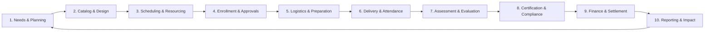
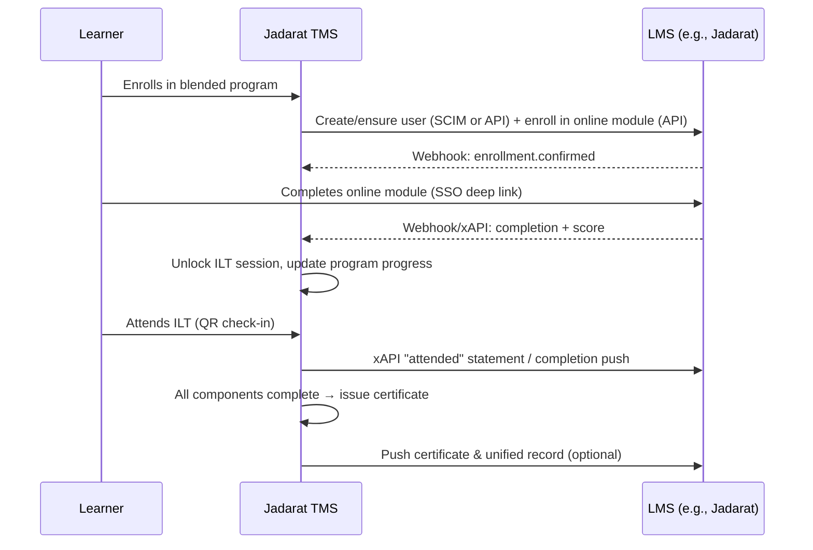
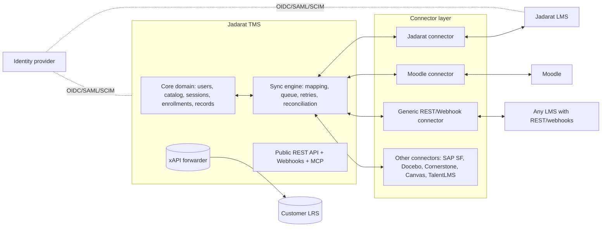
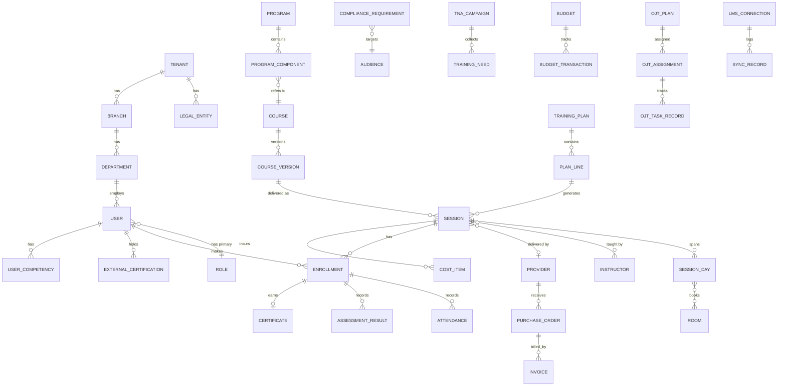

# Jadarat TMS — Business Requirements Document (BRD)

## Cloud Training Management System (SaaS) with Open LMS Interoperability

| | |
|---|---|
| **Product** | Jadarat TMS — Training Management System (module of the Jadarat HR Suite; also sold standalone) |
| **Company** | ENTLAQA |
| **Document type** | Business Requirements Document |
| **Version** | 2.1 — Draft for stakeholder review |
| **Date** | 30 September 2026 |
| **Supersedes** | *Jadarat TMS BRD v1.0* (15 March 2026) |
| **Companion documents** | `docs/delivery/Jadarat_TMS_Development_Plan.md` (development plan & delivery guide) · `docs/brd/TMS_Feature_List.md` (feature list, 289 features) · `docs/research/TMS_Market_Comparison_vs_BRD.md` (market & regulatory research) |
| **Classification** | Internal — Confidential |

### Document Control

**Revision history**

| Version | Date | Author | Summary |
|---|---|---|---|
| 1.0 | 15 Mar 2026 | ENTLAQA Product Team | Initial Jadarat TMS BRD (offline training, Jadarat-specific) |
| 2.0 | 27 Sep 2026 | ENTLAQA Product Team | Full rewrite: comprehensive TMS scope, training planning cycle, vendor & finance depth, assessment engine, generic LMS integration framework, corrected regulatory content, sovereign deployment, requirement IDs with priority & release |
| 2.1 | 30 Sep 2026 | ENTLAQA Product Team | Decisions D1, D2, D6, D7 recorded: product named Jadarat TMS; positioned as first module of the planned Jadarat HR Suite and sold standalone; shared Jadarat Platform (§3.4, §6.27, Appendix H.5); Commerce for training providers removed from scope; government/banks confirmed as Year-1 segments; self-hostable Next.js + Supabase stack |

**Approvals**

| Role | Name | Signature / Date |
|---|---|---|
| Executive Sponsor | | |
| Head of Product | | |
| Head of Engineering | | |
| Head of Sales / Customer Success | | |
| Information Security Officer | | |
| Legal & Compliance | | |

**How to read this document**

- Each requirement has a unique ID (`FR-<MODULE>-<NNN>`, `NFR-<AREA>-<NNN>`, `INT-<NNN>`). IDs never change once issued; retired items are marked *Deprecated*.
- **Priority (MoSCoW):** **M** = Must (release cannot ship without it) · **S** = Should (high value, may slip one release) · **C** = Could (desirable) · **W** = Won't in this plan (recorded for future).
- **Release:** **R1** MVP (months 0–4) · **R2** Growth (months 5–8) · **R3** Enterprise & Sovereign (months 9–12) · **R4** Intelligence & Scale (months 13–18). See §16.
- "The system" means Jadarat TMS. "Tenant" means one customer organization. "LMS" means any external Learning Management System (Jadarat LMS is the reference implementation).
- Requirements describe **what** the business needs. The reference architecture in Appendix H describes **how** ENTLAQA intends to build it and is guidance, not a requirement, unless stated as a constraint.

---

## Table of Contents

1. [Executive Summary](#1-executive-summary)
2. [Business Context & Objectives](#2-business-context--objectives)
3. [Scope](#3-scope)
4. [Stakeholders, Roles & Personas](#4-stakeholders-roles--personas)
5. [End-to-End Business Processes](#5-end-to-end-business-processes)
6. [Functional Requirements](#6-functional-requirements)
7. [LMS Integration Framework](#7-lms-integration-framework)
8. [Other Integrations](#8-other-integrations)
9. [Public API & Webhooks](#9-public-api--webhooks)
10. [Data Requirements](#10-data-requirements)
11. [Non-Functional Requirements](#11-non-functional-requirements)
12. [Security, Privacy & Compliance](#12-security-privacy--compliance)
13. [Localization & MENA Requirements](#13-localization--mena-requirements)
14. [SaaS Commercial Model](#14-saas-commercial-model)
15. [Deployment Models & Data Residency](#15-deployment-models--data-residency)
16. [Release Plan](#16-release-plan)
17. [Assumptions, Constraints & Dependencies](#17-assumptions-constraints--dependencies)
18. [Risks & Mitigations](#18-risks--mitigations)
19. [Acceptance & Success Criteria](#19-acceptance--success-criteria)
20. [Open Decisions](#20-open-decisions)
- [Appendix A — Glossary](#appendix-a--glossary)
- [Appendix B — Default Roles & Permission Matrix](#appendix-b--default-roles--permission-matrix)
- [Appendix C — Status Models](#appendix-c--status-models)
- [Appendix D — Notification Event Catalog](#appendix-d--notification-event-catalog)
- [Appendix E — Regulatory Reference](#appendix-e--regulatory-reference)
- [Appendix F — Competitive Positioning](#appendix-f--competitive-positioning)
- [Appendix G — Standard Reports Catalog](#appendix-g--standard-reports-catalog)
- [Appendix H — Reference Solution Architecture](#appendix-h--reference-solution-architecture)

---

## 1. Executive Summary

### 1.1 Problem

Organizations in the Middle East and North Africa (MENA) spend a large share of their learning budgets on instructor-led training (ILT), virtual instructor-led training (VILT), workshops, conferences and on-the-job training (OJT). These activities are run on spreadsheets, e-mail and disconnected tools. The result:

- **No planning discipline:** annual training plans are compiled manually from manager e-mails, never reconciled to what was delivered.
- **Operational waste:** training coordinators spend most of their time on logistics — rooms, trainers, materials, reminders, attendance sheets.
- **Financial blindness:** committed vs. actual spend, cost per learner and vendor performance are unknown until year-end.
- **Compliance exposure:** expiring certifications, mandatory training and regulator disclosures (e.g., Saudi Qiwa annual training disclosure, OJT quotas, UAE Emiratisation, SAMA certifications, Egypt training-fund rules) are tracked by hand.
- **Fragmented records:** online learning lives in the LMS, classroom learning lives in spreadsheets — no single training record per employee.
- **Poor fit of global tools:** leading TMS products are English-first, lack Arabic/RTL, Hijri and prayer-aware scheduling, WhatsApp, and MENA regulatory reporting, and start at USD 25K–65K+ per year.

### 1.2 Solution

Jadarat TMS is a multi-tenant, Arabic-first SaaS platform that manages the **complete training operations lifecycle** — *Plan → Design → Schedule → Enroll → Deliver → Assess → Certify → Pay → Report* — for classroom, virtual, blended and on-the-job training. It connects to any LMS through an open, standards-based **LMS Integration Framework** (SSO, SCIM, REST API, webhooks, xAPI, LTI 1.3, cmi5), with Jadarat LMS as the first certified connector, so that online and offline learning form one unified record.

Jadarat TMS is the **first module of the planned Jadarat HR Suite** (Core HR, Payroll & Time, Performance & Skills, Recruitment & Onboarding, Jadarat LMS, Jadarat TMS). It is built on a shared **Jadarat Platform** and is also sold **standalone** to organizations that use other HR systems (§3.4).

### 1.3 Value Proposition

| Stakeholder | Value |
|---|---|
| L&D / Training Manager | One place to plan, schedule, resource and run all training; logistics automated; plan vs. actual in real time |
| HR Director / CHRO | Unified training record, skills visibility, regulator-ready reports, measurable impact |
| Finance | Budgets, commitments, vendor invoices, chargebacks and subsidy claims under control |
| Line Manager | Team training hub, one-tap approvals (web, mobile, WhatsApp), compliance gaps at a glance |
| Employee / Learner | Simple catalog, mobile check-in, reminders on WhatsApp, certificates and history in one place |
| Instructor / Provider | Own portal: schedule, rosters, attendance, materials, evaluations, payments |
| Compliance / Auditor | Immutable audit trail, e-signed attendance, evidence packs for regulators |

### 1.4 Key Differentiators

1. **Arabic-first, MENA-native** — full RTL, Arabic four-part names, Arabic morphological search, Hijri (Umm al-Qura) dual dates, prayer/Jumu'ah/Ramadan-aware scheduling, country and branch-specific working weeks.
2. **End-to-end training planning** — training needs analysis (TNA) campaigns, demand consolidation, budget scenarios and plan-vs-actual, which few global products offer natively in a single flow.
3. **Regulator-ready evidence packs** — Saudi Qiwa training disclosure and OJT quota, HRDF (Hadaf) claim evidence, SAMA/Financial Academy certification coverage, UAE Emiratisation/Nafis, Egypt training-fund exemption evidence.
4. **Open LMS interoperability** — standards-based connector framework; works with Jadarat LMS out of the box and with other LMSs (Moodle, Docebo, SAP SuccessFactors, Cornerstone, Canvas, TalentLMS) through connectors or open standards.
5. **Operations AI in Arabic** — AI scheduling optimizer for ILT, an Arabic-capable "Ops Agent" that executes admin tasks with confirmation and audit, recommendations, content generation, and a sovereign-model option.
6. **WhatsApp-native workflows** — reminders, approvals, check-in and assistant on the channel MENA employees actually use.
7. **Sovereign deployment options** — regional multi-tenant cloud, dedicated single-tenant, and in-country (KSA/UAE) deployments for government, critical infrastructure and banks.
8. **Accessible pricing** — per-active-user tiers that make a professional TMS affordable for SMEs, with enterprise and government editions.

### 1.5 Business Model Summary

Subscription SaaS with four editions — **Starter, Professional, Enterprise, Government/Sovereign** — plus paid add-ons (AI pack, WhatsApp messaging, commerce, additional connectors, dedicated hosting). Details in §14.

---

## 2. Business Context & Objectives

### 2.1 Market Context

- ILT remains a primary modality: industry research (Brandon Hall Group) reports roughly two-thirds of enterprises use ILT and describes a "rebirth of the training management system".
- Analysts (Fosway, Gartner Market Guide for Corporate Learning Technologies) observe that AI, skills and operational automation are now expected on every roadmap.
- Regulation in the Gulf is increasing training obligations: Saudi Qiwa annual training disclosure (since 2023) and the 2026 OJT mandate; UAE Emiratisation targets reaching 10% by end-2026; Egypt's Labour Law No. 14 of 2025 training-fund provisions; SAMA mandatory professional certifications for financial-sector staff.
- No verified competitor combines Arabic-first UX, MENA scheduling rules, WhatsApp, regulator reporting and full TMS depth (see Appendix F).

### 2.2 Business Objectives & KPIs

| # | Objective | KPI | Target (12 months after R1 GA) |
|---|---|---|---|
| BO-1 | Establish market presence | Paying tenants | ≥ 100 |
| BO-2 | Revenue | Annual recurring revenue (ARR) | USD 0.5–1.0 M |
| BO-3 | Adoption | Monthly active users (MAU) | ≥ 10,000 |
| BO-4 | Retention | Net revenue retention (NRR) | ≥ 110% |
| BO-5 | Cross-sell | Share of new tenants with an active LMS connector | ≥ 50% |
| BO-6 | Regional coverage | Countries with active tenants | ≥ 5 (EG, SA, AE, OM, BH) |
| BO-7 | Operational value to customers | Reduction in coordinator hours per session (customer-reported) | ≥ 40% |
| BO-8 | Product quality | Customer satisfaction (CSAT) / NPS | CSAT ≥ 4.3/5 · NPS ≥ 30 |

### 2.3 Product Principles

1. **Arabic-first, not Arabic-added.** Every screen, notification, report and AI response is designed for Arabic first and English second.
2. **Operations-first.** Purpose-built for running physical, virtual and on-the-job training; not a retrofitted e-learning system.
3. **Plan-to-proof.** Every training activity traces from a planned need to delivered evidence (attendance, assessment, certificate, cost).
4. **Compliance by default.** Regulatory rules are configuration, not custom development.
5. **Open by design.** Every capability is available through documented APIs and events; the LMS is a partner, not a silo.
6. **AI-augmented, human-accountable.** AI proposes and executes only with human confirmation, full audit and reversibility.
7. **Progressive complexity.** Simple defaults for SMEs; depth unlocked by configuration for enterprises and government.

---

## 3. Scope

### 3.1 Customer Segments

| Segment | Profile | Primary needs |
|---|---|---|
| **S1 — Enterprise corporate L&D** | 500–50,000+ employees, multi-branch, multi-country | Planning cycle, approvals, budgets, compliance, HRIS/LMS integration, SSO |
| **S2 — SME** | 50–500 employees, HR runs training part-time | Fast setup, simple enrollment, attendance, certificates, compliance reports |
| **S3 — Government & public sector** | Ministries, authorities, state-owned enterprises | Data sovereignty, in-country hosting, strict audit, Arabic-only operation, procurement-friendly licensing |
| **S4 — Regulated financial institutions** | Banks, insurers, finance companies, capital-market firms | Mandatory certification coverage (SAMA/FA, CMA), audit trail, e-signatures, in-country hosting |
| ~~S5 — Training providers & institutes (selling to the public)~~ | *Out of scope (decision D1).* Providers are supported only as **suppliers** to customer organizations through the provider portal (§6.8). | — |

### 3.2 In Scope

| Area | Summary |
|---|---|
| Tenant platform | Multi-tenant SaaS, organization structure, branding, custom domains, localization, custom fields, terminology |
| Identity & access | Users, groups/audiences, RBAC, SSO (SAML/OIDC), SCIM, MFA, user lifecycle |
| Planning | Training needs analysis, training requests, annual/quarterly training plans, budget scenarios, calendar publication, plan vs. actual |
| Catalog | Courses, course templates, versions, programs and learning paths, blended programs, materials library, competency tagging |
| Scheduling & resources | Sessions (ILT, VILT, hybrid, OJT, conference, exam), multi-day, recurrence, calendars and resource timeline, conflict detection, venues/rooms/equipment, VILT platforms, AI optimizer |
| Instructors & providers | Internal/external instructors, availability, qualifications, portal, workload, contracts, payments; training-provider registry, contracts, RFQ, portal |
| Enrollment | Self, manager, admin and rule-based enrollment; nominations; seat quotas; approvals; waitlists; cancellation and no-show policies; contractor and other non-employee learners |
| Logistics | Session task checklists, materials and printing, catering, travel and accommodation, room setup, joining instructions |
| Delivery evidence | Attendance (manual, rotating QR, geo-fence, e-signature, kiosk/NFC, VILT import, offline), assessment engine, evaluations (Kirkpatrick L1–L4, Phillips ROI) |
| Credentials & compliance | Certificate designer, issuance, public verification, Open Badges 3.0, external certifications, recertification, compliance rules and matrix |
| OJT & skills | OJT plans, observation checklists, mentor sign-off, evidence, competency frameworks, gap analysis, individual development plans |
| Finance | Budgets, commitments, expenses, purchase orders, vendor invoices, chargebacks, trainer payments, fees, subsidy claims, ERP export, multi-currency, VAT |
| Experiences | Learner portal, manager hub, instructor portal, provider portal, mobile PWA with offline mode |
| Communications | E-mail, SMS, WhatsApp, push, in-app, Microsoft Teams; templates; calendar invites |
| Analytics | Dashboards, standard reports, report builder, scheduled delivery, BI export, ESG human-capital reporting, predictive insights |
| Regulatory packs | KSA, UAE, Egypt (initial); configurable compliance-framework engine for others |
| AI | Ops Agent, scheduling optimizer, recommendations, content generation, learner assistant, insights, AI governance |
| Integration | LMS Integration Framework, HRIS, identity providers, calendars, VILT, messaging, payments, ERP, BI, e-signature, government platforms; public REST API, webhooks, MCP server |
| SaaS operations | Subscription and billing, usage limits, tenant provisioning, ENTLAQA super-admin console |
| HR Suite integration | Shared Jadarat Platform services; integration with Core HR, Payroll & Time, Performance & Skills, Recruitment & Onboarding; standalone mode (§3.4, §6.27) |

### 3.3 Out of Scope

| Item | Rationale / alternative |
|---|---|
| Commerce for training providers (public course sales, checkout, e-commerce, customer invoicing) | Decision D1: Jadarat TMS serves employers training their own workforce. Buying from providers remains in scope (§6.8). |
| Functions owned by other Jadarat HR Suite modules (payroll calculation, time & attendance, appraisals, recruitment) | Delivered by those modules; the TMS integrates with them (§6.27). |
| E-learning content authoring and SCORM hosting/playback | Provided by the connected LMS (e.g., Jadarat LMS). The TMS launches LMS content via deep link / LTI / cmi5 but does not host SCORM runtimes. |
| Full HRIS / payroll | TMS consumes HR master data; it does not run payroll. Trainer payment amounts are exported to ERP/payroll. |
| Full ERP / accounts payable | TMS produces POs, accruals and payables data for export; payments are executed in ERP. |
| Proctoring engine | Integrate with third-party proctoring for high-stakes exams (C priority). |
| Native iOS/Android apps | Mobile experience delivered as installable PWA; native apps may follow (W in this plan). |
| Workforce/Nitaqat headcount computation | The TMS reports the **training** contribution; official Nitaqat band is taken from Qiwa (input field), not calculated. |

### 3.4 Jadarat HR Suite Context

Jadarat TMS is the first module of the planned **Jadarat HR Suite**. Two commercial modes use **one codebase**:

| Mode | Customer | Employee & org data comes from | Competency data comes from | Payroll / time integration |
|---|---|---|---|---|
| **Suite mode** | Buys Jadarat HR Suite (TMS plus other modules) | Jadarat Core HR (native, real-time) | Jadarat Performance & Skills | Native events to Jadarat Payroll & Time |
| **Standalone mode** | Uses another HR system (e.g., SAP, Oracle, Workday, Jisr, ZenHR) | HRIS connector or CSV/SFTP (FR-INT-01), or maintained in the TMS | TMS competency module (§6.15) | Exports to external payroll/ERP |

Suite modules are licensed per tenant; the mode is a tenant configuration, not a separate product.

#### 3.4.1 Shared Jadarat Platform Services

The following capabilities are built **once** as platform services and reused by every suite module. Requirements for them appear in this BRD because Jadarat TMS is the first module to need them.

| Platform service | Requirements in this BRD |
|---|---|
| Tenancy, editions, subscription & billing, platform console | FR-ADM-01…17, FR-SUB-01…05 |
| Identity: sign-in, SSO, SCIM, MFA, sessions | FR-IAM-10…13 |
| People & organization directory (employees, managers, branches, departments, legal entities, cost centers) | FR-ADM-02…05, FR-IAM-01…06, FR-STE-02 |
| Roles, permissions & data scopes | FR-IAM-07…09, FR-IAM-14 |
| Workflow & approvals engine | FR-WFL-01…04 |
| Notifications (e-mail, SMS, WhatsApp, push, in-app, Teams) | FR-NTF-01…09 |
| Audit, privacy, consent, retention, data export | FR-AUD-01…06 |
| Files & documents | FR-CAT-06 (shared storage service) |
| Localization (Arabic/RTL, Hijri, holidays, working weeks, prayer times) | §13 |
| Design system & suite shell (navigation, search, notification inbox, mobile app) | FR-STE-08, NFR-UX-01…04 |
| Integration hub, public API, webhooks, event bus, MCP | §7–§9 |
| AI governance and AI services | FR-AI-10, FR-AI-11 |
| Reporting foundation (data sets, report builder, exports) | FR-RPT-05, FR-RPT-06 |

#### 3.4.2 Module Boundaries (who owns what)

| Data / capability | Owner in suite mode | Owner in standalone mode | How Jadarat TMS uses it |
|---|---|---|---|
| Employees, positions, jobs, managers, org units | Core HR | TMS (platform directory, fed by HRIS/CSV) | Reads; reacts to lifecycle events |
| Competency frameworks, role profiles, proficiency, IDPs | Performance & Skills | TMS (§6.15) | Reads gaps; writes training evidence |
| Appraisals and goals | Performance & Skills | — | Provides training history and L3 results; receives development actions |
| Working time, leave, absence | Payroll & Time | External system | Publishes training days and absences |
| Payroll items (allowances, stipends, deductions) | Payroll & Time | External payroll/ERP | Calculates amounts; sends for payment |
| Recruitment and onboarding journeys | Recruitment & Onboarding | — | Receives new-hire and onboarding triggers |
| Online learning content and progress | Jadarat LMS | Any LMS via connector | §7 |
| Training operations, plans, sessions, attendance, assessments, certificates, compliance, training budgets | **Jadarat TMS** | **Jadarat TMS** | System of record |

---

## 4. Stakeholders, Roles & Personas

### 4.1 Stakeholders

| Stakeholder | Interest | Involvement |
|---|---|---|
| ENTLAQA executive team | Revenue, positioning, LMS cross-sell | Sponsor, approver |
| ENTLAQA product & engineering | Buildable, maintainable scope | Author, delivery |
| ENTLAQA customer success & implementation | Fast onboarding, configurability | Reviewer, UAT |
| Customer L&D leadership | Planning, operations, impact | Primary user, buyer |
| Customer HR / CHRO | Workforce capability, compliance | Buyer, user |
| Customer Finance | Cost control | User, approver |
| Customer IT / InfoSec | Integration, security, data residency | Gatekeeper |
| Line managers | Team development, approvals | User |
| Employees / learners | Access to training, records | User |
| Instructors (internal/external) | Schedule, delivery, payment | User |
| Training providers | Contracts, bookings, invoices | User |
| Regulators / auditors | Evidence and reports | Consumer of outputs |
| LMS vendors (Jadarat and others) | Interoperability | Integration partner |

### 4.2 System Roles (summary)

Fifteen default roles ship with every tenant; tenants may clone and create custom roles (FR-IAM-020). Full matrix in Appendix B.

| Role | Arabic label | Scope |
|---|---|---|
| Platform Super Admin | مشرف المنصة | ENTLAQA internal only; cross-tenant operations |
| Tenant Admin | مدير المنشأة | Full configuration of one tenant |
| Training Manager | مدير التدريب | Plans, catalog, sessions, resources, enrollments, reports |
| Training Coordinator | منسق التدريب | Day-to-day session operations, logistics, attendance |
| HR Manager | مدير الموارد البشرية | Records, mandatory training, compliance, HRIS |
| Finance Manager | المدير المالي | Budgets, POs, invoices, chargebacks, payments |
| Compliance Officer | مسؤول الامتثال | Compliance dashboards, regulatory reports, audit (read) |
| Department Head | رئيس القسم | Department plan, approvals, department reports |
| Line Manager | المدير المباشر | Direct reports: requests, nominations, approvals, team view |
| Internal Instructor | مدرب داخلي | Assigned sessions, attendance, materials, grading |
| External Instructor | مدرب خارجي | Assigned sessions only; no organizational data |
| Training Provider Admin | مسؤول جهة التدريب | Provider portal: offerings, quotes, rosters, invoices |
| Mentor / Assessor | مرشد / مقيّم | OJT and observation checklists for assigned trainees |
| Learner | متدرب | Own catalog, enrollments, records, certificates |
| Auditor | مدقق | Read-only access to records and audit log |

### 4.3 Personas

| Persona | Goals | Pain today | Key features |
|---|---|---|---|
| **Nada — Training Manager, enterprise (3 branches, 200+ sessions/yr)** | Deliver the annual plan on budget | 60% of time on logistics; plan compiled from e-mails | Planning cycle, resource timeline, task checklists, AI scheduler, plan vs. actual |
| **Omar — Training Coordinator** | Sessions run without surprises | Last-minute room clashes, chasing attendance sheets | Conflict detection, checklists, rotating-QR attendance, joining instructions |
| **Ahmed — HR Director, SME (120 staff)** | Simple compliance and reports | No visibility of cost or completion | Starter setup wizard, mandatory rules, Qiwa disclosure report |
| **Fatima — Department Head (25 reports)** | Approve quickly, close skill gaps | E-mail approval chains | Manager hub, WhatsApp approvals, TNA campaign form |
| **Khalid — Internal Instructor (50+ sessions/yr)** | Know schedule, deliver, grade | Double bookings, paper rosters | Instructor portal, mobile attendance, grading |
| **Sara — Compliance Officer, bank** | 100% certification coverage | Manual tracking of 500+ certificates | External certifications, SAMA/FA coverage rules, expiry alerts, audit packs |
| **Hassan — Finance Business Partner** | Spend within budget | Invoices not matched to sessions | Commitments, POs, invoice matching, chargebacks, ERP export |
| **Layla — Training Provider Account Manager** | Win and deliver client courses | Quotes and rosters over e-mail | Provider portal, RFQ response, rosters, invoicing |
| **Yousef — Employee (field technician)** | Know where and when training is; get certificate | Misses messages; paper sign-in | WhatsApp reminders, mobile check-in, offline OJT sign-off, digital certificate |
| **Mariam — Government Training Director** | Sovereign, auditable operation | Cannot use foreign-hosted SaaS | In-country deployment, Arabic-only mode, immutable audit |

---

## 5. End-to-End Business Processes

### 5.1 Training Lifecycle



### 5.2 Process Descriptions

| # | Process | Trigger | Main steps | Outputs |
|---|---|---|---|---|
| P1 | **Training Needs Analysis & Planning** | Planning cycle opens (e.g., Q4 for next year) or ad-hoc request | L&D opens TNA campaign → managers receive pre-filled team forms (mandatory, expiring, skills gaps) → managers submit needs → L&D consolidates demand → system converts demand to sessions & cost → scenarios → approvals (Dept → Finance → HR/L&D) → plan approved | Approved training plan, budget, draft sessions |
| P2 | **Catalog & Design** | New need or plan line without a course | Create/clone course from template → objectives, competencies, assessments, materials → optional LMS linking for online components → publish | Published course / program |
| P3 | **Scheduling & Resourcing** | Approved plan line or ad-hoc | Create sessions (manual, bulk from plan, or AI optimizer) → assign instructor/provider, venue, room, equipment → conflict checks (people, rooms, holidays, prayer times) → confirm → publish to calendar | Scheduled sessions, bookings |
| P4 | **Enrollment & Approvals** | Session published / rule fires / nomination | Self-enroll, manager nominate, admin assign, or rule-based auto-enroll → prerequisite & capacity checks → approval workflow → confirm or waitlist → calendar invite | Enrollments, waitlists |
| P5 | **Logistics & Preparation** | Session confirmed | Task checklist generated → materials, printing, catering, travel booked → joining instructions and pre-work sent → reminders | Completed checklist, ready session |
| P6 | **Delivery & Attendance** | Session day | Check-in (QR/e-signature/kiosk/manual/VILT import) → per-day attendance → instructor notes | Attendance records |
| P7 | **Assessment & Evaluation** | Session start/end, scheduled follow-ups | Pre-test → post-test → L1 survey → L3 follow-up to learner and manager at 30/60/90 days → L4/ROI analysis | Scores, evaluation results |
| P8 | **Certification & Compliance** | Completion criteria met / external certificate uploaded | Issue certificate / badge → verification link → expiry schedule → recertification auto-enrollment → compliance status recalculated | Credentials, compliance status |
| P9 | **Finance & Settlement** | Session completed / invoice received | Actual costs captured → vendor invoice matched to PO and session → trainer payment calculated → chargebacks and no-show fees posted → subsidy claim evidence prepared → ERP export | Actuals, payables, chargebacks, claims |
| P10 | **Reporting & Impact** | Continuous / scheduled / regulatory deadline | Dashboards, plan vs. actual, effectiveness, ESG, regulator packs (e.g., Qiwa by 31 Jan) | Reports, disclosures |

### 5.3 Blended Learning with an External LMS



---

## 6. Functional Requirements

Requirement IDs match the feature list (`docs/brd/TMS_Feature_List.md`): feature `ADM-01` is specified by requirement `FR-ADM-01`, and so on. Where a feature needs several requirements, suffixes are used (`FR-ADM-01a`, `FR-ADM-01b`).

Columns: **Pri** = MoSCoW priority · **Rel** = target release.

### 6.1 Tenant Platform & Administration (ADM)

**Purpose:** Let each customer organization configure its own instance — structure, identity, branding, fields and features — without ENTLAQA involvement.

| ID | Requirement | Pri | Rel |
|---|---|---|---|
| FR-ADM-01 | The system shall provide self-service sign-up that creates a tenant in *trial* status, provisions default roles, templates and workflows, and launches an onboarding wizard (organization → branding → first users → first course → first session). Trial length is configurable by ENTLAQA (default 14 days). | M | R1 |
| FR-ADM-02 | Tenant Admin shall maintain the organization profile: legal name (AR/EN), commercial registration no., VAT/tax no., industry, headquarters country, default currency, default timezone, default language, fiscal-year start month, authorized signatory. | M | R1 |
| FR-ADM-03 | The system shall support multiple legal entities under one tenant, each with its own currency, VAT number, branding variant, certificate numbering and invoice sequence; users, budgets and reports can be scoped by entity. | S | R3 |
| FR-ADM-04 | Tenant Admin shall maintain branches (AR/EN name, code, country, city, address, GPS, timezone, headquarters flag, parent branch) with branch-specific working week (including half-days) and working hours. | M | R1 |
| FR-ADM-05 | Tenant Admin shall maintain a hierarchical department tree (AR/EN name, code, cost center, head, parent, branch) with drag-and-drop reordering and CSV import. | M | R1 |
| FR-ADM-06 | The system shall display an interactive org chart (branch → department → team) showing head-count and compliance percentage per node, exportable to PDF/PNG. | C | R3 |
| FR-ADM-07 | Tenant Admin shall configure brand identity: logo variants (full, icon, light, dark), primary/secondary/accent colors with generated shades, Arabic and Latin fonts from an approved list; the system shall warn when color contrast fails WCAG 2.2 AA. | M | R1 |
| FR-ADM-08 | The system shall provide a theme builder with live preview (dashboard, login, certificate, e-mail, mobile), ≥ 10 presets, draft/publish, version history and dark-mode enablement. | S | R2 |
| FR-ADM-09 | Tenant Admin shall customize the login page (background, AR/EN welcome text, footer, legal links, scheduled seasonal themes). | C | R2 |
| FR-ADM-10 | Each tenant shall receive a default subdomain; Tenant Admin may add custom domains through a DNS wizard with automatic verification, SSL provisioning, health monitoring and redirect from the default subdomain. | S | R2 |
| FR-ADM-11 | Tenant Admin shall define custom fields (text, number, date, list, multi-list, boolean, user, file) for users, courses, sessions, enrollments, instructors, vendors and venues, with AR/EN labels, required flag, visibility by role, and availability in filters, reports, imports and API. | M | R1 |
| FR-ADM-12 | Tenant Admin shall override system terminology (e.g., Course → Program, Session → Workshop) in Arabic and English, with preview and reset. | S | R2 |
| FR-ADM-13 | The system shall gate features per tenant based on edition and add-ons; Tenant Admin can further disable enabled features for their users. | M | R1 |
| FR-ADM-14 | The admin home shall show: users by status, usage vs. plan limits, integration health, AI spend vs. cap, domain/SSL status, pending invitations and approvals, and the last 10 audit events, with quick actions. | M | R1 |
| FR-ADM-15 | Enterprise tenants shall be able to create a sandbox tenant cloned from production configuration (without personal data) for testing. | S | R3 |
| FR-ADM-16 | Tenant Admin shall export and import configuration packages (roles, workflows, templates, custom fields, notification templates) between tenants. | C | R3 |
| FR-ADM-17 | ENTLAQA staff shall have a platform console to manage tenants (plan, limits, status, feature flags), view health, send announcements, and impersonate a tenant user only with a reason, time limit, tenant-visible banner and audit entry. | M | R1 |

**Business rules**
- BR-ADM-1: Tenant data is isolated; no tenant can read another tenant's data through UI, API, export or AI.
- BR-ADM-2: Changing default currency after transactions exist requires a conversion confirmation; historical amounts keep their original currency.
- BR-ADM-3: Weekend/working-hour settings resolve in order: branch → legal entity → tenant → country default.

**Acceptance criteria (examples)**
- *Given* a new sign-up, *when* the wizard is completed, *then* the tenant has 15 default roles, default notification templates, default approval workflow, and can create a course and session within 15 minutes.
- *Given* a branch with Friday–Saturday weekend, *when* a session is scheduled on Friday, *then* the system warns before saving.

---

### 6.2 Identity, Users & Access (IAM)

**Purpose:** Manage who can access the tenant, how they authenticate and what they can see and do.

| ID | Requirement | Pri | Rel |
|---|---|---|---|
| FR-IAM-01 | The system shall maintain user profiles: e-mail, mobile with country code, first/father/grandfather/family names in AR and EN, display names, employee ID, branch, department, job title (AR/EN), grade, manager, hire date, nationality, national flag, status, locale, photo, custom fields. E-mail and employee ID are unique per tenant. | M | R1 |
| FR-IAM-02 | Profiles shall also hold gender, date of birth and employment category (e.g., management, professional, technical, operational) to support ESG and ministry reporting; these fields are restricted to HR/Compliance roles by default. | M | R1 |
| FR-IAM-03 | Admins shall invite users individually or in bulk; invitations expire (default 7 days), can be resent (max 3) and revoked; custom invitation template per tenant. | M | R1 |
| FR-IAM-04 | The system shall provide a bulk import wizard for users (CSV/XLSX, up to 10,000 rows): template download with Arabic headers, auto/manual column mapping, row-level validation, dry-run preview, create-only / upsert / update-only modes, progress and downloadable error report. | M | R1 |
| FR-IAM-05 | Deactivating a user shall preserve all records, block login, and prompt reassignment of owned items (sessions, approvals, OJT mentees, tasks); deactivated users are archived and can be reactivated. | M | R1 |
| FR-IAM-06 | Admins shall create static groups and dynamic audiences defined by AND/OR rules on any profile field (incl. custom fields and hire date); audiences re-evaluate automatically and can be used for enrollment, notifications, compliance rules, catalog visibility and reports. | M | R2 |
| FR-IAM-07 | The system shall ship 15 default roles (Appendix B). Tenant Admin can clone roles and create custom roles with a permission matrix grouped by module; high-risk permissions are flagged. System roles cannot be edited. | M | R1 (default) / R2 (builder) |
| FR-IAM-08 | Role assignments shall support data scopes: own, direct reports, all reports (hierarchy), department(s), branch(es), legal entity, all. | M | R2 |
| FR-IAM-09 | The system shall enforce configurable separation-of-duties rules (e.g., a user cannot approve their own request; budget creator cannot approve the same budget; invoice approver ≠ PO creator). | S | R2 |
| FR-IAM-10 | The system shall support SSO via SAML 2.0 and OpenID Connect with multiple identity providers per tenant, attribute mapping, just-in-time provisioning with default role, "force SSO" (disable passwords except break-glass admins), and a test tool with request/response log. | M | R2 |
| FR-IAM-11 | The system shall expose a SCIM 2.0 endpoint for user and group provisioning from Microsoft Entra ID, Okta and Google Workspace. | S | R3 |
| FR-IAM-12 | The system shall support MFA (TOTP, e-mail OTP, SMS OTP) with enforcement off / optional / required for all / required for selected roles, grace period and trusted-device duration. | M | R1 |
| FR-IAM-13 | Tenant Admin shall configure password policy, lockout threshold, session timeout, maximum concurrent sessions (R1); IP allow-lists with role bypass and access-hour restrictions (R3). Admins can view active sessions and force logout. | M | R1 / R3 |
| FR-IAM-14 | Approvers shall delegate approval authority to another user for a date range; delegated actions are recorded with both identities. | S | R2 |
| FR-IAM-15 | The system shall support non-employee user types — provider staff, external instructors, and contractor / outsourced workforce learners (e.g., contractors who need safety training) — with restricted portals and no access to internal directory data. | M | R2 |

**Business rules**
- BR-IAM-1: A user has exactly one primary role and may hold additional roles; effective permissions are the union, limited by each role's data scope.
- BR-IAM-2: Break-glass: at least one Tenant Admin must retain password + MFA login when SSO is forced.
- BR-IAM-3: Any role or permission change is audited with before/after values.

---

### 6.3 Training Needs Analysis & Planning (PLN)

**Purpose:** Turn organizational needs into an approved, budgeted training plan and track its delivery.

| ID | Requirement | Pri | Rel |
|---|---|---|---|
| FR-PLN-01 | Employees and managers shall submit training requests for catalog courses or for new/external training (title, provider, justification, linked competency, estimated cost, preferred period, attachments); requests follow a configurable approval workflow and, once approved, become a plan line or a direct enrollment. | M | R1 |
| FR-PLN-02 | Training Managers shall create TNA campaigns with name, planning period, scope (departments/branches/audiences), deadline, reminders, optional budget envelope per department, and form template. | M | R2 |
| FR-PLN-03 | Each manager in scope shall receive a campaign form pre-filled with their team and, per employee, mandatory training due, certifications expiring in the planning period and top competency gaps; managers add or remove needs with priority (critical/high/medium/low), justification and preferred quarter. | M | R2 |
| FR-PLN-04 | Where enabled, employees may self-nominate needs within a campaign; nominations require manager validation before inclusion. | S | R2 |
| FR-PLN-05 | The system shall consolidate submitted needs by course (or requested topic), branch, delivery type and month, showing head-count, priority mix and requesting departments. | M | R2 |
| FR-PLN-06 | For each consolidated line the system shall calculate the number of sessions required (head-count ÷ course capacity, respecting minimum participants) and estimated cost from the course cost model (instructor, venue, materials, catering, travel). | M | R2 |
| FR-PLN-07 | Training Managers shall create and compare at least three plan scenarios (e.g., full, reduced, minimum) by including, trimming or deferring lines, with totals by department, category and quarter against budget envelopes. | S | R3 |
| FR-PLN-08 | The plan shall follow a configurable approval workflow (e.g., Department Head → Finance → HR/L&D Director), support comments and line-level rejection, and lock on approval with versioning for later revisions. | M | R2 |
| FR-PLN-09 | From an approved plan, Training Managers shall bulk-generate draft sessions (per line, per quarter/month, per branch) and publish a training calendar to audiences; nominated employees are pre-enrolled or invited. | M | R2 |
| FR-PLN-10 | The system shall report plan vs. actual per line, department and period: planned vs. delivered sessions, head-count, training hours and cost, with variance and a year-end forecast. | M | R2 |
| FR-PLN-11 | Learners may register interest in courses without upcoming sessions; when interest reaches a configurable threshold, the Training Manager is alerted with a "create session" action. | S | R2 |
| FR-PLN-12 | The system shall export the approved plan and next-year committed budget in the format required for the Saudi Qiwa annual training disclosure (see FR-REG-02). | M | R2 |

**Business rules**
- BR-PLN-1: A need linked to an expiring certification or mandatory rule cannot be deleted by the manager without a reason.
- BR-PLN-2: Approved plan lines reserve budget as *planned*; enrollment approval converts to *committed*; invoice/expense converts to *actual* (see FIN).
- BR-PLN-3: Plan revisions create a new version; plan-vs-actual always compares to the latest approved version, with history available.

**Acceptance criteria (examples)**
- *Given* a campaign scoped to 10 departments, *when* it opens, *then* each department head receives an e-mail/WhatsApp link to a pre-filled form and reminders are sent at T-7 and T-2 days before the deadline.
- *Given* 47 needs for a course with capacity 20 and minimum 8, *when* consolidated, *then* the system proposes 3 sessions (20/20/7 is invalid; it proposes 16/16/15) and the estimated cost for 3 sessions.

---

### 6.4 Catalog, Courses & Programs (CAT)

| ID | Requirement | Pri | Rel |
|---|---|---|---|
| FR-CAT-01 | Training Managers shall create courses with: code (auto with tenant prefix), AR/EN title, short and long description (rich text with RTL), category (hierarchical), tags, delivery type (ILT, VILT, hybrid, OJT, conference, workshop, exam, e-learning via LMS), duration (hours/days), min/max participants, target audience, language(s), thumbnail. | M | R1 |
| FR-CAT-02 | Course templates shall define defaults inherited by sessions: resources required (room type, equipment), task checklist template, materials, cost model, evaluation forms, assessments, certificate template and attendance rule. | M | R1 |
| FR-CAT-03 | Courses shall support prerequisites (courses and competency levels, AND/OR), equivalencies (course A satisfies course B) and target-audience rules. | M | R1 |
| FR-CAT-04 | Course changes to learning objectives, duration, assessments or certificate shall create a new version; enrollments and certificates reference the version delivered. | S | R2 |
| FR-CAT-05 | Courses shall list learning objectives (AR/EN) and competencies with target proficiency gained. | M | R1 |
| FR-CAT-06 | A materials library shall store versioned files and links (PDF, PPTX, DOCX, video, URL; ≤ 200 MB per file) classified as trainer-only, learner pre-work, learner handout or post-course; materials attach to courses and sessions with visibility windows. | M | R1 |
| FR-CAT-07 | Programs (learning paths) shall group courses and components with sequence, mandatory/elective flags, minimum electives, deadlines relative to enrollment, and program-level completion and certificate. | M | R2 |
| FR-CAT-08 | Blended programs shall combine TMS sessions, LMS online modules (via LMS connector), OJT plans and assessments, with unlock rules (e.g., online module must be complete before ILT). | M | R2 |
| FR-CAT-09 | Programs and courses shall support auto-enrollment triggers: new hire, transfer, role/job change, audience membership, certification expiry. | M | R2 |
| FR-CAT-10 | The catalog shall be searchable with Arabic morphological matching (root/stem, diacritics-insensitive, alef/ya/ta-marbuta normalization), filters (category, type, language, duration, upcoming dates, mandatory, location), card/list views, and "recommend to my team". | M | R1 |
| FR-CAT-11 | Each tenant may publish a public catalog page (course pages with upcoming sessions, SEO metadata, share links); visibility per course. | S | R2 |
| FR-CAT-12 | Training Managers shall import provider catalogs (CSV/API) as provider-offered courses linked to the provider (see VND). | C | R3 |

**Acceptance criteria (example)**
- *Given* a search for "إدارة" and a course titled "الإدارة الاستراتيجية", *when* searching, *then* the course is returned in the first page of results.

---

### 6.5 Scheduling & Sessions (SCH)

| ID | Requirement | Pri | Rel |
|---|---|---|---|
| FR-SCH-01 | Sessions shall belong to a course (version) and support: code, optional title override, delivery type, one or more days each with its own date, start/end time, venue/room or virtual link, instructors; recurrence (RRULE) for series; timezone per session. | M | R1 |
| FR-SCH-02 | Session status shall follow the model in Appendix C (Draft → Scheduled → Confirmed → In progress → Completed; Cancelled; Postponed) with reasons, automatic learner notification and one-click reschedule preserving enrollments. | M | R1 |
| FR-SCH-03 | Calendars shall provide month/week/day/agenda views, color by status/category/branch, drag-and-drop rescheduling (with conflict re-check) and filters by instructor, venue, department, category, delivery type. | M | R1 |
| FR-SCH-04 | A resource timeline (Gantt) shall show instructors, rooms and equipment as rows over time, with drag-to-assign and utilization shading. | M | R2 |
| FR-SCH-05 | On save and on drag, the system shall detect conflicts: instructor double-booking, instructor unavailability/limits, room and equipment double-booking, room capacity below enrollment, learner overlaps, public holidays per country/branch, weekends; hard conflicts block, soft conflicts warn with override reason. | M | R1 |
| FR-SCH-06 | Scheduling shall account for prayer times (calculated per venue location and method), Friday Jumu'ah block and Ramadan working hours; sessions overlapping these trigger warnings and agenda suggestions with breaks. | M | R2 |
| FR-SCH-07 | All date pickers and displays shall support Gregorian, Hijri (Umm al-Qura) or dual display per tenant/user preference. | M | R1 |
| FR-SCH-08 | Sessions shall support minimum-enrollment rules: warning at T-N days, optional auto-cancel or merge proposal; auto-confirm at T-N days when minimum reached. | M | R1 |
| FR-SCH-09 | Training Managers shall bulk-create sessions from plan lines, templates (e.g., "every Sunday for 8 weeks") or by copying a previous period, with a preview and conflict report before commit. | M | R2 |
| FR-SCH-10 | For VILT/hybrid sessions the system shall create, update and cancel meetings in Zoom, Microsoft Teams and Webex via integration, store join links, and send them only to enrolled participants. | M | R2 |
| FR-SCH-11 | Hybrid sessions shall track in-room and remote capacity separately and allow attendance by either mode. | S | R2 |
| FR-SCH-12 | An AI schedule optimizer (see FR-AI-03) shall propose schedules for a set of unscheduled sessions under constraints and weighted objectives. | S | R3 |
| FR-SCH-13 | Training Managers may publish open sessions to qualified instructors ("call for tender"); instructors apply, managers select, the rest are notified. | C | R3 |
| FR-SCH-14 | The system shall send calendar invitations (.ics) that update or cancel when the session changes, and support two-way calendar sync for instructors (Microsoft 365, Google) to read busy time. | M | R2 |

**Business rules**
- BR-SCH-1: A session cannot move to *Confirmed* without a venue/room (or virtual link) and a primary instructor.
- BR-SCH-2: Cancelling a session releases bookings, notifies participants and offers alternative sessions; costs already incurred remain as actuals.
- BR-SCH-3: Session codes are unique per tenant: `<COURSE-CODE>-<YYYY>-<SEQ>` by default (configurable).

**Acceptance criteria (example)**
- *Given* instructor Khalid is booked 09:00–13:00 on 3 Nov, *when* a coordinator assigns him to another session 12:00–15:00 on 3 Nov, *then* the system blocks the save and suggests available qualified instructors.

---

### 6.6 Venues & Resources (RES)

| ID | Requirement | Pri | Rel |
|---|---|---|---|
| FR-RES-01 | Maintain venues (internal/external) with AR/EN name, branch, address, GPS, map link, photos, contacts, amenities, parking, notes. | M | R1 |
| FR-RES-02 | Maintain rooms per venue with capacity per setup style (classroom, U-shape, theatre, boardroom, cabaret, lab) and fixed equipment. | M | R1 |
| FR-RES-03 | Maintain bookable equipment (type, quantity, location, condition) and book it per session day with availability checks. | M | R1 |
| FR-RES-04 | Rooms and resources may require owner approval; bookings remain *tentative* until approved. | S | R2 |
| FR-RES-05 | Record venue/room rates (hourly/daily) and external venue contracts; booking costs flow to the session cost model. | M | R2 |
| FR-RES-06 | Utilization reports per venue, room and equipment (booked hours ÷ available hours) with trends. | M | R2 |
| FR-RES-07 | Venues shall record accessibility and facility attributes: wheelchair access, prayer rooms (men/women), women-only facilities, first aid, catering availability. | M | R1 |

---

### 6.7 Instructor Management (INS)

| ID | Requirement | Pri | Rel |
|---|---|---|---|
| FR-INS-01 | Maintain internal (linked to user) and external instructor profiles: AR/EN names, photo, bio, specializations, languages and dialects, contact, employer/provider, status. | M | R1 |
| FR-INS-02 | Record instructor qualifications and certifications with evidence and expiry; alert instructor and Training Manager before expiry. | M | R1 |
| FR-INS-03 | Maintain a "qualified-to-teach" matrix (instructor × course/version, with qualification date and optional expiry); only qualified instructors are suggested or allowed (configurable hard/soft rule). | M | R1 |
| FR-INS-04 | Maintain weekly availability patterns, blocked dates, max sessions/hours per week and month, preferred venues and travel willingness. | M | R1 |
| FR-INS-05 | Instructor portal (web + PWA): my schedule, session details, rosters with photos, attendance marking, materials upload/download, grading and practical assessments, session reports, evaluation results (anonymized), availability management. | M | R1 |
| FR-INS-06 | Workload dashboard: sessions, hours, utilization vs. limits, per period and per instructor. | M | R2 |
| FR-INS-07 | Performance: average ratings, pass rates, attendance and completion rates of their sessions, trends, comparison to peers (restricted view). | M | R2 |
| FR-INS-08 | Record contracts and rate cards for external instructors (hourly, daily, per participant, fixed per session), currency, validity, contracted days; show consumed vs. contracted. | S | R2 |
| FR-INS-09 | Calculate trainer payables per session/period (delivered units × rate + approved expenses − deductions), route for approval and export to ERP/payroll. | S | R2 |
| FR-INS-10 | Collect and track external instructor onboarding documents (CV, ID/Iqama, bank details, NDA, tax documents) with expiry. | S | R2 |
| FR-INS-11 | AI instructor matching suggests ranked instructors per session (qualification, availability, language/dialect, ratings, cost, travel). | C | R4 |

---

### 6.8 Training Providers & Vendors (VND)

| ID | Requirement | Pri | Rel |
|---|---|---|---|
| FR-VND-01 | Maintain a provider registry: legal name AR/EN, CR, VAT, country, accreditation (e.g., TVTC, HRDF strategic partner) with evidence and expiry, contacts, bank details, status (prospect, approved, suspended, blocked). | M | R2 |
| FR-VND-02 | Record provider contracts and framework agreements: scope, price lists, discounts, validity, payment terms, SLA, attachments. | S | R2 |
| FR-VND-03 | Maintain provider catalogs (courses, prices, languages, delivery modes) linkable to tenant courses. | S | R2 |
| FR-VND-04 | Provider portal: view assigned sessions and rosters, confirm instructors, mark attendance, upload materials and certificates, submit invoices, view evaluations (aggregated). | S | R2 |
| FR-VND-05 | Issue RFQs to one or more approved providers (scope, dates, head-count, requirements); providers respond in the portal; the system compares quotes side by side and converts the selected quote to a PO and session(s). | S | R3 |
| FR-VND-06 | Provider scorecard: ratings, pass rates, no-show/cancellation by provider, on-time invoices, cost per learner. | S | R3 |
| FR-VND-07 | Track provider compliance documents (licenses, insurance, accreditation) with expiry alerts and automatic suspension option. | C | R3 |

---

### 6.9 Enrollment, Registration & Approvals (ENR)

| ID | Requirement | Pri | Rel |
|---|---|---|---|
| FR-ENR-01 | Learners shall self-enroll into visible sessions; the system validates prerequisites, audience eligibility, capacity, registration window and learner conflicts, and requires terms acceptance where configured. | M | R1 |
| FR-ENR-02 | Managers shall nominate or directly enroll direct reports (scope-limited), with optional deadline and message. | M | R1 |
| FR-ENR-03 | Admins shall bulk-enroll by list upload, group/audience, department or branch, with preview of eligibility and capacity outcomes. | M | R1 |
| FR-ENR-04 | Enrollment rules shall auto-assign learners to courses/programs based on audience, mandatory rules, recertification and triggers (FR-CAT-09); the learner or manager then picks a session, or the system auto-places by location/date. | M | R2 |
| FR-ENR-05 | Approval workflows (FR-WFL-01) shall apply to enrollments with conditions (cost thresholds, external training, travel required, department), sequential/parallel steps, escalation after N hours, auto-approval rules (mandatory, zero-cost) and comments. | M | R2 |
| FR-ENR-06 | Approvers shall approve/reject from web, mobile, e-mail deep link and WhatsApp interactive message; each channel action is authenticated and audited. | M | R2 |
| FR-ENR-07 | Full sessions shall offer a waitlist with position; when a seat frees, the next eligible learner is auto-promoted (or offered with a response window), notified, and alternative sessions are suggested. | M | R2 |
| FR-ENR-08 | Training Managers may allocate seat quotas per department/branch per session; unused quotas release to general availability at T-N days. | S | R2 |
| FR-ENR-09 | A cancellation policy per course/session shall define cut-off windows, substitution (replace with a colleague) and transfer (to another session) rules. | S | R2 |
| FR-ENR-10 | No-show and late-cancellation fees shall be calculated per policy and charged back to the learner's cost center (see FIN-07), with manager notification and waiver workflow. | S | R3 |
| FR-ENR-11 | Sessions may include registration forms with custom questions (dietary, accessibility needs, emergency contact, uniform size, travel origin); answers feed logistics. | M | R2 |
| FR-ENR-12 | *Removed by decision D1.* Public (B2C) and client-company (B2B) registration is out of scope; contractor learners are handled through FR-IAM-15 and normal enrollment. | W | — |
| FR-ENR-13 | The system shall prevent or warn on learner schedule conflicts across sessions and OJT days. | M | R1 |

**Business rules**
- BR-ENR-1: Enrollment statuses follow Appendix C.
- BR-ENR-2: Waitlist promotion respects approvals: a promoted learner whose approval is pending keeps the seat for the configured hold time (default 24 h).
- BR-ENR-3: Mandatory enrollments cannot be self-cancelled; learners may request a transfer.

**Acceptance criteria (example)**
- *Given* a session at capacity with 3 waitlisted learners, *when* an enrolled learner cancels, *then* waitlist #1 is promoted within 1 minute, notified by e-mail and WhatsApp, and the roster updates in real time.

---

### 6.10 Session Logistics & Operations (LOG)

**Purpose:** Remove the manual logistics work that consumes most of a coordinator's time.

| ID | Requirement | Pri | Rel |
|---|---|---|---|
| FR-LOG-01 | Task checklist templates (per course, delivery type or venue) shall generate tasks for each session with owner role/user, due date relative to session start (e.g., T-14 book room, T-7 send joining instructions, T-3 print handouts, T+2 upload attendance), reminders, completion evidence and status; overdue tasks escalate. | M | R1 |
| FR-LOG-02 | Joining instructions shall be generated from templates with session variables (venue, room, map link, parking, dress code, prayer room, agenda, pre-work links, contact) and sent automatically at a configured time and on change. | M | R1 |
| FR-LOG-03 | Materials and printing orders shall be generated per session with quantities derived from confirmed enrollments + buffer, routed to the print owner/vendor, and tracked to delivery. | S | R2 |
| FR-LOG-04 | Catering requests per session day (breaks, lunch, dietary counts from registration answers, Ramadan/iftar options) shall be generated and sent to the catering owner/vendor with cost capture. | S | R2 |
| FR-LOG-05 | Travel and accommodation requests for instructors and trainees (flights, hotels, ground transport, per diems) shall be captured, approved, linked to the session and costed. | S | R3 |
| FR-LOG-06 | Room setup checklists (layout, AV test, accessibility, signage) shall be generated per room booking and confirmed by the venue owner. | C | R2 |
| FR-LOG-07 | An operations board shall show today's and upcoming sessions with readiness indicators (instructor confirmed, room ready, materials delivered, joining instructions sent, enrollment vs. minimum) and issue logging. | M | R2 |
| FR-LOG-08 | Material/kit shipments to branches shall be tracked (items, quantities, carrier, tracking number, received confirmation). | C | R3 |

**Acceptance criteria (example)**
- *Given* a course template with 8 checklist tasks, *when* a session is confirmed for 15 Dec, *then* 8 tasks are created with due dates relative to 15 Dec and assigned owners receive notifications.

---

### 6.11 Attendance (ATT)

| ID | Requirement | Pri | Rel |
|---|---|---|---|
| FR-ATT-01 | Instructors/coordinators shall mark attendance per learner per session day: present, absent, late, excused, partial (minutes); bulk mark all; notes per learner. | M | R1 |
| FR-ATT-02 | The system shall display a session-day QR code on the instructor's screen that rotates every 60 seconds (configurable) and is signed and time-limited; learners scan with the phone camera (no app) and authenticate (SSO/OTP) to check in. Screenshots older than the rotation window are rejected. | M | R1 |
| FR-ATT-03 | Optional geo-fencing shall accept check-in only within a configurable radius of the venue (default 200 m) and record device fingerprint; out-of-range attempts are logged and routed to the instructor for decision. | M | R1 |
| FR-ATT-04 | Check-in and check-out timestamps per day shall compute attended minutes and apply the late threshold; partial attendance is computed automatically. | M | R1 |
| FR-ATT-05 | E-signature attendance shall capture a drawn or typed signature per learner per day with timestamp, IP, device, geo (if permitted) and a tamper-evident hash of the record; signed sheets export to PDF for audits. | M | R2 |
| FR-ATT-06 | A kiosk/tablet mode shall allow learners to check in by badge (NFC/barcode) or by searching their name plus OTP, locked to one session. | S | R3 |
| FR-ATT-07 | For VILT sessions the system shall import participant reports from Zoom/Teams/Webex, match participants to enrollments (by e-mail), and compute attended minutes against a threshold. | M | R2 |
| FR-ATT-08 | Attendance capture (instructor roster and QR/kiosk queue) shall work offline in the PWA and sync when connectivity returns, with conflict resolution (latest trusted source wins, audited). | M | R2 |
| FR-ATT-09 | Attendance rules per course (e.g., ≥ 80% of hours, all mandatory days) shall determine completion eligibility, certificate issuance and subsidy eligibility flags (e.g., HRDF Tamheer absence ≤ 10%). | M | R1 |
| FR-ATT-10 | The system shall flag anomalies: same device used by multiple learners, check-in location far from venue, impossible travel between check-ins, check-ins outside session time. | S | R3 |
| FR-ATT-11 | Printable sign-in sheets (AR/EN) with roster, per-day columns and signature boxes shall be available as fallback; scanned sheets can be uploaded as evidence. | M | R1 |

**Business rules**
- BR-ATT-1: Attendance can be edited after the session only by authorized roles within a configurable window (default 7 days); later edits require approval and are audited with reason.
- BR-ATT-2: When the same learner has attendance from multiple methods, precedence is: e-signature > QR/kiosk > VILT import > manual (configurable).

**Acceptance criteria (example)**
- *Given* a QR code displayed at 09:00:00, *when* a learner scans a screenshot of it at 09:02:30, *then* check-in is rejected with "code expired, scan the live code".

---

### 6.12 Assessment & Evaluation (ASM)

| ID | Requirement | Pri | Rel |
|---|---|---|---|
| FR-ASM-01 | A question bank shall support MCQ (single/multiple), true/false, matching, ordering, short answer, essay and file upload, in Arabic and English, with categories, difficulty, competency tags, media and version history. | M | R1 |
| FR-ASM-02 | Tests (pre, post, standalone exam) shall support fixed or random selection from pools, time limits, attempts, pass mark, shuffling, availability windows, and delivery on web/PWA in-session or remotely; auto-scoring for objective items and manual grading for others. | M | R1 |
| FR-ASM-03 | The system shall report learning gain (post − pre) per learner, session, course and instructor (Kirkpatrick Level 2), and item analysis (difficulty, discrimination). | M | R2 |
| FR-ASM-04 | Instructors shall grade learners on practical assessments using rubrics (criteria × levels) and enter final grades/comments; results feed completion rules. | M | R1 |
| FR-ASM-05 | Level 1 reaction surveys shall be sent automatically at session end (QR at the venue + notification), support anonymous mode, standard question sets (content, instructor, venue, relevance, NPS) and custom questions, with reminders until deadline. | M | R1 |
| FR-ASM-06 | Level 3 follow-ups shall be scheduled at configurable intervals (default 30/60/90 days) to the learner and their manager asking about application of skills, with results aggregated per course and department. | M | R2 |
| FR-ASM-07 | Level 4 / ROI: Training Managers shall link programs to business KPIs (imported or entered), and the system shall compute Phillips ROI using program costs, monetized benefits, isolation factor and confidence adjustment. | C | R4 |
| FR-ASM-08 | Evaluation forms shall exist for instructors, venues, providers and learner-to-program, with results on respective scorecards. | M | R1 |
| FR-ASM-09 | AI shall analyze free-text comments (Arabic and English): sentiment, themes, notable quotes, per session/course/instructor, with human-readable summaries. | S | R3 |
| FR-ASM-10 | AI shall draft questions from course objectives and uploaded materials for reviewer approval before entering the bank. | S | R3 |
| FR-ASM-11 | High-stakes exams may be delivered through third-party proctoring integrations; results return to the TMS. | C | R4 |

---

### 6.13 Certification, Credentials & Compliance (CRT)

| ID | Requirement | Pri | Rel |
|---|---|---|---|
| FR-CRT-01 | A visual certificate designer (A4/Letter, portrait/landscape) shall support text blocks, images, borders, QR code, signatures, stamps and variables (learner name AR/EN, course AR/EN, dates Gregorian/Hijri, hours, score, grade, certificate no., instructor, CPD points), bilingual layouts, versioning and categories (completion, attendance, excellence, compliance). | M | R1 |
| FR-CRT-02 | Maintain signatories (name/title AR/EN, signature image, active dates), stamps, and numbering rules (prefix, separators, Gregorian/Hijri year, zero-padded sequence, reset rules, gap detection). | M | R1 |
| FR-CRT-03 | Certificates shall be issued automatically when completion rules are met (attendance, assessment, evaluation submitted, all program components complete) or manually with approval; delivered by e-mail/WhatsApp and in the learner portal. | M | R1 |
| FR-CRT-04 | Each certificate shall have a public verification page (via QR/short code) on the tenant domain showing validity, holder, course, date, issuer; revoked/expired status shown; a verification API is available. | M | R1 |
| FR-CRT-05 | Certificates with validity periods shall expire automatically; reminders at 90/60/30/7 days (configurable) to learner and manager; recertification auto-enrollment into the refresher course. | M | R1 |
| FR-CRT-06 | Employees (or HR on their behalf) shall record externally earned certifications and licenses (e.g., SAMA/Financial Academy certificates, CMA exams, professional licenses) with issuer, number, dates, evidence upload and approval; these count toward compliance rules. | M | R1 |
| FR-CRT-07 | A compliance rules engine shall define requirements: *who* (audience/role/department/branch/new hires), *what* (course, program, certification or any-of set), *when* (within N days of hire/role change; recurring every N months; by fixed date), *framework* (regulator reference) and *grace period*. | M | R1 |
| FR-CRT-08 | Compliance dashboards shall show status per person, team, department, branch and framework (compliant, due soon, overdue, expired), with drill-down, overdue alerts and exportable evidence. | M | R1 |
| FR-CRT-09 | Coverage-target rules shall measure the percentage of an audience holding a requirement against a target and deadline (e.g., "≥ 90% of remittance staff certified within 12 months of hire"; "≥ 25% per 6 months"), with trajectory charts and alerts. | M | R2 |
| FR-CRT-10 | The system shall issue Open Badges 3.0 / W3C Verifiable Credentials for configured certificates, signed by the tenant issuer profile. | S | R3 |
| FR-CRT-11 | Learners shall share certificates to LinkedIn and export badges to credential wallets. | S | R3 |
| FR-CRT-12 | Certificates may be digitally signed (PAdES) with a tenant or national PKI certificate. | C | R3 |

---

### 6.14 OJT & Skills Sign-off (OJT)

| ID | Requirement | Pri | Rel |
|---|---|---|---|
| FR-OJT-01 | OJT plans shall define sequential or parallel tasks with descriptions (AR/EN), linked competencies, duration, required evidence, assessment criteria and reference materials. | M | R2 |
| FR-OJT-02 | OJT plans shall be assigned to trainees with mentor(s), supervisor, start and target dates, location and notification schedule. | M | R2 |
| FR-OJT-03 | Mentors shall update task progress with evidence (photo, video, document, e-signature) and rating; trainees see progress and upcoming tasks. | M | R2 |
| FR-OJT-04 | Reusable observation checklists (items, pass/fail or rating scale, critical items, comments) shall be attachable to OJT plans, courses and sessions, and completable by assessors, peers or managers. | M | R2 |
| FR-OJT-05 | Assessors shall complete checklists and sign off offline on mobile; sign-off captures e-signature, timestamp and location, syncing later. | M | R2 |
| FR-OJT-06 | OJT completion shall require final mentor and supervisor evaluation; failure triggers extension or re-assignment workflow; success updates competency levels and may issue a certificate. | M | R2 |
| FR-OJT-07 | A logbook shall record hours and practical activities by date with verifier sign-off. | S | R3 |
| FR-OJT-08 | For Saudi tenants, the system shall track the OJT mandate (≥ 2% of workforce trained per year in OJT of 2–6 months for establishments with ≥ 50 employees; ≥ 100 trainees for ≥ 5,000 employees), store Qiwa training-contract references and show progress toward the annual quota. | M | R2 |
| FR-OJT-09 | Graduate/apprenticeship programs (e.g., Tamheer) shall track cohort, stipend period, host establishment details and attendance thresholds that affect stipend eligibility. | S | R3 |

---

### 6.15 Competencies & Development (SKL)

| ID | Requirement | Pri | Rel |
|---|---|---|---|
| FR-SKL-01 | Maintain competency frameworks (categories, competencies AR/EN, proficiency scales with behavioral indicators) and role profiles (required proficiency per job). | M | R2 |
| FR-SKL-02 | Support self, manager and assessor competency assessments with evidence and calibration. | M | R2 |
| FR-SKL-03 | Compute gaps (required − current) per person, team, role and department; gaps feed recommendations, TNA pre-fill and reports. | M | R2 |
| FR-SKL-04 | Individual development plans (IDPs) with goals, linked courses/OJT, target dates, manager approval and progress. | S | R3 |
| FR-SKL-05 | Import skills from HRIS/LMS and import taxonomies (e.g., ESCO) with mapping. | S | R3 |
| FR-SKL-06 | AI shall infer skills and proficiency suggestions from completions, assessments and OJT results, for human confirmation. | C | R4 |
| FR-SKL-07 | Visualize competency heat-maps and a skills graph by department/role. | C | R4 |

---

### 6.16 Budget & Finance (FIN)

| ID | Requirement | Pri | Rel |
|---|---|---|---|
| FR-FIN-01 | Finance/Training Managers shall create annual budgets by department, branch, legal entity, category and cost center, with approval workflow and revisions. | M | R2 |
| FR-FIN-02 | Budget consumption shall be tracked in three states — *planned* (approved plan lines), *committed* (approved enrollments/POs/bookings) and *actual* (expenses/invoices) — against budget, with available balance. | M | R2 |
| FR-FIN-03 | Each session shall have a cost model (instructor, venue, equipment, materials, catering, travel, other) with estimated values from templates/rates and actual values from expenses/invoices; cost allocates to participants' cost centers. | M | R1 |
| FR-FIN-04 | Users shall capture expenses linked to sessions/budgets with category, amount, currency, VAT, receipt upload and approval workflow. | M | R2 |
| FR-FIN-05 | Purchase orders shall be raised for providers, instructors, venues and catering, linked to sessions and budgets, with approval and PDF output; PO numbers may be imported from ERP. | S | R3 |
| FR-FIN-06 | Vendor invoices shall be captured (upload/portal/API) and matched to PO and delivered session (3-way match: ordered, delivered attendance, invoiced); mismatches route for resolution. | S | R3 |
| FR-FIN-07 | Chargebacks shall allocate session costs (per participant, per seat, or fixed) and no-show fees to cost centers, producing journal-ready allocation reports. | S | R3 |
| FR-FIN-08 | Reports shall show cost per learner, per training hour, per course, per department and per provider. | M | R2 |
| FR-FIN-09 | Budget alerts at configurable thresholds (e.g., 50/75/90/100%), burn-rate and year-end forecast. | M | R2 |
| FR-FIN-10 | Subsidy/levy evidence packs shall assemble the data required for claims (e.g., HRDF programs: attendance, certificates, costs, Saudi-national status; Egypt training-fund exemption: training delivered, hours, cost). | M | R3 |
| FR-FIN-11 | Export or integrate financial data to ERP (SAP, Oracle, Microsoft Dynamics, Odoo): budgets, POs, accruals, payables, allocations. | S | R3 |
| FR-FIN-12 | Multi-currency with daily exchange rates (or manual), reporting in tenant base currency; VAT rates per country/legal entity. | M | R2 |

**Business rules**
- BR-FIN-1: A committed amount is released when an enrollment is cancelled before the cancellation cut-off; after cut-off it remains committed and may generate a fee.
- BR-FIN-2: Budget overrun behavior per budget: *warn*, *require extra approval*, or *block*.

---

### 6.17 Commerce for Training Providers (COM)

**Status: Won't — removed from scope by decision D1 (30 Sep 2026).** Requirements are kept below, marked **W**, for traceability and possible future reconsideration. Jadarat TMS serves employers training their own workforce; buying from training providers is covered by §6.8 and §6.16.

| ID | Requirement | Pri | Rel |
|---|---|---|---|
| FR-COM-01 | Price lists per course/session (public, corporate, member, early-bird, group tiers) in multiple currencies, with VAT inclusive/exclusive display. | W | — |
| FR-COM-02 | Public checkout with local and international payment methods (Mada, Visa/Mastercard, Apple Pay, STC Pay; Fawry/Meeza in Egypt) through a payment gateway, 3-D Secure, receipts. | W | — |
| FR-COM-03 | Corporate client accounts with contacts, contract pricing, group bookings, credit terms and PO-based payment. | W | — |
| FR-COM-04 | Vouchers, discount and promo codes, prepaid training credits with balance tracking. | W | — |
| FR-COM-05 | Quote → order → invoice lifecycle with refunds and credit notes, and statement of account per client. | W | — |
| FR-COM-06 | Invoices shall comply with e-invoicing regimes: ZATCA FATOORA (KSA) and ETA e-invoice (Egypt), including QR codes and clearance/reporting where required. | W | — |
| FR-COM-07 | Revenue and profitability reports per course, session, client and instructor. | W | — |
| FR-COM-08 | Client-company portal: client HR can book seats, manage their learners, view attendance, certificates and invoices. | W | — |

---

### 6.18 Learner Experience (LRN)

| ID | Requirement | Pri | Rel |
|---|---|---|---|
| FR-LRN-01 | "My Learning" shall show upcoming sessions (with join/check-in actions), required training with due dates, requests and approvals status, waitlists, history, certificates and pending surveys/tests. | M | R1 |
| FR-LRN-02 | A unified transcript shall list TMS and LMS records with a source badge (Offline / LMS), hours, dates, scores and certificates, exportable to PDF. | M | R2 |
| FR-LRN-03 | Learners shall have a personal calendar and receive .ics invitations that update on change. | M | R1 |
| FR-LRN-04 | The learner experience shall be an installable PWA optimized for mobile: QR check-in, materials, surveys, tests, certificates, notifications. | M | R1 |
| FR-LRN-05 | Offline mode shall cache upcoming session details, downloaded materials and pending OJT evidence, and sync on reconnect. | M | R2 |
| FR-LRN-06 | Personalized recommendations ("required for you", "for your role", "closes your gaps", "popular in your team") with reasons shown. | S | R2 |
| FR-LRN-07 | Learners shall set notification channels, language and calendar preferences (as permitted by Tenant Admin). | M | R1 |
| FR-LRN-08 | All learner, manager and instructor screens shall meet WCAG 2.2 AA in both Arabic and English. | M | R1 |

---

### 6.19 Manager Hub (MGR)

| ID | Requirement | Pri | Rel |
|---|---|---|---|
| FR-MGR-01 | Managers shall see a team dashboard: compliance status per member, overdue and due-soon items, expiring certifications, upcoming sessions, training hours YTD. | M | R1 |
| FR-MGR-02 | An approvals inbox shall list pending approvals (enrollments, requests, expenses, OJT sign-offs) with context (cost, budget impact, team schedule) and bulk approve/reject. | M | R1 |
| FR-MGR-03 | A team calendar shall show members' sessions and OJT days to avoid operational clashes. | M | R1 |
| FR-MGR-04 | Managers shall nominate/assign training to one or many team members with deadline and message in one step. | M | R1 |
| FR-MGR-05 | Managers shall complete TNA campaign forms for their team from the hub (FR-PLN-03). | M | R2 |
| FR-MGR-06 | Managers shall receive and complete Level 3 follow-up tasks (FR-ASM-06). | M | R2 |
| FR-MGR-07 | Managers shall view team competency gaps and recommended actions. | S | R2 |

---

### 6.20 Communications & Notifications (NTF)

| ID | Requirement | Pri | Rel |
|---|---|---|---|
| FR-NTF-01 | A real-time in-app notification center (bell + page) with read/unread, filters, deep links and bulk mark-as-read. | M | R1 |
| FR-NTF-02 | E-mail notifications with branded bilingual templates, variables, preview with sample data, per-tenant sender name and optional custom sending domain (SPF/DKIM). | M | R1 |
| FR-NTF-03 | WhatsApp Business (Meta Cloud API or approved BSP): template management with approval status tracking, variables, AR/EN, interactive buttons (confirm attendance, approve/reject, open check-in), opt-in capture and opt-out handling. | M | R2 |
| FR-NTF-04 | SMS through configurable gateways (MENA-native provider and an international fallback), sender ID per tenant/country. | M | R2 |
| FR-NTF-05 | Web push notifications for PWA users. | S | R2 |
| FR-NTF-06 | Microsoft Teams (and Slack) notifications with actionable cards for approvals and reminders. | S | R3 |
| FR-NTF-07 | A notification event catalog (Appendix D) with per-event configuration: recipients by role, channels, timing, language resolution (recipient's locale), and quiet hours respecting prayer times and weekends. | M | R1 |
| FR-NTF-08 | Scheduled reminders (default T-7d, T-3d, T-1d, T-1h) and daily/weekly digests for managers and coordinators. | M | R1 |
| FR-NTF-09 | Coordinators shall broadcast messages to session participants or audiences via chosen channels, with delivery statistics. | M | R2 |

**Business rules**
- BR-NTF-1: Channel fallback order is configurable (e.g., WhatsApp → SMS → e-mail) when a channel fails or the recipient has not opted in.
- BR-NTF-2: All outbound messages are logged with status (queued, sent, delivered, read, failed) for 12 months.

---

### 6.21 Reporting & Analytics (RPT)

| ID | Requirement | Pri | Rel |
|---|---|---|---|
| FR-RPT-01 | An executive dashboard shall show KPI tiles (sessions, participants, training hours, hours per employee, completion, attendance, spend, compliance %, satisfaction/NPS), trends by month/quarter, department heat-map, top courses/instructors and upcoming pipeline, filterable by period, entity, branch, department. | M | R1 |
| FR-RPT-02 | Standard operational reports (Appendix G) shall be available with filters, sorting, saved views and export. | M | R1 |
| FR-RPT-03 | Effectiveness analytics shall present Kirkpatrick L1–L4 results by course, instructor, provider and department. | M | R2 |
| FR-RPT-04 | Plan vs. actual and budget vs. actual dashboards (see FR-PLN-10, FR-FIN-02). | M | R2 |
| FR-RPT-05 | A report builder shall let authorized users choose a data set (sessions, enrollments, attendance, assessments, certifications, costs, users, OJT), columns, filters, grouping, charts, and save/share/schedule reports by e-mail; exports to XLSX, CSV and PDF with tenant branding. | M | R2 |
| FR-RPT-06 | A BI connector shall provide read-only analytical access (e.g., OData feed or scheduled exports to a customer data warehouse/S3/Azure Blob) plus a Power BI template. | S | R3 |
| FR-RPT-07 | ESG human-capital reports shall produce average training hours per employee by gender and employee category (GRI 404-1, ESRS S1-13), percentage of employees receiving performance/career reviews where data exists, and training spend per employee. | S | R3 |
| FR-RPT-08 | Predictive insights shall estimate no-show risk per enrollment, demand forecast per course, and budget burn forecast, with explanations. | C | R4 |
| FR-RPT-09 | AI narrative summaries (Arabic/English) of dashboards and periods, with anomaly alerts (e.g., sudden no-show spike in a branch). | S | R3 |
| FR-RPT-10 | Conversational analytics: users ask questions in Arabic or English and receive answers with the underlying table/chart and a link to the saved report; data access respects the user's permissions. | C | R4 |

**Business rule**
- BR-RPT-1: All reports respect the viewer's role data scope; exports are audited.

---

### 6.22 Regulatory Packs (REG)

**Purpose:** Provide configuration and reports that turn training data into regulator-ready evidence. Legal parameters are held as versioned configuration so changes in regulation do not require code releases. All figures are validated with Legal before each release (Appendix E).

| ID | Requirement | Pri | Rel |
|---|---|---|---|
| FR-REG-01 | A compliance-framework engine shall let ENTLAQA and tenants define frameworks (regulator, reference, effective dates), requirements (FR-CRT-07), coverage targets (FR-CRT-09), evidence types and report templates; ENTLAQA ships and maintains official packs. | M | R1 |
| FR-REG-02 | **KSA — Qiwa annual training disclosure:** for establishments with ≥ 50 employees, produce the annual disclosure data — training hours (with check against ≥ 8 training units per trainee per year), number of trainees, the training plan and the next year's committed training budget — with a deadline tracker (31 January) and evidence export. | M | R2 |
| FR-REG-03 | **KSA — OJT mandate:** track OJT participation against the 2% annual workforce quota (see FR-OJT-08). | M | R2 |
| FR-REG-04 | **KSA — HRDF (Hadaf):** maintain program definitions and produce evidence packs: attendance vs. thresholds (e.g., Tamheer ≤ 10% absence), certificate authentication data, cost breakdowns, Saudi-national status. | S | R3 |
| FR-REG-05 | **KSA — SAMA / Financial Academy:** ship a pack with the mandated professional certificates (e.g., Retail Banking Foundations; Credit Advisor Certificate – Level 1; Professional Certificate in Exchange & Transfer; Foreign Exchange Professional Exam; Compliance Foundations) and their coverage/rollout rules, using external certifications (FR-CRT-06). | M | R2 |
| FR-REG-06 | **KSA — CMA:** pack for capital-market professional exams (e.g., CME-1, CME-2 AML/CTF). | S | R3 |
| FR-REG-07 | **KSA — Saudization training contribution:** report training hours, certifications and OJT for Saudi nationals; record the establishment's Nitaqat band (Platinum, High Green, Medium Green, Low Green, Red) as an input from Qiwa for context and trend. | S | R2 |
| FR-REG-08 | **UAE — Emiratisation:** track Emirati head-count targets (2% per year, 1% per half-year; 10% by end-2026 for 50+ employees; 20–49-employee rule for listed sectors), show contribution exposure, and record Nafis-supported trainees and programs. | S | R3 |
| FR-REG-09 | **Egypt:** track training delivered per employee and produce evidence for training-fund exemption requests under Labour Law No. 14 of 2025; produce Ministry of Labour training reports. | S | R3 |
| FR-REG-10 | **Health sector:** track CPD/CME hours and categories for licensed professionals (e.g., SCFHS, DHA, DoH) against renewal requirements. | C | R4 |

---

### 6.23 AI Capabilities (AI)

**Principles:** AI features are opt-in per tenant; outputs are labeled as AI-generated; actions that change data require explicit human confirmation; every AI call is logged (feature, model, tokens, cost, user); tenant data is never used to train third-party models; AI respects role permissions and data scope.

| ID | Requirement | Pri | Rel |
|---|---|---|---|
| FR-AI-01 | **Ops Agent (Arabic/English):** an admin copilot that understands natural-language instructions (e.g., "جدول دورة السلامة لفرع جدة الشهر القادم لـ 40 موظف"), proposes a plan of actions (create sessions, book rooms, assign instructors, enroll audiences, pull reports), shows a preview/diff, executes on confirmation within the user's permissions, logs each action and supports undo. | S | R3 |
| FR-AI-02 | **Learner assistant** (web widget + WhatsApp): answers questions about catalog, schedules, policies and the learner's own records using retrieval over tenant content; can start enrollment, show QR check-in, or hand off to a human; tone and formality configurable. | S | R2 |
| FR-AI-03 | **Schedule optimizer:** given sessions to schedule, instructor/room availability, qualification, capacity, travel, learner preferences, prayer/working-hour constraints and deadlines, produce ranked schedules optimizing configurable weights (utilization, cost, learner convenience, compliance deadlines); user accepts in whole or part. | S | R3 |
| FR-AI-04 | **Recommendations:** rank courses per learner using role requirements, gaps, history, peer patterns and trends, with explanation. | S | R2 |
| FR-AI-05 | **Content generation:** draft session plans, facilitator guides, agendas, assessments and surveys from objectives and materials, in Arabic or English; outputs pass through a configurable review gate before publishing. | S | R2 |
| FR-AI-06 | **TNA assistant:** propose team needs to managers from gaps, expiries, role changes and plan history, with reasons, during campaigns. | S | R3 |
| FR-AI-07 | **Comment analysis:** see FR-ASM-09. | S | R3 |
| FR-AI-08 | **Regulatory drafting:** pre-fill regulator reports and subsidy claim packs from data, highlighting missing evidence. | C | R4 |
| FR-AI-09 | **Session transcription:** transcribe (Arabic dialects + English) recorded sessions, produce notes and FAQ candidates with consent capture. | C | R4 |
| FR-AI-10 | **AI governance console:** global and per-feature toggles; model/provider selection per feature (including a sovereign Arabic model option and in-region endpoints); bring-your-own-key; monthly budget cap and alerts; usage log; prompt/knowledge-base management for the assistant. | M | R2 |
| FR-AI-11 | **MCP server:** expose permitted TMS tools (search catalog, get schedule, enroll, create session, get compliance status) via Model Context Protocol so customers' own AI agents can act on the TMS with OAuth-scoped access. | S | R3 |

**Acceptance criteria (example)**
- *Given* the Ops Agent proposes creating 2 sessions and enrolling 40 users, *when* the user confirms, *then* the actions execute, each appears in the audit log tagged "AI-assisted" with the confirming user, and "Undo" reverts all of them within 24 hours if no dependent actions occurred.

---

### 6.24 Workflow & Automation (WFL)

| ID | Requirement | Pri | Rel |
|---|---|---|---|
| FR-WFL-01 | A visual workflow builder shall define approval workflows for: enrollment, training request, plan, budget, expense, PO, invoice, session creation, certificate issuance, OJT plan, external certification. | M | R2 |
| FR-WFL-02 | Steps support approver types (line manager, N-level manager, department head, role, specific user, cost-center owner, finance), conditions (amount, category, department, delivery type, external/internal, travel), sequential and parallel (all/any) logic, escalation and reminders, auto-approval, delegation, and default workflows per entity. | M | R2 |
| FR-WFL-03 | Automation rules ("when *event* and *condition* then *action*") shall allow actions such as notify, create task, enroll, change status, call webhook (e.g., "when fill rate < 50% at T-7 notify coordinator and suggest merge"). | S | R3 |
| FR-WFL-04 | SLA timers on approvals and tasks with overdue dashboards. | S | R3 |

In R1, approvals use a fixed default chain (Line Manager → Training Manager) configurable by toggles.

---

### 6.25 Audit, Data & Privacy (AUD)

| ID | Requirement | Pri | Rel |
|---|---|---|---|
| FR-AUD-01 | An immutable audit log shall capture authentication events, data create/update/delete (before/after diff), permission and configuration changes, approvals, exports, AI actions and integration changes, with user, timestamp, IP, device; searchable and exportable; not editable by any tenant role. | M | R1 |
| FR-AUD-02 | Tenant Admin shall export tenant data (full or filtered by entity/date) in XLSX, CSV and JSON, optionally with attachments (ZIP); downloads expire after 24 h and are audited. | M | R2 |
| FR-AUD-03 | Retention policies per data type (audit logs, training records, attachments, messages, inactive users) with purge or anonymization and legal hold. | S | R3 |
| FR-AUD-04 | Data subject requests (access, correction, erasure/anonymization, portability) under Saudi PDPL, UAE PDPL and Egypt PDPL shall be supported with workflow and evidence; erasure respects legal retention of training records. | M | R2 |
| FR-AUD-05 | Consent shall be captured and stored for WhatsApp messaging, geo-location at check-in, photos/recordings, AI processing where required, with withdrawal. | M | R1 |
| FR-AUD-06 | Data quality tools: duplicate detection/merge (users, instructors, venues, providers), bulk archive of stale courses/sessions, orphan file cleanup, storage breakdown. | S | R3 |

---

### 6.26 SaaS Subscription & Billing (SUB)

| ID | Requirement | Pri | Rel |
|---|---|---|---|
| FR-SUB-01 | Editions and add-ons shall determine feature availability and limits (active users, sessions/month, storage, AI budget, WhatsApp messages, connectors). | M | R1 |
| FR-SUB-02 | Usage metering with dashboards, projections ("user limit reached in ~45 days") and alerts at 50/75/90/100%; per-limit behavior: block, allow overage, or notify only. | M | R2 |
| FR-SUB-03 | Self-service subscription: plan comparison, upgrade (immediate), downgrade (end of term, with impact warning), proration, invoices, payment methods, billing contacts, failed-payment handling. | M | R2 |
| FR-SUB-04 | Support local payment methods and bank transfer for MENA customers, and issue ENTLAQA subscription invoices compliant with ZATCA (KSA) and ETA (Egypt) where ENTLAQA is registered. | M | R2 |
| FR-SUB-05 | An add-on catalog (AI pack, WhatsApp bundles, extra connectors, commerce, dedicated hosting, premium support) purchasable by Tenant Admin. | S | R3 |

**Business rule**
- BR-SUB-1: An *active user* is a user who logs in or is enrolled/attended in the billing month; instructors and external learners are counted per edition rules (§14).

### 6.27 HR Suite Integration & Platform (STE)

**Purpose:** Make Jadarat TMS a native module of the Jadarat HR Suite while remaining fully functional standalone. **Rel = Suite** means the requirement is delivered when the corresponding suite module is available; until then the standalone behavior applies.

| ID | Requirement | Pri | Rel |
|---|---|---|---|
| FR-STE-01 | Jadarat TMS shall run in suite mode or standalone mode per tenant (§3.4), switching data sources (Core HR vs. HRIS connector/CSV; Performance & Skills vs. TMS competencies) by configuration without data migration. | M | R1 |
| FR-STE-02 | The people & organization directory shall be built from R1 as a shared platform service with a single person record per individual across all suite modules; each module stores only its module-specific attributes linked to that record. | M | R1 |
| FR-STE-03 | In suite mode the TMS shall consume Core HR lifecycle events (hire, transfer, promotion, job change, manager change, termination) in near real time to trigger auto-enrollment, compliance recalculation, reassignment and deprovisioning. | M | Suite |
| FR-STE-04 | The TMS shall publish training days, attendance and absences to Payroll & Time so employees attending training are not marked absent and training-related absence can follow HR policy. | S | Suite |
| FR-STE-05 | The TMS shall send payroll items to Payroll & Time (or export them in standalone mode): internal instructor allowances, trainee stipends, training allowances and approved training-related deductions. | S | Suite |
| FR-STE-06 | Training agreements (training bonds): record sponsored-training agreements (cost, commitment period, pro-rata recovery rule, signed document); on termination the recoverable amount is calculated and sent to Payroll/final settlement for review. Rules are configurable per country and require legal validation. | S | R3 |
| FR-STE-07 | With Performance & Skills: provide training history, certifications and Level 3 results to appraisals; receive development actions from appraisals and IDPs as training requests or assignments. | S | Suite |
| FR-STE-08 | Suite user experience: one navigation shell, module switcher, unified notification inbox, unified search, one approvals inbox across modules, and one installable mobile app (PWA) with module sections — designed in R1 even when only the TMS module is licensed. | M | R1 |
| FR-STE-09 | With Recruitment & Onboarding: onboarding journeys trigger TMS programs (pre-start and first-90-days training) and receive completion status back. | S | Suite |

---

## 7. LMS Integration Framework

### 7.1 Objectives

1. Any LMS can exchange users, catalog, enrollments, progress, completions and credentials with the TMS.
2. Blended programs orchestrate online (LMS) and offline (TMS) components as one learning journey.
3. Learners and managers see one unified training record.
4. New LMS connectors can be added without changing TMS core.
5. Jadarat LMS is the reference connector and first to be certified.

### 7.2 Design Principles

- **Standards first:** OIDC/SAML for SSO, SCIM 2.0 for provisioning, xAPI 1.0.3/2.0 for activity data, LTI 1.3 Advantage and cmi5 for content launch, OpenAPI 3.1 for REST, CloudEvents 1.0 envelope for events.
- **Connector model:** each LMS is integrated through a connector that declares its capabilities; the TMS sync engine is connector-agnostic.
- **System-of-record clarity:** for each entity the tenant chooses the source of truth.
- **Idempotent, observable, recoverable:** every sync operation is idempotent, logged, retryable and replayable.
- **Secure by default:** OAuth 2.0 client credentials, least-privilege scopes, signed webhooks, secrets encrypted at rest.

### 7.3 Architecture



### 7.4 Capability Levels

Each connector declares a level; the admin UI shows exactly what is supported.

| Level | Name | Capabilities |
|---|---|---|
| L1 | **Link** | SSO deep links from TMS to LMS; manual course linking; completion import by file |
| L2 | **Sync** | L1 + user provisioning, catalog read, enrollment push, completion/progress/score pull (webhook and scheduled reconciliation) |
| L3 | **Blend** | L2 + blended program orchestration (unlock rules), certificate sync both ways, xAPI exchange, unified transcript |
| L4 | **Native** | L3 + LTI 1.3/cmi5 launch from TMS, real-time events both ways, shared skills/competency mapping, bidirectional attendance and session sync (for LMSs with ILT modules) |

Target: **Jadarat = L4**; Moodle = L3; SAP SuccessFactors, Docebo, Cornerstone = L2/L3; Generic REST connector = L2.

### 7.5 Requirements

| ID | Requirement | Pri | Rel |
|---|---|---|---|
| FR-LMS-01 | The system shall provide a connector framework: connector registry, capability declaration (7.4), configuration schema, credential vault, per-tenant multiple connections (e.g., two LMS instances), enable/disable, and versioned connector releases. | M | R1 |
| FR-LMS-02 | The Jadarat LMS connector shall support L4 capabilities, certified jointly with the Jadarat team, including a setup wizard (instance URL, OAuth credentials, test connection showing LMS version/tenant/user count, SSO setup, xAPI endpoint, sync direction). | M | R1 (L2) / R2 (L3) / R3 (L4) |
| FR-LMS-03 | SSO between TMS and LMS shall use the tenant's IdP or TMS as OIDC provider; "Go to online learning" deep links shall land the user in the correct LMS course without re-login, preserving tenant context. | M | R1 |
| FR-LMS-04 | User provisioning to the LMS shall use SCIM 2.0 when supported, otherwise the connector API; creates, updates, deactivations and department/manager changes propagate within 5 minutes; full reconciliation daily. | M | R2 |
| FR-LMS-05 | Catalog sync shall import LMS courses (id, titles AR/EN, description, duration, type, language, thumbnail, competencies, URL) as *LMS courses* usable in programs, compliance rules and recommendations; refresh scheduled and on webhook. | M | R1 |
| FR-LMS-06 | Enrollment push shall enroll learners into LMS courses when they join a blended program or rule, with due date; unenrollment on withdrawal; status acknowledgements recorded. | M | R1 |
| FR-LMS-07 | Progress and completion pull shall receive LMS events (webhook) and reconcile on schedule: progress %, status, score, completion date, time spent, certificate; updates enrollments, program progress, compliance and transcript. | M | R1 |
| FR-LMS-08 | The TMS shall emit xAPI statements for ILT/VILT attendance (`attended`), assessments (`passed`/`failed`/`scored`), OJT task sign-offs (`completed`), and certificate issuance (`earned`), to one or more configured LRS endpoints, using a published activity-ID convention; it shall also accept xAPI statements forwarded from the LMS. | S | R2 |
| FR-LMS-09 | The TMS shall launch LMS content via LTI 1.3 (with Assignment & Grade Services and Names & Role Provisioning) or cmi5 where the LMS supports it, receiving results back. | S | R3 |
| FR-LMS-10 | Admins shall configure mapping (users, departments, roles, courses, custom fields, statuses) with auto-map suggestions; conflict policy per entity (TMS wins / LMS wins / most recent wins / manual review); sync schedule (real-time, 5 min, hourly, daily); retry with exponential backoff; dead-letter queue with manual replay; health checks, latency tracking, auto-pause after repeated failures and admin alerts; sync history with request/response detail (secrets redacted). | M | R1 |
| FR-LMS-11 | Additional certified connectors: Moodle (R3), SAP SuccessFactors Learning, Docebo, Cornerstone, Canvas, TalentLMS (R3–R4 as demand dictates). | S | R3 |
| FR-LMS-12 | A connector SDK (TypeScript) with test harness and certification checklist shall allow partners and LMS vendors to build connectors; certified connectors are listed in the integration hub. | C | R4 |

### 7.6 Entity Ownership (defaults, configurable)

| Entity | Default source of truth | Direction |
|---|---|---|
| Users, org structure | HRIS → TMS → LMS | TMS → LMS |
| Online courses | LMS | LMS → TMS |
| ILT/VILT courses & sessions | TMS | TMS → LMS (L4, optional) |
| Blended program definition | TMS | TMS → LMS (enrollments) |
| Online progress / completion | LMS | LMS → TMS |
| Offline attendance, assessments, OJT | TMS | TMS → LMS / LRS |
| Certificates | Issuer system | Both (L3+) |
| Competencies | Tenant choice | Both (L4) |

### 7.7 Event Contract (TMS ⇄ LMS)

Events use the CloudEvents 1.0 envelope with `type` = `com.entlaqa.tms.<entity>.<action>` (outbound) or the connector's inbound mapping.

**Inbound from LMS (minimum for L2):** `user.updated`, `course.published`, `course.updated`, `course.retired`, `enrollment.created`, `enrollment.cancelled`, `progress.updated`, `course.completed`, `certificate.issued`.

**Outbound to LMS/subscribers:** see §9.3.

**Sample inbound completion payload (connector-normalized):**

```json
{
  "specversion": "1.0",
  "type": "lms.course.completed",
  "source": "jadarat://tenant/acme",
  "id": "evt_01J9ZK3Q7X8",
  "time": "2026-11-03T10:15:00Z",
  "tenant": "acme",
  "data": {
    "lms_user_id": "u_88213",
    "tms_user_external_id": "EMP-1044",
    "lms_course_id": "c_5521",
    "status": "completed",
    "score": 86.5,
    "progress": 100,
    "time_spent_minutes": 142,
    "completed_at": "2026-11-03T10:14:52Z",
    "certificate": { "number": "JAD-2026-00991", "url": "https://..." }
  }
}
```

**Sample outbound enrollment request (TMS → LMS, REST):**

```http
POST /v1/enrollments HTTP/1.1
Authorization: Bearer <oauth2-access-token>
Idempotency-Key: tms-enr-7f3c2a
Content-Type: application/json

{ "user_external_id": "EMP-1044", "course_id": "c_5521",
  "due_date": "2026-11-30", "source": "tms_program:PRG-ONB-2026" }
```

### 7.8 Acceptance Criteria

- *Given* a learner in a blended program with an online prerequisite, *when* the LMS sends `course.completed`, *then* the TMS updates program progress, unlocks ILT session selection and notifies the learner within 2 minutes.
- *Given* the LMS is unavailable, *when* 3 enrollment pushes fail, *then* they are retried with backoff, remain visible in the sync queue, and succeed automatically when the LMS recovers without duplicates (idempotency key honored).
- *Given* nightly reconciliation, *when* an LMS completion was missed by webhook, *then* it is detected and applied, and the sync report lists it as "reconciled".

---

## 8. Other Integrations

| ID | Integration | Scope | Pri | Rel |
|---|---|---|---|---|
| FR-INT-01 | **HRIS** | Connectors for SAP SuccessFactors/SAP HCM, Oracle HCM, Workday, Microsoft Dynamics 365 HR, BambooHR and regional HR suites (e.g., Jisr, ZenHR, Menaitech), plus generic CSV/SFTP and API. Sync employees, org units, jobs, managers, hires, transfers, terminations; triggers auto-enrollment and deprovisioning; optional performance/skills import. | M | R2 (CSV/SFTP R1) |
| FR-INT-04 | **Government platforms** | Report formats and export files for Qiwa, HRDF and UAE MoHRE/Nafis; API integration where authorities provide it. | M | R2 |
| FR-INT-05 | **E-signature** | DocuSign / Adobe Sign / regional providers for trainer and provider contracts and learner undertakings. | C | R3 |
| FR-INT-06 | **Document storage** | SharePoint/OneDrive and Google Drive as material sources (link or import). | S | R3 |
| FR-INT-07 | **iPaaS** | Connectors for Zapier, Make and Microsoft Power Automate. | C | R4 |
| — | **Identity providers** | Entra ID, Okta, Google Workspace, ADFS, national SSO where available (see FR-IAM-10/11). | M | R2 |
| — | **Calendars** | Microsoft 365 and Google Calendar (FR-SCH-14). | M | R2 |
| — | **Virtual classrooms** | Zoom, Microsoft Teams, Webex (FR-SCH-10, FR-ATT-07). | M | R2 |
| — | **Messaging** | WhatsApp Business, SMS gateways, e-mail provider, Teams/Slack (NTF). | M | R1–R3 |
| — | **Payments** | Gateway(s) supporting Mada, cards, Apple Pay, STC Pay, Fawry (COM, SUB). | S | R2–R3 |
| — | **ERP / Finance** | SAP, Oracle, Dynamics, Odoo (FR-FIN-11). | S | R3 |
| — | **Maps & prayer times** | Map provider for venues; prayer-time calculation (local library or API with caching). | M | R1–R2 |

---

## 9. Public API & Webhooks

### 9.1 Requirements

| ID | Requirement | Pri | Rel |
|---|---|---|---|
| FR-INT-02 | A versioned public REST API (OpenAPI 3.1, JSON, `/api/v1`) covering all core entities, with OAuth 2.0 (client credentials and authorization code + PKCE), scoped API keys for server-to-server, pagination (cursor), filtering, sparse fields, idempotency keys on writes, rate limits per tenant/app (429 with `Retry-After`), consistent error model (RFC 9457 problem details), sandbox tenants and interactive documentation. | M | R2 |
| FR-INT-03 | Outgoing webhooks: subscriptions per event type, HMAC-SHA256 signatures with timestamp, retries with exponential backoff (up to 24 h), delivery logs with payload/response, manual replay, test send, and secret rotation. | M | R2 |
| — | Bulk endpoints (import/export jobs) for users, enrollments, completions and historical records, with asynchronous job status. | M | R2 |
| — | MCP server for AI agents (FR-AI-11). | S | R3 |

### 9.2 Core API Resources

`/users` · `/groups` · `/org-units` (branches, departments, legal entities) · `/roles` · `/courses` · `/course-versions` · `/programs` · `/sessions` · `/session-days` · `/instructors` · `/providers` · `/venues` · `/rooms` · `/resources` · `/bookings` · `/enrollments` · `/waitlists` · `/attendance` · `/assessments` · `/assessment-results` · `/evaluations` · `/certificates` · `/external-certifications` · `/compliance-requirements` · `/compliance-status` · `/ojt-plans` · `/ojt-assignments` · `/competencies` · `/training-requests` · `/tna-campaigns` · `/training-plans` · `/budgets` · `/expenses` · `/purchase-orders` · `/invoices` · `/transcripts` · `/reports` · `/webhooks` · `/audit-events` (read).

### 9.3 Outbound Event Catalog (webhooks & LMS)

| Domain | Events |
|---|---|
| Users | `user.created`, `user.updated`, `user.deactivated` |
| Catalog | `course.published`, `course.updated`, `course.retired`, `program.published` |
| Sessions | `session.scheduled`, `session.confirmed`, `session.updated`, `session.cancelled`, `session.postponed`, `session.completed` |
| Enrollment | `enrollment.requested`, `enrollment.approved`, `enrollment.rejected`, `enrollment.enrolled`, `enrollment.waitlisted`, `enrollment.promoted`, `enrollment.cancelled`, `enrollment.completed`, `enrollment.no_show` |
| Attendance | `attendance.marked`, `attendance.updated` |
| Assessment | `assessment.submitted`, `assessment.graded`, `evaluation.submitted` |
| Credentials | `certificate.issued`, `certificate.revoked`, `certificate.expiring`, `certificate.expired` |
| Compliance | `compliance.due`, `compliance.overdue`, `compliance.met` |
| OJT | `ojt.assigned`, `ojt.task_signed_off`, `ojt.completed`, `ojt.failed` |
| Planning & finance | `plan.approved`, `budget.threshold_reached`, `po.approved`, `invoice.matched` |

---

## 10. Data Requirements

### 10.1 Conceptual Data Model



### 10.2 Key Data Entities

| Domain | Entities |
|---|---|
| Tenant & org | tenant, legal_entity, branch, department, cost_center, working_calendar, holiday, tenant_settings, branding, domain, custom_field_definition, terminology_override |
| Suite integration | suite_module_license, event_outbox, event_subscription, training_agreement, payroll_item_export |
| Identity | user, user_identity (SSO links), role, permission, role_assignment (with scope), group, audience_rule, invitation, delegation, consent |
| Planning | training_request, tna_campaign, tna_form, training_need, training_plan, plan_version, plan_line, plan_scenario, interest |
| Catalog | category, course, course_version, course_template, learning_objective, material, program, program_component, prerequisite, equivalency |
| Scheduling | session, session_day, session_instructor, recurrence, virtual_meeting, conflict_override |
| Resources | venue, room, room_setup, equipment, booking |
| Instructors & providers | instructor, qualification, teach_authorization, availability, instructor_contract, rate_card, provider, provider_contract, provider_catalog_item, rfq, quote |
| Enrollment | enrollment, enrollment_status_history, waitlist_entry, seat_quota, registration_answer, cancellation_policy, fee |
| Logistics | task_template, task, joining_instruction, material_order, catering_order, travel_request, shipment |
| Delivery | attendance_record, signature, checkin_event, vilt_participant_import |
| Assessment | question, question_pool, assessment, attempt, response, rubric, grade, survey, survey_response, followup |
| Credentials | certificate_template, signatory, stamp, numbering_rule, certificate, badge_assertion, external_certification |
| Compliance | framework, compliance_requirement, coverage_target, compliance_status_snapshot, regulatory_report |
| OJT & skills | ojt_plan, ojt_task, ojt_assignment, ojt_task_record, evidence, observation_checklist, checklist_result, competency_framework, competency, proficiency_scale, role_profile, user_competency, idp |
| Finance | budget, budget_line, budget_transaction (planned/committed/actual), cost_item, expense, purchase_order, invoice, allocation, trainer_payable, exchange_rate, subsidy_claim |
| Communications | notification_template, notification_rule, message, message_delivery, broadcast |
| Integration | lms_connection, connector_config, entity_mapping, sync_job, sync_record, webhook_subscription, webhook_delivery, api_client |
| AI | ai_config, knowledge_document, ai_interaction_log, recommendation, agent_action |
| Platform | audit_event, data_export, data_import, subscription, usage_meter, invoice (SaaS) |

### 10.3 Data Rules

- DR-1: Every tenant-owned record carries `tenant_id`; isolation enforced at the database layer (row-level security) and verified by automated tests.
- DR-2: All timestamps stored in UTC; dates rendered in user timezone and calendar (Gregorian/Hijri) at display time.
- DR-3: All user-facing text fields that appear to learners exist in Arabic and English (`*_ar`, `*_en`), with fallback to the tenant default language.
- DR-4: Monetary amounts are stored with currency code and the exchange rate used; reports convert to base currency.
- DR-5: Training records (enrollments, attendance, results, certificates) are retained for at least 10 years by default (configurable) and are never hard-deleted while under retention.
- DR-6: Soft delete for business entities; hard delete only through retention/erasure processes with audit.
- DR-7: External IDs (HRIS employee ID, LMS IDs) are stored per connection in mapping tables, not overloaded into core fields.

### 10.4 Data Migration

The system shall provide import templates and validation for: users, org structure, courses, instructors, venues, historical sessions, historical enrollments/completions, certificates (with original numbers and dates), external certifications and budgets — each with dry-run, error report and rollback of an import batch.

---

## 11. Non-Functional Requirements

### 11.1 Performance

| ID | Requirement |
|---|---|
| NFR-PERF-01 | Largest Contentful Paint ≤ 2.5 s at p75 on a mid-range mobile over 4G; ≤ 1.5 s on desktop broadband. |
| NFR-PERF-02 | API response time p95 ≤ 500 ms for reads, ≤ 800 ms for writes (excluding bulk/async jobs). |
| NFR-PERF-03 | Calendar/timeline renders ≤ 1.5 s with 500 sessions in view. |
| NFR-PERF-04 | QR scan → confirmed check-in ≤ 3 s at p95; 300 simultaneous check-ins per session without error. |
| NFR-PERF-05 | Bulk import of 10,000 users completes ≤ 5 minutes; report exports up to 100,000 rows complete asynchronously ≤ 2 minutes. |
| NFR-PERF-06 | Real-time updates (roster, notifications) delivered ≤ 2 s. |

### 11.2 Scalability & Capacity

| ID | Requirement |
|---|---|
| NFR-SCAL-01 | Shared infrastructure supports ≥ 1,000 tenants and ≥ 500,000 users. |
| NFR-SCAL-02 | A single tenant supports ≥ 100,000 users, ≥ 20,000 sessions/year and ≥ 1,000 concurrent users without degradation. |
| NFR-SCAL-03 | Background processing (notifications, sync, reports, AI) scales horizontally with queues; no user-facing request waits on third-party calls. |

### 11.3 Availability, Backup & Recovery

| ID | Requirement |
|---|---|
| NFR-AVL-01 | Monthly availability per edition SLA: 99.5% (Starter), 99.9% (Professional), 99.95% (Enterprise), 99.95–99.99% (Government, per contract). |
| NFR-AVL-02 | Recovery Point Objective (RPO) ≤ 15 minutes; Recovery Time Objective (RTO) ≤ 4 hours (Enterprise/Government: ≤ 1 hour). |
| NFR-AVL-03 | Point-in-time recovery for ≥ 7 days (Starter/Professional) and ≥ 30 days (Enterprise/Government); encrypted backups stored in the same jurisdiction as primary data. |
| NFR-AVL-04 | Planned maintenance announced ≥ 72 h ahead and scheduled outside tenant working hours; zero-downtime deployments for normal releases. |
| NFR-AVL-05 | Offline-capable PWA functions (attendance, OJT sign-off) continue during backend outages and sync later. |

### 11.4 Usability & Accessibility

| ID | Requirement |
|---|---|
| NFR-UX-01 | WCAG 2.2 Level AA in Arabic and English; keyboard navigation; screen-reader labels; visible focus; color contrast ≥ 4.5:1. |
| NFR-UX-02 | Mobile-first responsive design (≥ 360 px width); bottom navigation for learners and instructors on mobile. |
| NFR-UX-03 | A new coordinator can create a course and schedule a session with a room and instructor within 10 minutes without training (validated in usability tests). |
| NFR-UX-04 | Consistent design system; empty states with guidance; inline help and contextual tooltips in AR/EN. |

### 11.5 Compatibility

| ID | Requirement |
|---|---|
| NFR-COMP-01 | Latest two versions of Chrome, Edge, Safari (macOS/iOS), Firefox and Samsung Internet. |
| NFR-COMP-02 | PWA installable on Android and iOS; camera QR scanning supported on both. |

### 11.6 Maintainability & Quality

| ID | Requirement |
|---|---|
| NFR-MNT-01 | TypeScript strict mode; linting and formatting enforced in CI. |
| NFR-MNT-02 | ≥ 80% unit-test coverage for domain and utility code; end-to-end tests for all critical journeys (enroll, approve, check-in, certificate, sync). |
| NFR-MNT-03 | Automated tenant-isolation tests for every table and API endpoint. |
| NFR-MNT-04 | Database migrations versioned and reversible; feature flags for progressive rollout. |
| NFR-MNT-05 | Public API backwards-compatible within a major version; deprecations announced ≥ 6 months ahead. |

### 11.7 Observability

| ID | Requirement |
|---|---|
| NFR-OBS-01 | Centralized structured logs, metrics and distributed traces with tenant correlation IDs (no personal data in logs). |
| NFR-OBS-02 | Alerting on error rate, latency, queue depth, sync failures, message delivery failures and AI cost anomalies. |
| NFR-OBS-03 | Public status page with incident history. |

---

## 12. Security, Privacy & Compliance

### 12.1 Security Requirements

| ID | Requirement |
|---|---|
| NFR-SEC-01 | Authentication per FR-IAM-10/12/13; passwords hashed with a modern adaptive algorithm; breached-password check. |
| NFR-SEC-02 | Authorization checks on every server action and API endpoint (deny by default); row-level security for tenant isolation. |
| NFR-SEC-03 | Encryption in transit (TLS 1.2+, TLS 1.3 preferred, HSTS) and at rest (AES-256); application-level encryption for secrets and sensitive fields (national IDs, bank details). |
| NFR-SEC-04 | Secrets (API keys, connector credentials, webhook secrets) stored in a vault/KMS, never shown after creation, rotatable. |
| NFR-SEC-05 | OWASP ASVS Level 2 controls; OWASP Top 10 and API Top 10 addressed; dependency and container scanning in CI; SAST/DAST before each release. |
| NFR-SEC-06 | Independent penetration test before GA and annually; critical findings fixed before release. |
| NFR-SEC-07 | Rate limiting, bot protection on public endpoints (sign-up, public catalog, verification, check-in). |
| NFR-SEC-08 | File uploads virus-scanned, type-checked and stored privately with signed, expiring URLs. |
| NFR-SEC-09 | Signed and time-limited QR payloads; replay protection for check-in and approval links. |
| NFR-SEC-10 | Security incident response plan with customer notification within contractual and legal timelines (e.g., 72 h where applicable). |

### 12.2 Privacy & Data Protection

- Compliance with **Saudi PDPL** (in force since 14 Sep 2024, including transfer regulations: cross-border transfers require an approved safeguard such as SDAIA standard contractual clauses and a transfer risk assessment), **UAE Federal Decree-Law 45/2021** (and free-zone regimes where relevant), **Egypt Law 151/2020** and its Executive Regulations (effective 2 Nov 2025, one-year grace period), and **GDPR** for EU data subjects.
- Data Processing Agreement (DPA) available to all customers; sub-processor list published.
- Privacy by design: data minimization (e.g., geo-location stored only at check-in, only when enabled), purpose limitation, configurable retention, consent capture (FR-AUD-05), data subject rights (FR-AUD-04).
- AI processing: no customer data used to train third-party models; regional or sovereign model endpoints available; prompts and outputs logged for audit per tenant retention.

### 12.3 Certifications & Frameworks (targets)

| Item | Target |
|---|---|
| ISO/IEC 27001 | Certification within 12 months of GA |
| SOC 2 Type II | Report within 18 months of GA |
| Saudi NCA ECC / CCC alignment | Required for in-country government deployments (R3) |
| CST Cloud Service Provider registration (KSA) | Via in-country hosting partner as required |
| UAE Information Assurance / Dubai ISR alignment | For UAE government deployments |

---

## 13. Localization & MENA Requirements

| ID | Requirement |
|---|---|
| NFR-L10N-01 | Arabic is the default language; full RTL layout using logical CSS properties; bidirectional text handled for mixed Arabic/English content (course codes, e-mails, numbers). |
| NFR-L10N-02 | Arabic typography: approved fonts (e.g., Cairo, Tajawal, IBM Plex Sans Arabic, Noto Kufi Arabic), larger base size than Latin (+10–15%), line-height 1.5–1.7, no synthetic italics. |
| NFR-L10N-03 | Numerals: Western (0–9) or Eastern Arabic (٠–٩) per tenant/user preference; consistent in UI, PDF, e-mail. |
| NFR-L10N-04 | Calendars: Gregorian, Hijri (Umm al-Qura) or dual; Hijri shown on certificates and reports where configured; storage calendar-neutral (UTC). |
| NFR-L10N-05 | Names: four-part Arabic names and English transliteration; search tolerant to spelling variants (e.g., "محمد/محمّد", "عبد الله/عبدالله"). |
| NFR-L10N-06 | Working weeks per country/branch, including half-days (e.g., UAE federal government Friday half-day); defaults: KSA, Egypt, Oman, Bahrain, Kuwait, Qatar Fri–Sat; UAE Sat–Sun. |
| NFR-L10N-07 | Public holidays per country (including Hijri-based Eid holidays with admin confirmation of moon-sighting dates). |
| NFR-L10N-08 | Prayer times per venue location with selectable calculation method; Jumu'ah block; Ramadan mode (reduced hours, iftar-aware scheduling and catering). |
| NFR-L10N-09 | Currencies: SAR, AED, EGP, OMR, BHD, KWD, QAR, JOD, USD, EUR with correct decimal places (e.g., 3 decimals for OMR, BHD, KWD). |
| NFR-L10N-10 | Phone numbers with country codes and validation; national ID/Iqama fields with format validation where used. |
| NFR-L10N-11 | All templates (e-mail, WhatsApp, SMS, certificates, reports) exist in Arabic and English; recipient locale drives language. |
| NFR-L10N-12 | Arabic-only operating mode for government tenants (English UI disabled). |
| NFR-L10N-13 | UI translations maintained by professional translators with an in-product glossary; no machine-only translation in released UI. |

---

## 14. SaaS Commercial Model

### 14.1 Editions

| Capability | Starter | Professional | Enterprise | Government / Sovereign |
|---|---|---|---|---|
| Target | SME (S2) | Mid-market (S1/S4) | Large enterprise (S1/S4) | Government, CNI (S3) |
| Indicative price | USD 3–5 / active user / month | USD 5–8 / active user / month | Annual contract (indicative USD 50K–200K) | Annual contract (indicative USD 100K–500K+) |
| Minimum | 50 users | 200 users | Custom | Custom |
| Core operations (catalog, scheduling, enrollment, attendance, certificates, notifications) | ✅ | ✅ | ✅ | ✅ |
| Planning cycle (TNA, plan vs. actual) | Requests only | ✅ | ✅ | ✅ |
| Budget & finance | Basic cost tracking | Budgets, expenses | + POs, invoices, chargebacks, ERP | Full |
| Providers & vendor portal | — | ✅ | ✅ + RFQ | ✅ + RFQ |
| Assessments | ✅ | ✅ | ✅ | ✅ |
| OJT & observation checklists | Basic | ✅ | ✅ | ✅ |
| Compliance & regulatory packs | Basic rules | + KSA/UAE/Egypt packs | + custom frameworks | + custom frameworks |
| LMS connectors | Jadarat L1 | Jadarat L3 + 1 connector | All connectors | All connectors |
| HRIS integration | CSV | CSV/SFTP + 1 connector | All connectors | All connectors |
| SSO / SCIM | — | SSO | SSO + SCIM | SSO + SCIM |
| Custom domain & advanced branding | — | ✅ | ✅ | ✅ |
| Public API & webhooks | — | Read API | Full | Full |
| AI | — | Recommendations, assistant (add-on credits) | + Ops Agent, optimizer, content | + sovereign model option |
| WhatsApp | Add-on | Included bundle | Included bundle | Included bundle |
| Deployment | Regional multi-tenant | Regional multi-tenant | Multi-tenant or dedicated | Dedicated in-country / customer-hosted |
| SLA | 99.5% | 99.9% | 99.95% | 99.95–99.99% |
| Support | E-mail, knowledge base | Priority, business hours | Dedicated CSM, 24×5 | Dedicated team, on-site, 24×7 |

### 14.2 Add-ons

AI credit packs · WhatsApp/SMS message bundles · additional LMS/HRIS connectors · dedicated hosting · sandbox tenant · premium support · implementation and data-migration services · custom regulatory packs.

### 14.3 Active User Definition

A user counts as active in a billing month if they logged in, or were enrolled/attended/assessed in that month. External instructors and provider users are free; contractor learners count as active users.

### 14.4 Suite Pricing

When Jadarat TMS is purchased as part of the Jadarat HR Suite, platform services and user licences are shared across modules and TMS is priced as a module add-on per employee; standalone pricing follows §14.1. Final suite pricing is decision D9 (§20).

---

## 15. Deployment Models & Data Residency

| ID | Model | Description | Target segments | Rel |
|---|---|---|---|---|
| FR-DEP-01 | **Regional multi-tenant cloud** | Shared SaaS in the region closest to MENA with adequate providers; for KSA personal data transferred outside the Kingdom, SDAIA standard contractual clauses and a transfer risk assessment are executed | S1, S2, S5 (private sector) | R1 |
| FR-DEP-02 | **Dedicated single-tenant** | Isolated database and application instance in the chosen region | S1, S4 | R3 |
| FR-DEP-03 | **In-country sovereign** | Deployment inside KSA and UAE on approved local cloud regions, meeting NCA CCC / UAE government requirements; all data, backups, logs and AI inference endpoints in-country | S3, S4 (banks), CNI | R3 |
| FR-DEP-04 | **Customer-hosted** | Packaged deployment (containers + infrastructure templates) on the customer's private cloud or data center, with ENTLAQA-managed updates | S3 | R4 |
| FR-DEP-05 | **Arabic-only mode** | See NFR-L10N-12 | S3 | R1 |

**Requirements**
- The codebase shall be a single product line deployable to all four models without forks (configuration and infrastructure differ, code does not).
- No hard dependency on services unavailable in-country; each external service (e-mail, SMS, AI, maps, prayer times, storage) must have an in-country or self-hosted alternative for FR-DEP-03/04.
- Tenant data location is recorded per tenant and displayed in the admin console; cross-region data movement requires explicit contractual approval.

---

## 16. Release Plan

| Release | Timing | Theme | Scope (modules / key requirements) | Exit criteria |
|---|---|---|---|---|
| **R1 — MVP** | Months 0–4 | Run training operations end-to-end | **Shared Jadarat Platform foundation (people directory, identity, roles, workflow, notifications, audit, design system & suite shell)**, suite/standalone mode, ADM core, IAM core (MFA, import, 15 roles), training requests (PLN-01), catalog & templates, sessions & calendar, conflicts, Hijri, venues/rooms/equipment, instructors + portal, enrollment (self/manager/bulk), task checklists & joining instructions, attendance (manual, rotating QR, geo, sign-in sheets, rules), assessments & L1 surveys, certificates + verification + expiry, external certifications, compliance rules & dashboard, learner PWA, manager hub, e-mail + in-app notifications, executive & operational reports, audit log, consent, editions, **LMS framework + Jadarat L2**, regional cloud | 5 design-partner tenants live; all R1 "M" requirements accepted; pen test passed |
| **R2 — Growth** | Months 5–8 | Plan, approve, budget, integrate | TNA campaigns & training plan, plan vs. actual, Qiwa disclosure & OJT quota, SAMA pack, custom roles & scopes, SSO, dynamic audiences, approval workflow builder, waitlists, quotas, cancellation policy, VILT (Zoom/Teams/Webex), resource timeline, e-signature & offline attendance, OJT & observation checklists, competencies, budgets/expenses, providers & portal, trainer contracts/payments, logistics orders, WhatsApp/SMS/push, report builder, unified transcript, AI assistant/recommendations/content + governance, public API & webhooks, HRIS connectors, Jadarat L3, xAPI | 50 tenants; Qiwa disclosure produced for ≥ 5 Saudi tenants |
| **R3 — Enterprise & Sovereign** | Months 9–12 | Enterprise depth & sovereignty | Legal entities, sandbox, SCIM, IP/access-hour controls, scenarios, AI optimizer, Ops Agent, MCP server, RFQ & scorecards, POs, invoice matching, chargebacks, no-show fees, ERP export, subsidy packs (HRDF, Egypt), UAE & CMA packs, Open Badges 3.0, PKI signing, kiosk/NFC, anomaly detection, Teams/Slack, BI connector, ESG reports, AI narratives, retention & data tools, training agreements (bonds), Moodle & other connectors, Jadarat L4 (LTI/cmi5), **in-country KSA/UAE deployment**, dedicated hosting | ISO 27001 certified; first government / bank in-country tenant live |
| **R4 — Intelligence & Scale** | Months 13–18 | Predictive, AI-native, ecosystem | Phillips ROI, predictive insights, conversational analytics, AI instructor matching, skills inference & graph, transcription, regulatory drafting, proctoring, health CPD pack, connector SDK & partner program, iPaaS connectors, customer-hosted package | SOC 2 Type II; ≥ 3 partner-built connectors |

Detailed per-requirement release tags are in §6–§9.

---

## 17. Assumptions, Constraints & Dependencies

### 17.1 Assumptions

- A1: Jadarat LMS will expose (or build) the APIs and webhooks required for L2 by R1 and L3/L4 by R2/R3.
- A2: Design-partner customers (≥ 5) are available for R1 discovery, UAT and references, including at least two Saudi tenants.
- A3: Customers will provide HR master data by CSV/SFTP if no HRIS connector exists.
- A4: Meta WhatsApp Business template approvals can be obtained per tenant/BSP within standard timelines.
- A5: Regulatory report formats (Qiwa, HRDF, MoHRE) can be produced as files for upload where no public API exists.

### 17.2 Constraints

- C1: ENTLAQA's preferred stack (Appendix H) is Next.js, Supabase (PostgreSQL), Vercel and TypeScript; any component that cannot run in-country must have a self-hostable alternative (§15).
- C2: Arabic-first and RTL are non-negotiable for all user-facing surfaces.
- C3: The TMS will not host SCORM runtimes; online content stays in the LMS.
- C4: Legal/regulatory content must be validated by counsel before release.

### 17.3 Dependencies

| Dependency | Needed for | Risk if late |
|---|---|---|
| Jadarat LMS API/webhooks | FR-LMS-02…10 | Blended programs delayed |
| Payment gateway with Mada/STC Pay/Fawry | SUB | Manual invoicing only |
| WhatsApp BSP / Meta Cloud API | NTF-03, ENR-06, AI-02 | Fewer engagement channels |
| In-country cloud partner (KSA/UAE) | FR-DEP-03 | Government segment blocked |
| ZATCA/ETA e-invoicing integration | SUB-04 | Non-compliant invoices in KSA/Egypt |
| Translators & Arabic UX review | NFR-L10N | Quality perception |
| Other Jadarat HR Suite modules (Core HR, Payroll & Time, Performance & Skills, Recruitment & Onboarding) | FR-STE-03…09 | Suite-mode features remain in standalone behavior until each module ships |

---

## 18. Risks & Mitigations

| # | Risk | Likelihood | Impact | Mitigation |
|---|---|---|---|---|
| RK-1 | Scope too broad for 18 months | High | High | Strict MoSCoW; R1 limited to operations core; design partners validate priorities quarterly |
| RK-2 | Regulatory rules change (Qiwa, Emiratisation, Egypt) | High | Medium | Regulations as versioned configuration packs; legal review cadence; release notes per pack |
| RK-3 | Competitors add Arabic/MENA features (e.g., SAP with local data centres, Jisr bundling training) | Medium | High | Differentiate on operations depth, WhatsApp, planning, price; partner with HR suites via connectors |
| RK-4 | Sovereign deployment complexity (managed services unavailable in-country) | Medium | High | Architecture designed for self-hosting from R1; early partner selection; separate DevOps track |
| RK-5 | LMS partners' API limitations | Medium | Medium | Capability levels; generic connector; file-based fallback |
| RK-6 | AI cost overruns / hallucination risk | Medium | Medium | Per-tenant caps, retrieval-grounded answers, confirmation for actions, evaluation suite in Arabic |
| RK-7 | Attendance fraud undermining audit value | Medium | Medium | Rotating signed QR, geo-fence, device checks, anomaly detection, e-signature |
| RK-8 | Data-protection non-compliance (cross-border transfers) | Low | High | DPA, SCCs, transfer risk assessments, regional/in-country options, privacy reviews |
| RK-9 | Low adoption by managers | Medium | High | WhatsApp approvals, manager hub, digests, one-tap actions |
| RK-11 | Platform built for TMS only and hard to reuse for other HR modules | Medium | High | Platform services separated from TMS module from R1 (Appendix H.5); architecture review before each new suite module |
| RK-10 | Price pressure in SME segment | Medium | Medium | Self-serve onboarding, templates, low support cost design |

---

## 19. Acceptance & Success Criteria

### 19.1 Release Acceptance

- All **Must** requirements of the release pass acceptance tests (functional, NFR, security).
- No open critical/high defects; medium defects have an agreed plan.
- Accessibility audit (WCAG 2.2 AA) passed for new screens in Arabic and English.
- Tenant-isolation and penetration tests passed.
- Documentation (admin guide, user guide AR/EN, API reference) published.
- Design-partner UAT sign-off.

### 19.2 Product Success Metrics (post-launch)

| Metric | Target |
|---|---|
| Time to first session scheduled after sign-up | ≤ 1 day (median) |
| Weekly active coordinators per tenant | ≥ 80% of licensed coordinators |
| Share of attendance captured digitally (QR/e-signature/VILT import) | ≥ 85% |
| Approval turnaround (request → decision) | Median ≤ 24 h |
| Certificates issued automatically | ≥ 90% |
| Compliance overdue items reduced (6 months after go-live) | −50% vs. baseline |
| LMS sync success rate | ≥ 99.5% of events processed without manual intervention |
| CSAT / NPS | ≥ 4.3 / ≥ 30 |

---

## 20. Open Decisions

| # | Decision | Default used in this BRD | Owner | Needed by |
|---|---|---|---|---|
| D1 | Serve training providers (Commerce, public registration, e-invoicing)? | **Decided 30 Sep 2026: No.** Jadarat TMS serves employers; Commerce removed (§6.17 marked W) | CEO / Product | Closed |
| D2 | Government a Year-1 segment (drives in-country deployment)? | **Decided 30 Sep 2026: Yes.** Government and banks are Year-1 targets; in-country KSA/UAE deployment in R3, architecture self-hostable from R1 | CEO / Sales | Closed |
| D3 | Planning cycle timing | **Decided 30 Sep 2026: R2** (training requests PLN-01 only in R1) | Product | Closed |
| D4 | Next LMS connectors after Jadarat | Moodle (R3), then SAP SuccessFactors, Docebo, Cornerstone | Product / Partnerships | Before R3 |
| D5 | Messaging vendors | Meta WhatsApp Cloud API or regional BSP; MENA SMS gateway + international fallback | Engineering | Before R2 |
| D6 | Stack for sovereign deployments | **Decided 30 Sep 2026:** Next.js + Supabase (PostgreSQL), self-hostable; no hard dependency on Vercel-only features; same stack for the whole Jadarat HR Suite | CTO | Closed |
| D7 | Product name | **Decided 30 Sep 2026: Jadarat TMS** | Marketing | Closed |
| D8 | Active-user pricing vs. per-employee pricing for Enterprise | Active user | CFO | Before GA |
| D9 | Suite pricing (module add-on vs. bundle tiers) | Per-employee module pricing on a shared suite licence | CFO / Product | Before GA |
| D10 | Order of HR Suite modules after TMS | Core HR next (it owns the employee record), then Payroll & Time, Performance & Skills, Recruitment & Onboarding | CEO / Product | Before R2 planning |

---

## Appendix A — Glossary

| Term | Definition |
|---|---|
| ILT | Instructor-led training delivered in a physical location |
| VILT | Virtual instructor-led training (Zoom, Teams, Webex) |
| Hybrid | Session with in-room and remote participants simultaneously |
| OJT | On-the-job training: structured learning performed at the workplace under a mentor |
| TMS | Training Management System: plans, operates, and administers training activities |
| LMS | Learning Management System: hosts and delivers online learning content |
| LRS | Learning Record Store: stores xAPI statements |
| xAPI | Experience API: standard for recording learning activity statements |
| cmi5 | xAPI profile defining how an LMS launches and tracks content |
| LTI 1.3 | Learning Tools Interoperability: standard for secure tool launch between learning systems |
| SCIM | System for Cross-domain Identity Management: user provisioning standard |
| TNA | Training Needs Analysis |
| Kirkpatrick L1–L4 | Evaluation levels: Reaction, Learning, Behaviour, Results |
| Phillips ROI | Level 5 evaluation converting results to monetary return on investment |
| Commitment | Budget reserved by an approved decision but not yet spent |
| Chargeback | Allocation of training cost to the consuming cost center |
| Qiwa | Saudi Ministry of Human Resources and Social Development (HRSD) labour-services platform |
| HRDF (Hadaf) | Saudi Human Resources Development Fund |
| Nitaqat | Saudi localization (Saudization) classification program |
| Nafis | UAE federal program supporting Emirati employment in the private sector |
| MoHRE | UAE Ministry of Human Resources and Emiratisation |
| SAMA | Saudi Central Bank |
| FA | Financial Academy (KSA), delivering mandated financial-sector certifications |
| CMA | Capital Market Authority (KSA) |
| NCA ECC / CCC | Saudi National Cybersecurity Authority Essential / Cloud Cybersecurity Controls |
| PDPL | Personal Data Protection Law (KSA, UAE and Egypt each have their own) |
| ZATCA / FATOORA | Saudi Zakat, Tax and Customs Authority / its e-invoicing system |
| ETA | Egyptian Tax Authority (e-invoice system) |
| Open Badges 3.0 | 1EdTech standard for verifiable digital credentials aligned with W3C Verifiable Credentials |
| MCP | Model Context Protocol: standard for exposing tools and data to AI agents |
| PWA | Progressive Web App: installable web application with offline capability |

---

## Appendix B — Default Roles & Permission Matrix

**Legend:** **F** = full (create/edit/delete) · **E** = edit within scope · **A** = approve · **V** = view · **O** = own records only · — = none. Scope is limited by the role's data scope (FR-IAM-08).

| Area | Tenant Admin | Training Mgr | Coordinator | HR Mgr | Finance Mgr | Compliance | Dept Head | Line Mgr | Int. Instructor | Ext. Instructor | Provider Admin | Mentor | Learner | Auditor |
|---|---|---|---|---|---|---|---|---|---|---|---|---|---|---|
| Tenant settings, branding, domains | F | — | — | — | — | — | — | — | — | — | — | — | — | V |
| Users & roles | F | V | V | E | V | V | V (dept) | V (team) | — | — | — | — | O | V |
| Training requests & TNA | F | F | E | E | V | V | A / E | A / E | — | — | — | — | O | V |
| Training plan | F | F | V | A | A | V | A | V | — | — | — | — | — | V |
| Catalog & programs | F | F | E | V | V | V | V | V | V | V (assigned) | E (own catalog) | V | V | V |
| Sessions & scheduling | F | F | F | V | V | V | V | V | V (assigned) | V (assigned) | V (assigned) | — | V (enrolled) | V |
| Venues & resources | F | F | E | — | V | — | — | — | — | — | — | — | — | V |
| Instructors & providers | F | F | E | V | V | — | — | — | O | O | O | — | — | V |
| Enrollments & approvals | F | F | E | E | A (cost) | V | A | A | V (roster) | V (roster) | V (roster) | — | O | V |
| Logistics tasks | F | F | F | — | V | — | — | — | E (assigned) | E (assigned) | E (assigned) | — | — | V |
| Attendance | F | F | F | V | — | V | V | V | E | E | E | — | O | V |
| Assessments & evaluations | F | F | E | V | — | V | V | V (L3) | E (grading) | E (grading) | E (grading) | E | O | V |
| Certificates & external certs | F | F | E | E / A | — | V | V | V | — | — | E (upload) | — | O | V |
| Compliance rules & reports | F | E | V | F | — | F | V | V | — | — | — | — | O | V |
| OJT & observation | F | F | E | V | — | V | V | V | — | — | — | E | O | V |
| Budgets, POs, invoices, payments | F | E | V | V | F / A | — | V (dept) | — | O (payables) | O (payables) | E (invoices) | — | — | V |
| Reports & analytics | F | F | E | F | F (finance) | F (compliance) | V (dept) | V (team) | V (own sessions) | V (own sessions) | V (own) | V (mentees) | O | V |
| Integrations & API | F | — | — | E (HRIS) | — | — | — | — | — | — | — | — | — | V |
| AI features | F (config) | Use | Use | Use | Use | Use | Use | Use | Use | — | — | Use | Use | V (logs) |
| Audit log | V | — | — | — | — | V | — | — | — | — | — | — | — | V |

The Platform Super Admin (ENTLAQA) operates outside tenant roles, through the platform console (FR-ADM-17).

---

## Appendix C — Status Models

**Session:** `Draft → Scheduled → Confirmed → In progress → Completed`; any pre-completion state → `Cancelled`; `Scheduled/Confirmed → Postponed → Scheduled`.

**Enrollment:** `Requested → Pending approval → Approved → Enrolled → Attended → Completed | Failed | Incomplete`; side paths: `Waitlisted → Enrolled`; `Rejected`; `Cancelled (by learner/manager/admin)`; `Transferred`; `No-show`.

**Attendance (per day):** `Not marked → Present | Late | Partial | Absent | Excused`.

**Training request:** `Draft → Submitted → In approval → Approved → Planned | Enrolled | Closed`; `Rejected`; `Withdrawn`.

**TNA campaign:** `Draft → Open → Closed → Consolidated → Archived`.

**Training plan:** `Draft → In approval → Approved (vN) → Revision draft → In approval → Approved (vN+1)`; `Closed` at period end.

**Certificate:** `Issued → Active → Expiring → Expired`; `Revoked`; `Renewed` (links to new certificate).

**External certification:** `Submitted → Verified → Active → Expired`; `Rejected`.

**OJT assignment:** `Not started → In progress → Under evaluation → Completed | Failed → Extended | Re-assigned`.

**Purchase order:** `Draft → In approval → Approved → Sent → Partially invoiced → Closed`; `Cancelled`.

**Vendor invoice:** `Received → Matched | Exception → Approved → Exported to ERP → Paid`.

**LMS sync record:** `Queued → In progress → Succeeded | Failed → Retrying → Dead-letter → Replayed`.

---

## Appendix D — Notification Event Catalog

| Event | Default recipients | Default channels |
|---|---|---|
| Invitation to join | New user | E-mail |
| TNA campaign opened / reminder / closing | Managers in scope | E-mail, WhatsApp, in-app |
| Training request submitted / decided | Approver / requester | In-app, e-mail, WhatsApp |
| Session published to audience | Audience | In-app, e-mail |
| Enrollment requested (approval needed) | Approver | In-app, WhatsApp (interactive), e-mail |
| Enrollment approved / rejected | Learner, manager | In-app, e-mail, WhatsApp |
| Enrolled + calendar invite | Learner | E-mail (.ics), in-app |
| Waitlisted / promoted | Learner | In-app, WhatsApp, e-mail |
| Joining instructions | Learner | E-mail, WhatsApp |
| Session reminder (T-7d, T-3d, T-1d, T-1h) | Learner, instructor | WhatsApp, push, e-mail |
| Session changed / cancelled / postponed | Learners, instructors, coordinator | All enabled |
| Minimum enrollment not reached | Coordinator, Training Manager | In-app, e-mail |
| Task assigned / due / overdue | Task owner, coordinator | In-app, e-mail |
| Check-in confirmation | Learner | In-app |
| Absence recorded | Learner, manager (configurable) | In-app, e-mail |
| Survey / test available / reminder | Learner | WhatsApp, e-mail, push |
| Level 3 follow-up due | Learner, manager | E-mail, in-app |
| Certificate issued | Learner, manager | E-mail, WhatsApp, in-app |
| Certificate expiring (90/60/30/7 d) / expired | Learner, manager, HR | E-mail, WhatsApp, in-app |
| Compliance due / overdue | Learner, manager, compliance officer | E-mail, in-app, digest |
| OJT task due / signed off / evaluation needed | Trainee, mentor, supervisor | In-app, WhatsApp |
| Budget threshold reached | Budget owner, finance | E-mail, in-app |
| PO / invoice needs approval / exception | Approver, finance | In-app, e-mail |
| Provider RFQ issued / quote received | Provider / Training Manager | E-mail, portal |
| Integration error / sync paused | Tenant Admin | E-mail, in-app |
| Regulatory deadline approaching (e.g., Qiwa 31 Jan) | HR, compliance, Tenant Admin | E-mail, in-app |
| Usage limit threshold | Tenant Admin, billing contact | E-mail, in-app |

---

## Appendix E — Regulatory Reference

Figures below reflect research as of September 2026 and **must be validated by Legal before release**. Each item is maintained as configuration (FR-REG-01).

| Jurisdiction | Topic | Key parameters | Product impact |
|---|---|---|---|
| KSA | Qiwa annual training disclosure (Ministerial Resolution 3568, 2023) | Establishments with ≥ 50 employees; due 31 January; training hours (≥ 8 training units per trainee per year), trainees, training plan, next-year committed budget; fines SAR 5,000–15,000 (doubled on repeat) | FR-PLN-12, FR-REG-02 |
| KSA | OJT mandate (Ministerial Decision 116264, effective 18 Apr 2026) | ≥ 50 employees: train ≥ 2% of workforce per year in OJT of 2–6 months; ≥ 5,000 employees: ≥ 100 trainees; contracts on Qiwa | FR-OJT-08, FR-REG-03 |
| KSA | Nitaqat (Nitaqat Mutawar) | Bands: Platinum, High Green, Medium Green, Low Green, Red; new program phase from 2026 | FR-REG-07 (input only) |
| KSA | HRDF programs | Tamheer stipend withheld if absence > 10% per cycle; strategic-partner training support 75% of cost (cap per month/duration); professional-certificate reimbursement after passing; Maharat requires authenticated completion certificates | FR-ATT-09, FR-FIN-10, FR-REG-04 |
| KSA | SAMA / Financial Academy certifications | Retail Banking Foundations; Credit Advisor Certificate – Level 1; Professional Certificate in Exchange & Transfer (≥ 90% of target staff within 1 year of hire); Foreign Exchange Professional Exam; Compliance Foundations; general rollout ≥ 25% every 6 months within 2 years | FR-CRT-06, FR-CRT-09, FR-REG-05 |
| KSA | SAMA Cyber Security Framework | Institutional maturity levels (Level 3 minimum); **not** an individual certification | Awareness-training KPI only |
| KSA | CMA | Capital-market professional exams incl. AML/CTF (e.g., CME-2) | FR-REG-06 |
| KSA | PDPL | In force 14 Sep 2024; cross-border transfers require safeguards (SDAIA SCCs, BCRs or certification) and transfer risk assessment | §12.2, FR-DEP-01 |
| KSA | NCA Cloud Cybersecurity Controls (CCC-2:2024) | Government and CNI data location restrictions; highly classified data in-Kingdom | FR-DEP-03 |
| UAE | Emiratisation | 2% per year (1% per half-year) for 50+ employees in skilled roles; 10% by end-2026; contribution AED 10,000/month (AED 120,000/yr) per missing Emirati for 2026; firms with 20–49 employees in 14 sectors: 1 Emirati per year (2024, 2025) | FR-REG-08 |
| UAE | Nafis | Training ≥ 500 citizens/year via Nafis is one optional route to MoHRE Category 1 (not a mandate) | FR-REG-08 |
| UAE | Data protection & government cloud | Federal PDPL (Decree-Law 45/2021) excludes government data; government sensitive data kept in-country under Cloud-First policy | FR-DEP-03 |
| UAE | Working week | Federal government Mon–Thu full days + Friday half-day, weekend Sat–Sun; private sector varies | NFR-L10N-06 |
| Egypt | Labour Law No. 14 of 2025 | In force 1 Sep 2025; employers with ≥ 30 employees contribute to the training fund (reported 0.25% of minimum insurance wage per employee, EGP 10–30 per employee per year); ministerial exemption possible for establishments running their own training | FR-REG-09, FR-FIN-10 |
| Egypt | PDPL 151/2020 | Executive Regulations (Decree 816/2025) effective 2 Nov 2025; one-year grace period | §12.2 |
| Egypt / KSA | E-invoicing | ETA e-invoice (Egypt); ZATCA FATOORA (KSA) | FR-SUB-04 |

---

## Appendix F — Competitive Positioning

Summary of the market research (details and sources in `docs/research/TMS_Market_Comparison_vs_BRD.md`). The table states what was **verified**; "not found" means no evidence was found, not proof of absence.

| Capability | Jadarat TMS (target) | Training Orchestra | Administrate | Arlo | SAP SF Learning | Docebo | Cornerstone |
|---|---|---|---|---|---|---|---|
| Arabic-first UX (not just RTL) | ✅ | Not found | Not found | No localization | RTL supported | RTL supported | RTL claimed |
| Hijri, prayer & Ramadan-aware scheduling | ✅ | Not found | Not found | Not found | Not found | Not found | Not found |
| Training planning cycle (TNA → plan → plan vs. actual) | ✅ | ✅ strong | Partial | Not found | Needs mgmt model | Not found | Demand forecasting |
| AI scheduling for ILT | ✅ | Assisted | ✅ AI Scheduler | Not found | Not found | Not found | Not found |
| Agentic admin copilot | ✅ (Arabic) | Not found | ✅ AI Assistant | Not found | ✅ Joule agents | ✅ Harmony/AgentHub | ✅ Galaxy agents |
| QR / self check-in | ✅ rotating + geo | Via partner | Not found | Mobile app | ✅ | ✅ | ✅ |
| E-signature attendance | ✅ | Via partner | Not found | Not found | ✅ | Partial | Not found |
| OJT / observation checklists | ✅ + Qiwa OJT quota | Not found | Not found | Not found | ✅ | ✅ | ✅ |
| Budgets & finance depth | ✅ | ✅ strong | Partial | Provider revenue | Cost/chargeback | Via TO | ✅ |
| WhatsApp-native workflows | ✅ | Not found | Not found | Not found | Not found | Not found | Not found |
| MENA regulator packs (Qiwa, HRDF, SAMA, Emiratisation, Egypt) | ✅ | Not found | Not found | Not found | Not found | Not found | Not found |
| In-country KSA/UAE hosting | ✅ (R3) | Not found | Not found | Not found | ✅ Riyadh, Dubai | No Gulf region | Not found |
| Open LMS interoperability | ✅ framework | Named connectors | Named connectors | Moodle + built-in | Native LMS | Native LMS | Native LMS |
| Entry price | USD 3–5 / user / month | Quote | ~USD 65K+/yr | Per admin + per registration | Enterprise | ~USD 25K+/yr | Enterprise |

**Positioning statement:** *The Arabic-first training operations platform that plans, runs and proves every training activity — classroom, virtual and on-the-job — with MENA regulator-ready evidence, WhatsApp-native workflows and open integration with any LMS.*

---

## Appendix G — Standard Reports Catalog

| Category | Reports |
|---|---|
| Planning | Needs by department/priority; plan summary; plan vs. actual; interest backlog; request aging |
| Operations | Session calendar export; session status; fill rate & minimum-threshold risk; waitlists; cancellations & postponements; task completion & overdue; logistics orders |
| Attendance | Attendance sheet (per session/day); attendance rate by course/department/branch; late arrivals; no-show analysis; VILT minutes |
| Learning & evaluation | Test results & learning gain; item analysis; L1 satisfaction & NPS; L3 behaviour follow-up; instructor evaluation; provider evaluation |
| Instructors & providers | Instructor utilization & workload; instructor performance; qualification expiry; provider scorecard; contract consumption |
| Resources | Venue/room/equipment utilization; booking conflicts overridden |
| Compliance | Compliance matrix; overdue by person/manager; certification expiry forecast; coverage-target trajectory; external certifications register |
| Regulatory | Qiwa annual disclosure; OJT quota progress; HRDF evidence pack; SAMA/FA coverage; Emiratisation/Nafis; Egypt training-fund evidence |
| Finance | Budget vs. committed vs. actual; cost per learner/hour/course; chargebacks; no-show fees; POs & invoices status; trainer payables; subsidy claims |
| People | Individual transcript (unified TMS + LMS); training hours per employee; skills gaps; IDP progress |
| ESG | Training hours by gender and category; training spend per employee |
| Platform | User activity; adoption; notification delivery; integration sync health; AI usage & cost; audit log extract |

---

## Appendix H — Reference Solution Architecture

*Guidance for engineering; not a business requirement except where §15 and C1 apply.*

### H.1 Recommended Stack

| Layer | Choice | Notes |
|---|---|---|
| Web framework | Next.js (App Router), React, TypeScript (strict) | Server Components and Server Actions; build with `output: 'standalone'` so the same app runs on Vercel and in containers for sovereign deployments |
| UI | Tailwind CSS (logical properties) + shadcn/ui; RTL-first | Design tokens per tenant theme |
| i18n | next-intl (Arabic default) | ICU messages; locale-prefixed routes |
| Database | PostgreSQL via Supabase | Row-level security for tenant isolation; place helper functions (e.g., `current_tenant_id()`) in a `private` schema, not the `auth` schema; add `tenant_id` to JWT via a Custom Access Token Hook |
| Auth | Supabase Auth (email/password, MFA, SAML SSO, OIDC) | Use `@supabase/ssr`; validate users server-side with `getClaims()` / `getUser()` (not `getSession()`); see ADR 0003 |
| Storage | Supabase Storage (S3-compatible) | Private buckets and signed URLs; virus scanning on upload |
| Realtime | Supabase Realtime | Rosters, check-in, notifications |
| Background jobs & queues | PostgreSQL-based queue (e.g., pgmq/Supabase Queues) + workers; cron via pg_cron / scheduler | Sync engine, notifications, reports, AI jobs; idempotent handlers |
| Search | PostgreSQL full-text with Arabic normalization + trigram; pgvector for semantic search | Arabic stemming/normalization layer in application |
| Hosting (regional SaaS) | Vercel (region `fra1` Frankfurt, co-located with Supabase `eu-central-1`) | Note: `cdg1` is Paris |
| Hosting (sovereign) | Containers (Kubernetes) on KSA/UAE cloud regions; self-hosted Supabase stack | No Vercel-only features in critical paths |
| E-mail | Transactional provider (e.g., Resend) with SMTP fallback for in-country | Custom sending domains |
| Messaging | WhatsApp Cloud API / regional BSP; MENA SMS gateway + fallback | |
| Payments | Gateway supporting Mada, cards, Apple Pay, STC Pay, Fawry; Stripe where available | ZATCA/ETA e-invoicing service |
| AI | Provider-abstraction layer: Anthropic Claude (default), OpenAI, sovereign Arabic model (e.g., Jais) and in-region endpoints; embeddings provider also configurable per tenant | Governance per FR-AI-10 |
| Calendar UI | FullCalendar (incl. resource timeline) | Hijri display layer |
| PDF | Server-side PDF generation with Arabic shaping (e.g., headless Chromium rendering of HTML templates) | Certificates, sign-in sheets, reports |
| QR | Signed, rotating tokens; camera scanning in PWA | |
| Observability | OpenTelemetry traces, structured logs, error tracking | Tenant correlation IDs |
| CI/CD | GitHub Actions → preview → staging → production; Playwright E2E | Migrations gated |

### H.2 Middleware Responsibilities

1. Resolve tenant from custom domain or subdomain (cached lookup).
2. Apply locale routing (`/ar`, `/en`).
3. Refresh the auth session with `@supabase/ssr` and redirect unauthenticated users on protected paths. Protected paths are real URL prefixes; route groups such as `(dashboard)` do not appear in URLs and must not be used for matching.
4. Set security headers (CSP, HSTS, frame-ancestors).

### H.3 Tenant Isolation Pattern

> **Superseded by ADR 0002** (`docs/adr/0002-tenancy-and-row-level-security.md`): restrictive tenant policy, FORCE RLS, composite foreign keys and in-database claim validation. The simplified sample below is kept for history only.

```sql
create schema if not exists private;

create or replace function private.current_tenant_id()
returns uuid
language sql stable security definer set search_path = ''
as $$
  select nullif(auth.jwt() ->> 'tenant_id', '')::uuid
$$;

alter table public.sessions enable row level security;

create policy tenant_isolation on public.sessions
  for all to authenticated
  using (tenant_id = private.current_tenant_id())
  with check (tenant_id = private.current_tenant_id());
```

### H.4 Module Boundaries

`platform` (tenancy, billing) · `identity` · `planning` · `catalog` · `scheduling` · `resources` · `people-instructors-providers` · `enrollment` · `logistics` · `delivery` (attendance) · `assessment` · `credentials-compliance` · `ojt-skills` · `finance` · `commerce` · `communications` · `analytics` · `regulatory` · `ai` · `integration` (connectors, API, webhooks, MCP). Each module owns its tables and exposes services and events; cross-module access goes through services or events.

### H.5 Jadarat Platform & Suite Architecture

- **Modular monolith first.** One Next.js application ("suite shell") with one PostgreSQL database per deployment. Each suite module (TMS now; Core HR, Payroll & Time, Performance & Skills, Recruitment & Onboarding later) is a separate code package with its own database schema (`platform`, `tms`, `core_hr`, …). Modules can be extracted into separate services later if scale requires it.
- **Monorepo layout (indicative):** `apps/suite` (Next.js shell) · `packages/platform-*` (identity, people directory, rbac, workflow, notifications, audit, files, localization, integration, ai) · `packages/ui` (design system) · `modules/tms` · later `modules/core-hr`, `modules/payroll`, …
- **Contracts between modules:** modules never read another module's tables directly; they use service interfaces or domain events. Events are written to a transactional outbox table and delivered through a PostgreSQL-based queue, so the same mechanism works on Vercel + Supabase and in self-hosted, in-country deployments.
- **Licensing:** a tenant's licensed modules and mode (suite/standalone) are platform configuration; navigation, permissions and APIs are enabled per licensed module.
- **Security boundary:** row-level security by tenant on every table in every schema; module permissions are namespaced (e.g., `tms.session.create`, `core_hr.employee.read`).

---

*End of document — Jadarat TMS BRD v2.1 (Draft)*
