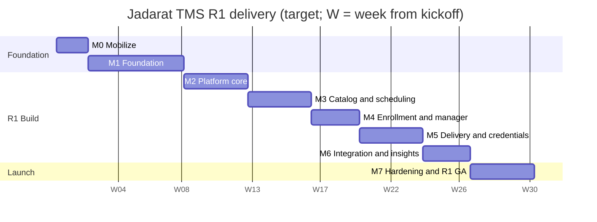

# Jadarat TMS — Development Plan & Engineering Delivery Guide

| | |
|---|---|
| **Audience** | Tech Lead and the engineering, design, QA, DevOps and security team |
| **Owner** | Product Owner, Jadarat TMS |
| **Version** | 1.1 — 30 September 2026 (§2.3 agent-team operating model) |
| **Status** | Issued for Tech Lead review; dates become the baseline after Milestone M1 estimation (§6) |
| **Inputs** | `docs/delivery/STATUS.md` (current state, updated every session) · `docs/brd/Jadarat_TMS_BRD_v2.md` (BRD v2.1) · `docs/brd/TMS_Feature_List.md` · `docs/research/TMS_Market_Comparison_vs_BRD.md` |

---

## 0. How to Use This Guide

- The **BRD** says *what* to build and why. This guide says *how we deliver it*: order, milestones, ways of working, and the quality and security bar every piece of work must pass.
- Requirement IDs (e.g., `FR-SCH-05`, `NFR-SEC-03`) refer to the BRD. Feature IDs (e.g., `SCH-05`) refer to the feature list. Every backlog item must reference at least one ID.
- When this guide and the BRD disagree on *scope*, the BRD wins. When they disagree on *process or quality*, this guide wins. Raise conflicts to the Product Owner.
- The Tech Lead owns the technical plan inside each milestone and may propose changes to sequence or estimates; the Product Owner approves scope and priority changes.

---

## 1. Product Goals & Non-Negotiable Quality Bars

Jadarat TMS is the first module of the Jadarat HR Suite and is also sold standalone. We win on **operations depth, Arabic-first experience, MENA compliance, security and trust**. The following bars apply to every release, not only the final one.

| # | Bar | Definition (measurable) |
|---|---|---|
| Q1 | **Security** | No known **critical or high** vulnerabilities in production (CVSS ≥ 7.0 or equivalent) at any release; tenant isolation proven by automated tests on every table and endpoint; independent penetration test passed before GA. "Zero security issues" is pursued as *zero known critical/high issues, verified continuously*. |
| Q2 | **Tenant isolation** | 100% of tables have row-level security and an automated cross-tenant test; any cross-tenant data exposure is a Sev-1 incident. |
| Q3 | **UX** | Core tasks meet BRD targets (NFR-UX-03): coordinator creates a course and schedules a session ≤ 10 min without training; QR check-in ≤ 3 s; manager approval ≤ 2 taps. Usability tests: task success ≥ 90% on core tasks, System Usability Scale (SUS) ≥ 80. |
| Q4 | **Arabic-first** | Every screen designed and reviewed in Arabic first; RTL correct; Arabic copy written by an Arabic UX writer (no machine-only translation in released UI); Hijri dates where configured. |
| Q5 | **Accessibility** | WCAG 2.2 AA in Arabic and English; zero *serious* or *critical* automated accessibility violations; manual screen-reader check for each new flow. |
| Q6 | **Performance** | NFR-PERF-01…06 met; performance budgets enforced in CI (Lighthouse / bundle size). |
| Q7 | **Reliability** | NFR-AVL targets; zero-downtime deploys; backups and restore tested; RPO ≤ 15 min, RTO ≤ 4 h (≤ 1 h Enterprise/Government). |
| Q8 | **Sovereign-ready** | Every component runs self-hosted (in-country KSA/UAE) — no hard dependency on vendor-only managed features (BRD §15, decision D6). |
| Q9 | **Suite-ready** | Platform services are separated from the TMS module from day one (BRD §3.4, Appendix H.5). |

---

## 2. Team, Roles & Responsibilities

### 2.1 Recommended Team (R1)

| Role | FTE | Key responsibilities |
|---|---|---|
| Product Owner | 1 | Vision, backlog, priorities, acceptance, design-partner relationship, regulatory input |
| Tech Lead | 1 | Architecture, technical plan, code quality, estimates, technical risk, hands-on on critical code |
| Senior Product Designer (Arabic UX) | 1 | Design system, flows, prototypes, usability testing, design QA |
| Arabic UX Writer | 0.5 | All UI copy (AR/EN), terminology glossary, notification templates |
| Full-stack Engineers | 4–5 | Feature delivery end-to-end (DB → API → UI → tests) |
| QA / Test Automation Engineer | 1 | Test strategy, E2E automation, exploratory testing, release testing |
| DevOps / Platform Engineer | 0.5–1 | CI/CD, environments, observability, infrastructure-as-code, sovereign deployment track |
| Security Lead (can be fractional/external) | 0.3 | Threat modeling, security reviews, tooling, pen-test coordination, incident response |

### 2.2 RACI (summary)

**R** = Responsible · **A** = Accountable · **C** = Consulted · **I** = Informed

| Activity | PO | TL | Design | Eng | QA | DevOps | Security |
|---|---|---|---|---|---|---|---|
| Scope & priorities | A/R | C | C | I | I | I | C |
| Architecture & ADRs | C | A/R | I | C | I | C | C |
| UX design & research | A | C | R | C | C | I | I |
| Feature implementation | I | A | C | R | C | C | C |
| Test strategy & automation | C | A | I | R | R | C | C |
| CI/CD & environments | I | A | I | C | C | R | C |
| Threat model & security review | I | A | I | R | C | C | R |
| Story acceptance | A/R | C | C | I | C | I | I |
| Milestone quality gate | A | R | R | R | R | R | R |
| Release go/no-go | A | R | C | I | R | R | R (veto on security) |

The Security Lead has a **veto** on releases with open critical/high security findings. QA has a veto on releases that fail the Definition of Done at milestone level.

### 2.3 Operating Model in Effect: Product Owner + Claude Code Agents (decided 30 Sep 2026)

The delivery team for M0 onward is **the Product Owner (human) plus Claude Code sessions and their sub-agents**. The roles in §2.1 are still performed, but mapped as follows. Everything else in this guide (quality bars, DoR/DoD, CI gates, quality gates) applies unchanged.

| Role in §2.1 | Performed by | How |
|---|---|---|
| Product Owner | **Human PO** | Scope, priorities, decisions, story acceptance, merges to `main`, design partners |
| Tech Lead | Claude (main session) | Architecture, ADRs, plan, sequencing, integration of sub-agent work |
| Engineers | Claude + sub-agents | Implementation in small PRs; parallel sub-agents for independent tasks, each in its own branch/worktree |
| Designer & UX writer | Claude | Design system, prototypes (interactive artifacts), AR/EN copy and glossary — **validated by real users (below)** |
| QA | Claude sub-agent (separate from the author) | Test plans, E2E automation, exploratory review of each PR |
| DevOps | Claude | CI/CD, environments, infrastructure-as-code; account-level actions done by PO |
| Security Lead | Claude sub-agent (separate from the author) | Threat models, security review of each security-relevant PR; **independent human pen test before GA** |

**Review rule (replaces "1–2 approving reviewers" in §3.3):** every PR is (1) authored by one agent, (2) reviewed by a *separate* review pass — code review for all PRs and a dedicated security review for security-relevant PRs — with findings fixed or explicitly accepted, (3) green on all CI gates, and (4) **merged only by the PO**. The PO may ask for a summary of any PR before merging.

**Activities that require humans (cannot be done by agents):**

| Activity | Owner | When |
|---|---|---|
| Account setup and billing (GitHub settings, Supabase, Vercel, domains, messaging providers) | PO | As needed; see STATUS next actions |
| Design partners (3–5 customers) and their feedback | PO | M0 onward |
| Usability tests with real Arabic-speaking users (5–8 per persona) | PO (Claude prepares scripts, tasks and analysis) | M1, M4, M7 |
| Legal validation of regulatory content (BRD Appendix E) | PO + legal counsel | Before each release using it |
| Independent penetration test and accessibility audit | External vendor, arranged by PO | M7 (and annually) |
| UAT sign-off | Design partners | M7 |
| Go/no-go decision and production promotion | PO | Each release |

**Continuity:** agents have no memory between sessions. Work state lives in `docs/delivery/STATUS.md` and `docs/delivery/BACKLOG.md`, updated at the end of every session (enforced by the Stop hook described in `CLAUDE.md`).

**Timeline:** milestone dates in §6 assumed a human team. They are re-baselined at Gate G1 based on actual throughput of the agent team and on the pace of human-dependent activities (usability tests, design partners).

---

## 3. Ways of Working

### 3.1 Cadence

| Ritual | Frequency | Participants | Output |
|---|---|---|---|
| Sprint (2 weeks) planning | Bi-weekly | Team | Sprint goal linked to milestone |
| Daily stand-up | Daily, 15 min | Team | Blockers raised |
| Backlog refinement | Weekly | PO, TL, Designer, 1–2 engineers, QA | Stories meeting Definition of Ready |
| Design critique | Weekly | Designer, PO, TL, UX writer | Approved designs for next sprint |
| Architecture review | Weekly, 45 min | TL, engineers, DevOps, Security | ADR decisions |
| Security review | Per epic (before build) and before merge of security-relevant changes | Security Lead, TL, owner engineer | Threat model + review record |
| Sprint review / demo | Bi-weekly | Team, PO, stakeholders; design partners every 2nd review | Feedback captured as backlog items |
| Retrospective | Bi-weekly | Team | 1–3 improvement actions |
| Milestone quality gate | End of each milestone | All roles | Gate record (pass / conditional / fail) |
| Status report | Weekly | PO → management | RAG status, progress, risks, quality metrics |

### 3.2 Backlog Structure

- **Epic** = a BRD module slice for one milestone (e.g., "M3 — Scheduling core").
- **Story** = a user-visible increment, written as *As a [persona], I want … so that …*, with Given/When/Then acceptance criteria and BRD IDs.
- **Tech task / enabler** = platform or infrastructure work, linked to the epic it enables.
- **Spike** = time-boxed investigation (≤ 3 days) producing an ADR or decision.
- Labels: `module:*`, `release:R1…R4`, `security-relevant`, `ux-research`, `a11y`, `migration`, `suite-platform`.

### 3.3 Source Control & Code Review

- Trunk-based development: short-lived branches (≤ 3 days), small pull requests (target < 400 changed lines).
- Branch protection on `main`: all CI gates green, at least **1 approving review** (2 for security-relevant or migration changes, one of which is the Tech Lead or Security Lead), CODEOWNERS for `packages/platform-*`, `supabase/migrations`, auth and RLS code.
- Conventional commit messages; each PR references a backlog item and BRD IDs; PR template checklist (Appendix B) completed.
- No direct pushes to `main`; no force-push on shared branches; secrets never committed.

### 3.4 Environments

| Environment | Purpose | Data | Deployed |
|---|---|---|---|
| Local | Development (Supabase CLI local stack) | Seed data | Developer |
| Preview | Per pull request | Seed data | Automatic on PR |
| Staging | Integration, QA, demos, UAT | Anonymized / synthetic | Automatic on merge to `main` |
| Production (regional) | Customers | Real | Manual promotion after release checklist |
| Sovereign staging (from R2) | Rehearse in-country self-hosted deployment | Synthetic | Per release candidate |
| Sovereign production (R3) | Government / bank tenants | Real, in-country | Per contract |

Production data is **never** copied to lower environments.

### 3.5 Architecture Decision Records (ADRs)

Every significant decision is recorded in `docs/adr/NNNN-title.md` (template in Appendix E): context, options, decision, consequences, security and sovereignty impact. ADRs required in M1 are listed in §6.

---

## 4. Definition of Ready & Definition of Done

### 4.1 Definition of Ready (story can enter a sprint)

- [ ] Linked to BRD requirement/feature IDs and to an epic/milestone
- [ ] User story and Given/When/Then acceptance criteria written and agreed with PO
- [ ] Designs approved (Arabic and English, desktop and mobile, empty/error/loading states)
- [ ] Final Arabic and English copy provided by UX writer
- [ ] Data model and API impact understood; migrations identified
- [ ] Security-relevant? If yes, threat model for the epic exists and mitigations are listed in the story
- [ ] Dependencies identified and unblocked
- [ ] Estimated by the team; fits in one sprint

### 4.2 Definition of Done (story)

- [ ] Acceptance criteria met and accepted by PO on staging
- [ ] Code reviewed and merged; all CI gates green (§5.3)
- [ ] Unit and integration tests added; E2E test added/updated for user-visible flows (Arabic and English)
- [ ] **RLS / tenant-isolation test added for every new table or endpoint**
- [ ] Authorization checks on every server action / API route (deny by default) with negative tests
- [ ] Input validation (schemas) on every boundary; output encoding; no secrets or personal data in logs
- [ ] Accessibility: no serious/critical automated violations; keyboard path works; screen-reader labels present
- [ ] RTL and LTR verified; Hijri/Gregorian where relevant; numerals per setting
- [ ] Design QA passed (matches design system; spacing, typography, states)
- [ ] Performance budget respected
- [ ] Audit events emitted for create/update/delete and sensitive reads/exports
- [ ] Telemetry (logs, metrics, traces) added for new operations
- [ ] Feature flag in place if the feature is incomplete or risky
- [ ] API changes documented (OpenAPI) and backwards-compatible
- [ ] User-facing help text / docs updated where needed
- [ ] No open critical/high defects linked to the story

### 4.3 Definition of Done (milestone) — see Quality Gates §7.

---

## 5. Quality Framework

### 5.1 Test Strategy

| Level | Tooling (recommended) | Scope | Target |
|---|---|---|---|
| Static | TypeScript strict, ESLint, Prettier | All code | 0 errors |
| Unit | Vitest | Domain logic, utilities, validation, date/Hijri, permissions | ≥ 80% line coverage for `packages/*` and domain code |
| Database | pgTAP (or SQL test harness) | RLS policies, functions, triggers, constraints | 100% of tables with RLS tests incl. cross-tenant negative tests |
| Integration | Vitest + local Supabase | Server actions, API routes, jobs, connectors (with mocks/fakes) | All endpoints; authz negative tests |
| Contract | OpenAPI diff + consumer tests | Public API, LMS connector contracts | No breaking changes without version bump |
| E2E | Playwright | Critical journeys in **Arabic and English**, desktop and mobile viewports | All journeys in Appendix F |
| Accessibility | axe-core in Playwright + manual screen reader (NVDA/VoiceOver) | Every page | 0 serious/critical |
| Visual regression | Playwright screenshots or Storybook-based visual testing | Design-system components, key pages in RTL/LTR | Reviewed diffs only |
| Performance | Lighthouse CI; k6 load tests | Budgets per page; NFR-PERF | Budgets enforced; load test per milestone from M5 |
| Security | See §8 | — | — |
| Exploratory | QA sessions per sprint | New features, edge cases, Arabic input | Session notes logged |

### 5.2 Critical User Journeys (must always have green E2E tests)

Listed in Appendix F; the list grows each milestone.

### 5.3 CI/CD Quality Gates (block merge when failing)

1. Install with lockfile; licence check (no disallowed licences)
2. Type-check, lint, format
3. Unit tests + coverage threshold
4. Database migration check (applies cleanly on empty DB and on last release snapshot; reversible)
5. RLS / tenant-isolation test suite
6. Integration tests
7. E2E smoke (Arabic + English) on preview environment
8. Accessibility scan on changed pages
9. Lighthouse / bundle-size budget
10. SAST (CodeQL and/or Semgrep with security rules)
11. Dependency vulnerability scan (e.g., `npm audit`/OSV-Scanner) — fail on high/critical with a fix available
12. Secret scanning (e.g., gitleaks) — fail on any finding
13. Container / IaC scanning (e.g., Trivy) for sovereign images
14. OpenAPI breaking-change check

Nightly: full E2E suite, DAST baseline scan (e.g., OWASP ZAP) against staging, dependency update PRs (Renovate/Dependabot).

### 5.4 Defect Severity & Response

| Severity | Definition | Examples | Response / fix target |
|---|---|---|---|
| **S1 Critical** | Security breach or exploitable critical vulnerability, cross-tenant data exposure, data loss/corruption, production outage | Tenant A sees Tenant B data; auth bypass | Immediate; hotfix ≤ 24 h; incident process |
| **S2 High** | Major function broken without workaround; high-severity vulnerability; compliance data wrong | Certificates not issued; attendance lost; stored XSS | Blocks release; fix ≤ 3 working days |
| **S3 Medium** | Function impaired with workaround; notable UX defect; a11y serious issue on non-core page | Filter wrong; RTL misalignment in a dialog | Fix within current/next sprint |
| **S4 Low** | Cosmetic; minor copy | Typo; spacing | Backlog, batch fix |

**Release rule:** no open S1 or S2 at any release. S3 allowed only with PO acceptance and a fix date.

### 5.5 Quality Metrics (reported weekly)

- Open defects by severity and age; escaped defects (found after release)
- CI pass rate; flaky-test count (target 0; flaky tests are fixed or quarantined within 48 h with an owner — never silently skipped)
- Coverage trend; RLS test coverage (target 100% of tables)
- Security findings open by severity; mean time to remediate
- Accessibility violations count
- DORA metrics: deployment frequency, lead time, change failure rate, time to restore
- UX: task success, SUS, time-on-task from latest usability round

---

## 6. Milestone Plan

### 6.1 Timeline Overview (targets — re-baselined at Gate G1)

The BRD targets R1 in months 0–4. With the Foundation phase and the shared platform added (decisions of 30 Sep 2026), a realistic R1 GA for a 4–5 engineer team is **about month 7**. The Tech Lead confirms or adjusts this at Gate G1; the BRD release plan (§16) is then updated.



| Milestone | Weeks | Gate | Theme |
|---|---|---|---|
| M0 Mobilize | 1–2 | G0 | Team, tools, access, decisions, design partners |
| M1 Foundation | 3–8 | **G1** | Design system + prototypes tested; architecture, ADRs, threat model; CI/CD with all gates; walking skeleton |
| M2 Platform core | 9–12 | G2 | Tenancy, identity, people directory, RBAC, audit, notifications base, suite shell |
| M3 Catalog & scheduling | 13–16 | G3 | Courses, templates, sessions, calendar, conflicts, venues, instructors |
| M4 Enrollment & manager | 17–19 | G4 | Enrollment, requests, manager hub, learner PWA, logistics tasks |
| M5 Delivery & credentials | 20–23 | G5 | Attendance, assessments, surveys, certificates, compliance |
| M6 Integration & insights | 24–26 | G6 | Jadarat LMS connector, reports, editions |
| M7 Hardening & R1 GA | 27–30 | **G7** | Pen test, load, accessibility audit, DR drill, UAT, launch |
| R2 Growth | ~months 8–11 | G-R2 | See §6.10 |
| R3 Enterprise & Sovereign | ~months 12–16 | G-R3 | See §6.10 |
| R4 Intelligence & Scale | ~months 17–22 | G-R4 | See §6.10 |

### 6.2 M0 — Mobilize (weeks 1–2)

**Objective:** Team ready to execute; no open blocking decisions.

| Deliverable | Owner |
|---|---|
| Team staffed; roles and RACI confirmed | PO |
| Accounts & access: GitHub org, project tracker, Figma, Supabase org, Vercel team, cloud accounts, error tracking, password manager; SSO + MFA enforced for all team tools | DevOps |
| Backlog seeded: epics per milestone, R1 features mapped to epics (Appendix G) | PO + TL |
| 3–5 design-partner customers signed (at least 2 Saudi, 1 government/bank) with usability-test and UAT commitments | PO |
| Open decisions D3, D4, D5, D8, D9, D10 scheduled for closure (BRD §20) | PO |
| Security tooling licences and pen-test vendor shortlist | Security |
| Kick-off: walk the team through BRD, this guide, research | PO + TL |

**Gate G0:** team and access complete; backlog seeded; design partners confirmed.

### 6.3 M1 — Foundation (weeks 3–8)

**Objective:** Everything needed to build fast *and* safely: validated UX direction, agreed architecture, security baseline, and a production-grade pipeline proven by a walking skeleton.

**Track A — UX foundation (Designer, UX writer, PO)**
- Design principles and Arabic-first design system v1: tokens (color, type scale for Arabic and Latin, spacing, radius, elevation, motion), RTL rules, iconography, data-display patterns (tables, calendars, timelines), forms, feedback states, dark mode tokens.
- Component library in code (`packages/ui`) built on shadcn/ui + Tailwind logical properties, documented in Storybook with RTL/LTR and light/dark stories.
- Suite shell design: navigation, module switcher, notification inbox, approvals inbox, search, mobile bottom navigation (FR-STE-08).
- Clickable prototypes of the 5 critical journeys: (1) coordinator creates course and schedules session; (2) manager approves request (web + WhatsApp); (3) learner QR check-in; (4) manager fills TNA form; (5) certificate verification.
- **Usability test round 1** with 5–8 users per key persona (coordinator, manager, learner) in Arabic; findings triaged and designs updated.
- Terminology glossary AR/EN; content style guide (tone, formality, error messages).

**Track B — Architecture (Tech Lead, engineers, DevOps)**
- Required ADRs:
  1. Monorepo layout and module boundaries (platform packages vs. `modules/tms`) — BRD Appendix H.5
  2. Tenancy model, tenant resolution, RLS pattern and JWT tenant claim (Custom Access Token Hook); helper functions in `private` schema
  3. AuthN/AuthZ: Supabase Auth with `@supabase/ssr`, server-side `getUser()`, permission model with data scopes, namespaced permissions
  4. Domain events: transactional outbox + PostgreSQL queue; idempotency rules
  5. Background jobs and scheduling (self-hostable)
  6. File storage, signed URLs, virus scanning
  7. i18n/RTL, Hijri and working-calendar library; prayer-time calculation approach
  8. Notification service abstraction (e-mail/SMS/WhatsApp/push providers, in-country alternatives)
  9. Observability (OpenTelemetry, logs without PII, error tracking)
  10. Sovereign deployment approach (containers, self-hosted Supabase, no Vercel-only critical paths)
  11. API style (server actions internally; REST `/api/v1` externally), versioning, error model
  12. AI provider abstraction and governance (to be used from R2)
- R1 logical data model and migration conventions; seed data strategy.
- Estimation of R1 epics → re-baselined plan.

**Track C — Security baseline (Security Lead, Tech Lead)**
- Threat model (STRIDE) for the platform and for each R1 epic (template Appendix D); risk register.
- Security requirements baseline: OWASP ASVS Level 2 mapped to modules; secure coding standard; secrets management; dependency policy.
- Priority risk areas with required controls (see §8.3).

**Track D — Engineering platform (DevOps, Tech Lead)**
- Monorepo scaffold; `apps/suite`, `packages/ui`, `packages/platform-*`, `modules/tms`; Supabase migrations folder.
- CI/CD with **all** gates from §5.3 active from the first commit; preview deployments; staging auto-deploy; production promotion workflow.
- Observability stack, error tracking, uptime checks, status page skeleton.
- **Walking skeleton:** a user signs in (MFA), lands in the Arabic RTL suite shell for a demo tenant, sees an empty TMS module, and an audit event is recorded — deployed to staging through all gates, and also started in a local self-hosted (Docker) stack to prove sovereignty.

**Gate G1 — Foundation sign-off (weeks 8)**
- [ ] Design system v1 in code + Storybook; shell and 5 journeys designed and tested; usability round 1 results: core-task success ≥ 80% on prototypes, all critical issues fixed in designs
- [ ] ADRs 1–11 approved; ADR 12 drafted
- [ ] Threat models for platform and R1 epics; risk register created
- [ ] CI/CD with all 14 gates active; walking skeleton green on staging and self-hosted
- [ ] R1 estimated; re-baselined milestone dates approved by PO; BRD §16 updated
- [ ] Design partners have seen prototypes and confirmed R1 priorities

### 6.4 M2 — Platform Core (weeks 9–12)

**Scope (features):** ADM-01, 02, 04, 05, 07, 11, 13, 14, 17 · IAM-01…05, 07, 12, 13 · STE-01, 02, 08 · AUD-01, 05 · SUB-01 · DEP-01, 05 · NTF-01, 02, 07 · SCH-07 (Hijri/Gregorian date components as shared platform capability)

**Key outcomes:** self-service tenant sign-up and onboarding wizard; organization, branches, departments; branding basics; custom fields engine; people directory (shared suite record) with bulk import; invitations; 15 default roles with scopes; MFA, password policy, session controls; immutable audit log; consent capture; editions/feature flags; suite shell with navigation and notification center; e-mail notifications with bilingual templates; Arabic-only mode.

**Security focus:** tenant isolation, authentication flows, session management, import file handling, audit immutability, platform-admin impersonation controls.

**Gate G2:** DoD for all stories; 100% RLS test coverage; security review of auth and tenancy passed; E2E for sign-up → invite → login (MFA) → role-restricted access in AR/EN; usability check of onboarding wizard with ≥ 3 partner users.

### 6.5 M3 — Catalog & Scheduling (weeks 13–16)

**Scope:** CAT-01, 02, 03, 05, 06, 10 · SCH-01, 02, 03, 05, 08 · RES-01, 02, 03, 07 · INS-01…05 · FIN-03

**Key outcomes:** courses with templates, prerequisites, objectives, materials library, Arabic search; sessions (multi-day, recurrence, lifecycle); calendar with drag-and-drop; conflict detection (instructor, room, learner, holidays, weekends); minimum-enrollment rules; venues/rooms/equipment; instructors with qualification matrix, availability and instructor portal; session cost model.

**Security focus:** file uploads (materials), instructor portal data exposure (external instructors see only assigned sessions), authorization on scheduling actions.

**Gate G3:** journey "coordinator creates course and schedules session with room and instructor" completed by partner users in ≤ 10 min (NFR-UX-03); calendar performance with 500 sessions ≤ 1.5 s; security review passed.

### 6.6 M4 — Enrollment, Requests & Manager (weeks 17–19)

**Scope:** ENR-01, 02, 03, 13 · PLN-01 · MGR-01…04 · LOG-01, 02 · LRN-01, 03, 04, 07 · NTF-08

**Key outcomes:** self/manager/bulk enrollment with eligibility and capacity checks; default approval chain; training requests; manager hub (team dashboard, approvals inbox, team calendar, nominate); session task checklists and joining instructions; learner "My Learning" in installable PWA; calendar invites; scheduled reminders.

**Security focus:** approval-link integrity (signed, single-use, expiring), manager data scope (direct reports only), notification content (no sensitive data in e-mail/SMS previews).

**Gate G4:** approval journey ≤ 2 taps on mobile; E2E enrollment→approval→calendar invite in AR/EN; usability round 2 (manager + learner) SUS ≥ 75 (target 80 by G7).

### 6.7 M5 — Delivery & Credentials (weeks 20–23)

**Scope:** ATT-01…04, 09, 11 · ASM-01, 02, 04, 05, 08 · CRT-01…08 · REG-01

**Key outcomes:** manual attendance, rotating signed QR check-in with geo-fence, check-in/out, attendance rules, printable sign-in sheets; question bank, pre/post tests, grading rubrics, L1 surveys, evaluation forms; certificate designer, signatories, numbering, auto-issuance, public verification, expiry and recertification; external certifications; compliance rules engine and dashboard; compliance-framework engine.

**Security focus:** QR token replay and screenshot sharing, geo-location privacy and consent, public verification endpoint (enumeration, rate limiting, minimal data), certificate tamper-evidence, test integrity.

**Gate G5:** QR check-in ≤ 3 s p95 with 300 concurrent scans (load test); certificate verification abuse tests passed; compliance calculations verified against test fixtures by QA and PO.

### 6.8 M6 — Integration & Insights (weeks 24–26)

**Scope:** LMS-01, 02, 03, 05, 06, 07, 10 · RPT-01, 02 · LRN-08 (full accessibility pass)

**Key outcomes:** LMS connector framework; Jadarat LMS connector at level L2 (SSO deep links, catalog sync, enrollment push, completion pull, mapping, retries, reconciliation, health monitoring); executive dashboard and operational reports with exports; full accessibility sweep.

**Security focus:** connector credential vault, webhook signature verification, SSRF protections on outbound calls, idempotency and replay protection, export permissions and audit.

**Gate G6:** end-to-end blended scenario with Jadarat staging (BRD §7.8 acceptance criteria); no data duplicates under retry tests; reports match seeded fixtures.

### 6.9 M7 — Hardening & R1 GA (weeks 27–30)

**Activities**
- Feature freeze (only S1/S2 fixes); bug bash with the whole team and design partners
- Independent **penetration test** (web app, API, tenant isolation, auth, QR/approval tokens) and remediation; re-test
- **Load and soak tests** against NFR-PERF/SCAL targets
- **Accessibility audit** (external or expert internal) in Arabic and English
- **Disaster-recovery drill:** restore from backup to a new environment; measure RPO/RTO
- **UAT** with design partners on staging using their real (anonymized) configuration
- Documentation: admin guide, user guides (AR/EN), API reference, release notes, runbooks, on-call rota, incident response plan
- Legal/compliance: DPA, privacy notice, sub-processor list, SDAIA transfer safeguards for KSA data (BRD §12.2)
- Data-migration rehearsal for first customers
- Go/no-go meeting (§7, G7)

**Gate G7 — R1 release readiness:** see §7.2.

### 6.10 R2–R4 (outline; detailed plans prepared at the end of the preceding release)

| Release | Target | Main epics (BRD) | Special tracks | Gate highlights |
|---|---|---|---|---|
| **R2 Growth** | ~months 8–11 | Planning cycle (PLN), Qiwa disclosure & OJT quota (REG-02/03), SAMA pack, custom roles & scopes, SSO, audiences, workflow builder, waitlists/quotas/cancellation, VILT, resource timeline, e-signature & offline attendance, OJT & observation checklists, competencies, budgets/expenses, providers & portal, trainer contracts/payments, WhatsApp/SMS/push, report builder, unified transcript, AI assistant/recommendations/content + AI governance, public API & webhooks, HRIS connectors, Jadarat L3, xAPI | **Sovereign staging rehearsal** each release candidate; **AI safety evaluation suite** (Arabic) before enabling AI features | Qiwa disclosure validated with ≥ 2 Saudi partners; AI red-team (prompt injection, data leakage) passed |
| **R3 Enterprise & Sovereign** | ~months 12–16 | Legal entities, sandbox, SCIM, scenarios, AI optimizer, Ops Agent, MCP server, RFQ, POs, invoice matching, chargebacks, ERP export, subsidy packs, UAE/CMA packs, Open Badges 3.0, kiosk/NFC, BI connector, ESG, training agreements (STE-06), Moodle and other connectors, Jadarat L4, **in-country KSA/UAE production**, dedicated hosting | **ISO 27001** certification; NCA ECC/CCC alignment evidence | Pen test incl. sovereign deployment; Ops Agent confirmation/undo and permission tests; first government/bank tenant live |
| **R4 Intelligence & Scale** | ~months 17–22 | ROI, predictive insights, conversational analytics, AI matching, skills inference, transcription, regulatory drafting, proctoring, health CPD, connector SDK, iPaaS, customer-hosted package | **SOC 2 Type II** | Partner connector certification program live |
| **Suite readiness** | Parallel from R2 | FR-STE-03…09 activate as Core HR, Payroll & Time, Performance & Skills, Recruitment & Onboarding ship | Architecture review before each new module team starts | Module contract tests between TMS and each new module |

---

## 7. Quality Reviews & Gates

### 7.1 Review Types

| Review | When | Who | Checks | Record |
|---|---|---|---|---|
| Code review | Every PR | Peer (+TL/Security for sensitive) | Correctness, readability, tests, security checklist, DoD | PR approval |
| Design QA | Every UI story before acceptance | Designer | Visual fidelity, RTL/LTR, states, responsive, a11y basics | Story comment |
| Security review | Per epic before build (threat model) and before merge of security-relevant PRs | Security Lead + TL | Threat model mitigations implemented; ASVS items; tests present | Review record in `docs/security/reviews/` |
| Sprint quality review | End of each sprint (30 min in review) | QA + TL | Defect trends, flaky tests, coverage, a11y, performance budgets | Sprint report |
| UX research round | M1, M4, M7 (then every release) | Designer + PO | Usability tests with target users; SUS; task success | Research report |
| Milestone quality gate | End of each milestone | All roles; PO chairs | Gate checklist (7.2) | Gate record (pass / conditional / fail) |
| Release readiness (go/no-go) | Before each release | PO, TL, QA, Security, DevOps | G7 checklist | Signed go/no-go record |
| Post-release review | 2 weeks after release | Team | Escaped defects, incidents, adoption metrics, lessons | Retrospective notes |

A **conditional pass** requires a written remediation plan with owners and dates, approved by the PO and — for any security item — the Security Lead. A **fail** stops the next milestone's feature work until resolved.

### 7.2 Standard Milestone Gate Checklist (G2–G6) and Release Gate (G7)

**Functional**
- [ ] All *Must* stories of the milestone meet DoD and are accepted by PO
- [ ] Demo to design partners completed; feedback triaged

**Quality**
- [ ] Critical journeys E2E green in Arabic and English (desktop + mobile)
- [ ] No open S1/S2 defects; S3 list accepted by PO
- [ ] Coverage and RLS-test targets met; zero flaky tests without owner

**Security**
- [ ] Threat-model mitigations for the milestone verified by tests or review
- [ ] SAST, dependency, secret, container scans: zero open critical/high
- [ ] DAST baseline on staging: zero open high
- [ ] Security review record signed off

**UX & accessibility**
- [ ] Design QA passed for all new screens
- [ ] Zero serious/critical accessibility violations; manual screen-reader check of new flows
- [ ] UX targets for the milestone met (task time / success where defined)

**Performance & reliability**
- [ ] Performance budgets and relevant NFR-PERF targets met
- [ ] Monitoring, alerts and runbooks exist for new components

**Sovereignty & suite readiness**
- [ ] New components run in the self-hosted stack
- [ ] No module reads another module's tables directly; platform code kept in platform packages

**Additional for G7 (release)**
- [ ] Independent penetration test: no open critical/high; re-test evidence attached
- [ ] Load/soak tests meet NFR-PERF and NFR-SCAL targets
- [ ] Accessibility audit passed (WCAG 2.2 AA)
- [ ] Backup restore / DR drill meets RPO/RTO
- [ ] UAT sign-off from ≥ 3 design partners
- [ ] Documentation, release notes, runbooks, on-call, status page ready
- [ ] Legal & privacy artefacts (DPA, privacy notice, sub-processors, transfer safeguards) approved
- [ ] Rollback plan tested

---

## 8. Security Program (Secure Development Lifecycle)

### 8.1 Principles

Secure by design, deny by default, least privilege, defense in depth, no secrets in code, privacy by design, everything auditable, verify continuously.

### 8.2 Lifecycle Activities

| Phase | Activity |
|---|---|
| Plan | Security requirements per epic (ASVS L2 mapping); abuse cases in stories |
| Design | Threat model (STRIDE) per epic; security review of ADRs |
| Build | Secure coding standard; validated inputs (schema validation at every boundary); parameterized queries only; output encoding; CSP; secrets from vault |
| Verify | CI gates (§5.3); security unit tests; RLS tests; DAST nightly; manual review for sensitive PRs |
| Release | Pen test before GA and annually; go/no-go security veto |
| Operate | Monitoring and alerting; vulnerability management SLAs; incident response; bug bounty after GA; access reviews quarterly |

### 8.3 Priority Risk Areas & Required Controls

| Risk area | Required controls |
|---|---|
| **Cross-tenant data access** | RLS on every table; tenant claim from server-verified JWT; no service-role key in request paths; automated cross-tenant tests; tenant ID never taken from client input |
| **Broken authorization** | Central permission checks with data scopes; deny by default; negative tests per endpoint; server-side checks even when UI hides actions |
| **Authentication & sessions** | MFA; lockout; secure cookies; session rotation on privilege change; `getUser()` server verification; SSO assertions validated (signature, audience, expiry) |
| **QR check-in & approval links** | Signed, short-lived, single-use tokens bound to session/day and user; replay detection; rate limits |
| **File uploads** | Type/size checks, virus scanning, private storage, signed expiring URLs, no inline execution of uploaded HTML/SVG |
| **Webhooks & connectors** | HMAC signature verification with timestamp; outbound URL allow-list and SSRF protection (block internal IP ranges); secrets in vault; idempotency keys |
| **AI features (R2+)** | Prompt-injection defenses; tools execute only within user permissions; human confirmation for data-changing actions; output filtering; no cross-tenant retrieval; full logging; red-team tests in Arabic and English |
| **Personal data** | Data minimization; field-level encryption for sensitive fields; no PII in logs; retention and erasure workflows; consent records |
| **Public endpoints** (sign-up, verification, public catalog, check-in) | Rate limiting, bot protection, minimal data exposure, enumeration protection |
| **Supply chain** | Lockfiles; pinned versions; automated dependency updates; licence checks; SBOM generated per release; signed container images for sovereign deployments |
| **Infrastructure** | Least-privilege cloud IAM; MFA on all admin accounts; secrets rotation; infrastructure-as-code reviewed; audit logging of admin actions |

### 8.4 Vulnerability Remediation SLAs

| Severity | Remediation target |
|---|---|
| Critical | 24 hours (hotfix) |
| High | 7 days (and before any release) |
| Medium | 30 days |
| Low | 90 days or accepted risk with PO + Security sign-off |

---

## 9. UX Program

- **Research cadence:** usability tests at M1 (prototypes), M4 and M7, then at least once per release; 5–8 participants per key persona; sessions in Arabic; recruit via design partners.
- **UX metrics:** task success, time on task, error rate, SUS (target ≥ 80 at GA), post-release adoption (weekly active coordinators, approval turnaround).
- **Design system governance:** every new component goes through design + engineering review; no one-off styles; tokens only; RTL/LTR and dark mode mandatory.
- **Content:** Arabic UX writer owns all copy; glossary enforced; notification templates reviewed for tone and formality; English is a peer language, not the source.
- **Heuristics checklist for design QA:** clarity of primary action, progressive disclosure, empty/loading/error states, forgiving inputs (Arabic/English digits, name variants), undo for destructive actions, consistent date display (Hijri/Gregorian), mobile ergonomics (thumb zones), accessible contrast and focus.

---

## 10. Sovereign Deployment Track

| When | Activity |
|---|---|
| M1 | ADR 10; walking skeleton runs in local self-hosted stack (Docker Compose) |
| Every milestone | CI job builds container images and runs smoke tests against self-hosted stack |
| R2 | Sovereign staging in a KSA/UAE cloud region; infrastructure-as-code; backup/restore drill in-country |
| R3 | Sovereign production; NCA ECC/CCC control evidence; in-country e-mail/SMS/AI alternatives verified |

---

## 11. Risk, Dependency & Change Management

- **RAID log** (Risks, Assumptions, Issues, Dependencies) maintained by PO, reviewed weekly with TL; top risks from BRD §18 seeded.
- **Key dependencies:** Jadarat LMS APIs (needed by M6), WhatsApp BSP (R2), payment gateway for subscriptions (R2), in-country cloud partner (R2 staging), pen-test vendor (booked by M5 for M7).
- **Change control:** scope changes go through PO; changes affecting a committed milestone require TL impact assessment (effort, risk, quality) and PO approval; BRD updated with version history.

---

## 12. Reporting

**Weekly status report (PO → management):** overall RAG; milestone progress (% stories done vs. plan); next gate date and confidence; top 5 risks/issues; quality metrics (§5.5); security findings; decisions needed.

**Milestone report:** gate result and checklist evidence; demo feedback; UX metrics; re-forecast of remaining milestones.

---

## 13. First Two Weeks — Tech Lead Checklist

- [ ] Read BRD v2.1, feature list, research report and this guide; list questions for PO
- [ ] Confirm team composition and gaps
- [ ] Set up repository, branch protection, CODEOWNERS, PR template (Appendix B)
- [ ] Draft ADR list and owners; start ADR 1 (monorepo/modules) and ADR 2 (tenancy/RLS)
- [ ] Set up CI with gates 1–3 and 10–12 on day one; add the rest during M1
- [ ] Plan the walking skeleton
- [ ] Book first threat-modeling session with Security Lead
- [ ] Agree sprint calendar and rituals with the team
- [ ] Review R1 epics with PO and prepare estimation for Gate G1

---

## Appendix A — R1 Scope by Milestone (feature IDs)

| Milestone | Features |
|---|---|
| M2 Platform core | ADM-01, 02, 04, 05, 07, 11, 13, 14, 17 · IAM-01…05, 07, 12, 13 · STE-01, 02, 08 · AUD-01, 05 · SUB-01 · DEP-01, 05 · NTF-01, 02, 07 · SCH-07 |
| M3 Catalog & scheduling | CAT-01, 02, 03, 05, 06, 10 · SCH-01, 02, 03, 05, 08 · RES-01, 02, 03, 07 · INS-01…05 · FIN-03 |
| M4 Enrollment & manager | ENR-01, 02, 03, 13 · PLN-01 · MGR-01…04 · LOG-01, 02 · LRN-01, 03, 04, 07 · NTF-08 |
| M5 Delivery & credentials | ATT-01…04, 09, 11 · ASM-01, 02, 04, 05, 08 · CRT-01…08 · REG-01 |
| M6 Integration & insights | LMS-01, 02, 03, 05, 06, 07, 10 · RPT-01, 02 · LRN-08 |

Total: 96 features = the R1 cut in the feature list. IAM-07 and IAM-13 deliver their R1 parts (default roles; password/lockout/session controls); their later parts follow in R2/R3.

## Appendix B — Pull Request Template

```markdown
## What & why
<!-- Summary. Link backlog item and BRD IDs (e.g., FR-SCH-05). -->

## How tested
- [ ] Unit / integration tests
- [ ] E2E (Arabic + English) where UI changed
- [ ] RLS / tenant-isolation tests for new tables/endpoints
- [ ] Authorization negative tests

## Checklist
- [ ] Input validation at boundaries; no secrets / PII in logs
- [ ] Audit events for create/update/delete/sensitive reads
- [ ] RTL/LTR checked; Hijri/Gregorian where relevant
- [ ] Accessibility: no serious/critical violations
- [ ] Migrations reversible and reviewed
- [ ] API changes documented; no breaking changes
- [ ] Feature flag if incomplete/risky
- [ ] Security-relevant? Separate security review completed and findings resolved

## Screenshots (Arabic and English)
```

## Appendix C — User Story Template

```markdown
**Title:** <verb + object>
**BRD IDs:** FR-XXX-NN
**As a** <persona> **I want** <capability> **so that** <outcome>.

**Acceptance criteria**
- Given … When … Then …
- Given … When … Then …

**Out of scope:** …
**Security notes:** <threat-model mitigations that apply>
**UX:** <Figma link> · **Copy:** <AR/EN copy link>
**Analytics / audit events:** …
```

## Appendix D — Threat Model Template (per epic)

```markdown
# Threat model — <Epic>
**Scope & assets:** data, actors, entry points, trust boundaries (diagram)
**STRIDE analysis**
| Threat | Category (S/T/R/I/D/E) | Entry point | Likelihood | Impact | Mitigation | Test/verification | Status |
**Abuse cases:** …
**Residual risks & owner:** …
**Reviewed by / date:** …
```

## Appendix E — ADR Template

```markdown
# ADR NNNN — <Title>
**Status:** Proposed | Accepted | Superseded
**Context:** …
**Options considered:** 1) … 2) … 3) …
**Decision:** …
**Consequences:** positive / negative
**Security impact:** …
**Sovereign deployment impact:** …
**Suite (multi-module) impact:** …
```

## Appendix F — Critical User Journeys (E2E, Arabic + English)

| # | Journey | From |
|---|---|---|
| J1 | Tenant sign-up → onboarding wizard → invite user | M2 |
| J2 | Login with MFA → role-restricted navigation | M2 |
| J3 | Bulk import users with validation errors and fix | M2 |
| J4 | Create course from template → schedule multi-day session → resolve conflict | M3 |
| J5 | Learner self-enrolls → manager approves on mobile → calendar invite received | M4 |
| J6 | Manager nominates team → waitlist/capacity handling | M4 |
| J7 | Session task checklist generated and completed | M4 |
| J8 | QR check-in (valid, expired screenshot, out-of-range) | M5 |
| J9 | Pre/post test → grading → certificate issued → public verification | M5 |
| J10 | Certification expiry → reminder → recertification enrollment | M5 |
| J11 | Blended program: LMS completion unlocks ILT session | M6 |
| J12 | Executive dashboard filters and report export | M6 |
| J13 | Cross-tenant access attempts on every API group return 403/404 | M2 onward |

## Appendix G — Backlog Seeding (epics)

`EP-M1-UX` Design system & prototypes · `EP-M1-ARCH` ADRs & data model · `EP-M1-SEC` Threat models & security baseline · `EP-M1-PLAT` CI/CD & walking skeleton · `EP-M2-TEN` Tenancy & onboarding · `EP-M2-IAM` Identity & roles · `EP-M2-PEO` People directory · `EP-M2-AUD` Audit & consent · `EP-M2-SHELL` Suite shell & notifications · `EP-M3-CAT` Catalog · `EP-M3-SCH` Scheduling & conflicts · `EP-M3-RES` Venues & resources · `EP-M3-INS` Instructors & portal · `EP-M4-ENR` Enrollment & approvals · `EP-M4-MGR` Manager hub · `EP-M4-LRN` Learner PWA · `EP-M4-LOG` Logistics tasks · `EP-M5-ATT` Attendance · `EP-M5-ASM` Assessments & surveys · `EP-M5-CRT` Certificates & compliance · `EP-M6-LMS` LMS framework & Jadarat connector · `EP-M6-RPT` Reports · `EP-M7-HARD` Hardening & launch.
