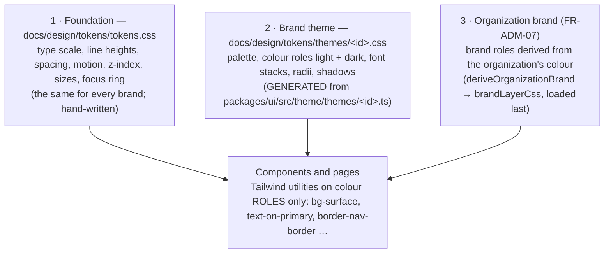

# Theming — how the look is built and swapped

| | |
|---|---|
| **Backlog** | T-M2-04c (visual design round: the look follows Jadarat LMS — PO, 5 Oct 2026) — groundwork |
| **Requirements** | FR-ADM-07 (organization branding, R1), FR-ADM-08 (theme builder, R2), NFR-UX-01 (WCAG 2.2 AA), NFR-UX-04 (consistent design system), NFR-L10N-02 (Arabic typography) |
| **Status** | Groundwork done (9 Oct 2026). The Jadarat LMS theme waits for the PO's material ([`visual-round-brief.md`](visual-round-brief.md)); the round itself follows [`visual-round-checklist.md`](visual-round-checklist.md) |
| **Code** | `packages/ui/src/theme/` (exported as `@jadarat/ui/theme`), `docs/design/tokens/`, `packages/config/tailwind/preset.css`, Storybook «Theme preview» |

## 1. Three layers

- `packages/ui/src/styles.css` imports the foundation, then the shipped theme. **Swapping the look = generating another theme file and importing it there** (§4).
- All three layers set CSS custom properties with the same selectors (`:root` for light; `@media (prefers-color-scheme: dark) :root:not([data-theme="light"])` and `:root[data-theme="dark"]` for dark), so a later layer replaces exactly the properties it sets and dark always beats light.
- The Tailwind preset only *names* the colour roles (`@theme inline reference`): utilities compile to `var(--color-<role>)` and Tailwind keeps no copy of any colour value.
- `docs/design/tokens/tokens.json` (W3C DTCG) documents every token. Tests keep it equal to the CSS.

## 2. The contract

`packages/ui/src/theme/contract.ts` is what a theme must provide:

| Group | Roles (CSS `--color-<role>`) | Notes |
|---|---|---|
| Surfaces | `bg`, `surface`, `surface-raised`, `surface-sunken`, `surface-hover`, `surface-selected` | |
| Text and lines | `text`, `text-muted`, `text-subtle`, `text-disabled`, `border`, `border-strong` | `text-disabled` exempt from contrast; `border` decorative only |
| Primary | `primary`, `primary-hover`, `on-primary`, `primary-subtle`, `primary-text`, `focus-ring` | Buttons, current item, links in brand colour |
| Accent (slot) | `accent`, `accent-hover`, `on-accent`, `accent-subtle`, `accent-text` | Second brand colour; aliases of primary in «jadarat» |
| Status | `success*`, `warning*`, `danger*`, `info*` | Always with an icon and a word (design principles P3) |
| Inverse, scrim | `inverse-surface`, `inverse-text`, `overlay` | Toasts, tooltips; behind dialogs |
| Shell (slot) | `header`, `on-header`, `on-header-muted`, `header-border`, `nav`, `on-nav`, `on-nav-muted`, `nav-border`, `nav-item-hover`, `nav-item-current`, `on-nav-item-current` | Lets a theme colour the header or side navigation; aliases of the surface/text roles in «jadarat» |

Plus font stacks (`--font-family-arabic|latin|mono`), radii (`--radius-sm|md|lg|xl`) and shadows (`--elevation-1…4`, light and dark).

Rules (all enforced by `packages/ui/src/theme/theme.test.ts`):

- every role has a light value; a role without a dark value must be an alias (`{semantic.<role>}`) so it follows its target in dark mode;
- every pair of `CONTRAST_PAIRS` (69 per mode: text 4.5 : 1, UI components and focus 3 : 1) passes in light and dark — [`tokens/contrast-report.md`](tokens/contrast-report.md) is generated from them;
- a theme with `status: 'pending'` (the «Jadarat LMS» slot) must keep the shipped values — nothing guessed before the PO's material arrives;
- `themes/jadarat.css` and `contrast-report.md` must equal what the code generates (CI fails when stale).

Components use roles, never palette steps or raw colours. Navigation entries use `NavItem` / `navItemClasses` / `navHeadingClasses` (shell roles), header text `text-on-header*`, so a coloured header or navigation stays readable.

## 3. Organization brand colours (FR-ADM-07)

`deriveOrganizationBrand({ primary, accent? }, baseTheme)` returns a brand layer for light and dark, the list of `adjustments` and the full contrast check:

| Mode | Fill (`primary`) | Text on fill | Hover | Tint (`primary-subtle`, `surface-selected`) | Brand text, focus ring |
|---|---|---|---|---|---|
| Light | the colour, darkened only as much as needed for white text ≥ 4.5 : 1 and the fill ≥ 3 : 1 on the page | white | 18 % darker (lighter for near-black) | a 90 % white wash, lightened until all text reads on it | darkened until ≥ 4.5 : 1 on every light surface and on the tint |
| Dark | the colour, lightened as needed (a very dark shade of it as text) | very dark shade of the colour | 25 % lighter | a little of the colour on the dark surface | lightened until ≥ 4.5 : 1 on every dark surface and on the tint |

- The result is re-checked against **all** pairs; a failure throws (by construction it cannot happen; the tests run ~530 colours: white, black, pure yellow, greys, a 216-colour grid and seeded random colours, with and without an accent).
- `adjustments` tells the admin preview when the colour shown differs from the one chosen (e.g. yellow `#FFD500` → `#8A7300` for buttons in light mode). The Storybook story «Theme preview / Colours and contrast» shows these notes.
- Only `#RRGGBB` values for known roles can be written (`normalizeHex`, `brandLayerCss`): tenant input can never inject CSS.
- **Not built yet** (EP-M2-TEN): the admin screen, storage, and loading the layer in the app. Planned delivery: the server derives the layer from the stored colour and renders it as `<style nonce={nonce}>` in the locale layout after the stylesheet (the CSP allows only nonce'd styles; no `style=""` attributes). Derive at save time too, so the admin sees the adjustments before publishing.

## 4. Replacing the look (the visual round)

1. Fill `packages/ui/src/theme/themes/jadarat-lms.ts` with the values taken from the PO's material (palette, all roles light + dark, fonts, radii, shadows) and set `status: 'active'`.
2. `pnpm --filter @jadarat/ui exec vitest run src/theme` — fix any contrast failure (the report names the pair and the ratio).
3. Review in Storybook (`pnpm --filter @jadarat/ui storybook`): toolbar **Brand = Jadarat LMS**, Arabic/English, light/dark, «Theme preview» stories; publish the static build for the PO.
4. After PO approval: make it the shipped theme (`SHIPPED_THEME` in `packages/ui/src/theme/index.ts`, the generated file and the `@import` in `styles.css`), update `tokens.json`, then `vitest run -u` (the golden record and the contrast report show every changed value for review).
5. Work through [`visual-round-checklist.md`](visual-round-checklist.md) (fonts, links, form controls, shell adoption, e-mail).

## 5. Proving "no visible change"

- `packages/ui/src/theme/tokens.test.ts` keeps a golden record (snapshot) of every resolved token in 7 contexts (light/dark by app setting and by system, Arabic/English, reduced motion). A refactor must leave it unchanged; a look change shows every changed value in the diff.
- For the T-M2-04c groundwork the computed styles and screenshots of every Storybook story (4 modes) and 17 app routes (desktop and mobile, light and dark) were also compared before/after in a browser: 0 differences.

## 6. Open technical points (Tech Lead)

| # | Point | Proposal |
|---|---|---|
| 1 | E-mails cannot import `@jadarat/ui` (platform packages are UI-free, ADR 0001); `EMAIL_COLORS` in `packages/platform-notifications/src/layout.ts` repeats token values by hand | Move `src/theme` (pure TypeScript, no React) to a small UI-free package that both may import, or store the derived organization palette with the branding settings and pass it to the e-mail renderer |
| 2 | The theme test generates the CSS of the shipped theme only | Generate one file per active theme when a second theme ships |
| 3 | Links have no colour role: Tailwind's preflight makes them inherit the text colour, without underline | Decide the link style in the round (SC 1.4.1: links in text need more than colour) |
| 4 | Fonts are not loaded at all yet (system fonts are shown) | Self-host the chosen fonts in the round (ADR 0007; [`visual-round-brief.md`](visual-round-brief.md) §5) |
