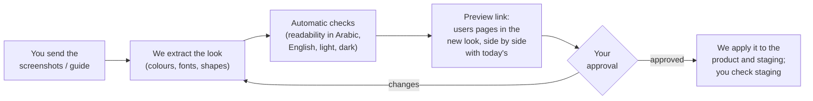

# Visual design round — what we need from you

| | |
|---|---|
| **For** | Product Owner (no technical knowledge needed) |
| **Task** | T-M2-04c — the product should look like **Jadarat LMS** (your decision, 5 Oct 2026) |
| **Status** | Ready on our side (9 Oct 2026). **Waiting for your Jadarat LMS screenshots or brand guide** |
| **Related** | [`visual-round-checklist.md`](visual-round-checklist.md) (our technical checklist), [`theming.md`](theming.md) (how the look is built) |

## 1. Why we need this

We cannot open Jadarat LMS, so we cannot see how it looks. We will not guess its colours or fonts. As soon as you send the material below, we turn it into the new look, show it to you on the real users pages, and apply it once you approve.

Everything is prepared: the product's look (colours, fonts, corner roundness, shadows) now lives in one replaceable "theme". Changing the theme changes every screen at once, in Arabic and English, in light and dark mode — and every colour combination is checked automatically for readability (the WCAG 2.2 AA accessibility standard).

## 2. What to send

### Screenshots of Jadarat LMS

One screenshot of each. If the LMS has both Arabic and English, send the **Arabic** ones first; English too if easy.

| # | Screen | What we learn from it |
|---|---|---|
| 1 | **Sign-in page** | First impression: logo, background, form and button style |
| 2 | **Home page / dashboard** after signing in | Header, menu, cards, overall colours |
| 3 | **A list or table page** (for example a list of courses or learners) | Table style, row height, filters, search, status labels |
| 4 | **A form** (for example adding or editing a course or a user) | Input fields, drop-down lists, check boxes, required fields, error messages |
| 5 | **A detail page** (for example one course or one learner's profile) | Page title, sections, how information is laid out |
| 6 | **The navigation menu** — open, and with a sub-menu if there is one | Menu colours, current-page highlight, icons |
| 7 | **Buttons and dialogs** — a page with several kinds of buttons (main, secondary, delete), and a pop-up window (for example "Are you sure?") | Button shapes and colours, dialog style |
| 8 | **Messages** — a success, warning or error message, if you can find one | Message colours and icons |
| 9 | **Mobile view** — the home page and one list on a phone | How it adapts to small screens |
| 10 | *Optional:* **dark mode**, if the LMS has one | Dark colours (if not, we create a matching dark mode and show you) |
| 11 | *Optional:* an **e-mail** sent by the LMS, and a **certificate**, if any | So e-mails and certificates match too |

### The brand guide, if one exists

| Item | Ideal form |
|---|---|
| **Colours** | The colour codes (for example `#0F665F`), with their names or uses ("main", "secondary", …) |
| **Fonts** | The font names for Arabic and English, the font files if you have them, and **the font licence** (see §5) |
| **Logo** | SVG files (best) or PNG with a transparent background; a version for light backgrounds and one for dark backgrounds; the small icon-only version if there is one |
| **Icon style** | The name of the icon set, if known, or a screenshot with several icons |

If there is no brand guide, screenshots are enough: we read the colours from them and show you the result before anything changes.

## 3. How to send them safely

- **Images only**: PNG or JPG screenshots, and PDF or image files for the brand guide. Attach them in your conversation with Claude, or put them in a shared folder and send us the link.
- Before taking a screenshot, use a **demo or test account** if you can. Otherwise **cover or blur** people's names, e-mail addresses, phone numbers, ID numbers and photos. We do not need real data — only the look.
- **Never** include passwords, sign-in details, links from the address bar that contain codes, or access to the LMS itself.
- **We will not put your screenshots or brand guide in the code repository** (it is public). We only keep what we take from them: colour codes, font names, sizes. Logo files go into the product only after you confirm they may be used there.

## 4. What happens next

1. **We extract the look** from your material into the "Jadarat LMS" theme.
2. **Automatic checks** run in Arabic and English, light and dark. If an LMS colour is too light for readable text, we use a slightly darker shade of it and tell you exactly where.
3. **Preview**: you get a link (our component gallery) where you can switch between today's look and the Jadarat LMS look on the users list, a user profile and the invite form, in Arabic and English, light and dark.
4. **Your decision**: approve, or tell us what to change (in plain words or with screenshots).
5. **Apply**: we switch the product to the new look and you check it on staging. Every screen we build afterwards uses it automatically.

The preview can be ready quickly after we receive the material; applying it is a short follow-up after your approval.

## 5. Arabic fonts — please check

The product runs in our cloud and, for government and bank customers, on their own servers inside the country. So **fonts must be stored with the product itself**. We do not load fonts from Google or any other outside service in production (the product's security settings would block it anyway).

**Today:** the product does not load any font yet. The screens ask for *IBM Plex Sans Arabic* / *IBM Plex Sans*, so people who have them installed see them; everyone else sees their device's standard font (for example Segoe UI or Tahoma on Windows). Only our design mock-ups load fonts from Google, and they are not part of the product. Choosing and storing the right font is part of this round.

| If Jadarat LMS uses… | What it means |
|---|---|
| A **free, open-licence font** (for example IBM Plex Sans Arabic, Noto Sans Arabic, Cairo, Tajawal, Almarai) | No problem: we store it with the product. |
| A **paid font** (for example from the GE SS, DIN Next Arabic or Frutiger Arabic families) | We may only use it if ENTLAQA's licence allows **web use on our own servers, for all customers, including installations on customers' servers**, and use **inside PDF files** (certificates). Please check the licence or ask the person who bought it. |
| A font **we cannot use** under these conditions | We pick the closest open-licence font and show you both side by side. |

## 6. Decisions you may need to make

| # | Question | Our suggestion |
|---|---|---|
| 1 | If the LMS font is a paid font: does ENTLAQA's licence cover the uses in §5? | Check with whoever bought it; otherwise use the closest open-licence font |
| 2 | Logo: does the product show the **Jadarat LMS logo**, a **Jadarat** logo with «التدريب» (Training), or a separate Jadarat TMS logo? | A Jadarat logo with «التدريب», matching the LMS style |
| 3 | If the LMS has **no dark mode**: should we create a matching one? | Yes (the product already supports dark mode) |
| 4 | When an organization picks its own colour (later in M2), it can be too light for readable text. We then use a darker shade of it for buttons and links automatically and show the admin a note. | Keep this automatic adjustment (it guarantees readability) |
