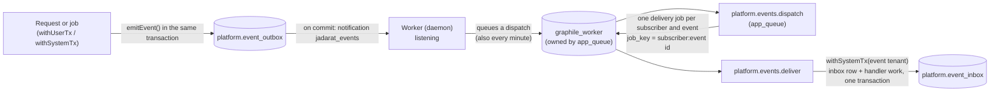

# Background jobs and domain events (runbook)

| | |
|---|---|
| **Backlog** | T-M2-06a (background jobs foundation) |
| **Architecture** | ADR 0004 (domain events, transactional outbox), ADR 0005 (graphile-worker, runtime modes) |
| **Code** | `packages/platform-jobs` (runner, dispatcher, subscriber registry) · `apps/worker` (process) · `platform-db` `emitEvent` (and `markEventProcessed` / `tenantIsServed` in `./jobs`) · migration `20261007090000_platform__jobs_and_event_outbox.sql` |

## 1. How it works



1. Code that changes data calls `emitEvent(tx, { type, subject, data })` **in the same transaction**. The database stamps the tenant and the actor (user, system or platform) from the verified claims; `data` holds identifiers only (thin events, no names, e-mail addresses or phone numbers).
2. When the transaction commits, the outbox trigger's notification (channel `jadarat_events`, one per transaction, none for a rollback) wakes the workers in daemon mode, which queue a `platform.events.dispatch` job (keyed: at most one waiting). The trigger runs as the inserting role and does nothing else, so business transactions never run queue code and never wait on the queue. A minutely schedule dispatches anything a notification missed (no worker listening, a lost connection, one-pass mode).
3. The dispatcher (login role `app_queue`, no access to business tables) takes up to 500 pending events (`for update skip locked`, so dispatchers on several workers never take the same event), queues one `platform.events.deliver` job per subscriber and event in a single call, and marks the events dispatched — all in one transaction.
4. A delivery runs inside the event tenant's system transaction (`withSystemTx`, login role `app_worker`, RLS applies). If the organization is not active (suspended, cancelled) the delivery is skipped with a warning and not replayed later (ADR 0005 §4). Otherwise it records `(subscriber, event)` in `platform.event_inbox`; if that row already exists the delivery was a retry or a duplicate and the handler does not run. The inbox row and the handler's work commit together: **exactly-once effect, at-least-once delivery**. Deliveries for a subscriber that no longer exists or no longer handles the event type are skipped.
5. A failing handler rolls back (inbox row included) and graphile-worker retries it with exponential back-off (`exp(min(attempts, 10))` seconds; 10 attempts by default, per subscriber `maxAttempts`). The error reaches the queue (`last_error`) and the logs as `delivery failed: <class> [<code>]` with stack locations only: its message may name people or quote values, so it is never kept.

## 2. Adding a subscriber

```ts
// packages/<package>/src/jobs/subscribers.ts  (or modules/<module>/src/jobs/…)
import type { Subscriber } from '@jadarat/platform-jobs/jobs';

export const invitationEmail: Subscriber = {
  name: 'notifications.invitation_email', // stable; it is the inbox key
  types: ['com.entlaqa.platform.invitation.created'],
  handle: async ({ tx, event }) => {
    // Database work only, in `tx` (the event's tenant). Never call an external service here:
    // write a delivery record and let a separate job call out, keyed by that record (ADR 0004 §5).
  },
};
```

Then add it to `SUBSCRIBERS` in `apps/worker/src/subscribers.ts`. Rules:

- Names are lower-case (`a-z 0-9 _ . @ -`), unique, and never reused; to reprocess events already handled (rebuilding a projection), version the name (`compliance-projector@v2`).
- Event types follow `com.entlaqa.<module>.<entity>.<action>`.
- Handlers must not assume delivery order (ADR 0004 §6).
- Job code lives in a `src/jobs/` folder: only there (and in `apps/worker`) may `withSystemTx` and `@jadarat/platform-jobs/jobs` be imported; the web app can never reach them (dependency rules, `pnpm check:deps`).

## 3. Running the worker

| Where | How | Connections |
|---|---|---|
| Local | `pnpm --filter @jadarat/worker build`, then `node apps/worker/dist/main.mjs daemon` (or `once`) | `DATABASE_URL_APP_QUEUE`, `DATABASE_URL_APP_WORKER` (names in `.env.example`) |
| Self-hosted (sovereign) | Service `worker` in `infra/docker/compose.yaml`: two replicas, daemon mode, read-only container | Same variables; TLS verify-full via `DATABASE_CA_CERT_FILE` |
| Staging (regional SaaS) | **Actions → Jobs (staging)**: one pass every 5 minutes and on demand (§4) | Secrets of the GitHub environment `staging-jobs` |
| Production (regional SaaS) | Worker containers (≥ 2 replicas) on a container host in Frankfurt — **host to be approved by the PO before real customers** (ADR 0005 §1) | Session-pooler or direct connections (LISTEN/NOTIFY needs a session) |

Modes: `daemon` listens for new events, runs until SIGTERM/SIGINT, lets running jobs finish and exits 0 (allow it up to a minute: a job killed half-way is retried only after graphile-worker's 4-hour lock expiry); `once` installs/upgrades the queue schema, queues a dispatch, runs every job that is due and exits — with exit code 1 when the pass could not run **or** when events written more than 10 minutes earlier are still waiting for dispatch (a stuck dispatch shows as a failed run). Failed jobs stay in the queue for their retry. `WORKER_CONCURRENCY` (default 5 in daemon mode, 2 in one-pass mode) sets the jobs run in parallel; each process opens up to `concurrency + 3` queue connections and `concurrency` tenant connections. The queue connection URL may carry TLS settings only (other parameters, such as `?host=` or `?user=`, are refused).

graphile-worker installs and upgrades its own tables in `graphile_worker` (owned by `app_queue`) when a worker starts. The migration creates the schema and graphile-worker's bootstrap table, so `app_queue` needs no privilege on the database itself. Log lines are the platform's structured JSON lines (`service: jadarat-worker`): graphile-worker's messages (task names, job ids, durations, the cleaned errors above), never job payloads.

## 4. Staging set-up (Product Owner, once, after the PR is merged)

The guide in chat gives one step at a time; this is the full list for reference. Never paste a password or connection string in chat.

1. **Password for the job runner.** GitHub → Settings → Environments → `staging` → Add environment secret `APP_QUEUE_DB_PASSWORD` (a new random password: at least 40 characters, only letters, digits, `-` and `_`, as for the other role passwords in [db-deploy.md](db-deploy.md)). Then **Actions → DB deploy** → `plan`, then `apply` (creates the `app_queue` role, the outbox and the inbox, and sets the password).
2. **New environment.** Settings → Environments → New environment `staging-jobs` → Deployment branches and tags → Selected branches → add `main`.
3. **Secrets of `staging-jobs`** (Supabase → Connect → Session pooler, port 5432 — the same host as `DATABASE_URL` in `staging`, with the user names below):
   - `DATABASE_URL_APP_QUEUE` = `postgresql://app_queue.<project-ref>:<APP_QUEUE_DB_PASSWORD>@<pooler host>:5432/postgres`
   - `DATABASE_URL_APP_WORKER` = `postgresql://app_worker.<project-ref>:<APP_WORKER_DB_PASSWORD>@<pooler host>:5432/postgres`
4. **Variable of `staging-jobs`**: `DATABASE_CA_CERT` = the same PEM text as the variable of the same name in `staging`.
5. **Check:** Actions → Jobs (staging) → Run workflow (branch `main`). The run must be green and its log must show `worker starting (once)` and `worker stopped`. Later runs turn red when events wait for more than 10 minutes; GitHub notifies about failed scheduled runs (by default the person who last changed the workflow's schedule).

Until steps 3–4 are done, every scheduled run ends after a notice ("not configured yet") — harmless. Good to know:
- Scheduled runs start late when GitHub is busy, so on staging an event can take several minutes to be handled; run the workflow by hand for an immediate pass.
- The repository is public, so **anyone can read these run logs**: they hold task names, job ids and cleaned errors only — never payloads, personal data or connection details.
- GitHub turns scheduled workflows off after 60 days without activity in a public repository; Actions shows a banner to turn it back on.

## 5. Operations

| Situation | What to do |
|---|---|
| Pending events pile up (`select count(*) from platform.event_outbox where dispatched_at is null`) | Check that a worker is running and can connect (logs: `worker configuration: …` names the variable at fault). Staging: look at the latest **Jobs (staging)** run |
| A job keeps failing | `select id, task_identifier, attempts, max_attempts, last_error, run_at from graphile_worker.jobs where attempts > 0 order by run_at` (as an owner role). `last_error` holds the cleaned error (class and code). After the last attempt the job stays in the table with `attempts = max_attempts` — dead-letter records and alerts are a follow-up (ADR 0004 §7) |
| Retry a failed job now | `select graphile_worker.reschedule_jobs(array[<id>]::bigint[], run_at := now(), attempts := 0)` |
| A worker died mid-job (killed, host restart) | Its jobs stay locked for 4 hours, then run again. To release them sooner, once the worker is gone for sure: `select graphile_worker.force_unlock_workers(array(select distinct locked_by from graphile_worker.jobs where locked_at < now() - interval '15 minutes'))`. Dispatch itself is never blocked by this (no named queue) |
| Shut down a worker | SIGTERM (`docker compose stop worker`): running jobs finish first, the process exits 0 |

Housekeeping (90-day outbox retention, dead letters, alerts on permanent failures) arrives with the first subscribers that need it (ADR 0004 §7); the R1 schedules of ADR 0005 §6 arrive with their features.
