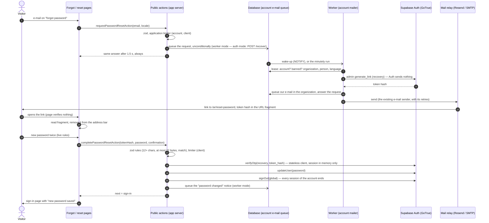

# Forgot / reset password (runbook)

| | |
|---|---|
| **Backlog** | T-M2-08 (no account enumeration, 60-minute single-use link, other sessions ended, confirmation e-mail) · T-M2-17 (the reset e-mail and the "password changed" notice through our notification service) |
| **Requirements** | FR-IAM-13, FR-IAM-16, NFR-SEC-01, FR-NTF-02 (BRD v2.5: account e-mails in the organization's language and brand, never the sign-in provider's mailer) · approved screens 10 `Forgot.dc.html` and 11 `Reset.dc.html` (`docs/design/screens/m2-users-roles/`) |
| **Architecture** | ADR 0003 (all auth flows are server actions; `getClaims`/`getUser`, never `getSession`), ADR 0002 §7 (no Auth secret key in the web app; note T-M2-17: the admin key exists in the worker only), ADR 0005 implementation note T-M2-17 (platform tasks), ADR 0008 implementation notes T-M2-08 and T-M2-17 |
| **Code** | Flow: `packages/platform-identity/src/password-reset.ts` · `auth-next.ts` (Next.js adapter, reads `PASSWORD_RESET_DELIVERY`) · `apps/suite/src/auth/password-reset.ts` (public actions) · `apps/suite/src/lib/{password-reset-input,password-reset-link,reset-limits,client-ip,server-settings}.ts` · pages `/[locale]/forgot-password`, `/[locale]/reset-password`. Worker path (T-M2-17): migration `20261010120000_private__account_mail_requests.sql` · `packages/platform-db/src/account-mail.ts` (request path) and `src/jobs/account-mail.ts` (worker) · `packages/platform-db/src/admin` (`createRecoveryLinkIssuer`) · `packages/platform-identity/src/jobs/account-mailer.ts` · `packages/platform-notifications/src/templates/{password-reset,password-changed}.ts` · `apps/worker/src/platform-tasks.ts`. Auth's own templates (fallback): `supabase/templates/{recovery,password-changed}.html` |
| **Spike** | GoTrue v2.197.0 recovery spike (7 Oct 2026) and `generate_link` source review (T-M2-17): findings in §2 and §4 |

## 1. Who sends the e-mails: `PASSWORD_RESET_DELIVERY`

A **server setting of the web app** (never sent to the browser; checked at start-up by the app's instrumentation — any value other than `auth`, `worker` or empty stops the start — and again on use):

| Value | Reset e-mail | "Password changed" notice | Where |
|---|---|---|---|
| `auth` (**default**, also when unset) | Supabase Auth's own mailer (`resetPasswordForEmail` on a stateless client, our template `supabase/templates/recovery.html`) — T-M2-08 behaviour, unchanged | Auth's own notice, when switched on in Auth (hosted: dashboard; template `password-changed.html`) | Hosted staging until the worker runs continuously; local Supabase |
| `worker` | **Our notification service**: the request is queued in the database; the worker creates the token through Auth's admin API (Auth sends nothing) and e-mails it in the organization's language and brand | **Ours**, queued after a completed reset and after a My profile change (FR-IAM-16); Auth's own notice must be off | Self-hosted stack (`infra/docker/compose.yaml`), smoke test; production once the worker host exists |

Why a setting: on staging the worker runs from a GitHub Actions schedule that in practice fires only every few hours, and a reset link delayed by hours is unusable. `worker` is switched on per environment only where a worker runs continuously (daemon, ADR 0005 §1). Both paths are tested (unit tests for each mode; the self-hosted smoke runs `worker`). The reset page, the link format and the completion are the same in both modes.

## 2. Flow

1. **Screen 10** (`/[locale]/forgot-password`, linked from sign-in «نسيت كلمة المرور؟» and from the invitation's "already used" state). The action validates the address (zod) and consults the application limiter. Then — never awaited by the answer (`after()`), answered after a constant **1.5 s** in every case — it either queues the request (`worker`: `private.request_password_reset_mail(email)`, §3) or starts `resetPasswordForEmail(email)` on a **stateless** Supabase client (`auth`: publishable key, session in memory only, implicit flow — no PKCE). The page then shows «الرسالة في الطريق» with the address the visitor typed, the 60-minute single-use rule and "send again" after a one-minute countdown.
2. **The e-mail** (worker mode: `platform.password_reset`, `packages/platform-notifications/src/templates/password-reset.ts`; auth mode: `supabase/templates/recovery.html` — the same texts) is bilingual, the person's language first with the button, the other language below with a plain link to the page in that language; HTML and plain text (worker mode); the organization's name in the header (worker mode; ADM-07 branding later goes into the same layout). Its links go straight to our page with the token hash in the **URL fragment**: `{APP_BASE_URL}/{ar|en}/reset-password#token_hash=<hash>&type=recovery` — built by the worker exactly as Auth's template builds it (`{{ .SiteURL }}/ar/reset-password#token_hash={{ .TokenHash }}&type=recovery`), so the page and the completion are unchanged. It states the 60-minute validity and never contains the one-time code or Auth's own `/verify` link — which keeps the e-mail to one way in, but is **not** what protects the link (next paragraph).

   **Why the code has 10 digits.** GoTrue v2.197.0 does not store a random token for the link: `TokenHash` is `sha224(e-mail + one-time code)` (`internal/crypto/crypto.go`, `mail.go`; the admin `generate_link` computes it the same way). Whoever knows the address can compute every candidate hash offline, so the link is only as strong as the code: with Auth's default **6 digits** that is about 20 bits — a spread attacker trying hashes through `GET /auth/v1/verify` (no API key needed) or through our completion action would hit a 60-minute link with about 50 % probability from roughly 1,400 addresses on hosted (security review, 7 Oct 2026). Leaving the code out of the e-mail changes nothing. The code length is therefore set to GoTrue's maximum, **10 digits** (about 33 bits; `otp_length = 10`, `GOTRUE_MAILER_OTP_LENGTH=10`, hosted "Email OTP Length" = 10; asserted by `scripts/auth-templates.test.mjs`), on top of the rate limits in §4. Nothing in our code depends on the code length: the token hash is 56 hex characters whatever the length, and our pattern only bounds its character set and size.
3. **Screen 11** (`/[locale]/reset-password`). Opening the page verifies **nothing** — e-mail security scanners that open links (some run scripts) cannot spend the single-use token. The client component reads the fragment, removes it from the address bar (`history.replaceState`) and keeps the token in memory; the language switch carries it in the fragment. The page sends no referrer (`Referrer-Policy: no-referrer` + meta tag) and error reports drop fragments in the browser and again in the tunnel (tests in `browser-error-tracking.test.ts`, `error-tunnel.test.ts`).
4. **Completing** (`completePasswordResetAction`): zod checks the password rules **first** (12+ characters = Auth's own minimum, ≤ 72 bytes, confirmation), so a weak entry never spends the link; then the per-client limiter; then, on a new stateless client: `verifyOtp({ type: 'recovery', token_hash })` → `updateUser({ password })` → `signOut({ scope: 'global' })` (Auth already ends every *other* session on a password change; `global` also closes the recovery session). The recovery session exists only in this request's memory: it never reaches the browser or our session cookies. In worker mode the "password changed" notice is then queued (`private.request_password_changed_mail(user)`, no claims); a failure to queue it is logged as a code and never fails the reset. The browser's own session cookies (whoever was signed in there) are cleared, and the visitor goes to `/[locale]/sign-in?notice=password-reset` («حُفظت كلمة المرور الجديدة…») to sign in with the new password.
5. **Answers on screen 11.** Expired, used, unknown or malformed link, or a banned account → one state, «انتهت صلاحية الرابط أو استُخدم» with "request a new link". If Auth refuses the new password **after** the link was spent (same as the current password, weak, leaked, other refusal) the recovery session is ended (`local` scope — the account's other sessions are untouched) and the same state shows the reason («كلمة المرور الجديدة مطابقة للحالية…») and asks for a new link: there is no retry without the token, and no retry cookie. Rate limits (ours, or Auth's on `/verify`) keep the form — the link is not spent.
6. **My profile** (FR-IAM-16, `changeMyPasswordAction`): after Auth accepted the new password, in worker mode the member's own notice is queued inside the action's transaction (in a savepoint, with the session's organization); a failure is logged (`notice_not_queued`) and the change still succeeds.
7. **Records.** No tenant audit row for a reset (the account may belong to several organizations, and no tenant session exists): a structured security log line `platform.auth.password_reset` with the Auth user id only (`outcome: success`); refusals log `status`/`errorCode` only. Worker mode: both e-mails are rows of the organization's delivery log (`platform.message_deliveries`, BR-NTF-2; content and address removed once sent). E-mail address, password and token are never logged; the smoke test checks the app and worker logs and the audit trail for the token.

## 3. Worker path (T-M2-17)

### 3.1 Queueing — no session, no tenant, nothing learned

The request comes from a visitor without session or organization, so it cannot use the tenant outbox (ADR 0004: every event has a tenant). It goes to a **platform-level queue**, `private.account_mail_requests` (migration `20261010120000`), reachable only through five SECURITY DEFINER functions owned by the NOLOGIN role **`account_mail_guard`** (no BYPASSRLS; explicit grants and policies `to account_mail_guard`, the pattern of `invitation_guard`):

| Function | Caller (checked inside) | Does |
|---|---|---|
| `request_password_reset_mail(email)` | web app: `session_user = app_server`, no claims needed | Adds a `password_reset` request with the lower-cased address — **unconditionally**: it never looks at accounts and returns nothing, so the request path cannot tell accounts apart (answer, timing, errors or database behaviour). Malformed addresses are dropped |
| `request_password_changed_mail(user)` | web app: without claims (after a reset), or with the signed-in user's own validated claims (My profile — `user` must be that user; the session's organization is recorded) | Adds a `password_changed` request for an existing account. **Without claims only for an account to which the worker sent our reset e-mail within the last 65 minutes** (a `platform.password_reset` delivery to one of its persons: in worker mode a completed reset always follows one — the link exists only in that e-mail and lives 60 minutes, plus 5 for the completion); otherwise dropped silently, so a stolen `app_server` credential cannot send branded notices to arbitrary accounts (security review T-M2-17). Auth's `recovery_sent_at` cannot serve: Auth clears it when the password changes (GoTrue v2.197.0 `User.UpdatePassword`), before this call. A reset completed from a link Auth itself sent (before a switch to worker mode) gets no notice of ours |
| `claim_account_mail_request()` | worker: `session_user = app_worker`, system claims with a job id (a **platform transaction**: system claims without a tenant, `withPlatformTx`) | Leases the oldest waiting request (5 minutes, one more attempt) and resolves it (§3.3) |
| `finish_account_mail_request(id)` | worker | Removes an answered request — in the organization's transaction that queues the e-mail, or after deciding to send nothing |
| `retry_account_mail_request(id)` | worker | A temporary failure: back-off 15 s, 30 s, 60 s, 120 s; after the 5th attempt the request is removed |

The table has RLS enabled and forced; no application role (web app, worker, queue runner, Auth) has any privilege on it or on the view `private.auth_account` (Auth accounts: id, e-mail, banned, last recovery link) — catalog test `10_catalog.sql`, `verify-deployment.sql`, pgTAP `54`–`61`.

**Retention and caps (database).** A request lives until it is answered — seconds with a running worker — and **at most 60 minutes** (the link's lifetime; older ones are removed unanswered by the next request **and** by the next lease, so retention holds without a running worker); it holds the typed address and nothing else about the visitor. One waiting request per address (or account); at most **10,000** waiting in all (a flood while no worker runs cannot grow the table without bound; further requests are dropped silently). The address never enters an event, a job payload (the worker's job has no payload), `jobs.last_error` or a log line.

**Wake-up.** An insert notifies the channel `jadarat_events`, like an event: daemon workers queue the account mailer at once (`PlatformTask`, ADR 0005 implementation note T-M2-17); a minutely schedule covers any gap; the one-pass mode runs it in every round.

### 3.2 The worker: `platform.account_mail`

For each leased request (up to 20 per pass):
1. **Nothing to send** when the lease says `unknown_account`, `banned` (Auth `banned_until` in the future), `too_soon` (a reset link was issued for the account less than 60 seconds ago — first attempt only; Auth's own one-e-mail-a-minute rule) or `no_membership` → the request is removed, a code is logged.
2. **Checks first, in the organization's system transaction** (`withSystemTx`, RLS applies): the organization must still be served (active/trial), the person must be visible, at most **5** e-mails of the template per person and hour (the delivery log); for a reset also the e-mail's content (rendered with a placeholder token). If any fails, the request is removed and nothing else happens.
3. **Reset — the token LAST:** only then Auth's admin `generate_link` (`type: recovery`, the account's address) through the restricted admin entry point (`createRecoveryLinkIssuer`, `@jadarat/platform-db/admin`; §4 for its verified behaviour). A new token **replaces** the account's previous one (the link the person may have just received stops working, as with `/recover`), so it is issued only when the e-mail will be queued — a capped, unsendable or organization-less request never rotates the token (security review T-M2-17: otherwise about five requests an hour would keep a person from ever resetting). Only the token hash is kept; the one-time code and Auth's own action link in the answer are discarded at once. Then, again in the organization's transaction, the checks are repeated and `queueEmail` runs (`platform.password_reset` with the links in both languages and the 60-minute validity, or `platform.password_changed` with the forgot-password page); the request is removed **in the same transaction**. The existing sender then sends it (provider retries for about 3.5 hours; `docs/engineering/email.md` §1).
4. **Failures.** Auth unreachable, 429/5xx, a wrong or expired admin key (`AUTH_ADMIN_KEY`), a missing configuration (`AUTH_ADMIN_NOT_CONFIGURED`) or a database error → the request is put back (back-off) and logged as a code; given up after 5 attempts (logged at `error`). A refusal that a retry cannot fix (e.g. an address Auth does not accept) → removed.

### 3.3 Which organization, which language (R1 rule)

A person may belong to several organizations; the e-mail goes out in **one** organization's name, language and delivery log:
1. **My profile change**: the session's organization (recorded with the request), while the membership there is still active.
2. Otherwise, among the account's **active memberships in active or trial organizations** (person active): the organization **most recently selected in a sign-in session** (`platform.session_context.updated_at`), else the **oldest membership** (`created_at`, then the organization id). Deterministic.
3. **None** (no membership, only invited/suspended/revoked ones, or only suspended/closed organizations) → no e-mail: the account cannot sign in anywhere.

**Language:** the person's preferred language in that organization (`persons.preferred_locale`: `ar` by default; English when set); organizations have no default language yet — when they do (ADM-07) it applies where the person has none. Both languages are always in the e-mail; this decides which comes first.

R2 slots in without changing this path: organization-edited texts (FR-NTF-10) at `renderEmail` (the one place every e-mail is rendered), the organization's own mail server (FR-NTF-11) through the sender's per-tenant `EmailRouter` (R1: the platform's transport for every tenant).

### 3.4 The Auth admin key

`SUPABASE_URL` + `SUPABASE_SECRET_KEY` are read by the **worker only** (`apps/worker/src/config.ts`, checked at start-up: both or neither; https origin): staging — GitHub environment `staging-jobs`; self-hosted — the worker container (`WORKER_AUTH_ADMIN_TOKEN`, a service_role token signed with the installation's key, 90 days, usable only for `generate_link` on the gateway's internal admin port — §7); **never** Vercel or the app container. Without them the worker logs `reset links: off` at start-up and reset requests wait (and expire). Enforcement: dependency-cruiser (`admin-client-only-in-jobs-or-admin`, `no-admin-or-jobs-reachable-from-suite`, fixtures in `scripts/dependency-rules.test.mjs`), and the self-hosted smoke test fails if any container but the worker holds an admin key or service_role token. ADR 0002 §7 note T-M2-17.

## 4. Account enumeration and abuse (GoTrue v2.197.0)

| Finding | Handling |
|---|---|
| `/recover` answers **200 for an unknown address** at once, but for an existing account only after sending the e-mail (≈ 60 ms vs 15 ms locally; more with a remote relay) | The answer never waits: the request (Auth call or queue insert) runs under `after()` and the action answers after a constant 1.5 s. (Chosen over "pad to 1.5 s and await": a slow relay could run past any padding.) Worker mode: the request path does not even look at accounts |
| A repeat within `SMTP_MAX_FREQUENCY` (60 s) returns **429 `over_email_send_rate_limit` for existing accounts only** | Auth mode: every Auth answer (429, 4xx, 5xx, network error) is treated as success; only the code is logged. Worker mode: the queue answers nothing; the worker applies the same one-a-minute rule (`too_soon`) out of sight |
| **Admin `generate_link` (T-M2-17, source review of `internal/api/mail.go` `adminGenerateLink`, v2.197.0):** for `type: recovery` it looks the account up first and answers **404 `user_not_found`** for an unknown address before writing anything — **no user is created** (only the `signup`/`invite`/`magiclink` types create users, and those run the before-user-created hook); for an existing account it stores the new token hash (`recovery_token`, `recovery_sent_at`, one-time token row, audit entry) and returns it with the one-time code and Auth's action link; **it sends no e-mail** (`GetEmailActionLink` only builds a URL); `SMTP_MAX_FREQUENCY` is not checked and no rate limiter applies to `/admin/*` routes; it does not check bans (verification does) | The worker calls it only for an account the database resolved (unknown addresses never reach Auth), keeps the token hash only, applies the 60-second rule itself, skips banned accounts and caps e-mails per person and hour. Self-hosted smoke: an unknown address → 404 and no new user, on the real GoTrue image |
| `code_challenge` (PKCE) does not protect the `token_hash` path | No PKCE: the stateless client uses the implicit flow and sends no challenge; the cookie-bound `@supabase/ssr` client (PKCE by default) is not used for recovery |
| Auth's per-IP limits see the **app's** address, not the visitor's (all calls come from the app server; on hosted the app's egress address, so all users share one bucket — §6 step 5) | Application limiter (`lib/reset-limits.ts`, in memory per instance, 15-minute windows per key): reset requests 10 per client, then — only for an allowed client — 3 per account (HMAC-SHA-256 of the lower-cased address under a random key of the process, never the address); new-password submissions 5 per client; clients without a trusted address share 100. IPv6 clients are keyed by their /64. A full table never refuses anyone: expired entries, then the oldest, make room. Client address only from a header the platform overwrites (`x-real-ip` on Vercel, else `JADARAT_CLIENT_IP_HEADER`; TM-0003 T-IAM-03) — **required for self-hosted production** (§7). A limited request gets the same answer; nothing is started. Worker mode adds the database caps of §3.1 (shared by every app instance) |
| The link's token hash is `sha224(e-mail + code)`: with a 6-digit code about 20 bits, guessable offline once the address is known | Code length 10 (GoTrue's maximum) in every environment — §2 step 2. Not showing the code in the e-mail is **not** a mitigation |
| Self-hosted GoTrue has **no per-IP limit on `/verify` without `GOTRUE_RATE_LIMIT_HEADER`**; `/verify` accepts the code and the computed token hash, so a direct caller could try candidates | The gateway limits `/auth/v1/verify` — every path under it, `/verify/` included, which Auth also serves — to 30 a minute (burst 10) per source address (`infra/docker/gateway/nginx.conf`; the smoke test checks the 429 for both paths); the stack publishes Auth on 127.0.0.1 only. **Not set:** `GOTRUE_RATE_LIMIT_HEADER=X-Forwarded-For` — every app call to Auth would then share the app's address as one bucket (token refresh, sign-in) unless the app forwards a verified client address; follow-up below |
| Auth's public `/recover` (and `/otp`, `/magiclink`) issue a **new** recovery token for an existing account, which **invalidates the link the user was just sent**, and tell accounts apart by timing | Self-hosted (worker mode): the gateway refuses `/auth/v1/recover`, `/otp`, `/magiclink` and `/resend` (404; smoke-tested); Auth has no mail relay anyway. Hosted: the endpoints stay public (Supabase's gateway); limited per account by `SMTP_MAX_FREQUENCY` (60 s) — accepted residual risk, as before T-M2-17 |
| A **deactivated** member's Auth account is not banned: Auth would still issue reset tokens to it (verify then refuses only banned users) | Worker mode: no e-mail without an active membership in an active or trial organization (§3.3). Auth mode: follow-up — ban the Auth user when a membership becomes the account's last inactive one (and lift it on reactivation). Either way such an account signs in to no organization |
| Auth mode only: unknown template URL at start-up → GoTrue silently uses its **English default**, whose link goes to `/verify` and does not fit our page (logged as `template_body_http_error`) | The self-hosted stack no longer serves templates to Auth (worker mode only). Hosted: templates pasted in the dashboard (§6). **Alert on `template_body_http_error`** while hosted runs in auth mode |

## 5. Settings

| Setting | Value | Where |
|---|---|---|
| Who sends the e-mails | `auth` (default) or `worker` (§1) | Web app only: Vercel environment variable `PASSWORD_RESET_DELIVERY`; self-hosted app container (`worker` in `infra/docker/compose.yaml`) |
| Auth admin API for reset links | `SUPABASE_URL` (the project's API origin) + `SUPABASE_SECRET_KEY` (a secret key `sb_secret_…`; self-hosted: service_role token) | **Worker only**: GitHub environment `staging-jobs` (variable + secret); self-hosted worker container (`WORKER_AUTH_ADMIN_TOKEN` in `.secrets/.env`). Never Vercel |
| Links in our e-mails | `APP_BASE_URL` (the web app's public origin) | Worker (as for invitations, `docs/engineering/email.md` §2) |
| E-mail link lifetime (`otp_exp`) | **3600 s** (60 minutes, single use) — governs the token in both modes | Hosted: Authentication → Sign In / Providers → Email → *Email OTP Expiration*; local: `supabase/config.toml` `[auth.email] otp_expiry`; self-hosted: `GOTRUE_MAILER_OTP_EXP` |
| One-time code length | **10** (GoTrue's maximum; the link's token hash is `sha224(e-mail + code)`) | Hosted: Authentication → Sign In / Providers → Email → *Email OTP Length*; local `[auth.email] otp_length`; self-hosted `GOTRUE_MAILER_OTP_LENGTH` |
| One e-mail per account per | 60 s | Auth mode: hosted Authentication → SMTP Settings → *Minimum interval between emails per user*; local `max_frequency`; self-hosted `GOTRUE_SMTP_MAX_FREQUENCY`. Worker mode: the worker's `too_soon` rule (Auth's `recovery_sent_at`) |
| Reset e-mail template + subject | Worker mode: `platform.password_reset` (code). Auth mode: `supabase/templates/recovery.html`, «إعادة تعيين كلمة المرور · Reset your password» | Auth mode — hosted: Emails → Templates → *Reset password*; local `[auth.email.template.recovery]`. Self-hosted: worker mode only |
| "Password changed" notice | Worker mode: `platform.password_changed` (ours; Auth's **off**). Auth mode: `supabase/templates/password-changed.html` | Hosted: Emails → *Password changed* (security notifications) — ON in auth mode, **OFF** in worker mode (else two notices); local `[auth.email.notification.password_changed] enabled = false`; self-hosted `GOTRUE_MAILER_NOTIFICATIONS_PASSWORD_CHANGED_ENABLED: 'false'` |
| Auth's SMTP | Hosted: Resend (port 465) — kept as the auth-mode sender (§6). Self-hosted: **none** — Auth sends no e-mail (no `GOTRUE_SMTP_HOST`: its mailer is a no-op) | Hosted: Authentication → SMTP Settings |
| Site URL | The web app's public origin (Auth-mode links are built from it) | Hosted: Authentication → URL Configuration → *Site URL*; self-hosted `GOTRUE_SITE_URL` |
| Require current password when updating | ON (My profile; a recovery session is exempt in GoTrue) | Hosted: Authentication → Sign In / Providers → Email; self-hosted `GOTRUE_SECURITY_UPDATE_PASSWORD_REQUIRE_CURRENT_PASSWORD` |
| Minimum password length | 12 (= the application's rule) | Hosted: Authentication → Sign In / Providers → Email → *Minimum password length*; self-hosted `GOTRUE_PASSWORD_MIN_LENGTH` |

## 6. Hosted Supabase (Product Owner — Claude guides one step at a time; never paste keys into chat)

**Done 7–8 Oct 2026 (T-M2-08, auth mode):** Site URL; *Reset password* template and subject; *Password changed* ON with our template; *Email OTP Length* 10, *Email OTP Expiration* 3600, *Minimum password length* 12; *Require current password* ON; rate limits (token verifications 150 per 5 minutes, e-mails 100 per hour); custom SMTP (Resend, port 465, sender `noreply@lms.entlaqa.com`, «ENTLAQA LMS», minimum interval 60 s). On hosted, Auth's per-IP limits count the **app's egress address**, so they stay sized above the expected peak and **no higher than 300 per 5 minutes** for verifications; alert on 429s from Auth (Logs Explorer: `auth_logs`, status 429 on `/verify`, `/recover`, `/token`). "IP address forwarding" stays off (it needs the Auth secret key in the web app, ADR 0002 §7).

**After T-M2-17 is merged — prepare the worker path (staging keeps `auth` meanwhile):**
1. **Actions → DB deploy** (plan, then apply): migration `20261010120000_private__account_mail_requests.sql`.
2. **Supabase → Project Settings → API Keys → Secret keys → Add new secret key**, name `worker-staging` → copy it (it is shown once).
3. **GitHub → Settings → Environments → `staging-jobs` → Add secret** `SUPABASE_SECRET_KEY` = that key. (Never in Vercel.)
4. Same environment → **Add variable** `SUPABASE_URL` = `https://kgmhlmiwlbvdmalesexv.supabase.co`.
5. **Actions → Jobs (staging) → Run workflow** (mode `pass`): the run log shows `reset links: on`.

**Switch on — only where the worker runs continuously** (the production worker host, PO cost decision; on staging's few-hourly schedule a reset link could arrive hours late):
6. **Vercel → `jadarat-tms` → Settings → Environment Variables**: `PASSWORD_RESET_DELIVERY` = `worker` (the environment concerned) → redeploy.
7. **Supabase → Authentication → Emails → Password changed** (security notifications): switch **OFF** — our notice replaces it (otherwise users get two).
8. Test: «نسيت كلمة المرور؟» with the PO's own account → our e-mail (organization's name, Arabic and English, HTML + text; check spam once) → new password → sign in; exactly one "password changed" notice. The jadarat.io mailbox that filtered Auth's HTML-only e-mail should now receive it (same route as invitations).

**Rollback:** set `PASSWORD_RESET_DELIVERY` back to `auth` (or delete it) and redeploy; switch *Password changed* back ON. Requests already queued are answered by the worker or expire within 60 minutes.

**Supabase custom SMTP — recommendation: keep it** (dormant in worker mode). It is the sender of auth mode (staging today, and the rollback above), and Auth's public `/recover` endpoint stays reachable on hosted: without custom SMTP a direct caller would make Supabase's built-in mailer send its English default to team addresses. Revisit once every environment runs in worker mode with a continuously running worker: then remove the custom SMTP, or narrow its key to the dormant use.

## 7. Self-hosted

**Required in production: `JADARAT_CLIENT_IP_HEADER`.** The application limits (§4) need the visitor's address, which the app trusts only from a header that the installation's load balancer or reverse proxy **overwrites** (for example `X-Real-IP` set from the connection address — never `X-Forwarded-For`, which clients can prefill). Set the app's `JADARAT_CLIENT_IP_HEADER` to that header's name. Without it every visitor shares one budget per app instance (100 reset requests and 100 submissions per 15 minutes), so one abuser can use it up for everyone, and the per-client limits do nothing. The stack in `infra/docker` publishes the app directly (no proxy), so it leaves the variable empty.

`infra/docker/compose.yaml` runs **worker mode** only: the app has `PASSWORD_RESET_DELIVERY=worker`; the workers (two replicas, daemon) hold the Auth admin key (`SUPABASE_URL=https://gateway:8444`, `SUPABASE_SECRET_KEY` = `WORKER_AUTH_ADMIN_TOKEN`, a service_role token signed by `gen-secrets.sh` with the installation's ES256 key, **valid 90 days**) and reach the gateway's **admin port 8444** over TLS on the internal `auth-admin` network. That port is not published and serves each internal network one call (security review T-M2-17): the workers' network only `POST /auth/v1/admin/generate_link`, the operators' `admin-cli` (network `auth-tools`) only `POST /auth/v1/admin/users`; everything else, and every other source (the app, the host), is refused. The published port 8443 serves no admin path (`/auth/v1/admin/…`, `/auth/v1/invite`) whatever the key; every e-mail goes through the worker's relay (`SMTP_URL`, `docs/engineering/email.md` §2). **Auth has no mail relay** (no `GOTRUE_SMTP_HOST`: its mailer is a no-op) and no templates (the former `auth-templates` container is gone); its "password changed" notice is off; the gateway refuses `/auth/v1/recover`, `/otp`, `/magiclink`, `/resend`. `GOTRUE_MAILER_OTP_LENGTH=10`, `GOTRUE_MAILER_OTP_EXP=3600` and `GOTRUE_MAILER_URLPATHS_RECOVERY` still govern the token.

**Runbook.**
- *Renew the worker's admin token* (every 90 days at the latest; each worker start warns from 30 days before expiry — log reason `auth_admin_key_expiry`): run `./gen-secrets.sh` (it replaces the token once fewer than 30 days are left, or after a signing-key rotation), then `docker compose --env-file .secrets/.env up -d worker`. An expired token shows as `AUTH_ADMIN_KEY` in the worker log; requests are retried and expire after 60 minutes. Revoking it at once = rotating the signing key: `infra/docker/README.md`, "Auth admin key".
- *A reset e-mail did not arrive:* worker log (`account e-mail not sent (password_reset: <reason>)`: `unknown_account`, `banned`, `too_soon`, `no_membership`, `organization_unavailable`, `hourly_cap`, `invalid_content`, `email_off`; or `failed … retried later` / `given up`), then the delivery log (`docs/engineering/email.md` §4). Waiting requests (operators, as the database owner): `select kind, attempts, created_at, not_before from private.account_mail_requests order by created_at` — never the address in tickets.

The smoke test (`infra/docker/smoke.sh`) runs the whole journey: My profile change → exactly one notice; request through the page, the link from **our** e-mail in Mailpit (organization name, Arabic first, HTML and text, fragment only, no `/verify`), new password, every session ended, new password signs in, old password refused, second use of the link refused, exactly one "password changed" notice, both deliveries sent without content, every request answered, `generate_link` from inside a worker for an unknown address → Auth's 404 without a new user and no other admin call for the worker, the published port's 404 for every admin path (even with the worker's key), the admin port neither published nor open to the app or the host, the gateway's 404 for the public token endpoints, no token in any log or audit row, no e-mail address in the worker logs, the admin key in the worker only.

## 8. Follow-ups

- **Shared limiter** (PostgreSQL, ADR 0011 §4) replacing the in-memory one, with the sign-in limiter (TM-0003 T-IAM-01, release blocker for real users).
- **Production worker host** (PO cost decision) — then `PASSWORD_RESET_DELIVERY=worker` everywhere and Auth's notice off (§6).
- **Client IP to self-hosted Auth**: forward a verified client address and set `GOTRUE_RATE_LIMIT_HEADER`, so Auth's own per-IP limits work for app calls too; then drop the gateway's `/verify` limit.
- **Ban deactivated accounts in Auth** (auth mode, §4).
- **Alerts** on `template_body_http_error` and 429 answers in Auth's logs (hosted, auth mode), and on `given up` account e-mails in the worker logs (ADR 0009).
- **Organization's default language** (ADM-07): used for account e-mails of persons without a preference.
- **Audit row**: if the PO wants a tenant audit entry for resets, record `platform.auth.password_reset` in each organization of the account when it next signs in (needs a tenant session).
- Screen 11 shows the account's e-mail and the exact expiry time in the design; both need the link verified on load, which we avoid (scanners) — see §2.
