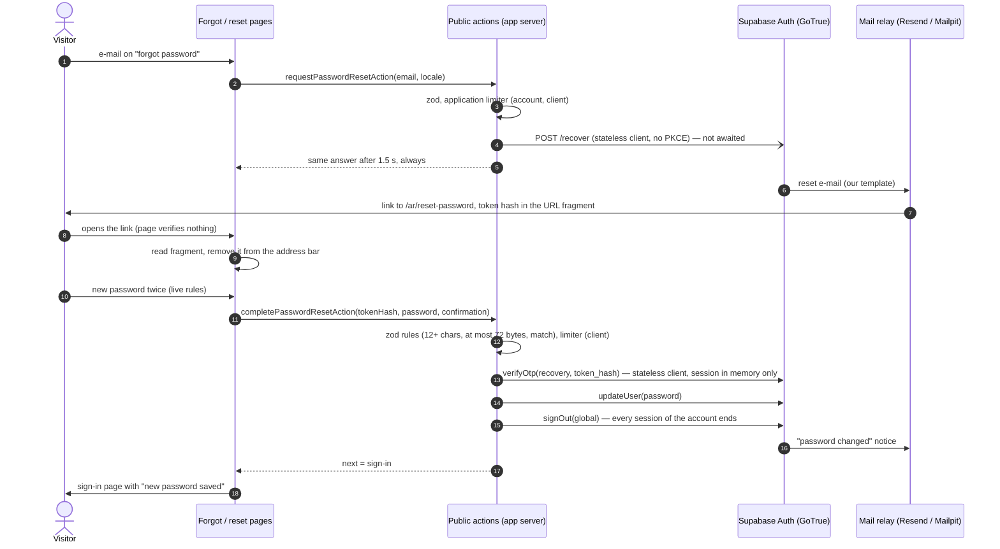

# Forgot / reset password (runbook)

| | |
|---|---|
| **Backlog** | T-M2-08 (no account enumeration, 60-minute single-use link, other sessions ended, confirmation e-mail) |
| **Requirements** | FR-IAM-13, NFR-SEC-01 · approved screens 10 `Forgot.dc.html` and 11 `Reset.dc.html` (`docs/design/screens/m2-users-roles/`) |
| **Architecture** | ADR 0003 (all auth flows are server actions; `getClaims`/`getUser`, never `getSession`), ADR 0002 §7 (no Auth secret key in the web app), ADR 0008 implementation note T-M2-08 (Auth sends these e-mails itself) |
| **Code** | `packages/platform-identity/src/password-reset.ts` (flow) · `auth-next.ts` (Next.js adapter) · `apps/suite/src/auth/password-reset.ts` (public actions) · `apps/suite/src/lib/{password-reset-input,password-reset-link,reset-limits,client-ip}.ts` · pages `/[locale]/forgot-password`, `/[locale]/reset-password` · templates `supabase/templates/{recovery,password-changed}.html` |
| **Spike** | GoTrue v2.197.0 recovery spike (7 Oct 2026): findings below |

## 1. Flow

1. **Screen 10** (`/[locale]/forgot-password`, linked from sign-in «نسيت كلمة المرور؟» and from the invitation's "already used" state). The action validates the address (zod), consults the application limiter and starts `resetPasswordForEmail(email)` on a **stateless** Supabase client (`createSupabaseStatelessClient`: publishable key, session in memory only, implicit flow — no PKCE). It never waits for Auth: the call is handed to Next.js `after()` and the answer is sent after a constant **1.5 s** in every case. The page then shows «الرسالة في الطريق» with the address the visitor typed, the 60-minute single-use rule and "send again" after a one-minute countdown.
2. **The e-mail** is Auth's own (§3), bilingual, Arabic first. Its link goes straight to our page with the token hash in the **URL fragment**: `{{ .SiteURL }}/ar/reset-password#token_hash={{ .TokenHash }}&type=recovery` (the English block links to `/en/…`). It never contains the one-time code (`{{ .Token }}`) or Auth's own `/verify` link (`{{ .ConfirmationURL }}`) — which keeps the e-mail to one way in, but is **not** what protects the link (next paragraph).

   **Why the code has 10 digits.** GoTrue v2.197.0 does not store a random token for the link: `TokenHash` is `sha224(e-mail + one-time code)` (`internal/crypto/crypto.go`, `mail.go`). Whoever knows the address can compute every candidate hash offline, so the link is only as strong as the code: with Auth's default **6 digits** that is about 20 bits — a spread attacker trying hashes through `GET /auth/v1/verify` (no API key needed) or through our completion action would hit a 60-minute link with about 50 % probability from roughly 1,400 addresses on hosted (security review, 7 Oct 2026). Leaving the code out of the e-mail changes nothing. The code length is therefore set to GoTrue's maximum, **10 digits** (about 33 bits; `otp_length = 10`, `GOTRUE_MAILER_OTP_LENGTH=10`, hosted "Email OTP Length" = 10; asserted by `scripts/auth-templates.test.mjs`), on top of the rate limits in §2. Nothing in our code depends on the code length: the token hash is 56 hex characters whatever the length, and our pattern only bounds its character set and size.
3. **Screen 11** (`/[locale]/reset-password`). Opening the page verifies **nothing** — e-mail security scanners that open links (some run scripts) cannot spend the single-use token. The client component reads the fragment, removes it from the address bar (`history.replaceState`) and keeps the token in memory; the language switch carries it in the fragment. The page sends no referrer (`Referrer-Policy: no-referrer` + meta tag) and error reports drop fragments in the browser and again in the tunnel (tests in `browser-error-tracking.test.ts`, `error-tunnel.test.ts`).
4. **Completing** (`completePasswordResetAction`): zod checks the password rules **first** (12+ characters = Auth's own minimum, ≤ 72 bytes, confirmation), so a weak entry never spends the link; then the per-client limiter; then, on a new stateless client: `verifyOtp({ type: 'recovery', token_hash })` → `updateUser({ password })` → `signOut({ scope: 'global' })` (Auth already ends every *other* session on a password change; `global` also closes the recovery session). The recovery session exists only in this request's memory: it never reaches the browser or our session cookies. The browser's own session cookies (whoever was signed in there) are cleared, and the visitor goes to `/[locale]/sign-in?notice=password-reset` («حُفظت كلمة المرور الجديدة…») to sign in with the new password.
5. **Answers on screen 11.** Expired, used, unknown or malformed link, or a banned account → one state, «انتهت صلاحية الرابط أو استُخدم» with "request a new link". If Auth refuses the new password **after** the link was spent (same as the current password, weak, leaked, other refusal) the recovery session is ended (`local` scope — the account's other sessions are untouched) and the same state shows the reason («كلمة المرور الجديدة مطابقة للحالية…») and asks for a new link: there is no retry without the token, and no retry cookie. Rate limits (ours, or Auth's on `/verify`) keep the form — the link is not spent.
6. **Records.** No tenant audit row (the account may belong to several organizations, and no tenant session exists): a structured security log line `platform.auth.password_reset` with the Auth user id only (`outcome: success`); refusals log `status`/`errorCode` only. E-mail address, password and token are never logged; the smoke test checks the app logs and the audit trail for the token.

## 2. Account enumeration and abuse (GoTrue v2.197.0 spike)

| Finding | Handling |
|---|---|
| `/recover` answers **200 for an unknown address** at once, but for an existing account only after sending the e-mail (≈ 60 ms vs 15 ms locally; more with a remote relay) | The answer never waits for Auth: the call runs under `after()` and the action answers after a constant 1.5 s. (Chosen over "pad to 1.5 s and await": a slow relay could run past any padding.) |
| A repeat within `SMTP_MAX_FREQUENCY` (60 s) returns **429 `over_email_send_rate_limit` for existing accounts only** | Every Auth answer (429, 4xx, 5xx, network error) is treated as success; only the code is logged |
| `code_challenge` (PKCE) does not protect the `token_hash` path | No PKCE: the stateless client uses the implicit flow and sends no challenge; the cookie-bound `@supabase/ssr` client (PKCE by default) is not used for recovery |
| Auth's per-IP limits see the **app's** address, not the visitor's (all calls come from the app server; on hosted the app's egress address, so all users share one bucket — §4 step 5) | Application limiter (`lib/reset-limits.ts`, in memory per instance, 15-minute windows per key): reset e-mails 10 per client, then — only for an allowed client — 3 per account (HMAC-SHA-256 of the lower-cased address under a random key of the process, never the address); new-password submissions 5 per client; clients without a trusted address share 100. IPv6 clients are keyed by their /64. A full table never refuses anyone: expired entries, then the oldest, make room (a flood can make old counters restart, not lock users out). Client address only from a header the platform overwrites (`x-real-ip` on Vercel, else `JADARAT_CLIENT_IP_HEADER`; TM-0003 T-IAM-03) — **required for self-hosted production** (§5). A limited request gets the same answer; Auth is not asked |
| The link's token hash is `sha224(e-mail + code)`: with a 6-digit code about 20 bits, guessable offline once the address is known | Code length 10 (GoTrue's maximum) in every environment — §1 step 2. Not showing the code in the e-mail is **not** a mitigation |
| Self-hosted GoTrue has **no per-IP limit on `/verify` without `GOTRUE_RATE_LIMIT_HEADER`**; `/verify` accepts the code and the computed token hash, so a direct caller could try candidates | The gateway limits `/auth/v1/verify` — every path under it, `/verify/` included, which Auth also serves — to 30 a minute (burst 10) per source address (`infra/docker/gateway/nginx.conf`; the smoke test checks the 429 for both paths); the stack publishes Auth on 127.0.0.1 only. **Not set:** `GOTRUE_RATE_LIMIT_HEADER=X-Forwarded-For` — every app call to Auth would then share the app's address as one bucket (token refresh, sign-in) unless the app forwards a verified client address; follow-up below |
| A **deactivated** member's Auth account is not banned: Auth still sends reset e-mails to it (verify then refuses only banned users) | Follow-up: ban the Auth user when a membership becomes the account's last inactive one (and lift it on reactivation). Until then a deactivated member can reset the password but signs in to no organization (sign-in requires an active membership) |
| Unknown template URL at start-up → GoTrue silently uses its **English default**, whose link goes to `/verify` and does not fit our page (logged as `template_body_http_error`) | Self-hosted: templates served by the `auth-templates` container with a health check that Auth `depends_on`; `GOTRUE_MAILER_URLPATHS_RECOVERY=/auth/v1/verify` keeps the fallback link at least well-formed. **Alert on `template_body_http_error`** in Auth's logs (operations follow-up with ADR 0009 alerts); the smoke test fails if the e-mail is not ours |

## 3. Settings

| Setting | Value | Where |
|---|---|---|
| E-mail link lifetime (`otp_exp`) | **3600 s** (60 minutes, single use) | Hosted: Authentication → Sign In / Providers → Email → *Email OTP Expiration*; local: `supabase/config.toml` `[auth.email] otp_expiry`; self-hosted: `GOTRUE_MAILER_OTP_EXP` |
| One-time code length | **10** (GoTrue's maximum; the link's token hash is `sha224(e-mail + code)`) | Hosted: Authentication → Sign In / Providers → Email → *Email OTP Length*; local `[auth.email] otp_length`; self-hosted `GOTRUE_MAILER_OTP_LENGTH` |
| One e-mail per account per | 60 s | Hosted: Authentication → SMTP Settings → *Minimum interval between emails per user*; local `max_frequency`; self-hosted `GOTRUE_SMTP_MAX_FREQUENCY` |
| Reset e-mail template + subject | `supabase/templates/recovery.html`, «إعادة تعيين كلمة المرور · Reset your password» | Hosted: Emails → Templates → *Reset password*; local `[auth.email.template.recovery]`; self-hosted `GOTRUE_MAILER_TEMPLATES_RECOVERY` (URL) + `GOTRUE_MAILER_SUBJECTS_RECOVERY` |
| "Password changed" notice | `supabase/templates/password-changed.html`, «تغيّرت كلمة المرور · Your password was changed» — sent after every password change (reset and My profile) | Hosted: Emails → *Password changed* (security notifications) ON; local `[auth.email.notification.password_changed]`; self-hosted `GOTRUE_MAILER_NOTIFICATIONS_PASSWORD_CHANGED_ENABLED` + `…TEMPLATES_…` + `…SUBJECTS_PASSWORD_CHANGED_NOTIFICATION` |
| SMTP | Hosted: Resend (port 465, implicit TLS); self-hosted: the installation's relay — port **465**, or a relay that **requires** TLS and authentication: Auth's mailer (gomail) uses STARTTLS on other ports only if the relay offers it. Certificates verified against the system roots plus the relay's CA (`AUTH_SMTP_CA_CERT_FILE`, mounted in `/certs/mail`, `SSL_CERT_DIR`) | Hosted: Authentication → SMTP Settings; self-hosted `GOTRUE_SMTP_*`, `AUTH_SMTP_*` in `.secrets/.env` |
| Site URL | The web app's public origin (links are built from it) | Hosted: Authentication → URL Configuration → *Site URL*; self-hosted `GOTRUE_SITE_URL` |
| Require current password when updating | ON (My profile; a recovery session is exempt in GoTrue) | Hosted: Authentication → Sign In / Providers → Email; self-hosted `GOTRUE_SECURITY_UPDATE_PASSWORD_REQUIRE_CURRENT_PASSWORD` |
| Minimum password length | 12 (= the application's rule) | Hosted: Authentication → Sign In / Providers → Email → *Minimum password length*; self-hosted `GOTRUE_PASSWORD_MIN_LENGTH` |

## 4. Hosted Supabase set-up (Product Owner, once after merge — Claude guides one step at a time)

All in the Supabase dashboard of `jadarat-tms-staging`; never paste keys into chat. The order keeps Supabase's **default** reset e-mail from ever going out: its English text links to Auth's own `/verify`, which does not fit our page. Custom SMTP (the switch that makes Auth send e-mails to real addresses) comes **last**.

1. **Authentication → URL Configuration**: *Site URL* = the staging web app's address (`https://…`, no path) — the links in the e-mail are built from it. *Redirect URLs*: nothing to add (the template builds the link itself).
2. **Authentication → Emails → Templates → Reset password**: subject `إعادة تعيين كلمة المرور · Reset your password`; body = the whole of `supabase/templates/recovery.html` (GitHub → "Raw", copy all). Save. Then **Password changed** (security notifications): switch ON, subject `تغيّرت كلمة المرور · Your password was changed`, body = `supabase/templates/password-changed.html`. Save.
   *If the dashboard does not let you edit templates before custom SMTP is enabled* (it may require it): do step 6 first, with *Minimum interval between emails per user* set, and come straight back to this step — in those few minutes Supabase's default reset e-mail would be live, so nobody should ask for a reset until the templates are saved.
3. **Authentication → Sign In / Providers → Email**: *Email OTP Length* **10** (required: the link's token hash is `sha224(e-mail + code)`, §1 step 2); *Email OTP Expiration* **3600**; *Minimum password length* **12**. Save.
4. Same page: *Require current password when updating* **ON** (if not already — My profile relies on it; a recovery session is exempt). Save.
5. **Authentication → Rate Limits.** On hosted, Auth's per-IP limits count the **app's egress address**, not the visitor's: every reset, sign-in and token check of every user comes from our server, so they all share one bucket and one abuser could exhaust it for everyone (our own limiter in front, §2, is the per-visitor control). So: *Rate limit for token verifications* — **raise** it above the expected peak of sign-ins plus resets (it covers `/verify`), but **no higher than 300 per 5 minutes**: it is also the direct guessing rate per attacker address (with 10-digit codes, 300 per 5 minutes is about a 4-in-10-million chance per address-hour); *Rate limit for sending emails* — size it to the expected volume of reset, "password changed" and other Auth e-mails per hour (with custom SMTP it is no longer capped at the built-in 2 an hour). **Alert on 429s** from Auth (Logs Explorer: `auth_logs` with status 429 on `/verify`, `/recover`, `/token`) — a 429 there means the shared bucket is exhausted. We do **not** enable "IP address forwarding" (`Sb-Forwarded-For`): it needs the Auth secret key in the web app, which ADR 0002 §7 rules out.
6. **Authentication → SMTP Settings → Enable custom SMTP** (last): host `smtp.resend.com`, port **465** (implicit TLS), username `resend`, password = a Resend API key with **Sending access** for `lms.entlaqa.com` (Resend → API Keys → Create; a separate key from the worker's is fine), sender e-mail `noreply@lms.entlaqa.com`, sender name `ENTLAQA LMS`; *Minimum interval between emails per user* **60** seconds. Save.
7. Test: on staging, «نسيت كلمة المرور؟» with the PO's own account → e-mail from «ENTLAQA LMS» in Arabic and English (ours, not Supabase's) → set a new password → sign in with it; the "password changed" e-mail arrives.

## 5. Self-hosted

**Required in production: `JADARAT_CLIENT_IP_HEADER`.** The application limits (§2) need the visitor's address, which the app trusts only from a header that the installation's load balancer or reverse proxy **overwrites** (for example `X-Real-IP` set from the connection address — never `X-Forwarded-For`, which clients can prefill). Set the app's `JADARAT_CLIENT_IP_HEADER` to that header's name. Without it every visitor shares one budget per app instance (100 reset e-mails and 100 submissions per 15 minutes), so one abuser can use it up for everyone, and the per-client limits do nothing. The stack in `infra/docker` publishes the app directly (no proxy), so it leaves the variable empty.

`infra/docker/compose.yaml`: Auth joins the `mail` network and sends through Mailpit, which requires STARTTLS. A real installation sets `AUTH_SMTP_HOST`, `AUTH_SMTP_PORT` (**465** for implicit TLS — on other ports Auth's mailer upgrades to TLS only when the relay offers STARTTLS, so use 465 or a relay that requires TLS and authentication), `AUTH_SMTP_USER`, `AUTH_SMTP_PASS` and, for a relay with a private CA, `AUTH_SMTP_CA_CERT_FILE` (added to the system roots, not replacing them: mounted in `/certs/mail`, read through `SSL_CERT_DIR`; a publicly trusted relay needs nothing), and gives Auth a network that reaches the relay; sender = `EMAIL_FROM_ADDRESS` / `EMAIL_FROM_NAME` like the worker. Templates are served from `supabase/templates` by `auth-templates` (nginx, read-only, internal network only, health-checked). The smoke test (`infra/docker/smoke.sh`, "password reset") runs the whole journey: request through the page, link from Mailpit (our template, fragment only, no `/verify`), new password, every session ended, new password signs in, old password refused, second use of the link refused, "password changed" notice, token in no log or audit row.

## 6. Follow-ups

- **Shared limiter** (PostgreSQL, ADR 0011 §4) replacing the in-memory one, with the sign-in limiter (TM-0003 T-IAM-01, release blocker for real users).
- **Client IP to self-hosted Auth**: forward a verified client address and set `GOTRUE_RATE_LIMIT_HEADER`, so Auth's own per-IP limits work for app calls too; then drop the gateway's `/verify` limit.
- **Ban deactivated accounts in Auth** (see §2).
- **Alert on `template_body_http_error` and on 429 answers** in Auth's logs (hosted: Logs Explorer; self-hosted: log shipping, ADR 0009) — a 429 on hosted means the app's shared bucket is exhausted (§4 step 5).
- **Audit row**: if the PO wants a tenant audit entry for resets, record `platform.auth.password_reset` in each organization of the account when it next signs in (needs a tenant session).
- Screen 11 shows the account's e-mail and the exact expiry time in the design; both need the link verified on load, which we avoid (scanners) — see §1.
