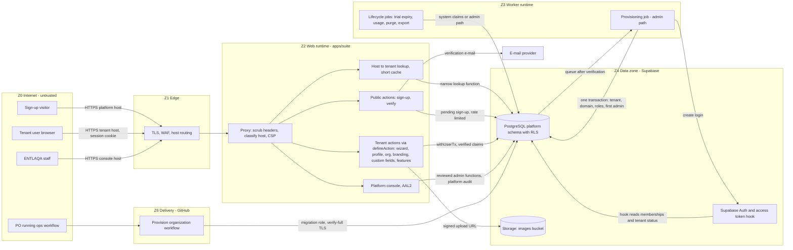

# Threat model TM-0002 — Tenancy & onboarding (EP-M2-TEN)

| | |
|---|---|
| **Backlog** | T-M1-C02 (Track C, M1 Foundation) — per-epic threat model |
| **Epic** | `EP-M2-TEN` — Tenancy & onboarding (M2) |
| **Features** | ADM-01, ADM-02, ADM-04, ADM-05, ADM-07, ADM-11, ADM-13, ADM-14, ADM-17, SUB-01, DEP-01, DEP-05 (= FR-ADM-01 … FR-DEP-05); platform host → tenant resolution (ADR 0002 §4) |
| **Template** | Development Plan Appendix D (extended, same section structure as TM-0001) |
| **Version** | 0.1 — 3 Oct 2026 |
| **Status** | Proposed (awaiting Tech Lead review and PO merge) |
| **Owner** | Security Lead (Claude agent) |
| **Reviewers** | Tech Lead (Claude agent), Product Owner; Legal counsel for the L-TEN items (§12) |
| **Inputs** | BRD v2.1 FR-ADM-01, 02, 04, 05, 07, 11, 13, 14, 17, FR-SUB-01, FR-DEP-01, 05, NFR-L10N-12, BR-ADM-1…3, §14.1, §15, App. E; Development Plan §4.1, §6.4, App. D, App. F (J1, J2, J13); ADR 0001, 0002 (§2–§9, §4 host resolution still open), 0003 (rev. 2), 0005, 0006, 0007, 0010, 0011; R1 data model §2.1–§2.2; implementation on `main` as of 3 Oct 2026 (§1.3) |
| **Parent** | [TM-0001](TM-0001-platform.md) — this model **inherits every TM-0001 mitigation** and cites its IDs (T-nn, F-nn, EP-nn, TB-n, A-nn, RR-nn) instead of repeating them |
| **Related** | Sibling M2 models [TM-0003](TM-0003-identity-roles.md) (IAM) · [TM-0004](TM-0004-people-directory.md) (PEO) · [TM-0005](TM-0005-audit-consent.md) (AUD) · [TM-0006](TM-0006-shell-notifications.md) (SHELL) · [`../risk-register.md`](../risk-register.md) · [`../asvs-l2-mapping.md`](../asvs-l2-mapping.md) · [`../secure-coding-standard.md`](../secure-coding-standard.md) · [`../../engineering/staging-sign-in.md`](../../engineering/staging-sign-in.md) |
| **ID scheme** | Threats `T-TEN-NN` · findings `F-TEN-NN` · abuse cases `AB-TEN-NN` · residual risks `RR-TEN-NN` · legal-validation items `L-TEN-NN` · register rows `R-NN` (common scheme of TM-0002…TM-0006; TM-0001 uses unprefixed `T-NN`/`F-NN`). BRD feature IDs (e.g. `ADM-01`, `IAM-12`) and requirements (`FR-…`) keep their BRD form and are never used as threat IDs |

---

## 1. Scope

### 1.1 Features in scope

| Feature | Requirement (short) | Rel | Security-relevant surface |
|---|---|---|---|
| ADM-01 | Self-service sign-up → tenant in *trial*, default roles/templates/workflows, onboarding wizard (organization → branding → first users → first course → first session); trial length set by ENTLAQA | R1 | Anonymous entry point that ends in a privileged, cross-tenant operation (provisioning); first Tenant Admin |
| ADM-02 | Organization profile (AR/EN legal name, CR no., VAT no., industry, HQ country, currency, timezone, language, fiscal-year start, authorized signatory) | R1 | Tenant row: tenant-editable vs. server-owned columns |
| ADM-04 | Branches (hierarchy, GPS, timezone, HQ flag, working week/hours) | R1 | Org structure feeds `branches` data scopes (ADR 0003 §3) |
| ADM-05 | Department tree (cost center, head, parent, branch), drag-and-drop, CSV import | R1 | Org structure feeds `org_units` / reporting scopes; bulk import |
| ADM-07 | Branding: logos, colors, fonts from an approved list, WCAG contrast warning | R1 | Uploads; values rendered into CSS; public (pre-login) branding |
| ADM-11 | Custom fields (8 types) on users, courses, sessions, enrollments, instructors, vendors, venues; AR/EN labels, required, **visibility by role**, filters/reports/imports/API | R1 | Tenant-defined schema; field-level authorization; restricted data |
| ADM-13 | Feature toggles per tenant driven by edition; Tenant Admin may further **disable** | R1 | Entitlement enforcement |
| ADM-14 | Admin home: users by status, usage vs. limits, integration health, AI spend, domain/SSL status, pending items, last 10 audit events | R1 | Aggregates and audit snippets |
| ADM-17 | ENTLAQA platform console: tenants (plan, limits, status, feature flags), health, announcements, impersonation with reason, time limit, banner, audit | R1 | Privileged cross-tenant interface (TB-6); tenant lifecycle (suspend, cancel, delete, export) |
| SUB-01 | Editions (Starter, Professional, Enterprise, Government) and add-ons determine features and limits | R1 | Entitlements and limits |
| DEP-01 | Regional multi-tenant cloud; SDAIA SCCs + transfer risk assessment for KSA personal data | R1 | Data-residency label, sign-up gating by jurisdiction/sector |
| DEP-05 | Arabic-only operating mode (government, NFR-L10N-12) | R1 | Contractual integrity of the UI language |
| *(platform)* | Tenant domains and **host → tenant resolution** (ADR 0002 §4 — still a placeholder in code) | R1 | Primary defense against cross-host session use (T-04) |

### 1.2 Out of scope (covered elsewhere)

- Sign-in, MFA policy, invitations and their acceptance, password reset, roles/scopes editor, session controls → `EP-M2-IAM` ([TM-0003](TM-0003-identity-roles.md)); people directory, bulk person import, suite/standalone data sources (STE-01/02) → `EP-M2-PEO` ([TM-0004](TM-0004-people-directory.md)); audit-log internals and consent → `EP-M2-AUD` ([TM-0005](TM-0005-audit-consent.md)); suite shell and notifications → `EP-M2-SHELL` ([TM-0006](TM-0006-shell-notifications.md)). This model states only the **interfaces** this epic needs from them.
- Custom domains and DNS wizard (ADM-10, R2 — TM-0001 T-64), theme builder/login page (ADM-08/09, R2), self-service billing (SUB-02…05, R2+), self-service tenant data export (FR-AUD-02, R2), retention policies (FR-AUD-03, R3), sandbox tenants (ADM-15, R3), dedicated/in-country/customer-hosted deployments (DEP-02…04, R3/R4) — only the **design constraints** they impose on R1 are listed here.

### 1.3 Implementation baseline (what exists on `main`, 3 Oct 2026)

| Control | State | Where |
|---|---|---|
| `platform.tenants` (slug regex + unique, status `trial/active/suspended/cancelled`, `mode`, `edition`, `data_residency`) with ENABLE + FORCE RLS, restrictive `tenant_isolation`; `authenticated` has **SELECT only** (no INSERT/UPDATE/DELETE) | Implemented | `supabase/migrations/20260930120200_platform__tenancy_core.sql` |
| `edition` is free text, default `standard` (no `ref_editions` FK; BRD editions are Starter/Professional/Enterprise/Government); `data_residency` is free text, default `eu-central-1` | Gap | same migration |
| `platform.tenant_domains` (global unique hostname, `verified_at`); `authenticated` SELECT only; **no lookup function yet** | Partly implemented | same migration |
| Claims: access-token hook issues `tenant_id` only for an active membership in an active/trial tenant; `private.current_tenant_id()` re-validates live session, active membership, tenant status and session's active tenant **on every statement**; system claims only for `app_worker` and active/trial tenants | Implemented (pgTAP 30, 31, 40, 50–53) | `…120100_private__tenant_claim_validation.sql`, `…120400_private__custom_access_token_hook.sql` |
| Membership guard: request path may only insert `invited` memberships and only suspend/revoke (trigger) | Implemented (pgTAP 20) | tenancy core migration |
| Request proxy scrubs client-supplied `x-jadarat-*`/`x-nonce` headers, classifies the host (placeholder), sets nonce CSP | Implemented (`proxy.test.ts`, `host-tenant.test.ts`) | `apps/suite/src/proxy.ts`, `apps/suite/src/lib/host-tenant.ts` |
| `classifyHost` treats `localhost`/`127.0.0.1`/`[::1]` as the platform host in **every** environment; host tenant ↔ claim tenant check not implemented | Gap (F-TEN-03) | `host-tenant.ts` |
| Tenant provisioning only through the manual **Provision organization** workflow (migration role, UID input only, refuses slug collisions unless `add_to_existing` + matching names, writes tenant audit `platform.tenant.admin_provisioned` without operator identity); creates tenants as `active`, not `trial` | Implemented (ops only) | `.github/workflows/tenant-provision.yml`, `scripts/provision-tenant.sh`, `scripts/sql/provision-tenant.sql` |
| Supabase public sign-up **disabled** (`enable_signup = false`; staging dashboard "Allow new users to sign up: off"); e-mail confirmations on | Implemented | `supabase/config.toml`, staging runbook |
| `definePublicAction` allowed only in `apps/suite/src/auth/` (CI gate); `defineAction` enforces permission, scope, AAL2 step-up and `getUser()` for high-risk permissions; high-risk permissions must require AAL2 | Implemented | `packages/platform-rbac`, `scripts/check-server-actions.mjs` |
| Admin client only importable from `**/jobs/**`, `**/admin/**` (dependency-cruiser); `withAdminTx` requires reason + actor but **does not persist an audit record** (TODO) | Partly implemented | `packages/platform-db/src/admin/index.ts` |
| Audit log append-only; actor bound to verified claims; `impersonator_user_id` forced NULL until support grants exist | Implemented | `…120300_platform__audit_events.sql` |
| Application rate limiting / bot challenge | **Not in place** (release blocker before real users) | staging runbook "Known gaps" |
| MFA off by default (PO, 1 Oct 2026); AAL2 still required by permission metadata | Decision in place; enrollment UI pending (`EP-M2-IAM`) | ADR 0003 rev. 2 |

---

## 2. Assets and data classification

Classes C1–C4 as defined in TM-0001 §2.1; aggregates take the highest class of their content.

| ID | Asset | Class | Where | TM-0001 link / note |
|---|---|---|---|---|
| TA-01 | Tenant registry: id, slug, status, edition, mode, residency label, trial end | C2 (integrity-critical) | `platform.tenants` | A-10; drives claims, entitlements and residency |
| TA-02 | Host map: subdomains (custom domains R2), verification state | C1 (resolution output) / C2 (table) | `platform.tenant_domains` | A-10; wrong mapping = cross-host session use |
| TA-03 | Organization profile: legal names, CR no., VAT no., HQ country, currency, timezone, **authorized signatory name** | C2; signatory C3 | `platform.tenants` | Signatory is personal data |
| TA-04 | Sign-up data: founder e-mail, name, mobile, password (Auth), terms/DPA acceptance evidence | C3 (password C4 in Auth) | pending sign-ups, `auth.users`, platform audit | A-06, A-08 |
| TA-05 | Org structure: branches (address, GPS), departments, heads, cost centers | C2 (heads C3) | `platform.branches`, `departments`, `cost_centers` | Determines data scopes (ADR 0003) |
| TA-06 | Tenant security settings (`tenant_settings.security_policy`: password, lockout, timeouts, MFA enforcement) | C3 (security-relevant) | `platform.tenant_settings` | A-10 |
| TA-07 | Custom field definitions (key, type, visibility) and **values** | Definitions C2; values C3, **may contain C4** if misused | `custom_field_definitions`, `custom_fields jsonb` | A-01/A-02 risk (T-TEN-24) |
| TA-08 | Branding assets and values | C1 when shown on login pages | Storage `images` bucket, `tenant_branding` | Phishing material if abused |
| TA-09 | Entitlements: editions, add-ons, module licences, feature overrides, usage counters | C2 (integrity-critical, commercial) | `ref_editions`, `tenant_module_licenses`, `tenant_feature_overrides`, `tenant_usage_daily` | Revenue and access control |
| TA-10 | Platform staff registry, support grants, platform audit | C3 (integrity-critical) | `platform_staff`, `support_grants`, `platform_audit_events` (planned) | A-11; TB-6 |
| TA-11 | Tenant offboarding export and purge evidence | C4 (aggregate) | worker temp, Storage exports | A-13 |
| TA-12 | Customer list (which organizations use Jadarat) | C2 (business-confidential) | slugs, console, DNS/TLS | Banks/government may require confidentiality |
| TA-13 | Ops credentials for provisioning (migration-role `DATABASE_URL` in GitHub environment) | C4 | GitHub environment secrets | A-07 |

---

## 3. Actors

TM-0001 §3 actors apply; epic-specific roles and motives:

| ID | Actor | Epic-specific capabilities | Threat motives in this epic |
|---|---|---|---|
| AC-AN | Anonymous sign-up visitor | Sign-up form, verification link, slug availability | Bot tenants, e-mail bombing, enumeration, pre-hijacking of global logins (T-TEN-01) |
| AC-MT | Malicious tenant (self sign-up gives anyone one) | Everything a founding Tenant Admin can do | Brand impersonation, entitlement bypass, cross-tenant pivot via provisioning or host resolution, custom-field abuse |
| AC-TA | Founding / later Tenant Admin | Profile, settings, structure, branding, custom fields, feature disable | Weakening security policy, storing restricted data in custom fields, lock-out of co-admins |
| AC-CO | HR / org-structure editor (role with org permissions) | Branches, departments, imports | Indirect scope escalation through the tree (T-TEN-12) |
| AC-PF-S | ENTLAQA support staff | Console read, impersonation requests | Social engineering target (T-TEN-06), over-reach |
| AC-PF-O | ENTLAQA operations/billing staff | Plans, limits, flags, suspension | Wrongful suspension, unapproved entitlement changes |
| AC-PF-A | ENTLAQA super admin | Staff management, deletion, residency changes | Insider abuse, account takeover target |
| AC-OPS | PO running the **Provision organization** workflow | Migration-role DB access through GitHub Actions | Mistyped slug/UID, workflow misuse by any repository writer (T-M0-11 deferred) |
| AC-EX | External attacker | Internet | Host-header attacks, subdomain enumeration, credential stuffing of new admins |

---

## 4. Entry points and trust boundaries

### 4.1 Entry points

| ID | Entry point | TM-0001 EP | Authentication | Release |
|---|---|---|---|---|
| TEP-01 | Sign-up page and sign-up server action (platform host) | EP-08 | None (bot challenge) | R1 |
| TEP-02 | E-mail verification link → confirmation page (POST) | EP-08 | Single-use token in link | R1 |
| TEP-03 | Slug ("short name") availability check | EP-08 | Pre-tenant, rate-limited | R1 |
| TEP-04 | Host → tenant resolution on every request (proxy classification + server-context lookup) | EP-01–03 | n/a (runs before auth) | R1 |
| TEP-05 | Platform host → tenant host transition after sign-up/sign-in | EP-01 | Session (host-only cookies) | R1 |
| TEP-06 | Onboarding wizard server actions | EP-02 | Session + `defineAction` | R1 |
| TEP-07 | Tenant configuration actions: profile, settings, branches, departments, branding, custom fields, feature toggles | EP-02 | Session + `defineAction` (+ AAL2 for high-risk) | R1 |
| TEP-08 | Department/branch CSV import | EP-15 | Session + signed upload URL | R1 |
| TEP-09 | Branding upload; public branding on the tenant's login page | EP-06, EP-15, EP-01 | Session (upload); none (display) | R1 |
| TEP-10 | Admin dashboard | EP-01 | Session + per-widget permission | R1 |
| TEP-11 | Platform console (tenants, plans, limits, status, flags, announcements, support grants, offboarding) | EP-13 | Staff SSO/password + AAL2 always | R1 |
| TEP-12 | **Provision organization** GitHub workflow (in place) | EP-16, EP-17 | GitHub identity + environment secret | Implemented |
| TEP-13 | Lifecycle jobs: provisioning, trial expiry, usage metering, purge, offboarding export | EP-14 (worker) | `app_worker` / admin path | R1 |
| TEP-14 | Supabase Auth endpoints reachable with the publishable key (`/signup`, `/verify`, `/recover`) | EP-04 | Publishable key | Public sign-up must stay **off** |

### 4.2 Trust boundaries

TM-0001 TB-1, TB-2, TB-4, TB-5, TB-6, TB-8, TB-9 and TB-10 apply. Epic-specific crossings:

| ID | Boundary | Crossing controls |
|---|---|---|
| TB-T1 | **Anonymous → tenant** (pre-tenant sign-up becomes a tenant and its first Tenant Admin) | Verified e-mail before any tenant exists; provisioning runs outside the request path in one audited transaction (F-TEN-01) |
| TB-T2 | **Platform host ↔ tenant host** (`<base>` / `console.<base>` / `<slug>.<base>`) | Host-only cookies per host; no session token in URLs; sign-in on the tenant host (F-TEN-02); host tenant = claim tenant in server context |
| TB-T3 | **Ops workflow → database** (GitHub Actions with migration role) | Manual dispatch, plan/apply, input validation in shell and SQL, required reviewer (deferred T-M0-11), audit with operator (F-TEN-07) |
| TB-T4 | **Deployment region ↔ tenant residency** | Tenant served only by a deployment whose region equals its residency label (T-TEN-17) |

### 4.3 Data-flow diagram

**Key flows (target design; current state in §1.3)**

1. **Self sign-up:** visitor → sign-up action (bot challenge, rate limit, strict schema, jurisdiction/sector gate) → pending sign-up row + verification e-mail (uniform response) → visitor confirms by POST → provisioning job (worker, admin path) creates the Auth login, tenant (`trial`), verified subdomain, default roles/templates, person and **active** membership in one transaction, writes platform + tenant audit → user signs in **on the tenant host** → wizard.
2. **Tenant request:** proxy scrubs headers and classifies host → server context resolves host via the narrow function (verified domains, status, public branding) → `getClaims()` → host tenant must equal `tenant_id` claim → `defineAction` (permission, scope, feature gate, AAL2) → `withUserTx` (RLS re-validates session, membership, tenant status).
3. **Console action:** staff on the console host (AAL2, staff allow-list) → console action wrapper (staff permission, reason/ticket, two-person where required) → reviewed admin function returning allow-listed columns → platform audit (+ tenant-visible audit when the tenant is affected).
4. **Suspension / offboarding:** console sets status (reason, notification) → DB denies tenant claims immediately (in place) → after the agreed period: export (if requested) → purge job (per-module purge, storage prefix, logins without other memberships) → evidence record.

---

## 5. STRIDE analysis

**Rating.** Likelihood (L) and Impact (I) on the **1–5 scales of the [risk register §1](../risk-register.md#1-method)** (L: 1 rare … 5 almost certain; I: 1 negligible … 5 severe, where 5 = cross-tenant exposure or harm to many tenants), rated **inherent** as the register defines it: with only the controls already implemented (§1.3), before the listed planned mitigations. TM-0001 uses H/M/L; roughly 4–5 = H, 3 = M, 1–2 = L. Any cross-tenant exposure is an S1 incident regardless of rating.

**Status values** (shared by TM-0002…TM-0006). *Implemented* (control exists on `main` with a test) · *Partly implemented* (part exists; the gap is named) · *Planned (Mx / Rx / Suite)* (control defined and assigned to a milestone or release; not built yet) · *Open — decision <ID>* (needs a Tech Lead or PO decision, or legal validation — F-…, D-… or L-… items, §8, §12). Accepted residuals are listed in §7. A threat becomes *Verified* only when its verification passes in CI or a review record exists (security README §4.2).

**Inherited unchanged (stories must cite them):** T-04 host spoofing · T-06 global identity takeover · T-07 impersonation · T-11 OTP/SMS abuse · T-12 enumeration · T-13 brand phishing · T-17 mass assignment · T-26 malicious imports · T-28 cache mixing · T-29 repudiation · T-30 staff attribution · T-35 restricted fields · T-40 stored XSS (incl. console) · T-42 residency · T-43 exports/backups · T-50 hook failure · T-56 role escalation · T-57 stale privileges · T-58 MFA bypass · T-64 custom domains (R2) · T-65 open redirect.

### 5.1 Spoofing

| ID | Threat | STRIDE | Entry point | L | I | Mitigation | Verification (test/CI/review) | Status |
|---|---|---|---|---|---|---|---|---|
| T-TEN-01 | **Sign-up with an e-mail the attacker does not own / account pre-hijacking:** attacker signs up as `victim@company.sa` with own password; the victim's employer later invites that address and the attacker already controls the global login (ADR 0003 §1) | S | TEP-01, TEP-02, TEP-14 | 4 | 4 | No Auth login exists before the e-mail is verified (pending sign-up row; login created by the provisioning job); verification link single-use, short expiry, confirmed by POST; unverified sign-ups purged after 24 h; sign-up for an e-mail that already has a login never sets or changes its password — the e-mail asks the owner to sign in and create the organization from there; password reset revokes all sessions; Supabase public sign-up stays off (T-06, T-12) | Integration: unverified sign-up cannot sign in; existing-login sign-up leaves password unchanged; purge job test; config test `enable_signup = false` | Partly implemented (public sign-up off); rest Planned (M2) |
| T-TEN-02 | **Host → tenant resolution incomplete or spoofed** (ADR 0002 §4 TODO): placeholder classification only; no lookup, no host = claim check, so a session for tenant A is served on any host; forged `Host`/`X-Forwarded-Host` from a misconfigured sovereign ingress | S | TEP-04 | 3 | 5 | Narrow `private` lookup (verified domains only, returns id, slug, status, public branding); short in-memory cache with negative caching; host tenant = claim tenant enforced in server context (`getRequestContext`/`defineAction`, SCS-2), not only in the proxy; mismatch → security event + switch/sign-in page; ingress overwrites forwarded headers (ADR 0010); proxy-owned header scrubbing (in place) (T-04, T-28) | Integration: host/claim mismatch, spoofed forwarded headers, unverified domain row, suspended tenant host; E2E J13 per host | Partly implemented (header scrubbing); Planned (M2) |
| T-TEN-03 | **Cross-host session handoff:** sign-in today happens on the platform host with an organization chooser; with host-only cookies the session does not reach `<slug>.<base>`, and a naive fix (token in redirect URL, parent-domain cookie) enables login CSRF, session fixation or token leakage via logs/referrers | S | TEP-05 | 3 | 4 | Sign-in on the tenant host; the platform host only offers "find my organization" (sends the user links by e-mail, uniform response); if a handoff is unavoidable: single-use code ≤ 60 s bound to target host and user, redeemed by POST, never a session token in a URL; cookies stay host-only (`__Host-` where supported); console on its own host | Integration: replayed/foreign-host handoff code rejected; cookie attribute assertions per host; DAST | Open — decision F-TEN-02 |
| T-TEN-04 | **Unknown, preview or loopback hosts** treated as the platform host (`classifyHost` maps `localhost` to `platform` in all environments) or resolved to a tenant on a preview deployment that shares the staging database | S | TEP-04 | 2 | 3 | Loopback classification only when `NODE_ENV=development`; unknown host → neutral 404 without tenant data; preview hosts on an explicit allow-list mapped to staging data only; production deployments accept only the platform, console and verified tenant hosts | Unit tests on `classifyHost` per environment; production-build integration test with `Host: localhost` | Open — decision F-TEN-03 |
| T-TEN-05 | **Brand / organization impersonation at sign-up:** slug, Arabic/English name and logo of a bank, ministry or ENTLAQA itself; IDN homograph labels (`xn--…`); bidi override characters (U+202E) in names shown in invitation e-mails; then mass phishing invitations from ENTLAQA's sending domain | S | TEP-01, TEP-03, TEP-06, TEP-09 | 4 | 3 | ASCII-only slug, `xn--` prefix rejected, reserved/protected list (technical labels such as `www`, `api`, `console`, `auth`, `admin`, `status`, `mail`; platform names; government/bank terms in Latin transliteration and Arabic name list) with confusable check against existing slugs; protected matches go to a manual review state before invitations can be sent; `safeText` strips bidi controls (SCS-4); trial invitation and message quotas; abuse reporting → suspension (T-13, R-28) | Unit tests: slug rules, confusables, bidi stripping; integration: protected name → review state, invitations blocked; quota test | Partly implemented (DB slug regex); Planned (M2) |
| T-TEN-06 | **Tenant ownership recovery by social engineering:** caller (phone/WhatsApp) claims to be the owner after the only Tenant Admin left, asks support to grant admin | S/E | TEP-11 | 3 | 4 | Recovery runbook: verify CR number and authorized signatory (ADM-02) against official documents, call back registered contacts, second staff approval; outcome is an **invitation** to a verified address (never a direct active membership), audited and notified to all remaining admins; invariant "≥ 1 active Tenant Admin" prevents self-lockout | Runbook review; integration: console recovery creates invitation + platform audit + notifications; last-admin removal blocked | Planned (M2) |
| T-TEN-07 | **Console reached by non-staff or by a taken-over staff account** (console on a tenant host, staff check only in UI, password-only staff) | S/E | TEP-11 | 2 | 5 | Console on a reserved host; every console action through a console wrapper that requires an active `platform_staff` row, AAL2 always and `getUser()`; phishing-resistant MFA recommended for staff; optional IP allow-list; no tenant membership for staff (ADR 0003 §6) (T-07, R-04) | CI gate: console actions use the console wrapper; negative tests: tenant admin, AAL1 staff, revoked staff → denied | Planned (M2) |

### 5.2 Tampering

| ID | Threat | STRIDE | Entry point | L | I | Mitigation | Verification (test/CI/review) | Status |
|---|---|---|---|---|---|---|---|---|
| T-TEN-08 | **Mass assignment of server-owned tenant fields** at sign-up, in the wizard or profile: `status`, `edition`, `trial_ends_at`, `data_residency`, `mode`, `arabic_only`, `slug`, or another tenant's id | T/E | TEP-01, TEP-06, TEP-07 | 4 | 4 | `z.strictObject` inputs, explicit field mapping (SCS-4, T-17); `authenticated` has no INSERT/UPDATE on `platform.tenants` (in place); ADM-02 adds column-level `UPDATE` on profile columns only; server-owned columns change only through console/admin functions | Unit: unknown keys → 400; pgTAP: `authenticated` cannot update server-owned columns | Partly implemented (DB grants) |
| T-TEN-09 | **Entitlement bypass:** Tenant Admin enables a feature outside the edition (override row with `enabled = true`), or calls a gated feature's server action/route/job directly while the UI hides it; permissions of unlicensed modules granted (T-56) | T/E | TEP-07 | 4 | 3 | Effective feature = edition ∧ add-ons ∧ module licence ∧ ¬tenant-disabled, computed server-side; tenant overrides can only **disable** (DB check on the tenant path); `defineAction`/`defineRoute` and job handlers declare a `feature` and deny when off; role editor hides and rejects permissions of unlicensed modules | Integration: direct call to a disabled feature's action → denied; override `enabled = true` → rejected; job skips disabled tenant | Planned (M2) |
| T-TEN-10 | **Limit bypass by concurrency** (parallel invitations/uploads exceed seat or storage limits) or limits checked only in the UI | T | TEP-06, TEP-07 | 3 | 2 | Limits checked server-side inside the write transaction with a per-tenant lock/counter; behavior at limit per edition (block/notify) | Integration: N parallel invitations at limit − 1 → exactly one succeeds | Planned (M2) |
| T-TEN-11 | **Security-policy weakening** by a Tenant Admin or a compromised admin account (password length below platform floor, lockout off, unlimited session timeout, MFA enforcement removed for admins) to persist access | T | TEP-07 | 3 | 4 | Platform floors and ceilings enforced in the Zod schema and server (cannot go below ASVS minimums, V6.2); security-policy permission high-risk (AAL2 + `getUser()`); before/after audit; notification to all Tenant Admins; AAL2 for high-risk permissions cannot be disabled by tenant policy | Unit: out-of-range policy rejected; integration: AAL1 → step-up; audit + notification asserted | Planned (M2) |
| T-TEN-12 | **Org-structure edits as indirect privilege change:** moving a department/branch or setting a department head changes `org_units`/`branches`/reports scopes (ADR 0003 §3); cycles or very deep trees break scope queries | T/E | TEP-07, TEP-08 | 3 | 4 | Structure changes require a dedicated org-structure permission (Tenant Admin by default), scope-impact flag in the audit entry; cycle prevention and maximum depth in DB (trigger on `ltree` path); composite FKs; head must be a person of the same tenant; grants recomputed per request; CSV import dry-run shows moves before apply (T-26) | pgTAP: cycle and cross-tenant parent/head rejected; authz negative tests for scoped roles; import dry-run test | Planned (M2) |
| T-TEN-13 | **Custom-field definition abuse:** field key used in SQL (filters, sort, expression indexes) → injection; tenant action triggers DDL (index per field) on shared tables; type change corrupts values; `user`-type value points to a person of another tenant | T | TEP-07 | 3 | 4 | Keys server-generated (`^[a-z][a-z0-9_]{0,62}$`, immutable), always bound as parameters (`custom_fields ->> $1`); no DDL from the request path (indexes only by reviewed migrations); values validated against the definition on every write; referenced ids re-read under RLS; definition changes audited (T-18) | Unit: key regex and injection corpus (incl. `__proto__`); integration: foreign-tenant `user` id rejected; Semgrep: no `sql.raw` with field keys | Planned (M2) |
| T-TEN-14 | **Provisioning integrity:** partial provisioning (tenant without admin, missing default roles), slug race, default role templates containing staff-only or unlicensed permissions, wrong first-admin membership | T | TEP-13, TEP-12 | 3 | 4 | One transaction; unique slug (in place); idempotency key per sign-up; roles seeded from the permission registry with a test that no staff-namespace permission is included; first membership only for the verified sign-up's login; ops script refuses collisions (in place) | Integration: rerun provisioning → single tenant; seeded-role permission test; failure injection → no partial tenant | Partly implemented (ops path) |
| T-TEN-15 | **Branding injection:** color or font values injected into CSS (`;}` sequences, `url(...)`), SVG/HTML logos, oversized images, remote font URLs | T | TEP-09 | 3 | 3 | Colors `^#[0-9a-f]{6}$` DB check (data model); fonts by code from an allow-list (self-hosted, ADR 0007); CSS custom properties built server-side from validated values; images per ADR 0006 (PNG/JPEG/WebP, ≤ 10 MB, magic bytes, re-encoded, scanned, no SVG); nonce CSP (in place) | Unit: invalid color/font rejected; integration: SVG/polyglot upload rejected | Planned (M2) |
| T-TEN-16 | **Slug / hostname reuse** after rename, cancellation or purge: old invitation, approval, calendar and verification links resolve to a different tenant | T/S | TEP-04 | 2 | 4 | Slugs immutable in R1 (rename = console operation); released hostnames tombstoned and never reassigned; tokens in links bound to tenant id and re-checked against the host | pgTAP/integration: tombstoned hostname cannot be re-inserted | Planned (M2) |
| T-TEN-17 | **Residency label or mode tampering / wrong-region placement:** label edited, free text (`eu-central-1` default), tenant provisioned or restored into the wrong deployment; suite/standalone mode or module licences changed by the tenant | T | TEP-07, TEP-11, TEP-13 | 2 | 4 | Residency from a reference list, set at provisioning from deployment configuration, never tenant-writable; a deployment refuses tenants whose label differs from its configured region; residency/mode/licence changes are console operations with two-person approval and audit | pgTAP: column not writable by `authenticated`; integration: label ≠ deployment region → tenant not served | Partly implemented (not writable by tenants) |
| T-TEN-18 | **Arabic-only mode bypass** (DEP-05): `/en` paths, locale cookie or `Accept-Language` show English UI, e-mails or exports to a government tenant contrary to contract | T | TEP-04, TEP-07 | 3 | 2 | Locale resolved server-side from the tenant flag (not only the proxy redirect, ADR 0007); notifications and exports forced to Arabic; switcher hidden; flag set by console/edition only | E2E: Arabic-only tenant cannot reach `/en` (ADR 0007 test 4); unit: notification locale | Planned (M2) |

### 5.3 Repudiation

| ID | Threat | STRIDE | Entry point | L | I | Mitigation | Verification (test/CI/review) | Status |
|---|---|---|---|---|---|---|---|---|
| T-TEN-19 | **Disputed sign-up or terms acceptance:** who created the organization, which terms/DPA version (incl. cross-border transfer terms) was accepted, when and from where | R | TEP-01, TEP-02 | 3 | 3 | Platform audit record at verification: terms version, timestamp (UTC), verified e-mail hash, pseudonymous IP, sign-up id; copied to the tenant audit at provisioning; immutable | Integration: audit entries asserted (`expectAudit`) | Planned (M2) |
| T-TEN-20 | **Staff and ops actions not attributable:** `withAdminTx` records reason/actor only as transaction settings (TODO); the ops workflow writes tenant audit without operator identity; plan, status and flag changes | R | TEP-11, TEP-12, TEP-13 | 3 | 4 | `platform_audit_events` (append-only) written by every admin operation with staff user id, reason, ticket; workflow records GitHub actor and run id; tenant-affecting actions also visible in the tenant audit (T-30) | Unit: `withAdminTx` without audit write fails; pgTAP: platform audit append-only | Partly implemented (reason/actor required) |
| T-TEN-21 | Tenant Admin denies configuration changes (settings, features, structure, branding, custom fields) | R | TEP-07 | 3 | 2 | Before/after audit per change with actor and request id (T-29); impersonation shows both identities | `expectAudit` in every configuration action test | Planned (M2) |

### 5.4 Information disclosure

| ID | Threat | STRIDE | Entry point | L | I | Mitigation | Verification (test/CI/review) | Status |
|---|---|---|---|---|---|---|---|---|
| T-TEN-22 | **Tenant / customer enumeration:** host lookup reveals existence, name, logo and status; slug availability reveals customers (e.g., which banks use Jadarat); per-subdomain TLS certificates publish every slug in Certificate Transparency logs; sign-up reveals existing logins (T-12) | I | TEP-01, TEP-03, TEP-04 | 4 | 2 | Lookup returns only public branding; identical neutral page for unknown, suspended and cancelled hosts; availability check rate-limited and only for verified sign-ups; wildcard certificate for tenant subdomains; uniform sign-up response | Integration: unknown vs suspended host responses identical; rate-limit test | Planned (M2) |
| T-TEN-23 | **Restricted custom-field values leaked** because the whole `custom_fields` jsonb is projected into DTOs, lists, search, exports, import error reports and audit diffs regardless of field visibility | I | TEP-07, TEP-10 | 4 | 4 | Single projection helper filters jsonb keys by definition visibility and caller grants; reused by DTOs, exports, search and reports; restricted values redacted in audit diffs (T-35) | Authz negative tests per role on lists, detail, export, search; unit tests on projection | Planned (M2) |
| T-TEN-24 | **Restricted personal data stored in custom fields** (national ID/Iqama, health, other special categories) outside classification, encryption and retention controls (A-01, A-02, A-05) | I | TEP-07 | 3 | 4 | Definitions carry a classification (C2/C3 only in R1); AR/EN warning and restricted default visibility when a label matches a restricted-terms list; admin guide states that national IDs belong in the encrypted directory fields (EP-M2-PEO); privacy review of the list (legal L-TEN-06) | Unit: restricted-terms warning; review of admin guide | Planned (M2) |
| T-TEN-25 | **Admin dashboard over-exposure:** usage, AI spend, integration details or "last 10 audit events" (with personal data) shown to roles without the matching permission; aggregates cached across tenants | I | TEP-10 | 3 | 3 | Each widget declares a permission; audit widget requires the audit-read permission and uses the redacted projection; usage rows written by system-claim jobs per tenant; no cross-request cache unless keyed by tenant and permission set (T-28) | Authz tests per widget; integration: two tenants/roles → no bleed | Planned (M2) |
| T-TEN-26 | **Cross-tenant disclosure through the console:** console lists/search use the admin path and return tenant personal data or records without a support grant; tenant-controlled names render as HTML in the console (T-40) | I | TEP-11 | 3 | 5 | Console shows tenant metadata and aggregates only; record-level data only inside an impersonation grant (T-07); console reads through reviewed admin functions returning allow-listed columns; text-only rendering | Review checklist on every console function; integration: console endpoints return no person fields; XSS corpus | Planned (M2) |
| T-TEN-27 | **Residency breach in onboarding and support:** government/regulated entities self-sign-up to the regional SaaS (R-06, R-08); Saudi or Egyptian tenants onboarded before transfer safeguards are in place (R-05, R-07); staff outside KSA/UAE access in-country tenants through console or impersonation | I | TEP-01, TEP-11 | 3 | 4 | Sign-up gate: sector declaration and government e-mail domains (e.g., `.gov.sa`, `.gov.ae`, `.gov.eg`) route to sales, no self-provisioning; countries enabled for self sign-up are a platform setting defaulting to those cleared by legal; one console per deployment, in-country for sovereign, access rules per contract; residency shown in console (BRD §15) (T-42) | Integration: blocked sector/domain/country → no tenant; config test per deployment | Planned (M2); Open — decision L-TEN-01…04 (legal) |
| T-TEN-28 | **Offboarding export leakage** (R1 export is a staff operation; FR-AUD-02 self-service is R2): full C4 aggregate delivered to the wrong person, left in worker temp space or stored outside the jurisdiction | I | TEP-11, TEP-13 | 2 | 5 | Export only to an active, verified Tenant Admin after re-authentication; encrypted object in the tenant's jurisdiction, signed URL ≤ 24 h, audited; worker temp wiped; two-person approval (T-43) | Runbook rehearsal; integration: URL expiry and audit | Planned (M7) |
| T-TEN-29 | **Data remnants after tenant deletion:** Storage objects under the tenant prefix, rows in module schemas added later, queue/outbox rows, logs, e-mail provider, LMS copies, backups | I | TEP-13 | 3 | 3 | Purge job driven by a per-module purge registry (every schema registers its tenant purge); storage prefix deletion; outbox/queue cleanup; deletion certificate listing systems and backup expiry date (PITR window, NFR-AVL-03) | CI check: every tenant table is covered by a purge registration; integration: purge leaves zero rows/objects | Planned (M7) |

### 5.5 Denial of service

| ID | Threat | STRIDE | Entry point | L | I | Mitigation | Verification (test/CI/review) | Status |
|---|---|---|---|---|---|---|---|---|
| T-TEN-30 | **Sign-up flooding and e-mail bombing:** bots create pending sign-ups/tenants, squat slugs and make ENTLAQA send verification e-mails to arbitrary addresses (sender reputation, denial of wallet) | D | TEP-01, TEP-02, TEP-14 | 4 | 3 | Rate limits per IP, network range and target e-mail hash (SCS-16); self-hostable proof-of-work challenge (ADR 0003 §2); no tenant before verification; daily caps and alerts; Supabase public sign-up off (in place) (T-11, T-51, R-15) | Integration: limits and challenge; alert on sign-up rate anomaly | Partly implemented (public sign-up off); Planned (M2) — release blocker |
| T-TEN-31 | **Wrongful or malicious suspension/cancellation** (compromised staff account, billing error, trial-expiry job bug) causes a tenant-wide outage | D | TEP-11, TEP-13 | 2 | 4 | Reason + ticket; two-person approval for paid tenants; notification to Tenant Admins; trial expiry with grace and warning e-mails; suspension reversible; deletion only after the contractual period and a second approval; DB denies suspended tenants immediately (in place) | Integration: approval required, notifications sent; job test for expiry boundary (timezones) | Partly implemented (status enforcement) |
| T-TEN-32 | **Host-lookup flood:** random subdomains force a DB lookup per request (cache misses) and exhaust the pooler | D | TEP-04 | 3 | 3 | Label validated before lookup (in place: hostname/slug regex); negative cache; per-IP limit for unknown hosts; lookup on unique index (in place) with statement timeout | Load test with random hosts; unit: invalid labels never reach DB | Partly implemented |
| T-TEN-33 | **Configuration resource abuse:** unbounded branches, departments, tree depth, custom fields, jsonb size, logo sizes | D | TEP-07, TEP-08 | 3 | 2 | Per-edition counts, maximum tree depth, jsonb size check constraints, upload limits (ADR 0006), pagination caps (T-48) | Integration: limits enforced | Planned (M2) |
| T-TEN-34 | **Purge breaks other tenants or fails silently:** `tenant_memberships.user_id … on delete cascade` means deleting a login also deletes its memberships in **other** tenants (e.g., an external instructor); append-only `audit_events` (trigger on every role) blocks deletion of the tenant row | D/T | TEP-13 | 3 | 4 | Purge deletes this tenant's memberships first and deletes a login only when no membership remains; audit handling per legal retention (partition/archive design, F-08) via a reviewed migration-owner function; purge is idempotent and reports completeness | Integration: shared login keeps other memberships; purge on a tenant with audit rows completes per design | Open — decision F-TEN-04 |

### 5.6 Elevation of privilege

| ID | Threat | STRIDE | Entry point | L | I | Mitigation | Verification (test/CI/review) | Status |
|---|---|---|---|---|---|---|---|---|
| T-TEN-35 | **Anonymous path to a privileged operation:** self-service provisioning needs rights no request role has (insert tenant, active membership, seed roles). Implemented with the admin client in the request path or a broad `SECURITY DEFINER` function taking a tenant id/slug, anyone could add themselves to an **existing** tenant (the ops path's `add_to_existing` mode must never exist in self-service) | E | TEP-01, TEP-02, TEP-13 | 3 | 5 | Provisioning only in the worker (admin path, ADR 0002 §7) triggered by a verified pending sign-up; the job only creates a **new** tenant and accepts no tenant id; first membership only for the verified login; admin client never importable by request code (dependency-cruiser, in place); `definePublicAction` allow-list extended only by ADR 0003 revision | Integration: existing slug/tenant id in any input → no membership; CI gates; security-review pass | Open — decision F-TEN-01 |
| T-TEN-36 | **Membership activation bypass** in the wizard's "first users" step (creating active members, accepting invitations on someone's behalf) | E | TEP-06 | 3 | 5 | Request path can only insert `invited` memberships and only suspend/revoke (trigger, in place); acceptance only by the invitee through the `EP-M2-IAM` checked function | pgTAP 20 (in place); integration on the wizard step | Partly implemented (DB guard); wizard Planned (M2) |
| T-TEN-37 | **Access retained after suspension, cancellation, trial expiry or admin revocation** (open tabs, unexpired JWT ≤ 15 min, host cache) | E | TEP-04, TEP-07 | 3 | 4 | `current_tenant_id()` requires active/trial tenant and active membership on every statement (in place); hook drops the claim at refresh (in place); trial expiry evaluated at request time from `trial_ends_at`, not only by a job; host cache short (T-57) | pgTAP 30/31/40 (in place); integration: expired trial → denied | Partly implemented |
| T-TEN-38 | **Platform-staff privilege creep:** support changes plans/flags, approves own impersonation grants, keeps standing access; staff list edited ad hoc; staff permissions confused with tenant permissions (T-56 says `platform.*` is excluded from tenant roles, yet ADR 0003 uses `platform.user.invite` for tenants) | E | TEP-11 | 3 | 4 | Staff roles (support, operations, super admin) with a separate permission namespace (proposed `console.*`) that tenant roles cannot contain; self-approval blocked; grants expire; staff table changed only by a reviewed ops change; quarterly access review (T-07, R-11) | Unit: tenant role cannot contain `console.*`; integration: self-approval denied | Planned (M2); naming Open — decision F-TEN-09 |
| T-TEN-39 | **Trial escalation:** serial trials with new e-mails, trial never expiring (job failure), trial tenants granted paid-edition features or used for production with real personal data beyond trial terms | E | TEP-01, TEP-13 | 4 | 2 | Trial edition entitlements explicit in `ref_editions`; expiry enforced at request time; soft duplicate detection (verified e-mail domain, CR number) flagged for review; expired-trial data retention per legal (L-TEN-05) | Integration: expired trial denied; duplicate flag test | Planned (M2) |

**Count:** 39 threats — 7 spoofing, 11 tampering, 3 repudiation, 8 information disclosure, 5 denial of service, 5 elevation of privilege (several span two categories as marked).

---

## 6. Abuse cases

Each becomes at least one negative test in the story it is attached to (§9).

| ID | Abuse case | Actor | Threats | Expected system behaviour / test |
|---|---|---|---|---|
| AB-TEN-01 | Attacker signs up as `hr.manager@<victim-company>.sa` with own password and never verifies; a month later the victim's employer invites that address | AC-AN | T-TEN-01 | No login exists (pending row purged after 24 h); the invitation creates a fresh login owned by whoever controls the mailbox |
| AB-TEN-02 | An employee of a ministry signs up with a `.gov.sa` address on the regional SaaS and starts importing staff | AC-AN | T-TEN-27 | Self-provisioning blocked; AR/EN message routes to the sovereign offering; event logged (R-06) |
| AB-TEN-03 | Trial tenant takes a bank-like slug and Arabic name, uploads the bank's logo, then invites 3,000 addresses | AC-MT | T-TEN-05, T-13 | Protected-name match → review state; invitations blocked until approved; trial quota; abuse report → suspension |
| AB-TEN-04 | Organization name contains U+202E so the invitation e-mail displays a reversed, misleading text | AC-MT | T-TEN-05 | Bidi override/isolate controls stripped on input; e-mail renders escaped text |
| AB-TEN-05 | Sign-up requests slug `xn--…` that renders like an existing customer's slug | AC-MT | T-TEN-05 | Rejected (`xn--` banned, ASCII-only, confusable check) |
| AB-TEN-06 | Sign-up payload adds `"edition":"enterprise","status":"active","data_residency":"…","tenantId":"<existing>"` | AC-AN | T-TEN-08, T-TEN-35 | 400 unknown keys; provisioning accepts no tenant id; DB grants deny |
| AB-TEN-07 | Sign-up with the slug of an existing tenant, hoping to be added as its admin (mirrors the ops `add_to_existing` mode) | AC-AN | T-TEN-35, T-TEN-14 | Generic "choose another name"; no membership in the existing tenant |
| AB-TEN-08 | Starter tenant replays an Enterprise-only server action, or saves an override `{feature_key, enabled: true}` | AC-MT | T-TEN-09 | Feature gate denies; override with `enabled = true` rejected |
| AB-TEN-09 | Coordinator scoped to the Training department moves Finance under Training, or sets self as Finance head | AC-CO | T-TEN-12 | Requires the org-structure permission (denied); if held, audit records the scope impact |
| AB-TEN-10 | Tenant Admin creates a text field "رقم الهوية / الإقامة" (ID/Iqama number) visible to all roles and imports values | AC-TA | T-TEN-23, T-TEN-24 | Warning + restricted visibility by default; values absent from other roles' lists and exports |
| AB-TEN-11 | Custom-field key `x') or 1=1 --` or `__proto__` | AC-MT | T-TEN-13 | Key is server-generated; supplied key rejected; no SQL/DDL effect |
| AB-TEN-12 | Request with `Host: tenant-b.<base>` and a tenant-A session, or `Host: localhost` against a sovereign ingress | AC-EX | T-TEN-02, T-TEN-04 | Host/claim mismatch → no data, security event; loopback not special in production |
| AB-TEN-13 | Caller on WhatsApp claims to be the CEO and asks support to make him Tenant Admin because the admin left | AC-EX | T-TEN-06 | Runbook verification + second approval; result is an invitation; existing admins notified |
| AB-TEN-14 | Cancelled tenant's admin is also an external instructor in another tenant; purge runs | AC-PF-O | T-TEN-34 | Login and other membership survive; only this tenant's data is removed |
| AB-TEN-15 | After suspension for non-payment a user keeps a tab open and posts server actions | AC-TA | T-TEN-37 | Zero rows from the DB immediately (in place); next refresh drops the claim |
| AB-TEN-16 | ENTLAQA support outside KSA opens an impersonation grant on the in-country deployment | AC-PF-S | T-TEN-27, T-07 | Denied unless the contract's access path and approvals are met; logged (legal L-TEN-04) |
| AB-TEN-17 | Government (Arabic-only) user follows an `/en/…` link from an old e-mail | AC-LR | T-TEN-18 | Served in Arabic; no English strings |
| AB-TEN-18 | Repository writer dispatches **Provision organization** with another tenant's slug and `add_to_existing` | AC-OPS | T-TEN-14, T-TEN-20 | Names must match exactly (in place); required reviewer (T-M0-11) and platform audit with GitHub actor (F-TEN-07) |

---

## 7. Residual risks and owners

| ID | Residual risk | Why it remains | Owner | Treatment |
|---|---|---|---|---|
| RR-TEN-01 | Organization identity (CR/VAT, signatory) is self-declared in R1; impersonation can pass the protected-name review | No official registry integration in scope | PO (accepts) | Review queue, abuse desk, suspension; reconsider registry verification for paid conversion |
| RR-TEN-02 | Jurisdiction and sector at sign-up are self-declared (VPN, private e-mail) | Cannot be proven technically | PO + Legal | Contractual terms, review at trial → paid conversion (R-05, R-06) |
| RR-TEN-03 | Subdomains remain guessable/discoverable (DNS, shared links) | Subdomain-per-tenant design | PO | Wildcard certificate, neutral pages; customers needing confidentiality use custom domains (R2) or dedicated deployments (R3) |
| RR-TEN-04 | One global login per e-mail: a password compromise affects every membership of that person | ADR 0003 §1 design | Tech Lead | MFA policy per tenant (IAM-12), AAL2 for privileged permissions, breached-password check |
| RR-TEN-05 | Deleted tenants remain in backups until the PITR window expires | Backup design (NFR-AVL-03) | PO + Legal | State in DPA and deletion certificate |
| RR-TEN-06 | Public branding may be served for up to the host-cache TTL after suspension | Cache for performance | Tech Lead | Accept: DB already denies data; TTL ≤ 60 s proposed |
| RR-TEN-07 | Serial trials with disposable e-mails | Low-friction sign-up is a product goal | PO | Monitoring and soft duplicate detection |

---

## 8. Findings and decisions needed

Proposed for the Tech Lead / PO; none is decided by this document.

| ID | Finding | Recommendation | Affects |
|---|---|---|---|
| F-TEN-01 | ADR 0002 §9 says provisioning runs "from platform console / sign-up" in one transaction but does not say **which privileged path** an anonymous sign-up uses; the only implemented path is the ops workflow with the migration role | Pending sign-up row written by a `definePublicAction` (allow-list extended by an ADR 0003 §4.7 revision); after verification a worker job (admin path) creates the Auth login (admin API, service key only in the worker — F-03) and the tenant via one reviewed function that only creates new tenants; idempotent per sign-up id; platform + tenant audit | ADR 0002 §9, ADR 0003 §4.7, ADR 0005 |
| F-TEN-02 | Staging signs in on the platform host and chooses the organization there; host-only cookies do not carry that session to `<slug>.<base>` | Sign-in on the tenant host; platform host offers e-mail-based "find my organization"; if a handoff is ever needed, single-use POST-redeemed code bound to host and user | ADR 0002 §4, ADR 0003 §2 |
| F-TEN-03 | `classifyHost` treats loopback as the platform in production; unknown hosts are classified `custom` | Loopback only in development; explicit platform/console/preview host allow-list from configuration; unknown → neutral 404 | `apps/suite/src/lib/host-tenant.ts` |
| F-TEN-04 | `tenant_memberships.user_id … on delete cascade` and the all-roles append-only trigger on `audit_events` make tenant purge either harmful (shared logins) or impossible | Purge design: memberships first, logins only when orphaned; audit retention/archival per legal (with TM-0001 F-08); per-module purge registry with CI coverage check | ADR 0002 §9, data model §2.5 |
| F-TEN-05 | MFA is off by default (PO, 1 Oct 2026) while high-risk permissions require AAL2; the founding Tenant Admin of a self-sign-up tenant will hit step-up on first high-risk action, and enrollment UI is in `EP-M2-IAM` | Make TOTP enrollment a wizard step for the founding Tenant Admin (skippable only until the first high-risk action); confirm which TEN permissions are high-risk (proposed: security policy, feature toggles, custom-field visibility, org structure import, tenant export) | ADR 0003 §2, IAM-12 |
| F-TEN-06 | `edition` default `standard` does not match BRD editions; `data_residency` is free text | `ref_editions` FK and a residency reference list; deployment-region check at host resolution | Data model §2.1, ADR 0010 §1 |
| F-TEN-07 | `withAdminTx` does not persist audit; provisioning audit lacks operator identity | Create `platform_audit_events` in M2; `withAdminTx` writes it in the same transaction; workflow passes GitHub actor/run id | ADR 0002 §7, `platform-db/admin` |
| F-TEN-08 | `platform.tenants` has no UPDATE path for ADM-02 | Column-level `UPDATE` grant on profile columns only, plus pgTAP test that server-owned columns stay unwritable | ADM-02 migration |
| F-TEN-09 | Staff vs tenant permission namespace ambiguity (T-56 vs ADR 0003 examples) | Reserve `console.*` for staff permissions; tenant role catalog rejects it | ADR 0003 §3, §6 |
| F-TEN-10 | `docs/security/README.md` §4 planned one TM-0002 for all M2 epics | **Done (3 Oct 2026):** README lists TM-0002…TM-0006 for the M2 epics and renumbers the later models (TM-0007 onward) | Security README |
| F-TEN-11 | Slug rules differ: SCS-4 `tenantSlug` allows 3–40 characters, the DB check 1–63 | One shared rule (proposed 3–40, ASCII, no `xn--`), mirrored by the DB check | SCS-4, tenancy migration |

---

## 9. Risk-register rows

Added to the [risk register](../risk-register.md) §3 on 3 Oct 2026 (v0.2), together with the proposals of the sibling M2 models; duplicates were merged, so one row can cover threats from several models. Scores, owners, mitigations and review dates are maintained **only in the register**.

| Register | Risk (short) | Threats / items from this model |
|---|---|---|
| R-35 | Account takeover through onboarding and recovery flows (account pre-hijacking) | T-TEN-01 |
| R-36 | Session lifetime and revocation gaps (access after suspension/expiry) | T-TEN-37 |
| R-37 | Privilege escalation through IAM and org-data administration (org-structure edits) | T-TEN-12 |
| R-38 | Self-service provisioning exposes a privileged, cross-tenant operation | T-TEN-14, T-TEN-35, T-TEN-36 |
| R-39 | Host → tenant resolution and cross-host session defects | T-TEN-02, T-TEN-03, T-TEN-04, T-TEN-16 |
| R-40 | Self sign-up onboards tenants whose legal preconditions are unmet | T-TEN-27; L-TEN-01…04 |
| R-41 | Over-broad reads of personal data inside a tenant (custom-field values, admin widgets) | T-TEN-23, T-TEN-25 |
| R-42 | Over-collection and over-retention of HR personal data (restricted data in custom fields) | T-TEN-24 |
| R-43 | Audit-trail completeness gaps (staff and ops attribution) | T-TEN-20 |
| R-46 | Tenant offboarding errors | T-TEN-28, T-TEN-29, T-TEN-34; L-TEN-05 |
| R-47 | Social engineering of tenant recovery paths | T-TEN-06 |
| R-55 | Bidi-control and confusable spoofing | T-TEN-05 |

Existing rows updated with this model's references: **R-06** (sign-up gate, T-TEN-27) · **R-11** (console scope and staff privilege creep, T-TEN-26, T-TEN-38) · **R-15** (enumeration and sign-up flooding, T-TEN-22, T-TEN-30) · **R-28** (IDN/bidi look-alikes and slug reuse, T-TEN-05, T-TEN-16).

---

## 10. Security requirements for the stories

Paste the relevant block into each story's acceptance criteria (Definition of Ready §4.1). Every story also inherits the DoD: RLS + isolation tests for new tables, 403/404/AAL2 negative tests per action, `expectAudit`, AR + EN E2E, no PII in logs.

**Cross-cutting — tenant domains and host resolution (ADR 0002 §4)**
- HR-1 A `private` lookup function returns only `id, slug, status, public branding` for **verified** hostnames; executable by the server role only; no `anon`/`authenticated` grant (pgTAP).
- HR-2 Server context (`getRequestContext`, `defineAction`, `defineRoute`) rejects requests whose host tenant ≠ `tenant_id` claim; mismatch is a logged security event; proxy classification is a hint only.
- HR-3 Unknown, unverified, suspended and cancelled hosts get the same neutral 404; loopback is special only in development; preview hosts come from an allow-list.
- HR-4 Host cache: public fields only, TTL ≤ 60 s, negative caching; invalid labels never reach the database.
- HR-5 Cookies host-only (`__Host-` where supported); Supabase Auth redirect allow-list limited to the platform host and `https://*.<base>/` patterns; `next`/`redirectTo` relative only (T-65).
- HR-6 Tests: J13 per host; spoofed `Host`/`X-Forwarded-Host`; `Host: localhost` on a production build.

**ADM-01 — Sign-up, trial, onboarding wizard**
- SU-1 Sign-up input is a `z.strictObject` (organization names via `safeText`, country, sector, e-mail, terms version); unknown keys → 400; no server-owned field accepted.
- SU-2 Rate limit per IP, network range and e-mail hash plus proof-of-work challenge; 429 with `Retry-After`; security event.
- SU-3 Identical response and timing whether or not the e-mail has a login; an existing login's password is never set or changed by sign-up.
- SU-4 No Auth login and no tenant before e-mail verification; verification link single-use, expiring, confirmed by POST; unverified rows purged after 24 h.
- SU-5 Provisioning per F-TEN-01: one transaction (tenant `trial` with `trial_ends_at`, verified subdomain, default roles from the registry without staff permissions, templates/workflows, person + active membership for the verified login only); idempotent; never accepts an existing tenant id/slug; platform + tenant audit.
- SU-6 Slug rule per F-TEN-11; `xn--` and reserved/protected names rejected; protected-name matches → review state that blocks invitations.
- SU-7 Government sector, government e-mail domains and countries not enabled by the platform setting → no self-provisioning; AR/EN message.
- SU-8 Terms/DPA acceptance recorded (version, UTC time, pseudonymous IP) — text validated by legal (L-TEN-01).
- SU-9 Each wizard step is a `defineAction` with its own permission; wizard state server-side; "first users" uses the invitation service (invited only, trial quota).
- SU-10 Founding Tenant Admin offered TOTP enrollment in the wizard (F-TEN-05); high-risk actions return step-up at AAL1.
- SU-11 Trial expiry enforced at request time; E2E J1 in AR and EN including a blocked-sector sign-up.

**ADM-02 — Organization profile**
- OP-1 Column-level `UPDATE` only on profile columns; `status, edition, mode, data_residency, slug, trial_ends_at, arabic_only` unwritable from the tenant path (pgTAP).
- OP-2 CR/VAT/signatory validated per country after digit normalization (NFR-L10N-10); shown as unverified in the console; signatory name never logged.
- OP-3 Currency change follows BR-ADM-2 confirmation; timezone/currency changes audited before/after.

**ADM-04 / ADM-05 — Branches and departments**
- OS-1 Org-structure changes require a dedicated permission (Tenant Admin by default); scope-affecting changes flagged in audit.
- OS-2 DB prevents cycles and enforces maximum depth; composite FKs for parent, branch, head, cost center (pgTAP cross-tenant references rejected).
- OS-3 GPS ranges validated; one HQ per tenant; per-edition count limits.
- OS-4 CSV import via `bulk_jobs`: dry-run preview listing moves, 10,000-row cap, formula-injection-safe error report, batch audit (T-26).
- OS-5 Negative tests: branch-/department-scoped roles cannot read or change outside their scope after a tree move.

**ADM-07 — Branding**
- BR-1 Images per ADR 0006 (PNG/JPEG/WebP, ≤ 10 MB, magic bytes, re-encoded, scanned; SVG rejected).
- BR-2 Colors match `^#[0-9a-f]{6}$` (DB check); fonts by code from the allow-list; CSS variables built server-side.
- BR-3 Pre-login branding limited to name, logo and colors; not shown for suspended/cancelled tenants; changes audited.

**ADM-11 — Custom fields**
- CF-1 Keys server-generated and immutable; used only as bound parameters; no DDL from the request path.
- CF-2 Values validated against the definition on every write (type, length, options); `user`/`file` references re-read under RLS.
- CF-3 Visibility-aware projection used by DTOs, lists, search, exports, import error reports and audit diffs; negative tests per role.
- CF-4 Definitions carry a classification (C2/C3); restricted-terms warning (AR/EN) and restricted default visibility; labels via `safeText`, rendered escaped.
- CF-5 Limits on fields per entity and jsonb size; definition changes audited.

**ADM-13 / SUB-01 — Feature toggles and editions**
- FE-1 `ref_editions` is a global reference table written only by migrations/console; `tenants.edition` references it (F-TEN-06).
- FE-2 Effective feature computed server-side; actions, routes and job handlers declare a feature and deny when off; direct-call test for a disabled feature.
- FE-3 Tenant overrides can only disable (DB check); changes audited with reason.
- FE-4 Limits enforced inside the write transaction; parallel-request test at the limit.
- FE-5 Role editor cannot grant permissions of unlicensed modules (T-56).

**ADM-14 — Admin dashboard**
- AD-1 Each widget declares a permission; audit widget requires audit-read and uses redacted projection.
- AD-2 Usage counters written by system-claim jobs per tenant; no cross-request cache unless keyed by tenant and permission set; no secrets or credential-bearing URLs in integration health.

**ADM-17 — Platform console and tenant lifecycle**
- PC-1 Console on a reserved host; every console action through a console wrapper (CI gate) requiring active `platform_staff`, AAL2 and `getUser()`.
- PC-2 Staff permissions in a separate namespace (F-TEN-09) with roles support/operations/super admin; self-approval blocked.
- PC-3 Console returns tenant metadata and aggregates only; record-level access only inside an impersonation grant (T-07: reason, ticket, ≤ 60 min default, banner, restricted actions, dual-identity audit).
- PC-4 Every console action writes `platform_audit_events` (staff id, reason, ticket); tenant-affecting actions also in tenant audit.
- PC-5 Two-person approval for: tenant deletion, residency/mode/licence change, export, reactivation after abuse suspension, all-tenant announcements (PO to confirm the list).
- PC-6 Announcements: plain text AR/EN with link allow-list, preview, rendered escaped.
- PC-7 Ownership recovery per runbook (T-TEN-06) produces an invitation, never a direct active membership; last-admin removal blocked.
- PC-8 Suspension/cancellation: reason, notification, reversible; purge per F-TEN-04 with deletion certificate; offboarding export per T-TEN-28.
- PC-9 Sovereign deployments run their own console in-country; staff access rules per contract (L-TEN-04).

**DEP-01 — Regional cloud and residency**
- RS-1 Residency from a reference list, set at provisioning from deployment configuration; unwritable by tenants (pgTAP).
- RS-2 Deployment serves only tenants whose residency equals its configured region.
- RS-3 Console shows the residency label (BRD §15); sign-up gate per SU-7.

**DEP-05 — Arabic-only mode**
- AO-1 Flag set by console/edition only; locale resolved server-side; `/en` redirected; notifications/exports in Arabic; E2E per ADR 0007 test 4.

---

## 11. ASVS 5.0 references

Section numbers as used in the [mapping](../asvs-l2-mapping.md).

| ASVS | Topic | Threats |
|---|---|---|
| V2.2, V2.3 | Input validation; business-logic order, limits, races | T-TEN-08, T-TEN-10, T-TEN-12, T-TEN-13, T-TEN-14, T-TEN-39 |
| V2.4 | Anti-automation | T-TEN-30, T-TEN-22, T-TEN-32 |
| V3.3, V3.5, V3.7 | Cookies, origin separation, redirects | T-TEN-03, HR-5 |
| V4.2 | HTTP message structure / trusted forwarded headers | T-TEN-02, T-TEN-04 |
| V5.2, V5.3 | Upload content and storage | T-TEN-15, OS-4 |
| V6.3, V6.4 | General authentication; factor lifecycle and recovery | T-TEN-01, T-TEN-06, T-TEN-11 |
| V7.2, V7.4 | Session verification and termination | T-TEN-03, T-TEN-37 |
| V8.2, V8.3, V8.4 | Function/data/field-level authorization; multi-tenant and admin interfaces | T-TEN-09, T-TEN-12, T-TEN-23, T-TEN-26, T-TEN-35, T-TEN-36, T-TEN-38 |
| V13.2, V13.3 | Least-privilege backend roles; secrets | T-TEN-35, T-TEN-20 (ops credentials TA-13) |
| V14.1, V14.2 | Classification; data minimization and residency | T-TEN-24, T-TEN-27, T-TEN-29 |
| V15.3 | Defensive coding (no mass assignment, no deep-merge of input) | T-TEN-08, T-TEN-13 |
| V16.3, V16.4 | Security events; log protection | T-TEN-02, T-TEN-19, T-TEN-20, T-TEN-21 |

---

## 12. Legal and regulatory items for validation

No figures or interpretations are asserted here; each item is for counsel (BRD C4) and feeds R-40.

| ID | Question | Linked |
|---|---|---|
| L-TEN-01 | Is click-through acceptance of a DPA containing SDAIA standard contractual clauses, plus ENTLAQA's transfer risk assessment, sufficient before enabling **self-service** sign-up for Saudi private-sector tenants on the Frankfurt deployment? | R-05, DEP-01, SU-8 |
| L-TEN-02 | May Egyptian organizations be onboarded (self-service or assisted) before ENTLAQA's obligations under Egypt PDPL and its Executive Regulations are met? | R-07 |
| L-TEN-03 | Which UAE entities (federal/emirate government, free zones) must be excluded from the regional SaaS, and how should the sector declaration be worded? | R-08, SU-7 |
| L-TEN-04 | Does remote access by ENTLAQA staff located outside KSA/UAE to in-country tenant data (support, impersonation) count as a cross-border transfer, and what approvals apply? | T-TEN-27, PC-9 |
| L-TEN-05 | Retention for expired-trial data, cancelled-tenant data, and audit logs after tenant deletion (data model Q7 proposes 7 years for audit) | T-TEN-29, T-TEN-39, F-TEN-04 |
| L-TEN-06 | Privacy notice and lawful basis for sign-up data, CR/VAT/signatory fields, and the restricted-terms list for custom fields | T-TEN-19, T-TEN-24 |

---

## 13. Maintenance and sign-off

- Update this model when: F-TEN-01…11 are decided; ADR 0002 §4/§9 or ADR 0003 §4.7 is revised; custom domains (ADM-10, R2), self-service billing (SUB-03) or self-service export (FR-AUD-02) start; before Gate G2.
- A threat moves to *Verified* only when its verification item exists and passes in CI, or a review record exists in `docs/security/reviews/`.

| Role | Name | Date | Result |
|---|---|---|---|
| Author | Security Lead (Claude agent) | 3 Oct 2026 | Draft v0.1 |
| Tech Lead review | — | — | Pending |
| Product Owner approval | — | — | Pending (PR merge) |
