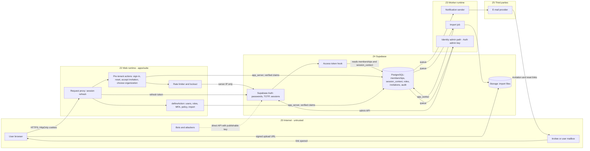

# Threat model TM-0003 — EP-M2-IAM Identity & roles

| | |
|---|---|
| **Backlog** | T-M1-C02 (Track C, M1 Foundation) — per-epic threat model |
| **Epic** | `EP-M2-IAM` — Identity & roles (M2) |
| **Features** | FR-IAM-01, 02, 03, 04, 05, 07, 12, 13 + carry-overs from T-M1-D03 (`BACKLOG.md`): application sign-in rate limit (release blocker for real users), failed sign-ins as security events, MFA tenant policy, session time-box/inactivity, organization switch in the suite, password reset + invitations. SSO (FR-IAM-10, R2) only as design constraints |
| **Template** | Development Plan Appendix D (extended, same section structure as TM-0001) |
| **Version** | 0.1 — 3 Oct 2026 |
| **Status** | Proposed (awaiting Tech Lead review and PO merge) |
| **Owner** | Security Lead (Claude agent) |
| **Reviewers** | Tech Lead (Claude agent), Product Owner (incl. decisions D-IAM-01…04) |
| **Inputs** | BRD v2.1 §4.2, §6.2 (FR-IAM-01…15, BR-IAM-1…3), §10.4, §12.1, App. B; Development Plan v1.1 §4.2, §6.4, §8, App. D, App. F (J1–J3, J13); ADR 0002 rev. 2, ADR 0003 rev. 2, ADR 0006, ADR 0011 §4; `docs/architecture/r1-data-model.md` §2.3; code at commit of 3 Oct 2026 (`packages/platform-identity`, `packages/platform-rbac`, `apps/suite/src/auth`, `supabase/migrations`, `supabase/config.toml`); `docs/engineering/staging-sign-in.md` (Known gaps); `STATUS.md` §3 |
| **Parent** | [TM-0001](TM-0001-platform.md) — this model **inherits every TM-0001 mitigation** and cites its IDs (T-nn, F-nn, EP-nn, TB-n, A-nn, RR-nn) instead of repeating them |
| **Related** | Sibling M2 models [TM-0002](TM-0002-tenancy-onboarding.md) (TEN) · [TM-0004](TM-0004-people-directory.md) (PEO) · [TM-0005](TM-0005-audit-consent.md) (AUD) · [TM-0006](TM-0006-shell-notifications.md) (SHELL) · [`../risk-register.md`](../risk-register.md) · [`../asvs-l2-mapping.md`](../asvs-l2-mapping.md) · [`../secure-coding-standard.md`](../secure-coding-standard.md) |
| **ID scheme** | Threats `T-IAM-NN` · findings `F-IAM-NN` · PO decisions `D-IAM-NN` · abuse cases `AB-IAM-NN` · residual risks `RR-IAM-NN` · entry points `IE-NN` · register rows `R-NN` (common scheme of TM-0002…TM-0006; TM-0001 uses unprefixed `T-NN`/`F-NN`). BRD features are cited as `FR-IAM-NN`; feature and requirement IDs are never used as threat IDs |

---

## 1. Scope

### 1.1 In scope

| Area | Features / items |
|---|---|
| Authentication | E-mail + password sign-in (in place), sign-out, password reset (new), invitation acceptance that sets the password (new), MFA with any authenticator app (TOTP) and the tenant MFA policy off / optional / required for all / required for roles, grace period, trusted device (FR-IAM-12) |
| Sessions | Session refresh in the request proxy (in place), organization chooser (in place) and in-suite organization switch (new), absolute and inactivity timeouts, maximum concurrent sessions, session list and force logout (FR-IAM-13) |
| Anti-automation | Application rate limiter and lockout in front of Supabase Auth (SCS-16, ADR-0011 §4), proof-of-work challenge (ADR-0003 §2), failed sign-ins as security events |
| User administration | Profiles incl. AR/EN four-part names (FR-IAM-01), restricted demographics (FR-IAM-02), invitations single/bulk with expiry, resend ≤ 3, revoke, custom template (FR-IAM-03), bulk import CSV/XLSX ≤ 10,000 rows with dry run and modes (FR-IAM-04), deactivate / reassign / archive / reactivate (FR-IAM-05) |
| Authorization data | 15 default roles (BRD App. B), role assignments with data scopes, BR-IAM-1…3; the role *builder* (FR-IAM-07 custom roles), scope editor (FR-IAM-08) and SoD rules (FR-IAM-09) are R2 but their R1 data model is in scope |
| Readiness | SSO (FR-IAM-10, R2) and SCIM (FR-IAM-11, R3): only the design constraints R1 must not violate |

### 1.2 Out of scope

- Everything already analysed in TM-0001 and only **inherited** here (§6.7): JWT verification, RLS mechanics, cache isolation, CSP/XSS, file scanning, platform-staff impersonation (FR-ADM-17), host → tenant resolution.
- Tenant sign-up and onboarding wizard (FR-ADM-01) and editions (FR-ADM-13): `EP-M2-TEN` ([TM-0002](TM-0002-tenancy-onboarding.md)). People directory and its sync from HRIS / Core HR (FR-STE-02): `EP-M2-PEO` ([TM-0004](TM-0004-people-directory.md)) / M6. Audit storage and consent: `EP-M2-AUD` ([TM-0005](TM-0005-audit-consent.md)).
- Approval delegation (FR-IAM-14, R2), non-employee portals (FR-IAM-15, R2), IP allow-lists and access hours (FR-IAM-13 R3 part).

### 1.3 Implementation baseline (3 Oct 2026)

What exists today determines the "Implemented" / "Partly implemented" status in §6. Everything else is "Planned" or "Open — decision".

| Control | State | Where |
|---|---|---|
| All auth flows as server actions; browser never talks to Auth, never sees a token (HttpOnly cookies) | **Implemented** | `apps/suite/src/auth/actions.ts` (`definePublicAction`, CI-gated to this folder), `platform-identity/src/auth-flow.ts` |
| Uniform "wrong e-mail or password" for every 4xx from Auth (unknown, unconfirmed, banned); Auth outage never shown as wrong password; refusal logged as a warning without personal data | **Implemented** | `auth-flow.ts` |
| Supabase Auth 429 surfaced as `RATE_LIMITED` — but Auth counts the **app server's** IP (no per-attacker, per-account limit) | **Gap** (STATUS §3, release blocker before real users) | — |
| `getClaims()` (asymmetric keys) per request; strict `getUser()` before a session gains a tenant and for high-risk/AAL2 permissions | **Implemented** | `verify-claims.ts`, `define-action.ts` |
| DB-level claim validation (TM-0001 F-01): every statement checks live `auth.sessions` row, **active** membership in an active/trial tenant and the session's `session_context` | **Implemented** (pgTAP `30_*`, `50_*`, `52_*`) | `…120100_private__tenant_claim_validation.sql` |
| Access-token hook issues `tenant_id`/`person_id` only for an active membership of the session's active tenant; strips incoming tenant claims | **Implemented** (pgTAP `40_*`) | `…120400_private__custom_access_token_hook.sql` |
| Organization selection: POST, `switch_active_tenant` (SECURITY DEFINER, owner `tenant_guard`) updates only the caller's session; old token stops working at the DB after a switch | **Implemented** (chooser only) | `…120100`, `…20261001120000_private__session_tenants.sql` |
| Membership guard: request path inserts only `invited` memberships, may update only `status`, and only suspend/revoke (never activate or reactivate) | **Implemented** | `…120200_platform__tenancy_core.sql` (trigger `check_membership_status_transition`) |
| Deactivation / reactivation (T-M2-09, 11 Oct 2026, rev. 2 after security review): suspend + tenant-scoped session end (trigger, serialised with the organization switch), privileged members only at AAL2 both ways (trigger / checked definer), reactivation only through `private.reactivate_membership`; the access-token hook issues no token to a login that belongs nowhere any more (`private.account_sign_in_refused`), fail-closed | **Implemented** (pgTAP `62_*`–`64_*`, `40_*`, integration, self-hosted smoke) | `…20261011090000_private__member_deactivation.sql`, `…20261011090100_private__sign_in_refusal.sql`, `platform-rbac/src/iam/deactivation.ts` |
| `defineAction` pipeline: verify → tenant claim → zod → grants → resource scope → AAL2 → handler → audit; deny by default (403/404/step-up) | **Implemented** — `loadGrants` and `resolveResource` return nothing yet, so every tenant action is denied until M2 | `platform-rbac` |
| Permission registry: high-risk ⇒ `requiresAal2` enforced at definition time | **Implemented** | `permissions.ts` |
| Audit `platform.auth.signed_in` / `signed_out` (ids only) | **Implemented** | `auth-flow.ts` |
| Auth config as code: `jwt_expiry = 900`, refresh rotation + reuse interval, sign-ups off, TOTP enrol/verify on (local `config.toml`); staging set in the dashboard (sign-ups off, ECC signing keys) | **Partly implemented** — CI asserts only the Data API settings, not Auth settings | `supabase/config.toml`, `scripts/lib/supabase-config.mjs` |
| MFA | **Off by default** (PO, 1 Oct 2026; ADR-0003 rev. 2); tenant policy planned | — |
| Session time-box / inactivity; cookie lifetime | **Gap** — `@supabase/ssr` defaults (long-lived); Supabase setting needs Pro plan (STATUS §3) | — |
| Password reset, invitations, import, roles tables, security settings, in-suite switch, session list | **Not built** (M2) | data model §2.3 (`invitations`, `roles`, `role_permissions`, `role_assignments`, `tenant_settings.security_policy`, `bulk_jobs`, `person_sensitive`) |

---

## 2. Assets

TM-0001 §2 assets apply (A-02 restricted demographics, A-06 authentication secrets, A-08 profiles, A-10 tenant configuration, A-11 audit, A-13 imports, A-16 availability). Epic-specific assets:

| ID | Asset | Class | Where | Why it matters |
|---|---|---|---|---|
| IA-01 | Invitation and password-reset tokens (links in e-mail) | C4 (bearer secrets) | `platform.invitations.token_hash`; Supabase Auth recovery tokens; mailboxes | Possession = ability to set a password = account takeover |
| IA-02 | Second factors: TOTP secrets, factor state, trusted-device tokens, (later) recovery material | C4 | Supabase Auth (`auth.mfa_factors`), cookie + hashed server record | MFA bypass |
| IA-03 | Membership status and `session_context` | C3, integrity-critical | `platform.tenant_memberships`, `platform.session_context` | They decide whether a token carries a tenant claim and whether the DB accepts it |
| IA-04 | Roles, role permissions, role assignments and their scopes | C3, integrity-critical | `platform.roles`, `role_permissions`, `role_assignments`, `role_assignment_targets` | Privilege escalation |
| IA-05 | Org relationships that **drive scopes**: manager, department, branch | C3, integrity-critical | `platform.person_employment` | Changing a manager widens `direct_reports` / `reports_tree` access (ADR-0003 §3) |
| IA-06 | Tenant security policy (password, lockout, timeouts, max sessions, MFA enforcement) | C3, security-relevant | `platform.tenant_settings.security_policy` | Weakening prepares an attack |
| IA-07 | Rate-limit counters, lockout state and security events (client IP, keyed e-mail hash, user agent hash) | C3 | PostgreSQL limiter (ADR-0011 §4), security event store | Detection and response; contains pseudonymous personal data |
| IA-08 | Import input files, dry-run results and error reports | C4 (aggregate) | Storage (private bucket), `platform.bulk_jobs` | Up to 10,000 employee records per file |
| IA-09 | Supabase Auth shared rate-limit budget and e-mail sending budget | — | Supabase Auth | One attacker can exhaust it for every tenant (sign-in, refresh, e-mails) |

---

## 3. Actors

TM-0001 §3 actors apply. Epic-specific roles and motives:

| ID | Actor | Trust | Relevant motives / behaviour |
|---|---|---|---|
| AC-TA | Tenant Admin | Trusted in own tenant | Assigns roles, resets MFA, sets policy; target of social engineering ("I lost my phone") |
| AC-HR | HR Manager | Trusted within scope; App. B grants **E** on "Users & roles" | Insider escalation: assign self/accomplice a privileged role; widen scopes through org data; bulk import |
| AC-CO | Coordinator, Training Manager, Line Manager | Trusted within scope; **V** on users | Mass assignment on profile updates; directory harvesting |
| AC-LR / AC-EI | Learner, external instructor (often a multi-tenant login) | Low trust | Self-escalation through own profile; directory harvesting ("no organizational data" for external instructors) |
| AC-IV | Invitee (not yet a user) | Untrusted until acceptance | Accepts with the wrong login; forwards the link |
| AC-XE | Former employee (deactivated) | Untrusted | Keeps an open tab / refresh token; uses old invitation or reset links |
| AC-MT | Malicious tenant (self-service trial) | Untrusted | Probes whether e-mails have logins elsewhere; deactivates or resets shared logins; phishing invitations |
| AC-EX | External attacker / botnet | Untrusted | Credential stuffing, password spraying, reset abuse, e-mail bombing, lockout as a weapon, direct calls to the Supabase Auth API |
| AC-MS | Mail security gateways and link previewers | Not malicious | Fetch links in e-mails (GET) and can consume single-use tokens |

---

## 4. Entry points and trust boundaries

### 4.1 Entry points

| ID | Entry point | Boundary | Authentication | State |
|---|---|---|---|---|
| IE-01 | Sign-in server action `platform.auth.sign_in` (`/{locale}/sign-in`) | TB-1, TB-2, TBI-2 | None (credentials) | Implemented |
| IE-02 | Organization chooser `platform.auth.select_organization`; in-suite organization switch | TB-2 | Session, strict `getUser()` | Chooser in place; in-suite switch M2 |
| IE-03 | Sign-out (this session); "sign out everywhere", session list, force logout (FR-IAM-13) | TB-2 | Session | Sign-out in place; rest M2 |
| IE-04 | Request proxy session refresh (any request carrying an `sb-*-auth-token` cookie) | TB-2, TBI-2 | Refresh token in cookie | Implemented |
| IE-05 | Password-reset request (public form) | TB-1, TB-2 | None | M2 |
| IE-06 | Password-reset completion (e-mailed link → confirmation page → POST new password) | TB-2, TBI-1 | Reset token | M2 |
| IE-07 | Invitation acceptance (e-mailed link → confirmation page → POST: set password, or sign in with an existing login) | TB-2, TBI-1 | Invitation token | M2 |
| IE-08 | User administration actions: invite, resend, revoke, edit profile and restricted fields, deactivate/reassign/archive/reactivate, MFA reset, force logout | TB-2 | Session + `defineAction` | M2 |
| IE-09 | Role catalogue and role assignment actions (role + scope) | TB-2 | Session + `defineAction` (AAL2) | M2 |
| IE-10 | Bulk import: template download, upload (signed URL), mapping, dry run, commit; worker job; error-report download | TB-2, TB-4, TB-9 | Session + signed URL; worker | M2 |
| IE-11 | MFA: enrol, challenge/verify at sign-in and step-up, unenrol, trusted device | TB-2, TBI-2 | Session | M2 |
| IE-12 | Tenant security policy settings (password, lockout, timeouts, max sessions, MFA enforcement) | TB-2 | Session + `defineAction` (AAL2) | M2 |
| IE-13 | Supabase Auth API reached **directly** from the internet with the public URL + publishable key (`/auth/v1/token`, `/recover`, `/otp`, `/verify`, `/user`, `/factors`, `/logout`) — TM-0001 EP-04 | TBI-5 | Publishable key ± tokens | **Exists today** |
| IE-14 | Outbound e-mail: invitations, reset links, security notifications (worker → provider); Supabase Auth's own mailer | TBI-1, TB-7 | — | M2 |
| IE-15 | Custom Access Token Hook on every token issuance/refresh | TB-4 | Supabase Auth → DB | Implemented |

### 4.2 Trust boundaries

TM-0001 TB-1…TB-10 apply. Epic-specific boundaries:

| ID | Boundary | Crossing controls |
|---|---|---|
| TBI-1 | Platform → e-mail channel → invitee mailbox | Tokens leave our control (gateways, forwarding, shared mailboxes): high-entropy, hashed at rest, single use, short-lived, no side effect on GET, bound to the addressee |
| TBI-2 | App server → Supabase Auth | Every Auth call originates from the app server's egress IP: Supabase per-IP limits see one client; the **application** limiter must run before every call |
| TBI-3 | Tenant ↔ global login | Tenant admins act on tenant-scoped data (person, membership, role assignment); password, e-mail, factors and the Auth user are global and change only by the login owner (re-authentication) or platform staff (T-06) |
| TBI-4 | Request path ↔ Auth admin API (secret key) | Creating logins, revoking sessions, resetting factors needs the Auth admin API; it must not live in the web runtime (ADR-0002 §7, F-03) — see F-IAM-02 |
| TBI-5 | Internet → Supabase Auth directly | Not routed through our app: application limits, lockout, audit and policy do not apply unless enforced inside Auth (hooks, settings) |

### 4.3 Data-flow diagram

**Key flows**

1. **Sign-in (in place):** browser → sign-in action → *(planned: limiter on client IP + keyed e-mail hash)* → Supabase Auth password grant from the server IP → `verifyClaims` → `private.session_tenants()` → auto-select or chooser → `switch_active_tenant` → refresh → hook adds tenant claim → audit `signed_in`.
2. **Invitation (planned):** admin action creates person + `invited` membership + `invitations` row (token hash) → outbox → notification sender e-mails a link → invitee opens a confirmation page (GET, no side effect) → POST accept: verifies token, e-mail binding, then either creates the login (identity admin path, F-IAM-02) and sets the password under the tenant policy, or asks an existing login to sign in and confirm → membership `invited → active` through a checked SECURITY DEFINER function → audit.
3. **Password reset (planned):** public form → limiter → reset e-mail (constant response) → confirmation page → POST new password (policy + breached check) → other sessions signed out → notification + audit.
4. **Deactivation (planned):** admin action → membership `active → suspended` (in-place guard allows it) → that tenant's `session_context` rows removed → the DB refuses the old claims at the next statement (in place) → reassignment tasks.
5. **Import (planned):** upload via signed URL → scan → worker parses in chunks under `withSystemTx` → dry-run report → commit → batch audit, rollback available.

---

## 5. Rating and status

**Rating.** Likelihood (L) and Impact (I) on the **1–5 scales of the [risk register §1](../risk-register.md#1-method)** (L: 1 rare … 5 almost certain; I: 1 negligible … 5 severe, where 5 = cross-tenant exposure or harm to many tenants), rated **inherent** as the register defines it: with only the controls already implemented (§1.3), before the listed planned mitigations. TM-0001 uses H/M/L; roughly 4–5 = H, 3 = M, 1–2 = L. Any cross-tenant exposure is an S1 incident regardless of rating. In this epic: I 5 = privileged account takeover at scale; 4 = C4 breach or privileged ATO in one tenant; 3 = single-tenant integrity/disclosure; 2 = single user.

**Status values** (shared by TM-0002…TM-0006). *Implemented* (control exists on `main` with a test) · *Partly implemented* (part exists; the gap is named) · *Planned (Mx / Rx / Suite)* (control defined and assigned to a milestone or release; not built yet) · *Open — decision <ID>* (needs a Tech Lead or PO decision, or legal validation — F-…, D-… or L-… items, §10). Accepted residuals are listed in §8. A threat becomes *Verified* only when its verification passes in CI or a review record exists (security README §4.2).

**References.** T-nn / F-nn / AB-nn = TM-0001; ADR-nnnn; SCS-n = secure coding standard; V-n.n = ASVS 5.0 section ([mapping](../asvs-l2-mapping.md)); FR/NFR/BR = BRD.

---

## 6. STRIDE analysis

### 6.1 Spoofing

| ID | Threat | STRIDE | Entry point | L | I | Mitigation | Verification (test/CI/review) | Status |
|---|---|---|---|---|---|---|---|---|
| T-IAM-01 | **Credential stuffing / password spraying through the sign-in action.** All Auth calls come from the app server, so Supabase's per-IP limits neither slow one attacker nor protect one account (STATUS §3); refines T-01 | S | IE-01 | 4 | 5 | `rateLimit()` (ADR-0011 §4) **before** the Auth call, keyed on client IP and on HMAC(e-mail), plus a per-account counter across all IPs (distributed attacks); progressive delay → proof-of-work challenge (ADR-0003 §2) → lockout per tenant policy (FR-IAM-13, D-IAM-04); 429 + `Retry-After`; security event (T-IAM-25); breached-password check (T-IAM-05); MFA policy (T-IAM-41). Uniform error message: in place | Integration: N+1 attempts → 429 and the Auth mock is **not** called; same account from 50 IPs → account limit triggers; events emitted. CI gate: sign-in action without `rateLimit` fails (Semgrep) | Partly implemented (uniform errors); limiter Planned (M2) — **release blocker for real users** |
| T-IAM-02 | **Bypass of all application controls by calling Supabase Auth directly** (`/auth/v1/token?grant_type=password`, `/factors/*/verify`) with the public URL and publishable key: no app limiter, lockout, audit or security event | S | IE-13 | 4 | 4 | Enforce per-account lockout **inside Auth** with the Password Verification Attempt and MFA Verification Attempt hooks backed by the same counters (plan availability and self-hosted GoTrue support to verify, F-10, F-09); Supabase per-IP limits do apply to the attacker's own IP on direct calls; make URL and publishable key server-only env vars (the browser never calls Auth — raises the bar, not a control); alert on password grants not originating from app egress (Auth logs) | Integration on staging: after lockout, a direct password grant is refused; config test that hooks are enabled in cloud and self-hosted config | Open — decision F-IAM-01 |
| T-IAM-03 | **Client-IP spoofing defeats the limiter** (`X-Forwarded-For` chosen by the attacker; rotating fake IPs) | S/D | IE-01, IE-05, IE-07 | 3 | 3 | Client IP taken only from the header the trusted edge sets (Vercel edge header; sovereign: configured proxy, right-most trusted hop); inbound copies stripped (the proxy already strips client-supplied `x-jadarat-*` headers — in place); always combined with the per-account key so IP rotation does not reset it | Unit tests of IP extraction per deployment mode with spoofed headers | Planned (M2) |
| T-IAM-04 | **Unused Supabase Auth flows remain enabled** and give alternative sign-in paths outside the app: magic link / e-mail OTP sign-in (`/otp`), e-mail change, phone, anonymous sign-in, sign-up | S | IE-13 | 3 | 4 | Sign-ups off (in place: `config.toml` + staging dashboard); disable or neutralise every flow the product does not use: phone/anonymous off, secure e-mail change (both addresses) only via the app, a **Send Email hook** that refuses unused `email_action_type`s (magic link, sign-up) and sends the rest through our notification service (F-IAM-07); assert all Auth settings as code in CI (SCS-9; today CI asserts only Data API settings) | Config test over `config.toml` and self-hosted env; DAST: direct `/otp` for an existing user sends nothing usable | Partly implemented (sign-up off) |
| T-IAM-05 | **Weak or breached passwords** and tenant password policy bypass: Supabase password rules are project-wide, users can set a password directly via `/user` with their own token, breached-password check is plan-dependent and needs internet egress (F-09) | S | IE-06, IE-07, IE-13 | 3 | 4 | Platform floor in Supabase (min length per ASVS V6.2, see mapping) = the lowest tenant value allowed; tenant policy checked in every set-password action (accept, reset, change); secure password change (re-authentication) on; breached-password check on (hosted — verify plan) and offline corpus fallback for sovereign; for a multi-tenant login the strictest active-membership policy applies at set time (D-IAM-04) | Integration tests per policy; config test; DAST direct `/user` password change without re-authentication refused | Planned (M2) |
| T-IAM-06 | **Invitation link takeover:** link forwarded, leaked from a shared mailbox, logs or `Referer`, or consumed by a mail gateway; whoever accepts first sets the password and gets the invited role | S | IE-07 | 3 | 4 | ≥ 256-bit random token; only its hash stored (`invitations.token_hash`); single use (atomic `pending → accepted`); expiry 7 days default (FR-IAM-03); resend **rotates** the token and invalidates the previous one; revoke; GET shows a confirmation page only (no state change — defeats AC-MS); `Referrer-Policy: no-referrer`, no third-party resources on the page; acceptance creates the login with the **invited e-mail** only; inviter notified on acceptance; roles fixed at invite time | Integration: reuse, expired, revoked, old token after resend, GET without side effect, token absent from logs (T-IAM-29) | Planned (M2) |
| T-IAM-07 | **Invitation accepted by the wrong login** ("join CSRF"): a victim signed in as login A opens an invitation addressed to someone else, or is lured into accepting an invitation to an attacker's tenant, so their login joins it | S | IE-07 | 2 | 3 | Accept only when the signed-in login's e-mail equals the invitation e-mail, otherwise sign out and restart; confirmation page shows organization name (AR/EN) and inviter; existing logins stay `invited` until they confirm (ADR-0003 §1, T-06); Next.js Origin check on server actions (in place) | Integration: mismatched login → refused; cross-site POST → refused | Planned (M2) |
| T-IAM-08 | **Inviting an e-mail that already has a login** (member of another tenant) silently links it, or tells the inviter that the address has an account elsewhere | S/I | IE-08 | 3 | 3 | Same UI, response and e-mail for new and existing logins; existing login gets a pending membership and must sign in to accept; the tenant can never set or see password, factors or other memberships of an existing login (TBI-3, T-06, T-12) | Integration: response/timing comparison new vs existing login | Planned (M2) |
| T-IAM-09 | **Password-reset account takeover:** reset link built from a spoofed `Host` (link points to attacker), open redirect in `redirectTo`, token consumed by scanners or reused, other sessions survive the reset | S | IE-05, IE-06 | 3 | 5 | Links built only from the configured canonical origin / verified tenant domain, never from request headers; Supabase redirect allow-list without wildcards (T-65, SCS-9 `safeNextPath`); token-hash flow verified server-side by POST from a confirmation page; single use, short expiry (Auth OTP expiry set as code); after reset: sign out other sessions (`signOut({ scope: 'others' })`), notify the user, audit; reset never yields AAL2 (T-IAM-10) | Integration: `Host`/`X-Forwarded-Host` spoof, reuse, expiry, other sessions revoked; DAST | Planned (M2) |
| T-IAM-10 | **Recovery downgrades MFA:** reset or "lost device" path yields an AAL2-equivalent session or removes factors without strong checks; Tenant Admin MFA reset used through social engineering; a tenant resets factors of a login shared with another tenant | S/E | IE-06, IE-08, IE-11 | 3 | 5 | Recovery always yields AAL1; tenant MFA reset is a high-risk permission (AAL2 + `getUser()`), needs a reason, is audited, e-mails the user, and is allowed only when **all** the login's active memberships are in that tenant — otherwise platform support with identity verification (T-06, T-07); user must re-enrol before any AAL2 permission; encourage two factors (Supabase TOTP has no recovery codes — verify) | Integration: reset → AAL1 → step-up required; multi-tenant login → tenant reset refused; audit + notification asserted | Planned (M2) |
| T-IAM-11 | **Attacker with only the password enrols their own TOTP first** (no factor yet, or during the grace period), locking the owner out and gaining AAL2 | S/E | IE-11 | 3 | 4 | First enrolment requires a fresh sign-in and, when the tenant requires MFA, a one-time code e-mailed to the login's address before the factor becomes verified (proves mailbox); notification on every enrol/remove; enrol/remove needs AAL2 when a verified factor exists (T-58); no grace period for roles with high-risk permissions | Integration: enrolment without e-mail confirmation refused; notification sent; E2E J2 | Planned (M2) |
| T-IAM-12 | **TOTP brute force or replay** at challenge, via the app or directly at `/factors/{id}/verify` | S | IE-11, IE-13 | 2 | 4 | Application limiter per login and factor; MFA Verification Attempt hook lock after N failures (F-IAM-01); Supabase verify rate limit; code single use within its window (Auth) | Integration: limiter; config test of hook | Planned (M2) |
| T-IAM-13 | **Trusted-device token theft or forgery** skips MFA (FR-IAM-12 trusted-device duration) | S | IE-11 | 2 | 4 | Random token, stored hashed per login + tenant + device, HttpOnly host-only cookie, lifetime ≤ tenant setting, revoked on password reset, factor change and force logout; only relaxes the *sign-in* prompt — never satisfies AAL2 for high-risk permissions (AAL2 comes only from Supabase `aal`) | Unit/integration: expired/revoked/forged token; AAL2 action still steps up | Planned (M2) |
| T-IAM-14 | **Session fixation / login CSRF:** victim's browser forced into the attacker's session (victim then types personal data into it) or a session cookie planted from a sibling subdomain | S | IE-01, IE-04 | 2 | 3 | New Auth session per sign-in (Supabase) and server actions behind Next.js Origin/Host check — in place; host-only cookies without `Domain` (SCS-8) — cookies currently use `@supabase/ssr` defaults, assert attributes; tenants cannot publish scripts or HTML on platform subdomains | E2E cookie-attribute assertions; cross-site POST to sign-in refused | Partly implemented |
| T-IAM-15 | **Display-name spoofing:** bidi controls (U+202E), homoglyphs or names such as "مدير المنشأة / Tenant Admin" make a person look like someone else in role-assignment, approval and e-mail views | S | IE-08, IE-10 | 3 | 2 | NFC normalization and removal of bidi/control characters in names (SCS-4); security-sensitive views show e-mail or employee number next to the name; reserved display names flagged | Unit tests with bidi/homoglyph corpus (AR/EN) | Planned (M2) |
| T-IAM-16 | **SSO readiness (R2):** JIT provisioning with a role above Learner, IdP group → admin mapping, e-mail-based auto-linking of an SSO identity to an existing password login, "force SSO" removing break-glass (BR-IAM-2); extends T-05 | S/E | Future EP-04 (SAML ACS) | 3 | 5 | R1 design constraints: login identity (`auth.users`) kept separate from `persons.email`; membership linked explicitly (BRD §10 `user_identity`), never by e-mail match; JIT default role = Learner; mapping to roles with high-risk permissions requires explicit AAL2 configuration; break-glass invariant shares the T-IAM-38 check | R2: rogue-IdP and auto-link tests; pen test scope | Planned (R2) — constraints apply now |

### 6.2 Tampering

| ID | Threat | STRIDE | Entry point | L | I | Mitigation | Verification (test/CI/review) | Status |
|---|---|---|---|---|---|---|---|---|
| T-IAM-17 | **Mass assignment on profile updates** (self-service or admin): learner/coordinator adds `managerPersonId`, `departmentId`, `status`, `personType`, `email`, `employeeNumber` or restricted fields to the payload; refines T-17 | T/E | IE-08 | 4 | 4 | One zod `strictObject` per action; field groups per permission: self-service (locale, photo, mobile with verification), profile (`platform.person.manage`), employment/manager (`platform.person.manage_employment`), restricted FR-IAM-02 fields (`platform.person.manage_sensitive`); `tenant_id` never from input | Unit: unknown key → 400; authz negatives per field group and default role | Planned (M2) |
| T-IAM-18 | **Scope escalation through org data:** scopes are derived from manager chain, department and branch, so whoever edits `person_employment` (HR Manager, import, later HRIS sync) can widen someone's `direct_reports`/`reports_tree`/`org_units` reach — e.g., make themselves manager of executives; manager cycles | T/E | IE-08, IE-10 | 3 | 4 | Employment edits need their own permission; no self-edit of own manager/department/branch; cycle and self-manager checks; before/after audit (BR-IAM-3 spirit); bulk changes only via dry run + confirm; grants recomputed per request (ADR-0003 §5) so changes are visible immediately in audit | Unit: cycle/self rules; integration: `expectAudit`; authz negatives | Planned (M2) |
| T-IAM-19 | **Malicious import file:** formula injection carried into exports and the error report, XLSX zip bomb or entity expansion, oversized files, encoding tricks (inherits T-26) | T/D | IE-10 | 3 | 3 | T-26 controls: 10,000-row and byte limits (FR-IAM-04), parser with entity expansion off, malware scan before parsing (ADR-0006), processing in the worker; NFC + bidi stripping (T-IAM-15); CSV/XLSX escaping of leading `= + - @ \t \r` in error reports and exports (SCS-6.6) | Malicious fixtures; fuzz tests on the importer | Planned (M2) |
| T-IAM-20 | **Import mass assignment and key confusion:** mapping columns onto server-owned fields (status, role, membership, login e-mail, `tenant_id`), or upsert matching on the wrong key overwrites another person (e.g., match by e-mail updates a different person's employee number) | T/E | IE-10 | 3 | 4 | Mapping targets from a fixed allow-list (no role, status, membership or login fields in R1); explicit match key chosen in the wizard; conflicts reported, never resolved silently; e-mail change of a person with an active membership never changes the login e-mail and is flagged; dry run mandatory before commit; batch audit + rollback (BRD §10.4) | Unit per mode (create-only / upsert / update-only); integration rollback test | Planned (M2) |
| T-IAM-21 | **Membership tampering at the database:** request-path code (bug, missing check) activates an invited or suspended membership, or re-points a membership to another person | T/E | IE-08 | 2 | 5 | In place: insert only `invited`; UPDATE grant on `status` only; transition trigger forbids (re)activation from `authenticated`; composite FK `(tenant_id, person_id)`. Planned: invitation acceptance and reactivation through checked SECURITY DEFINER functions (owner `tenant_guard`) that verify token/permission and AAL inside | pgTAP: learner claims cannot activate, reactivate or change `person_id`; tests for the new functions | Partly implemented (guard); functions Planned (M2) |
| T-IAM-22 | **IAM tables rely only on `defineAction`:** `persons` and `tenant_memberships` permissive policies are `true` inside the tenant; planned role tables likewise — one action with a missing or wrong check lets any member write persons, memberships or role assignments | T/E | IE-08, IE-09 | 3 | 4 | `defineAction` + CI gate (in place); add **restrictive** policies on `roles`, `role_permissions`, `role_assignments`, `role_assignment_targets`, `invitations`, `tenant_settings` (and writes to `tenant_memberships`) that require a DB-evaluated permission (`private.has_permission(code)` over `role_assignments`) and `aal2` for role tables (T-58 recommendation) | pgTAP: learner/coordinator claims cannot insert/update these tables; AAL1 claims cannot write role tables | Open — decision F-IAM-03 |
| T-IAM-23 | **Phishing through invitation e-mails:** tenant-controlled template (FR-IAM-03) or organization name injects links/HTML; trial tenants mass-invite in a bank's name (T-13, T-40, AB-05) | T/S | IE-14 | 3 | 4 | Logic-less templates, escaped variables, no raw HTML; call-to-action link generated by the platform (canonical origin only), other links blocked or shown as text; trial quotas and per-tenant daily caps; reserved names | Template unit tests; quota tests | Planned (M2) |
| T-IAM-24 | **Security policy weakened** by a compromised admin or insider (MFA off, lockout disabled, very long timeouts) to prepare an attack | T | IE-12 | 2 | 4 | Policy changes = high-risk permission (AAL2 + `getUser()`), before/after audit, e-mail to all Tenant Admins; platform floors the tenant cannot go below (minimum password length, maximum absolute session lifetime, lockout cannot be disabled) | Unit: floors enforced; integration: audit + notification | Planned (M2) |

### 6.3 Repudiation

| ID | Threat | STRIDE | Entry point | L | I | Mitigation | Verification (test/CI/review) | Status |
|---|---|---|---|---|---|---|---|---|
| T-IAM-25 | **Authentication failures are not security events:** today a refused sign-in is a warning log without a stable event name; failures have no tenant, so tenant-scoped `platform.audit_events` cannot hold them; lockouts, resets, MFA changes and rate-limit hits are not recorded | R | IE-01, IE-05, IE-06, IE-11, IE-13 | 4 | 3 | Stable event names (`auth.sign_in.failed`, `auth.lockout`, `auth.rate_limited`, `auth.password_reset.requested`/`completed`, `auth.mfa.enrolled`/`removed`/`reset`, `auth.session.revoked`) with keyed e-mail hash, client IP, user-agent hash (no plain e-mail, SCS-15); platform-level security-event store (not tenant-readable) + projection into the tenant audit for logins that are members of that tenant (F-IAM-06); Auth logs pulled for direct-API events (T-IAM-02); alert on spikes (ASVS V16.3) | Integration: `expectSecurityEvent` per failure path; alert rule test | Partly implemented (signed_in/out audit, warning log) |
| T-IAM-26 | **IAM changes not attributable:** role, scope, invitation, deactivation, MFA reset and policy changes without before/after or actor (BR-IAM-3) | R | IE-08, IE-09, IE-12 | 2 | 4 | `defineAction` audit hook (in place) with before/after per action; AAL and impersonation dual identity recorded (T-07); denied attempts on IAM actions logged as security events | `expectAudit` in every IAM action test | Partly implemented (audit pipeline); rest Planned (M2) |

### 6.4 Information disclosure

| ID | Threat | STRIDE | Entry point | L | I | Mitigation | Verification (test/CI/review) | Status |
|---|---|---|---|---|---|---|---|---|
| T-IAM-27 | **Account enumeration** through password reset, invitation, sign-in timing, import validation messages or direct Auth endpoints (refines T-12) | I | IE-01, IE-05, IE-07, IE-08, IE-13 | 4 | 2 | Sign-in: one message for every refusal — in place; reset: constant response ("if an account exists…") and e-mail sent asynchronously; invitation: T-IAM-08; `AUTH_NO_ORGANIZATION` only after a correct password (acceptable); rate limits; measure Auth timing for unknown vs known users (verify) | Integration: response body and timing comparison; DAST | Partly implemented |
| T-IAM-28 | **Directory over-exposure:** people search and profile DTOs return e-mails, mobiles and restricted demographics (FR-IAM-02) to Learners or External Instructors ("no organizational data", App. B); `persons_read` RLS is tenant-wide | I | IE-08 | 4 | 4 | Directory read permission per default role (none for Learner, External Instructor, Provider Admin beyond assigned context); DTO projection per permission reused by exports and search (T-35); restricted fields in `person_sensitive` with permission-gated policy (data model §2.3) | Authz negative tests per default role; E2E J13 | Planned (M2) |
| T-IAM-29 | **Tokens and personal data in logs, URLs and `Referer`:** invitation/reset tokens in query strings captured by request logs, analytics or `Referer`; e-mails logged on failures | I | IE-05, IE-06, IE-07 | 3 | 4 | Token parameters redacted in the app logger and not logged by the proxy; `no-referrer` and no third-party resources on token pages; token exchanged for a POST form on first view; tokens hashed at rest; no e-mail in logs (SCS-15) | Log-redaction unit tests; review of edge log settings | Planned (M2) |
| T-IAM-30 | **Import files and error reports exposed** (C4 aggregate): kept indefinitely, downloadable by other admins, signed URL forwarded | I | IE-10 | 3 | 4 | Private bucket, tenant prefix, download grant for the requester only (ADR-0006 §4), short signed-URL TTL; input and reports deleted at `bulk_jobs.expires_at`; error report holds row number, field and error code, not whole rows; download audited | Integration: other admin → 404; expiry job test | Planned (M2) |

### 6.5 Denial of service

| ID | Threat | STRIDE | Entry point | L | I | Mitigation | Verification (test/CI/review) | Status |
|---|---|---|---|---|---|---|---|---|
| T-IAM-31 | **Shared Auth rate limit exhausted** from the app server IP: one attacker blocks sign-in, refresh and e-mail sending for every tenant; forged `sb-*-auth-token` cookies make the proxy call Auth refresh on each request (STATUS §3) | D | IE-01, IE-04, IE-05 | 4 | 4 | Application limiter per client IP before **every** Auth call incl. refresh; proxy refreshes only well-formed Supabase session cookies, at most once per request, and clears cookies after a failed refresh; Auth e-mails sent via our notification service (Send Email hook / custom SMTP) so mail caps are ours; ask Supabase whether a trusted forwarded client IP is supported for server-side calls (verify — do not rely on it) | Load test: 1,000 forged-cookie requests → bounded Auth calls; integration on limiter | Planned (M2) — **release blocker** (STATUS §3) |
| T-IAM-32 | **Lockout as a weapon:** attacker locks out the CEO, all Tenant Admins, or a whole tenant by failing sign-ins | D | IE-01, IE-13 | 3 | 3 | Soft lock keyed on account + IP with progressive delay and proof-of-work rather than a hard global lock; self-unlock by e-mail; admin unlock; security event + alert; Tenant Admins notified of mass lockouts | Integration: attacker IP locked, owner from another IP can still sign in after challenge | Planned (M2) |
| T-IAM-33 | **E-mail bombing and denial of wallet** through reset requests, invitation resends and direct `/recover` | D | IE-05, IE-08, IE-13 | 3 | 3 | Per-account and per-IP limits on reset; invitation resend max 3 (FR-IAM-03) and per-tenant daily caps (lower for trials); Send Email hook enforces caps for Auth-originated mail; cost alerts (T-51) | Integration: limits; cap test | Planned (M2) |
| T-IAM-34 | **Import exhausts worker/database** (parallel 10,000-row imports, huge files) | D | IE-10 | 3 | 3 | One running import per tenant; chunked transactions with statement timeout; async job with progress (NFR-PERF-05 target); per-tenant quotas (T-48) | k6/integration with 10,000 rows | Planned (M2) |

### 6.6 Elevation of privilege

| ID | Threat | STRIDE | Entry point | L | I | Mitigation | Verification (test/CI/review) | Status |
|---|---|---|---|---|---|---|---|---|
| T-IAM-35 | **Privilege escalation via role assignment:** assigner grants roles with permissions they lack, assigns themselves, widens a scope to `tenant`; HR Manager (App. B: **E** on "Users & roles") assigns Tenant Admin to self or an accomplice (refines T-56) | E | IE-09 | 4 | 5 | Grant only roles whose permissions the assigner holds, within the assigner's own scope (ADR-0003 §5); no self-assignment or self-scope change; Tenant Admin and roles with high-risk permissions assignable only by a Tenant Admin at AAL2 after `getUser()`; other Tenant Admins notified; before/after audit (BR-IAM-3); one primary role (BR-IAM-1). R1 runtime denies everything until grants load (in place) | Unit: subset and scope rules incl. edge cases; authz negatives for each default role; E2E J2 | Partly implemented (deny-all runtime); rest Planned (M2); Open — decision D-IAM-03 |
| T-IAM-36 | **Platform power inside a tenant:** BRD counts "Platform Super Admin" among the 15 default roles; seeding it into the tenant catalogue, or (R2) a custom role with console or unlicensed-module permissions | E | IE-09 | 2 | 5 | Tenant catalogue = the 14 tenant roles of App. B; Platform Super Admin exists only as `platform.platform_staff` + console (ADR-0003 §6, FR-ADM-17); console permissions not in the tenant permission registry; role permissions filtered by edition (FR-ADM-13) | Unit/pgTAP: seeded roles contain no console permission; registry test | Planned (M2); Open — decision D-IAM-02 |
| T-IAM-37 | **System role tampering:** editing permissions of system roles (FR-IAM-07: not editable) or a custom role shadowing a system role code | E/T | IE-09 | 2 | 4 | Immutability trigger for `is_system` roles (data model §2.3); unique `(tenant_id, code)` with a reserved prefix for system codes; `role_permissions` FK to `ref_permissions` synced from the registry; CI drift check | pgTAP: update/delete of system role refused for every tenant role; drift test | Planned (M2) |
| T-IAM-38 | **Tenant left without an administrator** (last Tenant Admin removed, deactivated or locked out by MFA loss): recovery then depends on support, a social-engineering path | E/D | IE-08, IE-09 | 3 | 3 | Invariant ≥ 1 active Tenant Admin with a usable login (service check + constraint trigger); with forced SSO later, break-glass admin keeps password + MFA (BR-IAM-2); platform recovery only via the impersonation-grant process (T-07) with documented identity verification | Integration: removing last admin refused | Partly implemented — T-M2-09: deactivation refuses the last active Organization Admin without an end date (action `LAST_ADMIN` + database guard; pgTAP `63_*`); MFA-loss recovery Planned |
| T-IAM-39 | **Stale access after deactivation or role removal:** access token valid ≤ 15 min, refresh token alive, open tabs (refines T-57) | E | IE-08 | 3 | 4 | In place: the DB re-validates live session + **active** membership + `session_context` on every statement, so tenant data access stops at the next statement after the status change; `/suite` treats it as signed out. Planned: deactivation removes that tenant's `session_context` rows (tenant-scoped sign-out), grants recomputed per request (membership version counter), pending invitations, reset/action tokens and approval links of the person revoked; Storage/Realtime role allow-list with the same validation before first use (ADR-0002 §6a); direct-surface window = RR-06 | pgTAP (in place, `30_*`); integration: suspend → next server request denied; E2E | Partly implemented — T-M2-09: deactivation removes that tenant's `session_context` rows (trigger, pgTAP `62_*`; a concurrent organization switch cannot leave one behind — shared advisory lock, integration test), revokes the person's pending invitations, and Auth issues no token (sign-in or refresh) once the login belongs nowhere (access-token hook; pgTAP `64_*`, self-hosted smoke). Grants recomputation per request and Storage/Realtime allow-list Planned |
| T-IAM-40 | **Deactivation in one tenant disables a shared login everywhere:** a (malicious) tenant deactivates an external instructor and the implementation bans the Auth user or revokes all its sessions (T-06) | E/D | IE-08 | 3 | 3 | Tenant actions act on the membership and that tenant's sessions only; never ban, delete or globally sign out an `auth.users` row from a tenant action; global account actions only by the login owner or platform staff (audited admin path) | Integration with a two-tenant login: deactivation in A leaves B usable | Implemented (T-M2-09) — satisfied structurally: the tenant action changes only the membership and that tenant's sessions; no ban exists. Auth refuses tokens only when the login has memberships, none active in a served organization, and no pending invitation — decided live by the access-token hook, so another organization's active membership (or invitation) keeps the login usable (ADR-0002 §7 note T-M2-09; pgTAP `63_*`/`64_*`, integration). The refusal is visible only to someone who knows the password: a wrong password gets `invalid_credentials` like an unknown address (smoke) |
| T-IAM-41 | **MFA policy bypass:** tenant requires MFA but an AAL1 session keeps acting (tenant claim issued regardless of AAL; pages outside `defineAction`; policy or a role "MFA required" assigned mid-session); and "MFA off by default" could be read as allowing high-risk actions at AAL1 | E | IE-11, IE-15 | 3 | 5 | High-risk ⇒ AAL2 enforced by the registry and `defineAction` step-up — in place; tenant/role policy checked at organization selection and on every request (session state); recommended DB-level enforcement: the access-token hook issues `tenant_id` only when the session `aal` satisfies the tenant/role policy (hook input carries `aal` — verify) (F-IAM-04); policy changes effective on the next request | Negative tests at AAL1 for every high-risk action; pgTAP on hook outputs per policy | Partly implemented; Open — decision D-IAM-01 |
| T-IAM-42 | **Organization switch abuse:** switch into a tenant without active membership; CSRF-driven switch makes the user act in the wrong tenant; the old token keeps working in the previous tenant; switch as a GET side effect | E/T | IE-02 | 2 | 4 | In place: POST server action with Origin check, strict `getUser()`, `switch_active_tenant` checks live session + active membership and updates only the caller's session; DB refuses the previous token after a switch; audit `signed_in`. Planned: in-suite switch reuses the same function; host = claim check (T-04); audit `platform.auth.tenant_switched`; open tabs detect the claim change and reload | pgTAP `50_*`/`52_*` (in place); E2E switch with two tabs | Partly implemented (chooser); in-suite switch Planned (M2) |
| T-IAM-43 | **Sessions live too long:** long-lived `@supabase/ssr` cookies, no absolute/inactivity timeout (Free plan), shared devices, no concurrent-session cap or force logout (FR-IAM-13; STATUS §3) | E/S | IE-03, IE-04 | 4 | 4 | Tenant absolute + inactivity timeouts enforced by the application (ADR-0003 §2) and, preferably, by the database: extend `private.auth_session_validity` with `created_at`/`refreshed_at` (verify column semantics) so `user_session_is_valid` applies the tenant limits (F-IAM-05); Supabase time-box/inactivity (Pro) as outer bound; cookie max-age ≤ absolute timeout; concurrent-session cap at sign-in (oldest revoked); session list + force logout | Integration with a controlled clock: idle/absolute expiry → signed out; config test | Open — decision F-IAM-05 — **release blocker** (STATUS §3) |
| T-IAM-44 | **Auth admin (secret key) in the request path:** creating logins at invitation acceptance, signing out users, resetting factors need the Auth admin API; doing it in the web runtime breaks ADR-0002 §7 / F-03 and exposes the key (T-60) | E | IE-07, IE-08 | 3 | 5 | Decide one narrow, reviewed identity-admin path: operations queued to the worker (`app_worker` + Auth admin key) with the request waiting on the result, **or** a minimal `platform-identity/admin` module with its own import rule; every call audited with operator and reason (SCS-18) | dependency-cruiser rule; env-schema test that the web runtime has no secret key; security review | Open — decision F-IAM-02 |

**Count:** 44 threats — 16 spoofing, 8 tampering, 2 repudiation, 4 information disclosure, 4 denial of service, 10 elevation of privilege (primary category; several span two as marked).

### 6.7 Inherited from TM-0001 (not repeated)

| TM-0001 | How this epic uses or refines it |
|---|---|
| T-01, T-02 | Refined by T-IAM-01/02/31 (rate limiting, direct Auth API) and T-IAM-43 (session lifetime) |
| T-03 | `getClaims()`/`getUser()` in place; unchanged |
| T-04 | Host = claim check lands with tenant domains in M2; required by T-IAM-42 |
| T-06 | Basis for T-IAM-07, T-IAM-08, T-IAM-10, T-IAM-40 (TBI-3) |
| T-07 | Impersonation (FR-ADM-17) is not in this epic; T-IAM-10/T-IAM-38 route support recovery through it |
| T-11, T-51 | Only if e-mail/SMS OTP are adopted (ADR-0003 spike, R2); T-IAM-33 covers e-mail volume |
| T-12, T-13, T-17, T-26, T-35 | Refined by T-IAM-27, T-IAM-23, T-IAM-17/20, T-IAM-19, T-IAM-28 |
| T-50 | Hook changes for F-IAM-04 must keep its controls (no `user_metadata`, `search_path = ''`, pgTAP per status) |
| T-54, T-55, T-56, T-57, T-58, T-59 | Refined by T-IAM-35…T-IAM-41 |
| T-65 | Applies to reset/invitation redirects (T-IAM-09) |

---

## 7. Abuse cases

Each abuse case becomes at least one negative test in the epic's stories (Plan §8.2).

| ID | Abuse case | Actor | Threats | Expected behaviour / test |
|---|---|---|---|---|
| AB-IAM-01 | A botnet tries 50,000 leaked e-mail/password pairs against the sign-in action from rotating IPs and, in parallel, directly against `/auth/v1/token` | AC-EX | T-IAM-01, 02, 03 | Per-account and per-IP limits engage before Auth is called; direct attempts hit the Auth-side lockout (F-IAM-01); events and alert fire |
| AB-IAM-02 | A mail security gateway opens every invitation link | AC-MS | T-IAM-06 | GET renders a confirmation page only; the invitee can still accept |
| AB-IAM-03 | A dismissed employee keeps a tab open and starts an export 2 minutes after deactivation | AC-XE | T-IAM-39 | Next request: signed out / 404; the DB returns zero rows for the old claims |
| AB-IAM-04 | An HR Manager assigns herself the Tenant Admin role | AC-HR | T-IAM-35 | 403; denied attempt logged as a security event; no change |
| AB-IAM-05 | A coordinator adds `managerPersonId: <CEO>` to his own profile-update payload | AC-CO | T-IAM-17, 18 | 400 (strict schema); self-edit of employment fields refused |
| AB-IAM-06 | An attacker who phished a password enrols their own authenticator before the victim does | AC-EX | T-IAM-11 | Enrolment needs the e-mailed confirmation code; the victim is notified |
| AB-IAM-07 | A caller tells the Tenant Admin "I lost my phone" to get the CFO's MFA reset | AC-EX | T-IAM-10 | Reset requires AAL2 admin + reason; the CFO is e-mailed; the new session is AAL1 and must re-enrol before privileged actions |
| AB-IAM-08 | A trial tenant invites a bank employee's e-mail to learn whether it has an account, then deactivates the membership to disrupt | AC-MT | T-IAM-08, 40 | Identical responses; deactivation affects only the trial tenant's membership |
| AB-IAM-09 | An import file contains `=HYPERLINK(...)` names and extra columns `status=active`, `role=Tenant Admin` | AC-HR / AC-MT | T-IAM-19, 20 | Unknown mapping targets refused; values escaped in the error report |
| AB-IAM-10 | A reset request is sent with `Host: evil.example` | AC-EX | T-IAM-09 | The e-mailed link uses the canonical origin |
| AB-IAM-11 | Requests with random `sb-…-auth-token` cookies at high rate | AC-EX | T-IAM-31 | Malformed cookies dropped without an Auth call; limiter per IP stops refresh attempts |
| AB-IAM-12 | An attacker fails sign-ins for every Tenant Admin of a tenant | AC-EX | T-IAM-32 | Soft lock on the attacker's IP; admins sign in from their own network after the challenge; alert |
| AB-IAM-13 | A user signed in to her bank tenant clicks an invitation for the attacker's tenant addressed to another e-mail | AC-MT | T-IAM-07 | E-mail mismatch → refused; confirmation page names the organization |
| AB-IAM-14 | A learner calls the role-assignment server action directly | AC-LR | T-IAM-35, T-54 | 403 (deny by default, in place); audit/security event |

---

## 8. Residual risks and owners

| ID | Residual risk | Why it remains | Owner | Treatment |
|---|---|---|---|---|
| RR-IAM-01 | Supabase Auth is reachable directly with the publishable key; account lockout for direct calls depends on Auth hooks being available on the plan and in self-hosted GoTrue | Hosted Auth is a public API we do not front | Tech Lead | F-IAM-01; Supabase per-IP limits as fallback; monitoring of Auth logs |
| RR-IAM-02 | Password-only accounts while tenants keep MFA "off" (default since 1 Oct 2026) | PO decision for simplicity | PO (accepts) / Security Lead | Limiter + breached-password check; AAL2 for high-risk permissions (D-IAM-01); recommend "required for Tenant Admin" as onboarding default |
| RR-IAM-03 | Invitation and reset links are bearer secrets until used or expired; mailbox compromise = account takeover when MFA is off | E-mail is the recovery channel | Security Lead | Short expiry, single use, notifications, AAL1 after recovery |
| RR-IAM-04 | TOTP can be phished in real time (relay); no phishing-resistant factor for tenant users in R1 | Authenticator-app design | Security Lead | WebAuthn/passkeys evaluated for R2 (ASVS V6.7, verify Supabase support) |
| RR-IAM-05 | Access token usable ≤ 15 min on direct Supabase surfaces after deactivation (= TM-0001 RR-06) | JWT design | Tech Lead | Short TTL; DB validation on server paths (in place); service-role allow-list before Storage/Realtime use |
| RR-IAM-06 | An HR Manager acting within permission can widen scopes through org data; detection only via audit | Scopes follow the org chart by design | PO | Audit + periodic access review report per tenant |
| RR-IAM-07 | A multi-tenant login has one password and one factor set; a stricter tenant's policy applies only when the login acts there | Global identities (ADR-0003 §1) | Tech Lead | Strictest-policy rule at password set (D-IAM-04); forced change on entering a stricter tenant |

---

## 9. Risk-register rows

Added to the [risk register](../risk-register.md) §3 on 3 Oct 2026 (v0.2), together with the proposals of the sibling M2 models; duplicates were merged, so one row can cover threats from several models. Scores, owners, mitigations and review dates are maintained **only in the register**.

| Register | Risk (short) | Threats / items from this model |
|---|---|---|
| R-34 | Sign-in anti-automation gap (merged with the STATUS §3 rate-limiting risk) | T-IAM-01, 02, 03, 12, 31, 32 |
| R-35 | Account takeover through onboarding and recovery flows | T-IAM-06, 07, 09, 10, 11 |
| R-36 | Session lifetime and revocation gaps (merged with the STATUS §3 session-lifetime risk) | T-IAM-39, 43 |
| R-37 | Privilege escalation through IAM and org-data administration | T-IAM-18, 22, 35, 36, 37 |
| R-41 | Over-broad reads of personal data inside a tenant (directory) | T-IAM-28 |
| R-42 | Over-collection and over-retention of HR personal data (import artefacts) | T-IAM-30 |
| R-43 | Audit-trail completeness gaps (authentication failures as security events) | T-IAM-25, 26 |
| R-47 | Social engineering of tenant recovery paths (tenant without administrator) | T-IAM-38 |
| R-55 | Bidi-control and confusable spoofing (display names) | T-IAM-15 |

Existing rows updated: **R-02** → *Treating* (TM-0001 F-01 claim validation implemented and tested, §1.3; credential controls still open) · **R-04** (MFA off by default since 1 Oct 2026; T-IAM-41, D-IAM-01) · **R-15** (T-IAM-27, T-IAM-33) · **R-28** (T-IAM-23).

---

## 10. Findings and open decisions

Proposed changes for the Tech Lead (ADR updates) and decisions for the PO; none is decided by this document.

| ID | Finding / question | Recommendation | Affects |
|---|---|---|---|
| F-IAM-01 | Application lockout cannot cover direct calls to Supabase Auth (T-IAM-02, 12) | Use Password Verification Attempt and MFA Verification Attempt hooks backed by the limiter's counters; verify plan availability (hosted) and GoTrue support (self-hosted, T-M1-D04); otherwise record RR-IAM-01 as accepted with Supabase per-IP limits | ADR-0003 §2, ADR-0011 §4 |
| F-IAM-02 | Invitation acceptance, admin sign-out and MFA reset need the Auth admin API, which ADR-0002 §7 / F-03 keep out of the request path (T-IAM-44) | Choose: worker-executed identity operations (queue + wait) or a minimal reviewed `platform-identity/admin` module with an import rule and audit | ADR-0002 §7, ADR-0003, ADR-0005 |
| F-IAM-03 | IAM tables are protected only by `defineAction` inside a tenant (T-IAM-22) | Restrictive, permission-aware policies via `private.has_permission(code)` and `aal2` on role tables; measure cost with `EXPLAIN ANALYZE` | ADR-0002 §6, ADR-0003 §4.3 |
| F-IAM-04 | Tenant MFA policy is enforceable only in app code today (T-IAM-41) | Access-token hook adds `tenant_id` only when `aal` satisfies the tenant/role policy; app shows the step-up/enrol page when the claim is withheld | ADR-0002 §3, ADR-0003 §2 |
| F-IAM-05 | Session timeouts depend on a Pro-plan Auth setting and app code (T-IAM-43) | Extend `private.auth_session_validity` with session `created_at`/`refreshed_at` (verify semantics) and apply tenant limits in `user_session_is_valid` | ADR-0002 §6a, ADR-0003 §2 |
| F-IAM-06 | Failed sign-ins have no tenant; `platform.audit_events` is tenant-scoped (T-IAM-25) | Platform-level security-event store (infrastructure class, worker-readable) + tenant projection for logins that are members | ADR-0009, FR-AUD-01 |
| F-IAM-07 | Supabase's own mailer and link formats (implicit tokens, GET-consumed links, global send caps) conflict with HttpOnly server-only flows (T-IAM-04, 06, 09, 31, 33) | Own invitation tokens; reset via token-hash verified by POST; Send Email hook routing Auth mails through the notification service (ADR-0008) and refusing unused types | ADR-0003, ADR-0008 |
| F-IAM-08 | `NEXT_PUBLIC_SUPABASE_URL` / `…PUBLISHABLE_KEY` are exposed to the client although the browser never calls Auth (until Realtime needs it) | Server-only variables for Auth; revisit when Realtime ships (ADR-0003 §4.4) | `staging-sign-in.md`, env schema |
| D-IAM-01 (PO) | Does tenant MFA "off" allow high-risk permissions (role changes, policy, exports) at AAL1? | **No:** keep AAL2 for high-risk permissions regardless of tenant policy (already enforced by the registry); "off" only means no MFA at sign-in | ADR-0003 rev. 2, FR-IAM-12 |
| D-IAM-02 (PO) | BRD §4.2 / FR-IAM-07 count Platform Super Admin among the "15 default roles" seeded per tenant | Seed 14 tenant roles; Platform Super Admin = platform staff only (FR-ADM-17); clarify BRD wording at the next revision | BRD §4.2, App. B |
| D-IAM-03 (PO) | App. B gives HR Manager **E** on "Users & roles" | HR Manager may invite, edit, deactivate users and assign roles without high-risk permissions; Tenant Admin role and high-risk roles only by Tenant Admin | BRD App. B, FR-IAM-07 |
| D-IAM-04 (PO) | Which tenant's password/lockout policy applies to a login with several memberships (sign-in happens before a tenant is chosen) | Password: strictest active-membership policy at set time; lockout: platform default at the sign-in host, host tenant's policy on tenant hosts | FR-IAM-13 |

---

## 11. Requirements for the stories (security acceptance criteria)

Every story also meets the Definition of Done (Plan §4.2): RLS/isolation test per new table, positive + negative authorization tests (403/404/step-up), Arabic + English E2E, audit events.

| Feature / item | Security acceptance criteria | Threats |
|---|---|---|
| **Sign-in rate limit + lockout** (carry-over, SCS-16) | Limiter keyed on trusted client IP, HMAC(e-mail) and per-account counter runs before every Auth call (sign-in, refresh, reset, invitation accept, MFA verify); 429 + `Retry-After`, generic message AR/EN; progressive delay → proof-of-work → lockout per policy; Auth-side lockout for direct calls (F-IAM-01) or recorded acceptance; load test of forged-cookie refreshes. **Gate: no real user before this ships** | T-IAM-01, 02, 03, 31, 32 |
| **Failed sign-ins as security events** (carry-over) | Stable event names for every auth failure, lockout, rate-limit hit, reset, MFA change and session revocation; no plain e-mail/IP in app logs beyond the event schema; tenant projection for members; alert on spikes | T-IAM-25, 26 |
| **Password reset** (carry-over) | Constant response; canonical-origin links; token-hash verified by POST from a confirmation page; single use, short expiry set as code; tenant policy + breached check; other sessions signed out; notification + audit; resulting session AAL1 | T-IAM-05, 09, 10, 27, 29, 33 |
| **FR-IAM-03 Invitations** | ≥ 256-bit token, hash stored, single use, 7-day default expiry, resend ≤ 3 rotates the token, revoke; GET without side effects; e-mail binding; existing logins confirm by signing in; identical responses for new/existing logins; logic-less template, platform-generated link; per-tenant caps; acceptance through a checked SECURITY DEFINER function; audit | T-IAM-06, 07, 08, 21, 23, 33, 44 |
| **FR-IAM-01 Profiles** | Strict schemas with field groups per permission; self-service limited to an allow-list; NFC + bidi stripping of names; e-mail unique per tenant; changing `persons.email` never changes the login e-mail; directory reads per role; isolation tests for new tables | T-IAM-15, 17, 28 |
| **FR-IAM-02 Restricted fields** | Stored in `person_sensitive`; readable/writable only with dedicated permissions (HR/Compliance by default); excluded from DTOs, exports, search and audit diffs without permission (T-35) | T-IAM-17, 28 |
| **FR-IAM-04 Bulk import** | Upload via signed URL, scanned before parsing; ≤ 10,000 rows + byte limit; entity expansion off; allow-listed mapping targets (no role/status/membership/login fields); explicit match key; dry run mandatory; one running import per tenant; error report escaped and expiring; batch audit + rollback; employment changes audited | T-IAM-18, 19, 20, 30, 34 |
| **FR-IAM-05 Lifecycle** | Deactivation: membership `suspended` and that tenant's `session_context` rows removed (next statement denied — test); never a global ban from a tenant action; reassignment of owned items audited; tokens/links of the person revoked; reactivation only via a checked function with AAL2; ≥ 1 active Tenant Admin invariant — *T-M2-09 as built:* reactivation through `private.reactivate_membership`; members who hold a privileged role (in force or future-dated) only by the Organization Admin at AAL2, for deactivation and reactivation alike (D-IAM-01, review M4); other members at AAL1 — `platform.user.deactivate` is medium risk in the permission registry, and an AAL1 HR session can already invite any e-mail with non-privileged roles, so AAL2 here would add no protection (review L1, flagged in the PR); no ban: the access-token hook refuses tokens only for a login that belongs nowhere | T-IAM-38, 39, 40, 21 |
| **FR-IAM-07 Default roles** | 14 tenant roles seeded from code, immutable (`is_system` trigger), no console permissions; assignment: grant-what-you-hold within scope, no self-assignment, privileged roles by Tenant Admin at AAL2 with `getUser()`, other admins notified; before/after audit (BR-IAM-3); permission-aware restrictive RLS on role tables (F-IAM-03); authz negatives per default role | T-IAM-22, 35, 36, 37 |
| **FR-IAM-12 MFA + tenant policy** | TOTP (any authenticator app); policy off / optional / required for all / for roles; AAL2 for high-risk permissions regardless of policy (D-IAM-01); first enrolment e-mail-confirmed, notifications on enrol/remove; enrol/remove at AAL2 when a factor exists; no grace for privileged roles; admin MFA reset rules (T-IAM-10); trusted device never satisfies AAL2; hook enforcement (F-IAM-04) or per-request check | T-IAM-10, 11, 12, 13, 41 |
| **FR-IAM-13 Password policy, lockout, sessions** | Platform floors; policy change = high-risk permission with audit and admin notification; absolute + inactivity timeouts enforced by app and DB (F-IAM-05); cookie max-age ≤ absolute timeout; concurrent-session cap; session list, sign out everywhere, admin force logout (tenant-scoped); Auth settings asserted as code in CI | T-IAM-05, 24, 43 |
| **Organization switch in the suite** (carry-over) | POST only, reuses `switch_active_tenant`; host = claim check (T-04); audit `platform.auth.tenant_switched`; open tabs of the previous tenant reload; E2E with two tabs | T-IAM-42 |
| **SSO readiness** (FR-IAM-10, R2) | No e-mail-based linking anywhere in R1 code; login identity separate from `persons.email`; break-glass invariant reusable | T-IAM-16 |

---

## 12. ASVS 5.0 references

| ASVS section ([mapping](../asvs-l2-mapping.md)) | Threats |
|---|---|
| V1.2 Injection prevention (CSV/XLSX formula injection) · V1.5 Safe deserialization (XLSX parser) | T-IAM-19 |
| V2.2 Input validation · V2.3 Business logic · V2.4 Anti-automation | T-IAM-01, 03, 17, 18, 20, 31–34 |
| V3.3 Cookie setup · V3.7 Other browser considerations (open redirect, tokens in URLs) | T-IAM-09, 14, 29 |
| V5 File handling | T-IAM-19, 30 |
| V6.1 Documentation · V6.2 Password security · V6.3 General authentication | T-IAM-01–05, 27, 32 |
| V6.4 Factor lifecycle and recovery · V6.5 General MFA | T-IAM-06–13, 41 |
| V6.7 Cryptographic authentication (R2) · V6.8 Authentication with an IdP (R2) | RR-IAM-04, T-IAM-16 |
| V7.2 Fundamental session security · V7.3 Timeouts · V7.4 Termination · V7.5 Session abuse defenses | T-IAM-14, 39, 40, 42, 43 |
| V8.2 General authorization design · V8.3 Operation-level · V8.4 Other considerations | T-IAM-21, 22, 28, 35–38 |
| V14.2 General data protection | T-IAM-28, 29, 30 |
| V16.3 Security events · V16.5 Error handling | T-IAM-25, 26, 27 |

---

## 13. Maintenance, review and sign-off

- Update this model when: an `EP-M2-IAM` story changes a flow in §4.3; F-IAM-01…08 or D-IAM-01…04 are decided; ADR-0002/0003 are revised; SSO work (R2) starts (then extend T-IAM-16 into its own section).
- A threat moves to *Verified* only when its verification item exists and passes in CI or a review record exists in `docs/security/reviews/`.
- Gate G2 evidence for this epic: §11 criteria met, J1/J2/J3/J13 green in AR/EN, security review pass on every PR touching `platform-identity`, `platform-rbac`, `apps/suite/src/auth` or IAM migrations.

| Role | Name | Date | Result |
|---|---|---|---|
| Author | Security Lead (Claude agent) | 3 Oct 2026 | Draft v0.1 |
| Tech Lead review | — | — | Pending |
| Product Owner approval (incl. D-IAM-01…04) | — | — | Pending (PR merge) |
