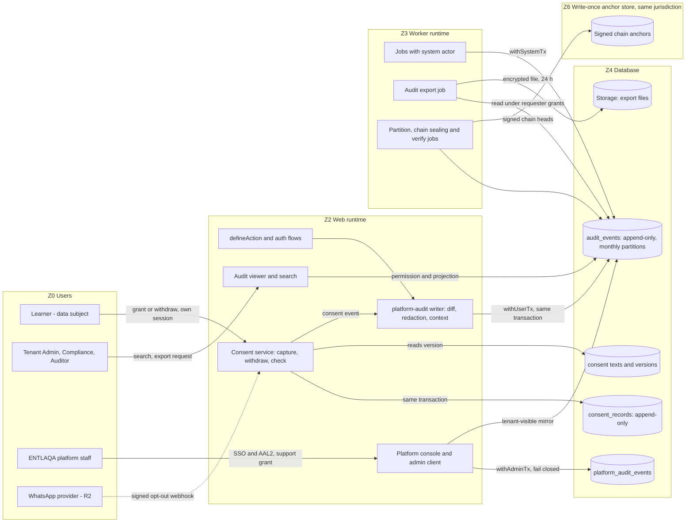

# Threat model TM-0005 — Audit & consent (`EP-M2-AUD`)

| | |
|---|---|
| **Backlog** | T-M1-C02 (Track C, M1 Foundation) — per-epic threat model |
| **Epic** | `EP-M2-AUD` — Audit & consent (M2) |
| **Features** | **AUD-01** Audit trail (FR-AUD-01, R1) · **AUD-05** Consent management (FR-AUD-05, R1); boundaries with FR-AUD-02/03/04 |
| **Template** | Development Plan Appendix D (extended, same section structure as TM-0001) |
| **Version** | 0.1 — 3 Oct 2026 |
| **Status** | Proposed (awaiting Tech Lead review and PO merge) |
| **Owner** | Security Lead (Claude agent) |
| **Reviewers** | Tech Lead (Claude agent), Product Owner; Legal counsel for the L-AUD items (§10) |
| **Inputs** | BRD v2.1 FR-AUD-01, FR-AUD-05 (boundaries with FR-AUD-02/03/04), FR-ADM-14, FR-ADM-17, FR-ATT-03, FR-NTF-03, §6.23 AI principles, §10.3 DR-2/5/6, §12.2, App. B, App. E; Development Plan §4.2, §6.4, §8.3, App. D; ADR 0002 §6a/§7, ADR 0003 §6, ADR 0009 §1–2, §7; data model §1.4, §1.12, §2.1, §2.3, §2.5, Q7 |
| **Parent** | [TM-0001](TM-0001-platform.md) — this model **inherits every TM-0001 mitigation** and cites its IDs (T-nn, F-nn, EP-nn, TB-n, A-nn, RR-nn) instead of repeating them. Main inherited threats: T-07, T-19, T-29, T-30, T-31, T-35, T-37, T-43, T-48, F-01, F-08 |
| **Related** | Sibling M2 models [TM-0002](TM-0002-tenancy-onboarding.md) (TEN: console, support grants) · [TM-0003](TM-0003-identity-roles.md) (IAM: auth security events) · [TM-0004](TM-0004-people-directory.md) (PEO) · [TM-0006](TM-0006-shell-notifications.md) (SHELL) · [`../risk-register.md`](../risk-register.md) (R-11, R-19, R-27, R-29, R-43…R-45) · [`../asvs-l2-mapping.md`](../asvs-l2-mapping.md) (V16, V14) · [`../secure-coding-standard.md`](../secure-coding-standard.md) (SCS-6, SCS-15, SCS-18) |
| **ID scheme** | Threats `T-AUD-NN` · findings `F-AUD-NN` · abuse cases `AB-AUD-NN` · residual risks `RR-AUD-NN` · legal-validation items `L-AUD-NN` · entry points `EA-NN` · stories `S-n` · register rows `R-NN` (common scheme of TM-0002…TM-0006; TM-0001 uses unprefixed `T-NN`/`F-NN`). BRD feature IDs (`AUD-01`, `AUD-05`) and requirements (`FR-AUD-…`) keep their BRD form and are never used as threat IDs |

---

## 1. Scope

### 1.1 In scope (M2)

- **Audit trail (FR-AUD-01):** the `platform-audit` package (today `packages/platform-db/src/audit.ts`), event catalog, before/after diff builder with field-classification redaction, sensitive-read helper; `platform.audit_events` expanded to the data model §2.5 shape (actor type, on-behalf-of, support grant, IP, device, diff, reason, correlation id, AI flag) with **monthly partitions**; tamper evidence (hash chain + external anchor, TM-0001 F-08); `platform.platform_audit_events` (data model §2.1) for console, admin-client and provisioning actions.
- **Audit consumers:** audit viewer and search, audit export ("searchable and exportable", FR-AUD-01 — R1 even though tenant data export FR-AUD-02 is R2), admin home "last 10 audit events" (FR-ADM-14).
- **Platform staff audit:** dual-identity events for impersonation/support grants (ADR 0003 §6, FR-ADM-17). The grant mechanism itself is threat-modelled with `EP-M2-TEN` ([TM-0002](TM-0002-tenancy-onboarding.md), ADM-17); this model covers how it is recorded.
- **Consent (FR-AUD-05):** `platform.consent_records` (append-only) and view `consents_current` (data model §2.3), versioned consent texts (AR/EN), capture UI, withdrawal, the consent-check service API used by consumers (geo check-in M5, photos/recordings, WhatsApp R2, AI processing R2), consent evidence report.
- **Audit retention mechanics:** partition lifecycle, legal hold hooks, tenant offboarding of audit data.

### 1.2 Out of scope

- Tenant data export (FR-AUD-02, R2), retention-policy engine (FR-AUD-03, R3), data subject requests (FR-AUD-04, R2) — but the M2 design must not block them (crypto-shredding / redaction decision F-08).
- Enforcement of consent **inside** each consumer (attendance, notifications, AI): owned by those epics' threat models; this model defines the contract they must follow (§9, S-9).
- Operational telemetry (ADR 0009; TM-0001 T-37).

### 1.3 Already implemented (M1, verified 3 Oct 2026)

| Control | Where | Evidence | Gap carried into this model |
|---|---|---|---|
| Append-only: no `UPDATE`/`DELETE` grants; `BEFORE UPDATE OR DELETE` trigger `audit_events_append_only` raises for every role | `supabase/migrations/20260930120300_platform__audit_events.sql` | `supabase/tests/10_catalog.sql` (grants, trigger enabled, update/delete fail), `20_isolation.sql` | No `TRUNCATE` trigger; table owner can disable the trigger or drop the table (T-AUD-05, T-AUD-07) |
| RLS: `ENABLE` + `FORCE`; RESTRICTIVE `tenant_isolation` | same migration | `20_isolation.sql` (insert with tenant B rejected) | Permissive `audit_events_read` is `using (true)`: every member of the tenant can read the whole tenant log at the DB layer; `platform.audit.read` is only a comment (T-AUD-19) |
| Actor binding: insert policy requires `actor_user_id` = verified `sub`, `actor_person_id` = claim `person_id`, `impersonator_user_id IS NULL` | same migration | `20_isolation.sql` (forged actor/person rejected; own actor accepted) | `occurred_at`, `id`, `entity_*`, `request_id`, `data` are client-settable; no `actor_type` (T-AUD-06, T-AUD-11, T-AUD-17) |
| Write API inside the business transaction | `packages/platform-db/src/audit.ts` (`insertAuditEvent`); `platform-rbac` `defineAction` writes the declared record after the handler, inside `withUserTx` → an audit failure rolls the change back (fail closed) | `audit.test.ts`, `define-action.test.ts` | `audit` hook is optional; `request_id` never written; no IP/device/diff; denied attempts not recorded (T-AUD-13, T-AUD-14, T-AUD-17) |
| Authorization runtime | `platform-rbac/src/default-runtime.ts`: `loadGrants()` returns `[]` (deny all) | `default-runtime.test.ts` | No tenant action — including any audit reader — can be authorized until M2 RBAC lands |
| Sign-in / sign-out events | `platform-identity/src/auth-flow.ts`: `platform.auth.signed_in` after the tenant-claimed token is issued; `platform.auth.signed_out` fail-open with a warning log | `auth-flow.test.ts`, `with-user-tx.integration.test.ts` | `signed_in` is written in a separate transaction **after** the refreshed cookies carry the tenant claim → an audit failure leaves a signed-in session without an event (T-AUD-16). Failed sign-ins are operational warnings only (carry-over in `EP-M2-IAM`, TM-0003 T-IAM-25) |
| Provisioning event `platform.tenant.admin_provisioned` | `scripts/sql/provision-tenant.sql` (run by the migration role via the *Provision organization* workflow) | `00_helpers_and_fixtures.sql` | Actor `NULL`; no operator, workflow-run or approver attribution (T-AUD-15) |
| Admin client | `platform-db/src/admin/index.ts` `withAdminTx`: requires reason + actor, sets `jadarat.admin_reason/actor` | `admin/index.test.ts` | Nothing persists them (TODO in code) (T-AUD-15) |
| **Not yet built** | — | — | Partitions, hash chain/anchor, `platform_audit_events`, `platform-audit` package, viewer/search/export, impersonation claim kind, sensitive-read audit, **all consent features** |

---

## 2. Assets

| ID | Asset | Class (TM-0001 §2.1) | Where | Why it matters |
|---|---|---|---|---|
| AA-01 | Tenant audit trail (= TM-0001 A-11) | C3, integrity-critical | `platform.audit_events` | Accountability, non-repudiation (FR-AUD-01); evidence for regulators and customers' auditors (NCA, SAMA) |
| AA-02 | Platform audit trail: console, impersonation, admin-client, provisioning | C3 (staff identities, tenant ids) | `platform.platform_audit_events` | Insider-abuse detection (R-11); tenant trust in ENTLAQA |
| AA-03 | Before/after diffs | C3; must **never** contain C4 plaintext (A-01…A-05) or secrets (A-06/A-07) | `before`/`after` jsonb | Largest personal-data leak channel of the audit log (T-35) |
| AA-04 | Request metadata: IP, device id, user-agent family, session id, AAL | C3 (personal data) | audit columns | Evidence quality vs. employee tracking and minimization |
| AA-05 | Chain heads, anchors and the anchor-signing key | Integrity-critical; key C4 (A-07) | DB + write-once store in the same jurisdiction | Tamper evidence against operators (RR-03) |
| AA-06 | Consent records and evidence | C3, regulatory evidence | `platform.consent_records` | Lawful basis for geo, photos/recordings, WhatsApp, AI (FR-AUD-05, §12.2) |
| AA-07 | Consent texts and versions (AR/EN) | C2, integrity-critical | versioned consent-text table | Proves *what* was consented to |
| AA-08 | Current consent state used by consumers | Integrity-critical decision input | `consents_current` | Wrong state = processing without consent |
| AA-09 | Audit exports | C4 aggregate | Storage (private bucket) | Mass disclosure (T-43) |
| AA-10 | Time source | Integrity | PostgreSQL clock (`now()`), host NTP | Ordering and dating of evidence (DR-2) |

## 3. Actors

TM-0001 §3 actors apply. Epic-specific roles:

| Actor | Role here | Threat motive |
|---|---|---|
| AC-TA Tenant Admin, Compliance (AC-CO), AC-AU Auditor | Read/search/export the audit log (App. B: Tenant Admin V, Compliance V, Auditor V; nobody edits) | Cover own tracks; over-export of personal data; snooping on colleagues' IP/device |
| AC-LR Learner / any person (data subject) | Gives and withdraws consent | Repudiation ("I never agreed"); victim of forged consent |
| AC-MG, AC-CO, AC-TA as **consent recorders** | Must not consent on someone's behalf | Forged or coerced consent to enable geo/WhatsApp |
| AC-PF Platform staff, DBA/operator | Console actions, support grants, DB access | Unattributed changes; tampering with the log |
| System actors (worker, `app_worker`) | Jobs that change data; partition/chain/export jobs | Unattributed effects (T-31); job failure → outage |
| AC-IN Messaging providers (R2) | Deliver opt-in/opt-out signals (WhatsApp `STOP`) | Forged or lost withdrawal |
| AC-EX / AC-MT | Inject content that is later rendered in the viewer or export | Log injection, viewer XSS, CSV formulas |

## 4. Entry points

| ID | Entry point | TM-0001 EP | Authentication | Release |
|---|---|---|---|---|
| EA-01 | Audit write path from `defineAction` (every server action) | EP-02, EP-03 | Session + verified claims | M1 (partial), M2 |
| EA-02 | Auth flows: sign-in, organization switch, sign-out, MFA, failed attempts | EP-04 | Varies | M1 (partial), M2 |
| EA-03 | Jobs via `withSystemTx` (system-actor claims) | EP-14 | `app_worker` + system claims | M2 |
| EA-04 | Platform console, support/impersonation grants, `withAdminTx`, Auth admin API | EP-13 | Staff SSO + AAL2 | M2 |
| EA-05 | Ops SQL: *Provision organization* and *DB deploy* workflows, SQL editor, `psql` | EP-16, EP-17 | GitHub environment + DB credentials | M1 |
| EA-06 | Audit viewer, search, admin-home widget (FR-ADM-14) | EP-01, EP-02 | Session + `platform.audit.read` | M2 |
| EA-07 | Audit export (async job → signed URL) | EP-02, EP-06, EP-14 | Session + `platform.audit.export` | M2 |
| EA-08 | Consent capture (profile privacy page, just-in-time prompt before geo check-in, onboarding) | EP-01, EP-02, EP-09 | Data subject's own session | M2 (UI), M5 (check-in prompt) |
| EA-09 | Consent withdrawal (same surfaces; WhatsApp `STOP`/opt-out webhook R2) | EP-02, EP-11 | Session / HMAC webhook | M2 / R2 |
| EA-10 | Consent-check service API used by consumers | in-process | Caller's transaction | M2 |
| EA-11 | Consent evidence report (per person, per purpose) | EP-02 | `platform.consent.read` | M2 |
| EA-12 | Maintenance jobs: partition creation, chain sealing, anchoring, verification, retention purge | EP-14 | `app_worker` / dedicated owner role | M2 (purge R3) |

## 5. Trust boundaries and data flow

TM-0001 boundaries TB-2, TB-3, TB-5, TB-6, TB-7, TB-9, TB-10 apply. Added:

| ID | Boundary | Crossing controls |
|---|---|---|
| TB-A1 | Committed audit/consent row ↔ everyone who can reach the database (app roles, owner, operators) | No update/delete/truncate for any app role; triggers; hash chain; anchor outside the DB |
| TB-A2 | Database ↔ write-once anchor store (same jurisdiction) | Signed anchors with a key the DB operators do not hold; object lock / WORM |
| TB-A3 | Data subject ↔ tenant (controller) ↔ ENTLAQA (processor) | Consent only from the subject's own session; tenant cannot edit records; ENTLAQA staff see consent only under a support grant |
| TB-A4 | Audit store ↔ readers (viewer, export, telemetry) | Permission + read-time projection of restricted fields; nothing from diffs to telemetry (ADR 0009 §7) |

**Key flows**
1. **Audited change:** `defineAction` → handler → `platform-audit` builds the diff from the classification registry (C4 redacted, secrets dropped) and adds context (request id, IP from trusted edge, device, AAL, session) → insert in the **same** `withUserTx` → commit or roll back together.
2. **Consent grant/withdraw:** subject's session → consent service reads the published text version → inserts `consent_records` row + audit event + outbox event `platform.consent.changed` in one transaction → consumers re-check at processing time.
3. **Consent check:** consumer calls `consent.require(tx, personId, purpose)` inside its own transaction; no current grant → deny (fail closed).
4. **Tamper evidence:** sealing job computes per-tenant chain segments over committed rows; anchoring job signs chain heads and writes them to the write-once store; verification job recomputes and alerts.

---

## 6. STRIDE analysis

**Rating.** Likelihood (L) and Impact (I) on the **1–5 scales of the [risk register §1](../risk-register.md#1-method)** (L: 1 rare … 5 almost certain; I: 1 negligible … 5 severe, where 5 = cross-tenant exposure or harm to many tenants), rated **inherent** as the register defines it: with only the controls already implemented (§1.3), before the listed planned mitigations. TM-0001 uses H/M/L; roughly 4–5 = H, 3 = M, 1–2 = L. Any cross-tenant exposure is an S1 incident regardless of rating.

**Status values** (shared by TM-0002…TM-0006). *Implemented* (control exists on `main` with a test) · *Partly implemented* (part exists; the gap is named) · *Planned (Mx / Rx / Suite)* (control defined and assigned to a milestone or release; not built yet) · *Open — decision <ID>* (needs a Tech Lead or PO decision, or legal validation — F-…, D-… or L-… items, §9, §10). Accepted residuals are listed in §8. A threat becomes *Verified* only when its verification passes in CI or a review record exists (security README §4.2).

Verification codes as in the ASVS mapping (U, RLS, I, E2E, SAST, CFG, DAST, M).

### 6.1 Spoofing

| ID | Threat | STRIDE | Entry point | L | I | Mitigation | Verification (test/CI/review) | Status |
|---|---|---|---|---|---|---|---|---|
| T-AUD-01 | Audit event attributed to someone else (server code or bug sets another user/person as actor) | S/R | EA-01 | 2 | 4 | Insert policy binds `actor_user_id`/`actor_person_id` to verified claims; writer takes actor only from `actorFromClaims` | RLS: `20_isolation.sql` forged actor/person rejected | Implemented |
| T-AUD-02 | Impersonation unattributed or self-asserted: staff acting under a support grant recorded as the tenant user only, or an `actor` claim set without a live grant (T-07) | S/R | EA-04 | 3 | 5 | Until a grant-bound claim kind exists, `impersonator_user_id` must be `NULL` (policy). M2: claim kind `act_as` accepted by `private.current_tenant_id()` only with a live, unexpired, unrevoked `support_grants` row for (staff, tenant, target user) (F-01 pattern); events carry `on_behalf_of_user_id` + `support_grant_id`, enforced by policy equality with the claim; grant start/stop/use mirrored into tenant audit | RLS: impersonator without claim rejected (exists); new: expired/revoked grant → zero rows and insert rejected; E2E: Tenant Admin sees staff + user + grant | Partly implemented |
| T-AUD-03 | Forged consent: coordinator/manager/admin records consent for a learner, or `person_id` is taken from input | S | EA-08 | 3 | 4 | Consent `grant` only from the subject's own session; `person_id` from verified claims, never an input field; no "consent on behalf" API in R1 (paper consent → decision F-AUD-06); RLS `with check (person_id = claim person_id)` for `granted` rows | RLS + I: insert for another person rejected; authz negative test for every role | Planned (M2) |
| T-AUD-04 | Forged or lost opt-in/opt-out from a channel (fake WhatsApp `STOP` or forged opt-in; unsigned opt-out link) | S/T | EA-09 | 2 | 3 | Provider webhooks verified (T-08); tenant from the connection; opt-out links signed, single-use (SCS-12); channel opt-in never implies other purposes | Contract tests (bad signature, replay) | Planned (R2) |

### 6.2 Tampering

| ID | Threat | STRIDE | Entry point | L | I | Mitigation | Verification (test/CI/review) | Status |
|---|---|---|---|---|---|---|---|---|
| T-AUD-05 | Committed audit/consent rows modified or removed by an app role; `TRUNCATE` not covered by the row trigger | T/R | EA-01, EA-05 | 3 | 5 | No `UPDATE`/`DELETE`/`TRUNCATE` grants; row trigger (exists) **plus** `BEFORE TRUNCATE` statement trigger; same pattern on every partition and on `consent_records`, `platform_audit_events`; CI catalog check covers partitions | RLS/catalog tests: update/delete fail (exist); new: truncate fails, every partition has the triggers | Partly implemented |
| T-AUD-06 | Back-/forward-dated or reordered events: insert supplies `occurred_at` or `id` (allowed today) | T | EA-01 | 3 | 3 | `BEFORE INSERT` trigger overwrites `occurred_at := now()` and `id` (or column-level `INSERT` grants excluding them); per-tenant monotonic `seq` (identity) for ordering | RLS test: supplied `occurred_at` is ignored | Open — decision F-AUD-01 |
| T-AUD-07 | Operator/DBA or compromised migration role disables the trigger, edits rows, drops a partition (T-19, RR-03) | T/R | EA-05 | 2 | 5 | Per-tenant hash chain (`seq`, `prev_hash`, `row_hash` over canonical JSON, RFC 8785) sealed by job; signed anchors in a write-once store in the same jurisdiction with a key DB operators do not hold; verification job + alert; DDL event trigger / DB session logging records `DISABLE TRIGGER`, `DROP`, `ALTER` on audit tables; dashboard access least-privilege | Chain-verification job test (tamper one row → alert); drill before G2 | Planned (M2); anchor store Open — decision F-AUD-02 |
| T-AUD-08 | Chain design breaks: concurrent inserts race, non-canonical JSON, partition drop indistinguishable from tampering, lock contention | T/D | EA-12 | 3 | 3 | Seal asynchronously per tenant (batch, ordered by `seq`) instead of per-row locks; canonical serialization; retention purge writes a signed "segment purged" marker in `platform_audit_events` before dropping | U (canonicalization vectors), I (parallel inserts, purge marker) | Open — decision F-AUD-02 |
| T-AUD-09 | Fabricated business events: any code holding a user transaction can insert arbitrary `action`/`entity` rows for its own actor | T/R | EA-01 | 2 | 3 | Only `platform-audit` may import the table (dependency-cruiser + Semgrep); action codes from a registered catalog (unknown → reject); later insert only via a `private` function, `INSERT` revoked from `authenticated` | CI rule test; U: unknown action rejected | Planned (M2) |
| T-AUD-10 | Consent evidence altered: rows updated/deleted, text edited after acceptance, `policy_version` pointing at mutable text | T/R | EA-08, EA-11 | 3 | 4 | `consent_records` [ao] like T-AUD-05; consent texts immutable once published (new version = new row), record stores `text_sha256` + locale; `consents_current` is a `security_invoker` view | RLS: update/delete/truncate fail; U: hash of rendered text equals stored hash | Planned (M2) |
| T-AUD-11 | Log injection: CR/LF, HTML, CSV formulas, Unicode bidi overrides in `entity_id`, `reason`, names inside diffs → spoofed viewer lines, XSS, formula execution in exports | T/I | EA-01, EA-06, EA-07 | 3 | 3 | `action` regex CHECK (exists); add CHECKs on `entity_type` (same style), `entity_id` (`^[A-Za-z0-9._:-]{1,128}$`), `reason` length ≤ 500 without control characters; diffs only from the typed builder; viewer renders text only with bidi isolation and visible marking of bidi controls; export escaping (SCS-6.6); operational logs structured JSON only (V16.4) | U: payload corpus (AR/EN, bidi, CRLF, `=HYPERLINK`); E2E viewer; export test | Partly implemented |
| T-AUD-12 | Unreliable time: app/client clocks used, DB host drift, sovereign hosts without trusted time, timezone confusion | T/R | EA-01, EA-08 | 2 | 3 | Database clock only (`now()`), never app or client time; UTC storage (DR-2), Hijri/Gregorian only at display; NTP on DB hosts with drift alert; anchors carry their own timestamp; trusted timestamping (RFC 3161, in-country TSA) evaluated for R3 sovereign | CFG/monitoring check; RLS test with T-AUD-06 | Partly implemented |
| T-AUD-13 | Retention purge abused to destroy evidence (early partition drop, purge despite legal hold, tenant deletion cascading to audit) | T/R | EA-12 | 2 | 4 | Purge only by a reviewed platform operation owned by a dedicated role, at max(contract retention, legal hold); per-tenant earlier deletion by crypto-shredding/anonymization, not row delete (F-08); FK to `tenants` without cascade (exists); offboarding exports the audit log first; purge marker (T-AUD-08) | I: purge refused under legal hold; review of purge function | Planned (M2 mechanics; FR-AUD-03 R3) |

### 6.3 Repudiation

| ID | Threat | STRIDE | Entry point | L | I | Mitigation | Verification (test/CI/review) | Status |
|---|---|---|---|---|---|---|---|---|
| T-AUD-14 | Incomplete coverage: mutating actions without audit (`audit` hook optional), bulk operations, direct module writes, job effects (T-29, T-31) | R | EA-01, EA-03 | 4 | 4 | Permission metadata declares audit mode; `defineAction` **requires** an audit record for every non-read permission (explicit `audit: none` only from a reviewed allow-list); bulk jobs write one batch event + per-row events; `withSystemTx` jobs record `actor_type = system`, job id, initiator | CI gate: every mutating permission maps to a catalog action; `expectAudit` in every action test | Partly implemented |
| T-AUD-15 | Unattributed platform operations: `withAdminTx` persists nothing; provisioning event has no operator; SQL editor sessions (T-30) | R | EA-04, EA-05 | 4 | 4 | `withAdminTx` writes `platform_audit_events` (staff id, reason, ticket, affected tenants) in the same transaction — fail closed; tenant-visible mirror for actions affecting a tenant; provisioning workflow records GitHub run id and approver in `data`; break-glass access recorded | I: admin op without audit row impossible; review of workflow | Open — decision F-AUD-05 |
| T-AUD-16 | Sign-in recorded only after the tenant-claimed session exists (partial fail-open) | R | EA-02 | 2 | 3 | On `signed_in` audit failure: revoke the session (`signOut local`) and return an error, or write the event before the token refresh in the tenant-switch transaction | U: audit failure → no tenant session | Open — decision F-AUD-04 |
| T-AUD-17 | Events lack evidential context: no request id, IP, device, AAL, auth method, session id, actor type | R | EA-01–03 | 4 | 3 | Writer reads `RequestContext` (request id from trusted proxy, ADR 0009 §1); IP only from the trusted edge header (T-04); device id = server-set cookie hash; UA family only; AAL + session id from claims; columns per data model §2.5 | U/I: every event has these fields; spoofed `X-Forwarded-For` ignored | Partly implemented (`request_id` column unused) |
| T-AUD-18 | Denied and failed attempts leave no trace (denial rolls back the transaction; failed sign-in has no tenant) | R | EA-01, EA-02 | 4 | 3 | Denials (403/404/AAL2) written in a separate short transaction, aggregated per actor + permission per minute; also security log events (V16.3); failed sign-ins → platform security events (`EP-M2-IAM`) | I: denied action produces one aggregated event | Planned (M2) |
| T-AUD-19 | Consent repudiation: subject denies consent; tenant cannot show which text, version, language or channel was used | R | EA-08, EA-11 | 3 | 4 | Record purpose, action, `policy_version`, `text_sha256`, locale, channel, surface, DB time, session id, AAL; evidence report renders the exact stored text; optional receipt in the inbox | E2E AR/EN: grant → evidence report shows identical text and hash | Planned (M2) |

### 6.4 Information disclosure

| ID | Threat | STRIDE | Entry point | L | I | Mitigation | Verification (test/CI/review) | Status |
|---|---|---|---|---|---|---|---|---|
| T-AUD-20 | Over-broad read at DB layer: `audit_events_read using (true)` → any tenant member reads the whole log through any query bug | I | EA-06 | 3 | 4 | Read policy requires `private.has_permission('platform.audit.read')` (or own rows only) once RBAC tables exist; viewer action `platform.audit.read` (high-risk, AAL2) | RLS: learner reads zero rows; authz negative tests per App. B role | Open — decision F-AUD-01 |
| T-AUD-21 | C4 data or secrets in diffs (national ID, health notes, geo, tokens, connector credentials) (T-35) | I | EA-01 | 4 | 4 | Diff builder driven by the classification registry (data model §1.12): `secret` → never stored (`"changed": true` only); C4 → `"[restricted]"` or ciphertext under a per-person key (F-08); changed fields only; `data`/`before`/`after` ≤ 16 KB each | U per entity type; CI check: every C4/secret column has a registry entry | Planned (M2) |
| T-AUD-22 | Viewer/export reveals restricted values to roles without the restricted permission, or exports another tenant's rows | I | EA-06, EA-07 | 3 | 4 | Read-time projection by the requester's permissions; export job runs under the requester's tenant and grant snapshot; encrypted file, signed URL ≤ 5 min, file expiry 24 h; export of the audit log is itself audited (T-43) | I: Auditor export has no restricted values; cross-tenant export test | Planned (M2) |
| T-AUD-23 | Audit metadata enables employee tracking (IP, device, timestamps visible to managers) | I | EA-06 | 3 | 3 | IP/device visible only to Tenant Admin, Compliance, Auditor; managers see no audit log (App. B); UA family only; retention per L-AUD-03 | Authz negative tests | Planned (M2); retention Open — decision L-AUD-03 |
| T-AUD-24 | Sensitive reads not audited: C4 viewed by a non-subject without trace (TM-0001 §2.1 C4 rule) | I/R | EA-01, EA-06 | 4 | 4 | `withSensitiveRead` in `platform-audit`: restricted projection writes `*.sensitive_read` (entity ids + field names, never values) in the same transaction, **fail closed**; lists aggregated (count + first 50 ids); every export audited | I: read without audit write returns no data | Planned (M2) |
| T-AUD-25 | Diffs or consent evidence leak into telemetry (errors, traces) (T-37) | I | EA-01 | 3 | 3 | ADR 0009 §7: no diffs in telemetry; writer errors logged with code + correlation id only | CI PII scan of E2E logs (ADR 0009) | Planned (M2) |
| T-AUD-26 | Consent status disclosed to managers (who refused geo/WhatsApp) → pressure or retaliation | I | EA-11 | 2 | 3 | Consent records readable only by the subject and roles with `platform.consent.read` (HR, Compliance, Tenant Admin); consumers show the effect ("location not used"), not the reason | Authz negative tests (manager, instructor) | Planned (M2) |

### 6.5 Denial of service

| ID | Threat | STRIDE | Entry point | L | I | Mitigation | Verification (test/CI/review) | Status |
|---|---|---|---|---|---|---|---|---|
| T-AUD-27 | Fail-closed audit becomes an outage: missing future partition, chain lock contention, oversized payloads | D | EA-01, EA-12 | 3 | 4 | Partitions created ≥ 3 months ahead by a job; `DEFAULT` partition as safety net + alert if non-empty or < 2 future partitions; asynchronous sealing (T-AUD-08); size caps (T-AUD-21) | I: insert beyond last partition lands in default + alert fires | Planned (M2) |
| T-AUD-28 | Expensive searches/exports by one tenant degrade others (T-48) | D | EA-06, EA-07 | 3 | 3 | Mandatory date range (≤ 93 days interactive) for partition pruning; allow-listed filters, keyset pagination, `statement_timeout`; exports async, 1 concurrent per tenant, 5/hour (SCS-16) | k6 later; I: unbounded query rejected | Planned (M2) |
| T-AUD-29 | Audit flooding (mass denied attempts, scripted reads) to bury activity or bloat storage | D/R | EA-01 | 3 | 2 | Denial aggregation (T-AUD-18); rate limits; per-tenant audit volume metric + anomaly alert (NFR-OBS-02) | Alert test | Planned (M2) |

### 6.6 Elevation of privilege

| ID | Threat | STRIDE | Entry point | L | I | Mitigation | Verification (test/CI/review) | Status |
|---|---|---|---|---|---|---|---|---|
| T-AUD-30 | Tenant admin disables or narrows auditing/consent requirements to hide actions (e.g., turns geo-fencing on without consent) | E/R | EA-06, EA-08 | 3 | 3 | No tenant setting can disable auditing ("not editable by any tenant role", FR-AUD-01); consent requirement per purpose is platform-fixed, not tenant-configurable; changes to roles, `platform.audit.*` grants and consent-relevant settings are audited and need AAL2 (T-56) | Authz + audit assertions | Planned (M2) |
| T-AUD-31 | Consent bypass by a consumer: geo stored, WhatsApp sent or AI run without a current grant (stale cache, race with withdrawal, default-on, new consumer forgets the check) | E/I | EA-10 | 4 | 4 | Single `consent.require(tx, personId, purpose)` read in the consumer's transaction; unknown purpose / no record → deny; DB guard on consumer tables (e.g., trigger on `checkin_events` rejecting geo columns without a current `geo_checkin` grant, data model §3.4); notifications re-check at send time; withdrawal event via outbox | RLS/I per purpose; CI: every purpose has a consumer test | Planned (M2 service; M5 geo; R2 WhatsApp/AI) |
| T-AUD-32 | Invalid consent: bundled, pre-ticked, a condition for using the product, or not refreshed after a material text change; employment power imbalance | E (legal basis) | EA-08 | 3 | 4 | One purpose per toggle, unticked, optional with a working alternative (QR without geo, manual attendance); re-consent on major version; legal basis per purpose decided by counsel (L-AUD-01) | M (privacy review); E2E: refusing consent keeps the alternative path | Open — decision L-AUD-01 |
| T-AUD-33 | Withdrawal ineffective: hard to find, not propagated to queued work or sub-processors | E/I | EA-09 | 3 | 4 | Withdraw on the same screen as grant (≤ 2 actions); effective immediately for new processing; outbox event cancels queued jobs; provider opt-out sync (R2); treatment of already collected data per L-AUD-02 | E2E: withdraw → next check-in stores no geo | Planned (M2) |

**Count:** 33 threats (4 spoofing, 9 tampering, 6 repudiation, 7 information disclosure, 3 denial of service, 4 elevation of privilege).

### 6.7 Audit write-failure policy (fail closed vs fail open)

| Event class | Behaviour | Status |
|---|---|---|
| Mutations via `defineAction` | **Fail closed:** audit insert in the same transaction; failure rolls back the change | Implemented |
| Sensitive reads and exports | **Fail closed:** no data returned or file produced without the audit row | Planned (M2) |
| Admin-client / console operations | **Fail closed** (same transaction as the operation) | Open — decision F-AUD-05 (T-AUD-15) |
| Sign-in | **Fail closed:** no tenant session without `signed_in` | Open — decision F-AUD-04 (T-AUD-16) |
| Sign-out | **Fail open:** never block sign-out; warning log | Implemented (fail open accepted, RR-AUD-05) |
| Denied attempts | **Fail open:** best-effort separate transaction + security log | Planned (M2) |
| Consent grant/withdrawal | Atomic: consent row, audit row and outbox event in one transaction; a withdrawal must never be blocked by downstream consumers | Planned (M2) |
| Jobs | Fail closed per job; retry and dead-letter (ADR 0004/0005) | Planned (M2) |

---

## 7. Abuse cases

| ID | Abuse case | Actor | Threats | Expected system behaviour / test |
|---|---|---|---|---|
| AB-AUD-01 | Tenant Admin approves own training budget, then tries to remove the trace | AC-TA | T-AUD-05, T-AUD-30 | No UI/API to edit or delete; DB rejects update/delete/truncate; the approval stays visible to the Auditor |
| AB-AUD-02 | A bug or crafted insert back-dates an audit row to before an incident | AC-DV / AC-EX | T-AUD-06 | `occurred_at` overwritten with DB time; `seq` keeps order |
| AB-AUD-03 | DBA disables the append-only trigger and edits a row | AC-PF | T-AUD-07 | Chain verification fails at next run; alert; DDL logged; anchor proves the original head |
| AB-AUD-04 | Support engineer under a grant changes an attendance record | AC-PF | T-AUD-02, T-AUD-15 | Event shows staff id, impersonated user and grant id; Tenant Admin sees it; expired grant → request denied |
| AB-AUD-05 | Auditor exports 12 months of audit including HR diffs of national-ID changes | AC-AU | T-AUD-21, T-AUD-22 | Diffs show `[restricted]`; export audited; signed URL expires |
| AB-AUD-06 | Learner (or a server-side query bug) lists the tenant's audit log | AC-LR | T-AUD-20 | RLS returns zero rows without `platform.audit.read`; action returns 404/403 |
| AB-AUD-07 | Coordinator clicks "consent" for 200 learners so geo-fencing works on day one | AC-CO | T-AUD-03 | No API exists; RLS rejects consent rows for another person |
| AB-AUD-08 | Learner withdraws geo consent, then checks in two minutes later | AC-LR | T-AUD-31, T-AUD-33 | Check-in accepted via QR; no geo stored (DB guard); instructor sees "location not used", not why |
| AB-AUD-09 | Tenant edits the consent text after 500 people accepted | AC-TA | T-AUD-10, T-AUD-32 | Published texts immutable; a new version prompts re-consent; old records keep the old hash |
| AB-AUD-10 | Course title `=HYPERLINK("http://evil")` with a bidi override appears in an audit diff export | AC-MT | T-AUD-11 | Export cell escaped; viewer isolates bidi and marks control characters |
| AB-AUD-11 | Partition job fails over a month boundary | System | T-AUD-27 | Inserts go to the default partition; alert fires; no outage |
| AB-AUD-12 | Attacker scripts 10,000 denied requests to bury a real action | AC-EX | T-AUD-18, T-AUD-29 | Denials aggregated; volume alert; real event still searchable by entity |
| AB-AUD-13 | Regulator asks a tenant to prove that person X agreed to location tracking on date Y | Regulator via AC-TA | T-AUD-19 | Evidence report: purpose, version, AR/EN text, hash, channel, DB time, session, later withdrawals |

## 8. Residual risks and owners

| ID | Residual risk | Why it remains | Owner | Treatment |
|---|---|---|---|---|
| RR-AUD-01 | An operator with DB superuser rights can alter rows before the next anchor | Anchoring is periodic | PO + Security Lead | Anchor interval ≤ 24 h (tune); DDL logging; access reviews; inherits TM-0001 RR-03 |
| RR-AUD-02 | List-view reads are audited in aggregate, not per record | Volume and cost | Security Lead | Count + first 50 ids; full per-record audit for C4 detail views and exports |
| RR-AUD-03 | Validity of employee consent (power imbalance) unconfirmed | Legal question | PO + Legal | L-AUD-01 before the first tenant uses geo-fencing (M5) |
| RR-AUD-04 | IP and device id identify a network/browser, not a person | Technical limits | Tech Lead | Combine with session id + AAL; document evidential limits for customers |
| RR-AUD-05 | Sign-out events can be missing (fail-open by design) | Availability over evidence | PO (accepts) | Session expiry still bounds the session; documented |
| RR-AUD-06 | DB clock trusted; no qualified timestamps in R1 | Scope | Tech Lead | NTP monitoring; RFC 3161 TSA evaluated for sovereign (R3) |
| RR-AUD-07 | Immutable audit vs erasure until F-08 is decided | Pending decision | Tech Lead + Legal | Inherits R-29 |

## 9. Findings for the Tech Lead (proposed; nothing decided here)

| ID | Finding | Recommendation |
|---|---|---|
| F-AUD-01 | M1 audit migration gaps: no `TRUNCATE` trigger; `occurred_at`/`id` client-settable; no CHECKs on `entity_type`/`entity_id`/size; read policy `using (true)`; `request_id` never written | Fix in the first `EP-M2-AUD` migration (additive, before partitioning — data model §1.14) with pgTAP tests |
| F-AUD-02 | Hash-chain and anchor design undecided (TM-0001 F-08) | New ADR (next free number): asynchronous per-tenant sealing, canonical JSON (RFC 8785), signed anchors to object-locked storage in the deployment's jurisdiction (SaaS and sovereign variants), verification cadence, purge markers, crypto-shredding vs redaction |
| F-AUD-03 | Impersonation needs a validated claim kind | Extend ADR 0002 §6a with `act_as` claims bound to a live `support_grants` row; policy equality for `on_behalf_of_user_id`/`support_grant_id` |
| F-AUD-04 | Fail-closed/open behaviour is implicit | Adopt §6.7 as the rule in SCS-15; fix sign-in (T-AUD-16) |
| F-AUD-05 | Platform operations have no audit sink | Build `platform_audit_events` + `withAdminTx` write (fail closed) + tenant-visible mirror before any console feature ships |
| F-AUD-06 | Paper/offline consent (e.g., staff without devices) has no defined path | PO decision: not supported in R1 (recommended), or a separate `recorded_by_admin` action requiring an uploaded signed form, reason and AAL2, flagged in reports |

## 10. Legal validation items (do not implement figures without counsel)

| ID | Question | Jurisdictions |
|---|---|---|
| L-AUD-01 | Lawful basis per purpose (geo at check-in, photos/recordings, WhatsApp, AI processing) for employees: is consent required and valid, or is another basis more appropriate? | KSA PDPL, UAE PDPL, Egypt PDPL 151/2020 (BRD §12.2, App. E) |
| L-AUD-02 | On withdrawal: delete, anonymize or keep data collected before withdrawal (e.g., attendance geo used as regulatory evidence)? | Same |
| L-AUD-03 | Audit-log retention default (data model Q7 proposes 7 years) and retention of IP/device metadata and consent evidence | Same + sector rules (SAMA, NCA) |
| L-AUD-04 | Required content of consent notices and form of evidence (e.g., written/electronic, language) | Same |
| L-AUD-05 | Whether health-adjacent data in absence evidence (A-05) needs explicit consent | Same |

## 11. Risk-register rows

Added to the [risk register](../risk-register.md) §3 on 3 Oct 2026 (v0.2), together with the proposals of the sibling M2 models; duplicates were merged, so one row can cover threats from several models. Scores, owners, mitigations and review dates are maintained **only in the register**.

| Register | Risk (short) | Threats / items from this model |
|---|---|---|
| R-41 | Over-broad reads of personal data inside a tenant (audit log, IP/device metadata, exports) | T-AUD-20, 22, 23 |
| R-43 | Audit-trail completeness gaps | T-AUD-14, 15, 16, 18, 24 |
| R-44 | Fail-closed audit causes an outage | T-AUD-08, 27 |
| R-45 | Invalid or bypassed consent | T-AUD-03, 04, 10, 31, 32, 33; L-AUD-01, 02 |

Existing rows updated: **R-11** (T-AUD-02, T-AUD-15) · **R-19** (T-AUD-21, T-AUD-25) · **R-27** (consent → R-45) · **R-29** → *Treating* (append-only guard implemented and tested, §1.3; T-AUD-05, 07, 08, 13; F-AUD-02; L-AUD-03).

## 12. Requirements for the stories (acceptance criteria)

Every story also meets DoD §4.2 (RLS tests for new tables, authorization negative tests, AR + EN E2E, accessibility, audit events).

| Story | Acceptance criteria |
|---|---|
| S-1 Harden and expand `audit_events` (F-AUD-01) | Columns per data model §2.5 plus `seq` and `actor_type`; `occurred_at`/`id` set by the DB whatever the insert supplies; `UPDATE`/`DELETE`/`TRUNCATE` fail for every role on the parent and every partition; CHECKs on `action`, `entity_type`, `entity_id`, `reason`, jsonb sizes; read policy requires `platform.audit.read` (learner reads 0 rows); passes `pnpm db:test` and `pnpm db:test:hosted-sim` |
| S-2 Monthly partitions | Partitions exist ≥ 3 months ahead; default partition exists; alert when the default partition has rows or < 2 future partitions; catalog test covers triggers/RLS on each partition |
| S-3 `platform-audit` writer | Only package allowed to write audit tables (dependency-cruiser + Semgrep); unknown action code rejected; every event has request id, actor type, session id, AAL, IP (trusted edge only), device id, UA family; diff contains changed fields only; `secret` fields never stored; C4 fields `[restricted]` (or encrypted per F-08); spoofed `X-Forwarded-For` ignored |
| S-4 Coverage | `defineAction` refuses to build a mutating action without an audit declaration (or reviewed `none`); CI gate maps every mutating permission to a catalog action; `expectAudit` in every action test; denied attempts produce one aggregated event per actor + permission per minute; sign-in without a `signed_in` row leaves no tenant session (T-AUD-16) |
| S-5 Sensitive reads | Reading any C4 projection writes `*.sensitive_read` (ids + field names, no values) in the same transaction; if the write fails, no data is returned; lists record count + first 50 ids |
| S-6 Platform and impersonation audit | `withAdminTx` cannot commit without a `platform_audit_events` row (staff id, reason, ticket, tenants); provisioning records workflow run id + approver; events under a support grant carry `on_behalf_of_user_id` + `support_grant_id`, rejected by RLS without a live grant; grant start/stop visible to the Tenant Admin |
| S-7 Viewer, search, export | Only Tenant Admin, Compliance, Auditor (App. B) — others get 404/403 (negative tests); date range required (≤ 93 days interactive); filters allow-listed; keyset pagination; values rendered as text with bidi isolation; export async, encrypted, signed URL ≤ 5 min, file expires 24 h, CSV/XLSX formula escaping, restricted values projected, export audited, 5/hour; admin-home widget (FR-ADM-14) uses the same projection |
| S-8 Tamper evidence | Sealing job builds per-tenant chain over `seq`; anchoring job writes signed heads to write-once storage in the same jurisdiction; verification job alerts on any mismatch (tested by tampering a row as superuser in CI); runbook for alert response |
| S-9 Consent records and service | `consent_records` [ao] with purpose (`whatsapp`, `geo_checkin`, `photo_recording`, `ai_processing`), action, `policy_version`, `text_sha256`, locale, channel, surface, session id; rows only for the caller's own `person_id`; `consents_current` is `security_invoker`; `consent.require(tx, personId, purpose)` denies on no/unknown/withdrawn record; consent change + audit + outbox event in one transaction |
| S-10 Consent UI (AR/EN) | Privacy page lists each purpose with plain-language text from the glossary/UX writer (not machine translation), unticked, one toggle per purpose, withdraw on the same screen in ≤ 2 actions; refusing keeps the alternative path working; new text version triggers re-consent; WCAG 2.2 AA; E2E AR + EN for grant, withdraw and re-consent |
| S-11 Consent evidence | Evidence report per person/purpose shows the exact stored text, hash, version, locale, channel, DB time and later withdrawals; readable only by the subject and `platform.consent.read` roles; managers and instructors denied (negative tests) |
| S-12 Consumer contract (for M5/R2 epics) | Each consumer calls `consent.require` in its own transaction; geo columns of `checkin_events` rejected by a DB guard without a current `geo_checkin` grant; notifications re-check at send time; a consumer test exists for every purpose |

## 13. ASVS 5.0 references

| ASVS section | Covered by |
|---|---|
| V16.1 Security logging documentation | §1.3, §6.7, ADR 0009 §7 (audit vs telemetry inventory) |
| V16.2 General logging (who/what/when/where, time source, correlation) | T-AUD-12, T-AUD-17, S-3 |
| V16.3 Security events (authentication, authorization failures, admin actions, impersonation) | T-AUD-02, T-AUD-14, T-AUD-15, T-AUD-16, T-AUD-18, S-4, S-6 |
| V16.4 Log protection (injection encoding, no modification, separate store) | T-AUD-05–T-AUD-11, T-AUD-13, S-1, S-8 |
| V16.5 Error handling (fail closed) | §6.7, T-AUD-27 |
| V8.4 Other authorization considerations (admin interfaces, impersonation) | T-AUD-02, T-AUD-15, T-AUD-20 |
| V14.1 / V14.2 Data protection (classification, minimization, consent) | T-AUD-21–T-AUD-26, T-AUD-31–T-AUD-33, S-9–S-12 |
| V1.2 / V1.3 Injection prevention and sanitization (CSV, bidi, rendering) | T-AUD-11, S-7 |

Requirement-level numbers are taken from the published ASVS 5.0.0 text when items are imported into the tracker (see the mapping's reading guide).

## 14. Maintenance, review and sign-off

- Update when: F-AUD-02/03 ADRs are decided; L-AUD-01…L-AUD-05 are answered; a new consent purpose or audit consumer is added; before Gate G2.
- A threat moves to *Verified* only when its verification item passes in CI or a review record exists in `docs/security/reviews/`.

| Role | Name | Date | Result |
|---|---|---|---|
| Author | Security Lead (Claude agent) | 3 Oct 2026 | Draft v0.1 |
| Tech Lead review | — | — | Pending |
| Legal counsel (L-AUD-01…L-AUD-05) | — | — | Pending (PO to arrange) |
| Product Owner approval | — | — | Pending (PR merge) |
