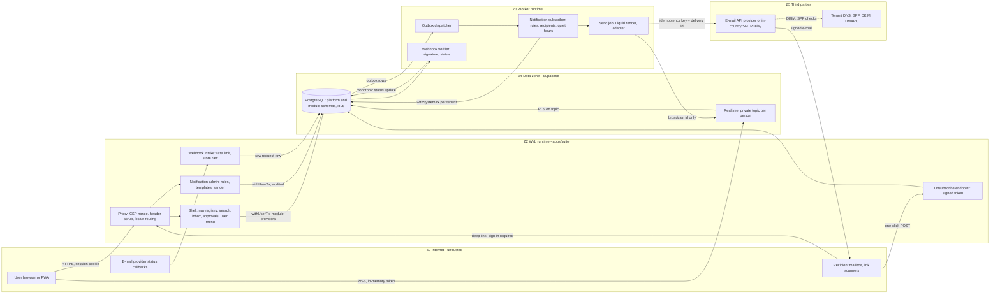

# Threat model TM-0006 — Suite shell, notifications, Hijri (EP-M2-SHELL)

| | |
|---|---|
| **Backlog** | T-M1-C02 (Track C, per-epic threat models) — epic `EP-M2-SHELL` |
| **Features** | STE-08 · NTF-01 · NTF-02 · NTF-07 · SCH-07 (FR-STE-08, FR-NTF-01, FR-NTF-02, FR-NTF-07, FR-SCH-07) |
| **Template** | Development Plan Appendix D (extended, same structure as TM-0001) |
| **Version** | 0.1 — 3 Oct 2026 |
| **Status** | Proposed (awaiting Tech Lead review and PO merge) |
| **Owner** | Security Lead (Claude agent) |
| **Reviewers** | Tech Lead (Claude agent), Product Owner |
| **Inputs** | BRD v2.1 §6.20 (FR-NTF-01…09, BR-NTF-1/2), FR-STE-08, FR-SCH-07, FR-MGR-02, FR-LRN-07, FR-AUD-05, FR-DEP-05, NFR-L10N-01…13, NFR-PERF-06, NFR-SEC-09, App. D, App. E; Development Plan v1.1 §6.4, §8, App. D; ADR 0001–0005, 0007, 0008, 0011; `docs/design/suite-shell.md` v1; code on `main` as of 3 Oct 2026 |
| **Related** | [TM-0001](TM-0001-platform.md) (threats T-nn, entry points EP-nn, boundaries TB-n, findings F-nn — referenced, not repeated) · [`../risk-register.md`](../risk-register.md) · [`../asvs-l2-mapping.md`](../asvs-l2-mapping.md) · [`../secure-coding-standard.md`](../secure-coding-standard.md) (SCS-n) |

---

## 1. Scope

### 1.1 In scope

| Feature | What this epic builds (security-relevant parts) | Rel |
|---|---|---|
| STE-08 | Platform shell (`packages/ui` + `platform-*`): navigation **registered by modules**, module switcher (incl. Jadarat LMS deep link), **global search across modules**, unified notification inbox, **unified approvals inbox** (container; decisions stay in each module), tenant/branch context chip, user menu (language, calendar, numerals, theme, notification preferences), PWA shell | R1 |
| NTF-01 | In-app notification centre: `platform.inbox_items`, Realtime broadcast on a private per-person topic, read/unread, filters, deep links, bulk mark-as-read | R1 |
| NTF-02 | E-mail channel: system + tenant-override templates (LiquidJS, ADR 0008 §3), branded bilingual layout, preview with sample data, per-tenant sender name, optional custom sending domain (SPF/DKIM), provider adapters (API provider in SaaS, SMTP relay in-country), provider status webhooks, delivery log (BR-NTF-2) | R1 |
| NTF-07 | Event catalog and tenant rules (recipients by role, channels, timing, recipient locale), quiet hours (night window, weekends, prayer windows, Jumu'ah), rate limits, outbox → subscriber → send-job pipeline (ADR 0004/0005/0008) | R1 |
| SCH-07 | Shared date capability in `platform-i18n`: Gregorian/Hijri (Umm al-Qura)/dual display and pickers, Hijri ↔ Gregorian conversion table, time-zone resolution, numerals, digit normalization (ADR 0007 §5–§8) | R1 |

### 1.2 Out of scope (inherited or covered elsewhere)

- Every platform control in TM-0001 applies unchanged (tenant isolation T-14/T-32, `defineAction` T-54/T-55, CSP/XSS T-40, outbox/queue T-24, logging T-37, data residency T-42, phishing via platform T-13, denial of wallet T-51). This model only adds threats specific to the shell, notifications and dates.
- Approval **decision** logic, approval-link tokens (T-10) and WhatsApp interactive replies: epics `EP-M4-ENR`/`EP-M4-MGR` (this epic only lists and dispatches to module approval providers). Reminders/digests (NTF-08): `EP-M4-LRN`, using this pipeline.
- WhatsApp, SMS, web push (NTF-03/04/05, R2), broadcasts (NTF-09, R2): R2 threat model; T-11/T-51 cover the cost side. Schemas built in R1 must not preclude those controls.
- Branding assets and Arabic-only mode configuration (ADM-07, DEP-05): `EP-M2-TEN`; consent records (AUD-05): `EP-M2-AUD`. Their **use** in the shell and e-mails is in scope here.
- Calendar feeds/.ics (FR-LRN-03): T-45; PWA offline caching: T-46.

### 1.3 Implementation baseline (verified in code, 3 Oct 2026)

| Area | What exists on `main` | What does not exist yet |
|---|---|---|
| Security headers / CSP | `apps/suite/src/proxy.ts` + `lib/security-headers.ts`: per-request 128-bit nonce; `script-src 'self' 'nonce-…' 'strict-dynamic'` (no `unsafe-inline`/`unsafe-eval` in production); `style-src` nonce in production; `object-src 'none'`; `frame-ancestors 'none'`; `frame-src 'none'`; `base-uri 'self'`; `form-action 'self'`; `connect-src` self + Supabase origin (HTTPS/WSS); `upgrade-insecure-requests` behind HTTPS; strict static CSP for `/_next/static`. Static headers: HSTS (no preload), `nosniff`, `X-Frame-Options: DENY`, `Referrer-Policy`, deny-all `Permissions-Policy`, COOP, CORP. Client-supplied `x-jadarat-*`/`x-nonce` headers scrubbed on every path. `private, no-store` on session-refresh responses. Tests: `proxy.test.ts`, `security-headers.test.ts` | CSP violation reporting (`report-to`), Trusted Types, open-redirect test corpus for locale paths |
| Locale routing | next-intl 4.14.8, `localePrefix: 'always'`, no locale detection, no locale cookie; `hasLocale` allow-list in layout and `i18n/request.ts`; `<html lang dir>` per locale | Arabic-only redirect `/en/*` → `/ar/*` (FR-DEP-05); user/tenant locale preference |
| Language toggle | `components/language-toggle.tsx`: `<a href="/{other}{path}">` where `path` is a **code constant** per page (`/`, `/sign-in`, `/select-organization`, `/suite`) → no request-controlled redirect today | Toggle that keeps the current path/query (must then use SCS-9 `safeNextPath`) |
| AppShell | `packages/ui/src/app-shell.tsx`: layout only (skip link, header, side nav, main; logical properties). Navigation items are static constants in `modules/tms` (`tmsNavigation`, test asserts every `href` starts with `/suite`) | Navigation/search/approval/notification **registries**, module switcher, search, inbox, approvals panel, user menu, mobile drawer/bottom nav |
| Tenant chip | `/suite` shows the claim tenant's name when auth is configured; otherwise falls back to the **Host-derived** label (display only, React-escaped). TODO in code: host tenant must equal claim tenant (ADR 0002 §4) | Branch context, tenant switch |
| Dates | `platform-i18n/formats.ts` pins `numberingSystem: 'latn'` and `calendar: 'gregory'` on every named format; `formattingLocale()` adds `-u-nu-latn-ca-gregory`. `i18n/request.ts` sets **`timeZone: 'Asia/Riyadh'` hard-coded** (TODO) | Hijri table/formatter, `<DateDisplay>`, pickers, digit normalization, tenant/user time zone, working calendars, prayer times |
| Notifications | ADR 0004, 0005, 0008 accepted (design only) | `platform-events`, `platform-jobs`, `platform-notifications` packages, worker container, all tables |

Status values used below: *Implemented (M1)* (in code with tests) · *Partly implemented* · *Designed* (decided in an ADR, not built) · *Planned (M2)* (control defined here for an M2 story) · *Open — finding SHL-Fnn* (needs a decision, §9).

---

## 2. Assets

Classification per TM-0001 §2.1. Epic-specific assets; platform assets A-01…A-16 still apply.

| ID | Asset | Class | Where | Why it matters |
|---|---|---|---|---|
| SA-01 | Inbox items and notifications (title, summary, deep link, module, read state) | C3 | `platform.inbox_items`, `platform.notifications` | Reveal training, approvals, absences, compliance status of a person |
| SA-02 | Recipient addresses and delivery log (masked destination, keyed hash, status history, provider message id) | C3 | `platform.message_deliveries` (12 months, BR-NTF-2) | Personal data; regulatory evidence that a notice was sent |
| SA-03 | Templates, event rules, quiet-hour settings | C3, security-relevant (A-10) | `platform.ref_notification_templates`, `platform.notification_templates`, `platform.notification_rules` | Phishing, template injection, suppression of mandatory notices |
| SA-04 | Sender identity: sender display name, custom sending domain, DKIM keys/selectors, provider credentials | C4 for keys/credentials (A-07), C3 otherwise | Vault/KMS, `platform` config | Spoofing, loss of sending reputation for all tenants |
| SA-05 | Notification preferences and unsubscribe state | C3 | `platform` preferences | Tampering silences a person's notices |
| SA-06 | Search results and any search index/normalized columns (names, employee IDs, course/session codes, certificate numbers) | C3 (inherits content) | Module tables via provider services | Cross-tenant or out-of-scope disclosure |
| SA-07 | Navigation, module and licence registry | C2 | Code registries + `platform` licence state (SUB-01) | Exposes unlicensed/unauthorized features |
| SA-08 | Approvals queue items (requester, object, cost, budget impact) | C3 | Module tables via approval providers | Scope leakage, wrong decisions |
| SA-09 | Calendar reference data: Hijri month-start table, time zones, working weeks, holidays (tentative/confirmed), prayer method | C2, **integrity-critical** | `platform-i18n` (committed table), `platform.working_calendars`, `platform.ref_public_holidays`, `platform.holidays` | Wrong deadlines, compliance status, certificate dates (A-09) |
| SA-10 | Sending-domain reputation (platform sending domain and verified tenant domains) | Business asset | DNS, provider accounts | One abusive tenant can block mail for all |
| SA-11 | Realtime access token (in memory) and per-person topics | C4 token (A-06) | Browser memory, Supabase Realtime | Eavesdropping on inbox events |

---

## 3. Actors

All TM-0001 actors apply. Relevant ones and epic-specific additions:

| ID | Actor | Relevance in this epic |
|---|---|---|
| AC-LR / AC-EI | Learner, external instructor | Search and inbox scope probing; bidi-spoofed display names and file names; Realtime topic probing |
| AC-MG | Line manager | Search for non-reports; approvals inbox scope; bulk approve |
| AC-TA / AC-MT | Tenant Admin / malicious tenant | Template injection, phishing templates, sender spoofing, custom-domain abuse, rule misconfiguration (spam, suppression) |
| AC-PF | Platform staff | Global holiday/reference data; dead-letter replay |
| AC-IN | E-mail provider / SMTP relay (status webhooks) | Forged or replayed delivery statuses; data retention outside jurisdiction |
| AC-RX | **Recipient mail infrastructure** (new): mailbox providers, corporate link scanners, link previewers, forwarding rules, shared inboxes | Prefetch GET links (one-click unsubscribe, deep links), forward messages to third parties |
| AC-DV | Module developers (Claude agents) registering navigation, search providers, notification types | Over-broad registrations, unsafe `href`s, providers that skip scope checks; Trojan Source in code/catalogs |

---

## 4. Entry points and trust boundaries

### 4.1 Entry points

| ID | Entry point | TM-0001 EP | Authentication |
|---|---|---|---|
| SEP-01 | Shell render on every signed-in page (RSC): navigation from registries, header counts, tenant/branch chip | EP-01 | Session cookie |
| SEP-02 | Global search server action (`platform.shell.search`, fan-out to module search providers) | EP-02 | Session cookie |
| SEP-03 | Inbox actions (list, mark read, mark all read, bulk) and the Realtime token endpoint + private topic subscription | EP-02, EP-07 | Session; in-memory Realtime token |
| SEP-04 | Approvals inbox (list, inline approve/reject, bulk, undo) dispatched to module approval providers | EP-02 | Session (+ AAL2 where the module action requires it) |
| SEP-05 | Locale-prefixed URLs (`/ar/…`, `/en/…`), language switch, Arabic-only redirect, deep links in e-mails | EP-01, EP-18 | Varies (public pages and signed-in pages) |
| SEP-06 | User preferences actions (language, calendar, numerals, notification channels, quiet hours) | EP-02 | Session |
| SEP-07 | Unsubscribe / preference links in e-mails (`List-Unsubscribe`, RFC 8058 one-click POST) | EP-08 | Signed purpose-bound token |
| SEP-08 | Notification admin: event rules, template editor and preview, sender name, custom sending domain | EP-02 | Session + `platform.notifications.manage` (AAL2 for sender/domain) |
| SEP-09 | Pipeline: outbox → dispatcher → notification subscriber → send job → provider API / SMTP | EP-14 | Worker credentials (TB-9) |
| SEP-10 | Provider status/bounce/complaint webhooks `/api/hooks/notifications/<provider>` | EP-11 | Provider signature (verified in the worker) |
| SEP-11 | Date inputs and pickers (Gregorian/Hijri), date-bearing server actions | EP-02 | Session |
| SEP-12 | Working calendar, holiday and prayer-method configuration (tenant) and global reference data (console) | EP-02, EP-13 | Session (tenant) / staff AAL2 (console) |

### 4.2 Trust boundaries

TM-0001 TB-1…TB-10 apply. Epic-specific boundaries:

| ID | Boundary | Crossing controls |
|---|---|---|
| TB-S1 | **Module → shell registries** (code boundary): modules contribute navigation items, search providers, approval providers and notification types | Typed registry contracts in `packages/contracts`, zod-validated in CI; shell treats module output as data (relative paths only, labels as text); every provider runs inside the module's own `defineAction`/service with scope checks |
| TB-S2 | **Tenant-authored content → rendered output** (templates, sender name, branding text, names, file names) | Logic-less sandboxed Liquid, escaping, HTML allow-list, bidi stripping/isolation, link allow-list |
| TB-S3 | **Platform → recipient mailbox** (AC-RX, outside our control) | Minimal content, sign-in-gated deep links, no state change on GET, signed purpose-bound tokens, SPF/DKIM/DMARC |
| TB-S4 | **Presentation calendars → canonical storage** | UTC instants / ISO dates / IANA zones only in storage; one conversion module; explicit calendar and numbering extensions |

### 4.3 Data-flow diagram

Crossings: Z0→Z2 (TB-1/TB-2), Z2→Z4 and Z3→Z4 (TB-3), browser→Realtime (TB-4), Z3→Z5 (TB-7), Z5→Z0 mailbox (TB-S3); TB-S1/TB-S2/TB-S4 are inside Z2/Z3 and are enforced in code.

**Key flows**

1. **Notification:** business write + outbox row (one transaction) → dispatcher → notification subscriber under `withSystemTx(event.tenantid)` re-reads entities and recipients under RLS → `notifications` + `message_deliveries` rows → send job renders the template (sandboxed Liquid, recipient locale, calendar mode) and calls the adapter with the delivery id as idempotency key → in-app item + Realtime broadcast carrying an id/counter only.
2. **Search:** `shell.search` (rate-limited) → each licensed module's search provider (`defineAction`-style service, `scopeFilter`, field projection) → merged, capped results; no shared index across modules or tenants.
3. **Status webhook:** provider → web tier stores the raw request → worker verifies signature, timestamp and that the provider message id belongs to an existing delivery → monotonic status update.

---

## 5. STRIDE analysis

**Rating.** L and I on the **1–5 scales of the risk register §1** (L: 1 rare … 5 almost certain; I: 1 negligible … 5 severe, where 5 = cross-tenant exposure), rated inherent (before the listed mitigations). TM-0001 uses H/M/L; the mapping is roughly 4–5 = H, 3 = M, 1–2 = L. Any cross-tenant exposure is an S1 incident regardless of rating.

### 5.1 Suite shell (STE-08)

| ID | Threat | STRIDE | Entry point | L | I | Mitigation | Verification (test/CI/review) | Status |
|---|---|---|---|---|---|---|---|---|
| SHL-01 | Module-registered navigation exposes features the user may not use (missing permission, unlicensed module, R2 items) or carries an unsafe `href` (absolute URL, `javascript:`, other module's prefix) | E/I | SEP-01 | 2 | 3 | Navigation registry contract `{ key, href, permission, feature, release }` in `packages/contracts`; `href` must be a relative path under the module's own prefix; shell filters by computed grants and licence (SUB-01) on the server; hiding is UX only — every page and action still enforces `defineAction`/page guards (T-54); labels from message catalogs only | CI test: every registered `href` is relative, matches the module prefix and an existing route; unknown permission codes fail (ASVS V8.1 check); E2E J2 (role-restricted navigation) | Partly implemented (static `tmsNavigation` + prefix test); registry Planned (M2) |
| SHL-02 | **Cross-tenant leak via global search**: a cross-module search table/materialized view or trigram index without RLS, a `security definer` search function, or a cross-request cache returns other tenants' names/records | I | SEP-02 | 3 | 5 | No shared cross-module index: each module's search provider queries its own tables through its service interface (ADR 0001) inside `withUserTx`; any search column/table is tenant-owned with RESTRICTIVE RLS (T-14/T-32); no materialized views over tenant data; no cross-request caching of results (SCS-17); recent searches stored per person under RLS | pgTAP isolation test on every search-related table and "recent searches"; integration test: same Arabic name (e.g. «عبدالله») in two tenants → tenant A sees only its own; E2E J13 includes the search action | Designed (M2) |
| SHL-03 | **Out-of-scope disclosure via search** within a tenant: results, snippets, counts or "exact code jump" reveal people/records outside the user's data scope (manager → non-reports; external instructor → directory, Appendix B) or match on restricted fields (national ID, birth date, A-01/A-02) | I/E | SEP-02 | 4 | 4 | Each provider applies `scopeFilter` and the same DTO field projection as lists (T-35, T-55); restricted fields are not searchable without the restricted-read permission; exact-code jump calls the same authorization (out of scope = "no results", identical to not found); no global totals; snippets built from projected DTOs; "Actions" group filtered by permission | Negative integration tests per provider and scope type (own, reports, org unit, assigned); search by national ID as non-HR returns nothing; response identical for "exists but out of scope" and "does not exist" | Designed (M2) |
| SHL-04 | Search abuse: wildcard/LIKE injection (`%`, `_`), very long or pathological inputs, per-keystroke flooding degrade the shared database (T-48) or act as an enumeration oracle | D/I | SEP-02 | 3 | 3 | zod: 2–100 chars after Arabic normalization (ADR 0007 §9); `%`/`_`/`\` escaped; parameterized queries; trigram/generated columns; result cap per group (e.g. 5); `statement_timeout`; per-person rate limit (SCS-16) + client debounce; normalization implemented without backtracking regexes | Unit tests (escaping, length, normalization parity app/SQL); Semgrep rule: no `ilike`/`like` built from raw input; k6 search scenario (M5) | Designed (M2) |
| SHL-05 | Inbox IDOR: list, mark-read, mark-all or bulk actions on another person's items (same tenant); unread counts of others | T/I | SEP-03 | 3 | 3 | RLS on `inbox_items`: tenant **and** `person_id = current person`; actions take item ids and filter on `ctx.personId`; bulk limited (≤ 500 ids); counts computed under RLS | pgTAP: other person in same tenant sees 0 rows and cannot update; integration negatives | Designed (M2) |
| SHL-06 | Realtime eavesdropping on another person's or tenant's inbox topic (`tenant:<id>:person:<id>`); token leakage from browser storage (T-44) | I | SEP-03 | 3 | 3 | Private channels; Realtime Authorization policy requires topic tenant = claim tenant **and** topic person = claim person; broadcast carries only id/counter, browser refetches via server; token in memory only (ADR 0003 §4.4); polling fallback; self-hosted parity (F-09) | pgTAP on `realtime.messages` policies; E2E: subscribing to a foreign topic fails; check no token in `localStorage`/cookies readable by JS | Designed (M2) |
| SHL-07 | Stale deep links and summaries: inbox item or e-mail link reveals an object after access was revoked or the object deleted; "no longer available" vs "forbidden" distinguishes existence | I | SEP-03, SEP-05 | 3 | 2 | Deep links re-authorize on open; one generic message «لم يعد هذا العنصر متاحًا» for deleted and out-of-scope objects; summaries minimal (no C4, T-35); panel shows 90 days, retention per BR-NTF-2 | E2E: revoke scope → open item → generic message, 404 status; unit test on template variables (no C4) | Designed (M2) |
| SHL-08 | Approvals inbox: items not assigned to me or outside scope listed; double decision through concurrent web/e-mail/bulk/undo; undo after side effects; bulk approve skips per-item checks | T/E | SEP-04 | 3 | 4 | Approval providers return only items where the person is the current step assignee (or delegate, R2); every decision is the module's `defineAction` (scope, SoD, AAL2) with optimistic concurrency (version/If-Match) and idempotency; undo only by the same actor within 10 s **before** outbound effects (notifications held via `scheduled_for`, design §6); bulk evaluates each item individually; decisions audited with channel (FR-ENR-06); no state change on GET (T-10) | Integration: two concurrent approvals → one effect; undo at 11 s rejected; bulk with one out-of-scope item → that item 404, others processed; audit assertions (shell part M2; decisions in `EP-M4-ENR` threat model) | Designed (M2/M4) |
| SHL-09 | Tenant/branch context spoofing: chip shows a Host-derived label (look-alike subdomain) or a branch filter from the client widens data scope | S/E | SEP-01 | 2 | 3 | Chip shows the **claim** tenant only (host must equal claim, T-04); branch filter only narrows (intersection with data scope, never widening); tenant switch is a POST that issues a new token (F-02) | Integration: branch id outside scope → ignored/404; host ≠ claim → no data; remove Host-derived fallback (SHL-F08) | Partly implemented (claim name shown when auth configured; Host fallback remains) |
| SHL-10 | Module switcher to Jadarat LMS / external links: reverse tabnabbing, SSO tokens in URLs, tenant-configured LMS URL used as open redirect | S/I | SEP-01 | 2 | 3 | `target="_blank" rel="noopener noreferrer"`; COOP `same-origin` (implemented); LMS URL only from the verified connector config (https, T-39 `safeFetch` for checks); SSO deep link per FR-LMS-03 without bearer tokens in query strings | Unit test on link attributes; COOP header test (exists); connector tests in `EP-M6-LMS` | Partly implemented (COOP) / Planned (M2, M6) |

### 5.2 Locale, rendering, CSP and bidirectional text

| ID | Threat | STRIDE | Entry point | L | I | Mitigation | Verification (test/CI/review) | Status |
|---|---|---|---|---|---|---|---|---|
| SHL-11 | **Open redirect via locale paths**: `/ar//evil.example`, `/%2F%2Fevil.example`, `/\evil.example`, Arabic-only redirect copying a raw `/en/…` path, a future language switch or post-login `next` preserving an attacker path, e-mail deep links built from request data (T-65) | S/I | SEP-05 | 3 | 3 | Current toggle uses code-constant paths (safe); any path-preserving switch, Arabic-only redirect or `next` uses SCS-9 `safeNextPath` and asserts same origin; next-intl redirects tested against a corpus; e-mail deep links built server-side from the recipient tenant's verified host + route constants + locale, never from request headers | Proxy unit-test corpus (`//`, `/\`, `%2F%2F`, `%5C`, `/ar/..//`, tab/newline in path, `/en//evil` on an Arabic-only tenant) → `Location` is same-origin or 404; DAST | Partly implemented (toggle); corpus Planned (M2) |
| SHL-12 | Locale/preference tampering: unvalidated locale reaches catalog loading or `Intl` constructors (exceptions = DoS) or silently selects a runtime default calendar (`ar-SA` → Umm al-Qura); preference actions accept arbitrary calendar/numeral/time-zone strings | T/D | SEP-05, SEP-06 | 2 | 3 | `hasLocale` allow-list before any use (implemented); preferences validated as zod enums (`ar`/`en`; `gregorian`/`hijri`/`dual`; `latn`/`arab`; IANA zone from an allow-list); formatting always via explicit `-u-nu-…-ca-…` (implemented for named formats) | Existing i18n tests; new unit tests for preference schemas and invalid zones | Partly implemented (M1); preferences Planned (M2) |
| SHL-13 | Stored XSS in shell surfaces (T-40): notification titles/summaries, search highlight markup, tenant and branch names, branding text, module labels, template preview in the admin UI | I/E | SEP-01…04, SEP-08 | 3 | 4 | React escaping only; search highlighting via text segments (no HTML strings); tenant rich text only through `SafeRichText`; template preview rendered from the same sanitized output as the sent e-mail, without enabling scripts or widening CSP (SHL-F03); nonce CSP (implemented) | ESLint `react/no-danger`; XSS corpus (AR/EN, bidi) per surface; E2E CSP header assertions | Partly implemented (CSP); rest Designed (M2) |
| SHL-14 | CSP regression or blind spot: later features (rich-text editor, e-mail preview, Realtime, PWA) add `unsafe-inline`, wildcard `connect-src`/`frame-src`; no violation reporting so injected markup goes unnoticed; DOM-XSS sinks without Trusted Types | T/E | SEP-01 | 3 | 4 | CSP built in one function with tests that forbid `unsafe-inline`/`unsafe-eval` in production (implemented); add `report-to` endpoint (rate-limited, no PII, sampled) and `require-trusted-types-for 'script'` in report-only mode first (SHL-F02); CODEOWNERS + security review for `security-headers.ts`/`proxy.ts` changes | `security-headers.test.ts` (exists); new tests for reporting directive; weekly CSP report review (SCS-7) | Implemented (M1) for policy; Open — SHL-F02 for reporting/Trusted Types |
| SHL-15 | **Bidi-override spoofing** (Trojan-Source-style U+202E RLO, U+202D LRO, U+2066–U+2069 isolates) in person names, file names, sender display names, course/session codes, URLs and amounts shown in inbox, search, approvals and e-mails — e.g. a requester name that renders as another person, `invoice[U+202E]fdp.exe` rendering as `invoiceexe.pdf`, reordered cost digits | S | SEP-01…04, SEP-08 | 3 | 3 | Strip U+202A–U+202E and U+2066–U+2069 on input for single-line identifiers (SCS-4 `BIDI_CONTROLS`; keep U+200E/U+200F/U+061C) **and** on render for data from imports/integrations; isolate user text with `<bdi>`/`dir="auto"`; force `dir="ltr"` for codes, e-mails, URLs, amounts (ADR 0007 §3); same sanitizer for e-mail subjects, From display names and template variables; mixed-script/confusable check on tenant display names and sender names (with T-13 reserved names) | Unit tests with a bidi/confusable corpus on the shared sanitizer; Playwright visual tests (RTL + LTR) of an approval item and inbox item with RLO payloads; template variable tests | Designed (helper defined in SCS-4, not implemented) — Planned (M2) |
| SHL-16 | Trojan Source in **code and message catalogs**: bidi controls in TypeScript/SQL hide logic, or in ICU catalogs reorder Arabic copy (e.g. a warning that reads differently) | T | AC-DV (repo) | 2 | 4 | CI lint fails on U+202A–U+202E and U+2066–U+2069 in source, SQL and catalogs (U+200E/U+200F/U+061C allowed only in catalogs); GitHub hidden-character warnings respected in review | New CI check under gate 10 (SHL-F05) | Open — SHL-F05 |

### 5.3 Notifications (NTF-01, NTF-02, NTF-07)

| ID | Threat | STRIDE | Entry point | L | I | Mitigation | Verification (test/CI/review) | Status |
|---|---|---|---|---|---|---|---|---|
| SHL-17 | **Template injection (SSTI) / render DoS** in tenant-editable Liquid: property walking (`constructor`, `__proto__`), `include`/`render`/`layout` reading files, unknown filters, unbounded loops or output (T-61) | E/D | SEP-08, SEP-09 | 3 | 5 | LiquidJS strict sandbox (ADR 0008 §3): strict variables and filters, own-property-only lookups, output escaped by default, no file system (`include`/`render`/`layout` disabled or bound to an empty in-memory store), parse/render/memory limits, variables only from the event's zod schema; template compiled and linted **on save**; rendering only in the worker with a time budget (option names to verify at implementation, SHL-F07) | Unit SSTI corpus (prototype access, include of `/etc/passwd`, `(1..100000000)` loop, huge string) → rejected at save or aborted; CI template lint for system templates (ADR 0008 Verification 4) | Designed (M2) |
| SHL-18 | **HTML/link injection and phishing-looking mail**: tenant templates or user-controlled variables (course title, reject reason, names) inject links/markup; malicious trial tenant sends credential-phishing from the platform domain (T-13, AB-05) | S | SEP-08, SEP-09 | 4 | 4 | Variables escaped; tenant rich text sanitized with the `SafeRichText` allow-list (no forms, scripts, remote images except tenant branding storage); links limited to the tenant's verified hosts and an allow-list, others rendered as text; all action links generated server-side; fixed bilingual footer (sender tenant, "we never ask for your password", report abuse); free-text user variables plain text and truncated; trial quotas and first-send review threshold for new tenants | Unit tests: external link in template stripped; `<a href>` in a variable escaped; footer cannot be removed; quota tests | Designed (M2) |
| SHL-19 | **E-mail header injection / SMTP smuggling**: CR/LF/NUL in subject, sender name, Reply-To or addresses add `Bcc:` or split messages; end-of-data sequences through the SMTP adapter | T/S | SEP-08, SEP-09 | 3 | 4 | zod rejects CR, LF, NUL and other control characters in every header value and address; display names RFC 2047-encoded by the mail library; no hand-built MIME; provider API preferred; SMTP adapter uses a maintained library with line-ending normalization and TLS required (ASVS V1.2) | Unit corpus (`%0d%0aBcc:`, `\r\n.\r\n`, Arabic names with CRLF); Semgrep rule banning string-built headers | Designed (M2) |
| SHL-20 | **Sender identity spoofing**: custom sending domain the tenant does not own; From of a foreign domain; misaligned SPF/DKIM so DMARC fails or lets spoofers in; dangling DNS after removal; display names such as «جدارات - الدعم» / "ENTLAQA Security" / bank names | S | SEP-08 | 3 | 4 | Default From: `"<tenant sender name> via Jadarat" <no-reply@<platform sending subdomain>>`; custom domain activated only after DNS proof (TXT) + DKIM records verified and alignment checked, periodic re-verification, automatic fallback to the platform domain on failure; DKIM keys held by the provider or in vault (A-07) and rotatable; platform sending domain with SPF, DKIM and DMARC `p=reject`; reserved display-name terms (Jadarat, ENTLAQA, جدارات, support/security words, reserved bank/government names) | Integration tests of the domain verification state machine (pending → verified → failed → fallback); unit tests on display-name rules; release checklist: DNS records of platform domain | Designed (M2; custom domain optional in R1) |
| SHL-21 | **Unsubscribe / preference tampering**: guessable or reusable links change another person's preferences; preference action IDOR; mandatory security or compliance notices switched off; link scanners (AC-RX) unsubscribe on GET | T | SEP-06, SEP-07 | 3 | 3 | Preferences changed in-app only by the owner (`person_id` from claims, tenant limits per FR-LRN-07); e-mail unsubscribe token: HMAC, `kid`, purpose `notification.unsubscribe`, bound to tenant + person + category, changes only that category; GET shows a confirmation, change only by POST (RFC 8058 one-click POST for `reminder`/`digest`/`broadcast`); `security` and tenant-mandatory compliance categories cannot be disabled; preference changes audited | Tests: A's token cannot change B; wrong purpose/expired `kid` rejected; GET has no side effect; security category not disableable; audit assertion | Planned (M2) — design gap in ADR 0008 (SHL-F04) |
| SHL-22 | **PII in notification payloads, e-mail bodies, subjects, provider logs and the delivery log**; open/click tracking rewrites links through provider domains; bodies retained by the provider outside the jurisdiction (T-35, T-42, T-45) | I | SEP-09 | 4 | 4 | Event and job payloads carry ids only (ADR 0004/0005); template variable schemas carry a PII class and C4 variables are rejected; generic subjects; summary + sign-in deep link; delivery log stores masked destination + keyed hash; rendered bodies purged after 30 days; provider open/click tracking **off**; provider region pinned and retention minimized (DPA, R-21); sovereign: in-country SMTP relay; logger redacts addresses (SCS-15) | CI lint: no C4 variable in any template schema; unit tests on masking and log redaction; provider configuration checklist per environment; privacy review per release | Designed (M2) |
| SHL-23 | **Delivering to the wrong tenant or person**: recipient resolver error, consumer running under the wrong tenant (T-24), stale address after change, multi-tenant person (external instructor) receiving tenant A content with tenant B branding/links, template/branding cache keyed without tenant, deactivated users still notified | I | SEP-09 | 3 | 5 | Subscriber runs `withSystemTx(event.tenantid)` and resolves recipients at send time under RLS from **active** memberships and verified addresses; template, branding and rendered-message caches keyed by tenant + template version + locale; deep-link host = recipient's tenant host; inbox item `person_id` from the resolved membership | Integration: person with memberships in two tenants receives correctly branded and linked mail from each; deactivated person receives nothing; cache-key unit test; pgTAP on notification tables | Designed (M2) |
| SHL-24 | **Replay / duplicate sends**: retries after provider timeout, bulk dead-letter replay re-sending months-old reminders or "session cancelled" notices, replay outside the tenant scope | T/D | SEP-09 | 3 | 3 | Delivery id as provider idempotency key; send job checks delivery state (`queued` → `sent`) in a transaction before calling out; `scheduled_dispatches` uniqueness (ADR 0005 §5); per-category time-to-live (e.g. a reminder expires at the session start) → expired deliveries are `suppressed`, not sent; replay is an audited platform operation scoped by tenant | Integration with provider fake: retry after timeout → one provider call; replay of an expired reminder → `suppressed`; audit assertion | Designed (M2); TTL rule Open — SHL-F04 |
| SHL-25 | **Notification spam, DoS and denial of wallet**: rule misconfiguration (repeating offsets), mass sends by a trial tenant, notification → event → notification loops, bounces and complaints blocklisting the shared sending domain (all tenants' security mail fails) | D | SEP-08, SEP-09 | 4 | 4 | Per-tenant and per-recipient caps with collapse keys, edition and trial quotas (ADR 0008 §6, SUB-01); rule validation (allowed offsets, no sub-hour repeats); notification handlers cannot emit catalog-triggering events (registry check); suppression list from hard bounces/complaints; automatic pause of a tenant's sending above provider complaint/bounce thresholds; separate sending subdomains for platform security mail and tenant mail; alerts on volume and cost (T-51) | Unit tests on caps/collapse; registry CI check for loops; integration: complaint webhook → suppression and pause; load test of digest fan-out; cost-anomaly alert test | Designed (M2) |
| SHL-26 | **Forged or replayed provider status webhooks** mark mails delivered (false BR-NTF-2 evidence) or as complaints (silently suppress one person's mail) | S/T | SEP-10 | 3 | 3 | ADR 0008 §7 / ADR 0011 §7: web tier rate-limits and stores raw; worker verifies the provider signature with timestamp tolerance and replay cache; provider message id must match an existing delivery of that provider and tenant; status transitions monotonic | Contract tests: bad signature, stale timestamp, replayed id, unknown message id → rejected/ignored | Designed (M2) |
| SHL-27 | Repudiation: tenant disputes that a compliance reminder was sent; admin changes rules, templates or sender identity without trace | R | SEP-08, SEP-09 | 3 | 3 | Delivery log with per-status timestamps and template id/version (12 months, BR-NTF-2); templates versioned and immutable once used; audit events with before/after for rules, templates, sender identity and preference changes (T-29) | `expectAudit` tests on admin actions; delivery-log retention test | Designed (M2) |
| SHL-28 | **Quiet-hours misuse or bugs**: security mail (password reset, invitation) deferred → lockout; time-sensitive cancellation deferred → learner travels to a cancelled session; deferral pushes a compliance reminder past its deadline or loops | D | SEP-09 | 3 | 3 | `security` category never deferred; `time_sensitive` bypasses weekend/prayer windows (ADR 0008 §4); deferral bounded (≤ 24 h) and never past the subject's deadline; in-app item always immediate; deferred status visible ("scheduled for 07:00") | Unit tests incl. Friday/Jumu'ah, Ramadan mode, Cairo DST; property test: deferred send time < deadline and ≤ 24 h later | Designed (M2) |

### 5.4 Hijri, Gregorian and time zones (SCH-07, NTF-07 quiet hours)

| ID | Threat | STRIDE | Entry point | L | I | Mitigation | Verification (test/CI/review) | Status |
|---|---|---|---|---|---|---|---|---|
| SHL-29 | **Wrong Hijri ↔ Gregorian conversion**: off-by-one around month starts, ICU differences between Node, browsers and the PDF renderer, years outside the Umm al-Qura table, tabular Islamic calendar used instead of Umm al-Qura, runtime default calendar for `ar-SA` → wrong deadlines, compliance status or certificate dates | T | SEP-11 | 3 | 4 | Storage calendar-neutral (DR-2): `timestamptz`/`date`; conversion only through `platform-i18n/hijri` with the committed, generated month-start table (ADR 0007 §6); explicit `ca-`/`nu-` extensions everywhere (implemented for named formats); out-of-range years → explicit error, never silent fallback; Hijri entry for deadline fields shows the Gregorian equivalent before saving; regulatory deadlines taken from BRD App. E in their legal calendar (no invented dates); tentative Hijri holidays only create soft conflicts | Unit tests vs published Umm al-Qura samples and `Intl` for 1440–1500 AH; round-trip property test; same output in Node and in Playwright browsers; PDF parity test (M5) | Partly implemented (explicit calendar); table Planned (M2) |
| SHL-30 | **Time-zone errors**: `timeZone: 'Asia/Riyadh'` hard-coded in `i18n/request.ts` shows wrong times for UAE (+1 h) and Egypt (DST); date-only values shifted a day by `new Date()`; "end of day" deadlines evaluated in UTC; server/browser zone mismatch; quiet hours evaluated in the wrong zone | T | SEP-11, SEP-09 | 4 | 3 | Wall-clock values stored with an IANA zone (ADR 0007 §6); zone resolution user → branch → tenant; each deadline field documents its governing zone and is stored as an instant computed from it; date-only values never pass through `Date` (helper + lint); the viewer's zone is shown when it differs from the event's zone; quiet hours in the recipient's zone | Unit matrix (`Asia/Riyadh`, `Asia/Dubai`, `Africa/Cairo` across DST changes); CI runs date tests with `TZ=UTC` and `TZ=Africa/Cairo` to catch implicit local time; Semgrep: `new Date(<string>)`/`Date.parse` on input | **Open — SHL-F01** (hard-coded zone) → Planned (M2) |
| SHL-31 | Tampering with calendar reference data: holidays, working weeks, Ramadan periods or prayer methods changed to suppress notices or shift deadlines; reference data seeded from unvalidated sources | T | SEP-12 | 2 | 3 | Global reference data only via the platform console (AAL2, audited, T-30); tenant overrides tenant-scoped with audit; values only from legally validated sources (BRD App. E, flagged for counsel); moon-sighting confirmation workflow (ADR 0007 §7) | Authz negative tests; audit tests; review of seed migrations | Designed (M2) |
| SHL-32 | Date/number input normalization bypass: Arabic-Indic or Persian digits, ambiguous `dd/mm` vs `mm/dd`, a Hijri date typed into a Gregorian field → validation bypass or wrong date stored | T | SEP-11 | 3 | 3 | Shared zod preprocessor normalizes digits (ADR 0007 §5); pickers submit ISO date + calendar tag, the server converts; no locale-dependent parsing of user input; year-range sanity checks per field | Unit tests (`١٤٤٨/٠٣/١٥`, `۱۴۴۸`, Hijri value in a Gregorian field, `31/02`) | Designed (M2) |

**Count:** 32 threats (shell 10, locale/rendering 6, notifications 12, dates 4).

---

## 6. Abuse cases

Each becomes at least one negative test in the epic's stories (Plan §8.2).

| ID | Abuse case | Actor | Threats | Expected behaviour / test |
|---|---|---|---|---|
| AB-SHL-01 | A tenant A user searches «عبدالله» while tenant B has hundreds of matches | AC-LR | SHL-02 | Only tenant A results; E2E J13 covers `shell.search` |
| AB-SHL-02 | A line manager types the employee ID of a non-report to jump to the profile | AC-MG | SHL-03 | "No results", identical to an unknown ID; direct URL → 404 |
| AB-SHL-03 | An external instructor searches "users" to find admin pages and the directory | AC-EI | SHL-01, SHL-03 | Actions group and people results empty; direct URL → 403/404 |
| AB-SHL-04 | A Tenant Admin saves a template with `{{ x.constructor }}`, `` or a 10⁸-iteration loop | AC-MT | SHL-17 | Rejected at save with a localized error; render limit aborts if bypassed |
| AB-SHL-05 | A requester's reject reason or name contains CRLF + `Bcc:` | AC-LR | SHL-19 | Stored as text; header values with control characters rejected; no extra recipient |
| AB-SHL-06 | A trial tenant sets sender name "Al Rajhi Bank Security" and custom domain `alrajhibank.com.sa` | AC-MT | SHL-20 | Reserved term blocked; domain stays unverified; mail goes from the platform domain "via Jadarat" |
| AB-SHL-07 | A learner sets a display name or file name containing U+202E so an approval or attachment renders as someone/something else | AC-LR | SHL-15 | Control characters stripped on save; rendering isolated with `<bdi>`; visual test passes |
| AB-SHL-08 | A phishing mail links to `https://<tenant-host>/ar//evil.example` or `/en/%2F%2Fevil.example` on an Arabic-only tenant | AC-EX | SHL-11 | Response stays on the tenant origin (or 404); no off-site `Location` |
| AB-SHL-09 | An attacker alters the person id in an unsubscribe link; a corporate link scanner prefetches the link | AC-EX / AC-RX | SHL-21 | Token signature fails; GET only shows confirmation; security category cannot be unsubscribed |
| AB-SHL-10 | A forged provider callback reports a complaint for the CEO's address | AC-EX | SHL-26 | Signature check fails in the worker; no suppression |
| AB-SHL-11 | A coordinator configures a reminder rule repeating every minute for 5,000 learners | AC-CO | SHL-25 | Rule validation rejects; caps and collapse keys bound volume; alert on spike |
| AB-SHL-12 | Support replays a three-month-old dead-letter batch | AC-PF | SHL-24 | Expired reminders `suppressed`; replay audited and tenant-scoped |
| AB-SHL-13 | A learner subscribes to `tenant:<id>:person:<other id>` | AC-LR | SHL-06 | Subscription denied by Realtime policy |
| AB-SHL-14 | A certificate expiring 30 Ramadan is viewed by a user in Cairo during DST and printed on the PDF | AC-LR | SHL-29, SHL-30 | Same calendar date in UI (Hijri and Gregorian), e-mail and PDF |
| AB-SHL-15 | A manager approves from e-mail and web at the same time, then presses undo | AC-MG | SHL-08 | One decision; undo reverses it before any notification leaves; full audit trail |

---

## 7. Residual risks and owners

| ID | Residual risk | Why it remains | Owner | Treatment |
|---|---|---|---|---|
| RR-SHL-01 | E-mail content reaches third-party mailboxes, forwards and shared inboxes; provider metadata (addresses, subjects) is processed by the provider | E-mail is not end-to-end controlled (TB-S3) | PO (accepts) / Security Lead | Minimal content + sign-in deep links; DPA, region pinning; in-country SMTP for sovereign; disclose in customer security guide |
| RR-SHL-02 | Phishing via look-alike tenants or carefully worded tenant templates cannot be fully prevented | Tenants legitimately author content | PO + Tech Lead | Link allow-list, reserved names, quotas, abuse desk and suspension (R-28) |
| RR-SHL-03 | One abusive tenant can degrade deliverability for others until it is paused | Shared platform sending domain | DevOps (Claude) | Separate sending streams, automatic pause, reputation monitoring (proposed R-SHL-A) |
| RR-SHL-04 | Umm al-Qura table and moon-sighting divergence: official dates can differ from computed ones | Calendar depends on publication and sighting | PO (operational confirmation) | Tentative/confirmed holidays; yearly confirmation duty; table regeneration test (ADR 0007) |
| RR-SHL-05 | Inbox events can still reach a revoked user for up to the token TTL on Realtime | JWT validity (RR-06) | Tech Lead | Counters only; server refetch re-authorizes; short TTL |
| RR-SHL-06 | E-mail clients render subjects and display names with their own bidi rules | Outside our rendering | Security Lead | Strip controls in headers; generic subjects |
| RR-SHL-07 | "Delivered"/"read" statuses from providers are best-effort and are not proof of reading | Provider capability | PO | State meaning of each status in the admin guide (BR-NTF-2) |

---

## 8. Risk-register candidates (proposed — the register is not edited here)

New rows (IDs assigned when merged into the register):

| ID | Risk description | Category | L | I | Score | Target | Owner | Mitigation (planned) | Status | Review date |
|---|---|---|---|---|---|---|---|---|---|---|
| R-SHL-A | **Shared e-mail sending reputation**: one tenant's spam, phishing or bounces get the platform sending domain/IP blocklisted, so invitations, password resets and compliance notices fail for all tenants (TM-0006 SHL-20, SHL-25) | Availability / abuse | 3 | 4 | 12 | 4 | DevOps (Claude) | Separate sending subdomains/streams (platform security vs tenant mail); suppression list; automatic tenant pause on bounce/complaint thresholds; DMARC `p=reject`; reputation monitoring | Open | 2026-11-30 |
| R-SHL-B | **Date and time errors** (Hijri conversion, time zones, DST, hard-coded `Asia/Riyadh`) produce wrong deadlines, compliance status, quiet hours or certificate dates — integrity of regulatory evidence (SHL-29, SHL-30, SHL-32) | Integrity — regulatory evidence | 3 | 4 | 12 | 3 | Tech Lead | ADR 0007 conversion table; zone resolution user → branch → tenant; TZ-matrix tests in CI; dual confirmation for Hijri deadline entry | Open | 2026-11-14 |
| R-SHL-C | **Template injection / render DoS** through tenant-editable Liquid templates (SHL-17) | Security — injection | 3 | 4 | 12 | 3 | Tech Lead | Strict sandbox, no file system, limits, compile-and-lint on save, worker-only rendering | Open | 2026-11-14 |
| R-SHL-D | **Bidi/Trojan-Source spoofing** of names, file names and senders in UI and e-mail, and hidden bidi characters in code/catalogs (SHL-15, SHL-16) | Security — web / SDLC | 3 | 3 | 9 | 3 | Security Lead | Shared sanitizer, `<bdi>` isolation, CI lint for bidi controls | Open | 2026-11-14 |

Updates to existing rows (add references, no rescoring proposed): R-01 ← SHL-02, SHL-23 · R-03 ← SHL-03, SHL-05, SHL-08 · R-16 ← SHL-13, SHL-14 · R-19 ← SHL-22 · R-21 ← SHL-22 (e-mail provider in sub-processor register) · R-22 ← SHL-04, SHL-25 · R-28 ← SHL-18, SHL-20.

---

## 9. Findings and recommendations

Proposed for the Tech Lead; none is decided by this document.

| ID | Finding | Recommendation | Affects |
|---|---|---|---|
| SHL-F01 | `apps/suite/src/i18n/request.ts` sets `timeZone: 'Asia/Riyadh'` for everyone (TODO) | Resolve the zone per request (user → branch → tenant) in the SCH-07 story before any deadline or schedule is displayed; add TZ-matrix CI run | ADR 0007, SCH-07 |
| SHL-F02 | CSP has no violation reporting and no Trusted Types | Add a `report-to` endpoint (rate-limited, no PII, sampled) and `require-trusted-types-for 'script'` in report-only mode; enforce once clean | SCS-7, `security-headers.ts` |
| SHL-F03 | Template preview (NTF-02) needs a rendering surface while CSP has `frame-src 'none'` | Prefer rendering the sanitized e-mail HTML inline through the `SafeRichText` pipeline plus a plain-text view; if an iframe is required, use `sandbox` without `allow-scripts`/`allow-same-origin` and a reviewed CSP change | ADR 0008 §3, SCS-6/7 |
| SHL-F04 | ADR 0008 does not specify unsubscribe/one-click design, sender-domain verification lifecycle, suppression list or a time-to-live for queued/replayed notifications | Amend ADR 0008 (§3, §6, §7) with these four items | ADR 0008 |
| SHL-F05 | No CI check for bidi control characters in source and catalogs | Add a lint step (gate 10) failing on U+202A–U+202E and U+2066–U+2069 (catalog allow-list for U+200E/U+200F/U+061C) | CI, SCS-21 checklist |
| SHL-F06 | Shell registries (navigation, search providers, approval providers, notification types) are not yet specified as contracts | Define them in `packages/contracts` with zod schemas and CI validation; state explicitly that global search is a fan-out to module providers and that no cross-module search table exists | ADR 0001 (or a short shell ADR) |
| SHL-F07 | LiquidJS hardening options are named only generally in ADR 0008 | Pin the exact options (strict variables/filters, own-property-only, escaping, file-system stub, parse/render/memory limits) and test them; verify names against the installed version | ADR 0008 §3 |
| SHL-F08 | `/suite` falls back to a Host-derived tenant label | Remove the fallback once host = claim checks land (ADR 0002 §4); never display client-derived tenant identity | `apps/suite` |

---

## 10. Requirements for the stories

Acceptance criteria to copy into the M2 stories (in addition to DoD §4.2: RLS tests for new tables, authorization negatives, AR + EN E2E, accessibility, audit events).

**STE-08 — Suite shell**
1. Navigation, search providers and approval providers are registered through typed contracts; CI fails on an absolute/`javascript:` `href`, an `href` outside the module prefix or an unknown permission (SHL-01).
2. Navigation and the module switcher show only permitted and licensed items, computed on the server; a hidden item's URL still returns 403/404 (SHL-01).
3. Global search: 2–100 characters, rate-limited, max 5 results per group; results respect tenant, data scope and field projection; out-of-scope and non-existent records give identical responses; restricted fields are not searchable without permission (SHL-02, SHL-03, SHL-04).
4. Approvals inbox lists only items assigned to the user; inline/bulk decisions call the module action per item; concurrent decisions produce one effect; undo works only within 10 s and before outbound notifications (SHL-08).
5. Tenant chip shows the claim tenant; branch filter can only narrow scope (SHL-09).
6. External module links use `rel="noopener noreferrer"`; no tokens in query strings (SHL-10).
7. Any language switch or redirect that keeps a path uses `safeNextPath`; the open-redirect corpus passes (SHL-11).
8. Names, codes, file names and amounts render with bidi isolation; RLO/LRO/isolate payloads in the corpus are stripped or isolated in AR and EN visual tests (SHL-15).

**NTF-01 — In-app notification centre**
1. RLS on inbox tables restricts rows to the owning person; mark-read/bulk actions cannot touch other persons' items (pgTAP + integration) (SHL-05).
2. Realtime topic per person, authorized by policy on tenant **and** person; payload id/counter only; token in memory; polling fallback; new item visible ≤ 2 s (NFR-PERF-06) (SHL-06).
3. Opening an item whose object is deleted or out of scope shows the generic «لم يعد هذا العنصر متاحًا» with 404 semantics (SHL-07).
4. Titles and summaries are plain text; no C4 data (SHL-13, SHL-22).

**NTF-02 — E-mail**
1. Templates compile in strict sandboxed Liquid on save; the SSTI/DoS corpus is rejected; every system template exists in `ar` and `en` and uses only declared variables (SHL-17).
2. Variables are escaped; tenant rich text sanitized; links outside the tenant's verified hosts are removed; the bilingual safety footer cannot be removed (SHL-18).
3. Header values with CR/LF/NUL are rejected; display names encoded by the mail library (SHL-19).
4. Default sender is "<name> via Jadarat" on the platform sending subdomain; a custom domain activates only after TXT + DKIM verification and alignment, re-verifies periodically and falls back on failure; reserved display-name terms are blocked; changes need AAL2 and are audited (SHL-20, SHL-27).
5. Delivery log stores masked destination + keyed hash, statuses with timestamps and template version; bodies purged after 30 days; provider tracking disabled (SHL-22, SHL-27).
6. Provider webhooks: signature, timestamp and replay checks in the worker; unknown message ids ignored; status transitions monotonic (SHL-26).
7. Preview uses sanitized output without enabling scripts or widening CSP (SHL-F03).

**NTF-07 — Event catalog, rules, quiet hours**
1. Subscribers run under `withSystemTx(event.tenantid)`; recipients resolved at send time from active memberships; a person in two tenants gets correctly branded and linked mail from each (SHL-23).
2. Each delivery is sent at most once (delivery id as idempotency key); expired notifications are suppressed on retry or replay; replay is audited (SHL-24).
3. Rule validation (allowed offsets), per-tenant/per-recipient caps, collapse keys, quotas, suppression list and automatic pause on bounce/complaint thresholds are in place; notification handlers cannot trigger catalog events (SHL-25).
4. Preferences: owner-only changes; unsubscribe tokens are purpose/person/category-bound HMAC tokens; GET has no side effect; `security` and mandatory categories cannot be disabled; changes audited (SHL-21).
5. Quiet hours: security never deferred; time-sensitive bypasses weekend/prayer windows; deferral ≤ 24 h and never past the deadline; tests cover Friday/Jumu'ah, Ramadan and Cairo DST (SHL-28).

**SCH-07 — Hijri/Gregorian dates**
1. Conversion only through the committed Umm al-Qura table; tests against published samples and `Intl` for 1440–1500 AH; identical output in Node, browsers and (from M5) PDF (SHL-29).
2. Out-of-range Hijri years fail explicitly; Hijri entry for deadline fields shows the Gregorian equivalent before saving (SHL-29).
3. Request time zone resolved user → branch → tenant (removes the hard-coded `Asia/Riyadh`); date tests pass with `TZ=UTC` and `TZ=Africa/Cairo` (SHL-30, SHL-F01).
4. Inputs accept Western, Eastern Arabic and Persian digits, submit ISO + calendar tag, and reject impossible dates (SHL-32).
5. Calendar preferences are zod enums; holiday/working-calendar changes are permission-checked and audited; global reference data editable only in the console (SHL-12, SHL-31).

---

## 11. ASVS 5.0 references

Section numbers as used in [`../asvs-l2-mapping.md`](../asvs-l2-mapping.md); requirement-level numbers must be taken from the published ASVS 5.0.0 text when imported into stories.

| ASVS 5.0 section | Threats |
|---|---|
| V1.2 Injection prevention (incl. e-mail header injection) | SHL-04, SHL-19 |
| V1.3 Sanitization (rich text, templates, bidi controls) | SHL-13, SHL-15, SHL-17, SHL-18 |
| V2.2 Input validation | SHL-12, SHL-32 |
| V2.3 Business logic security | SHL-08, SHL-28 |
| V2.4 Anti-automation | SHL-04, SHL-25 |
| V3.2 Unintended content interpretation · V3.4 Security headers | SHL-13, SHL-14 |
| V3.5 Browser origin separation (no state change on GET) | SHL-08, SHL-21 |
| V3.7 Other browser considerations (open redirect, external links) | SHL-10, SHL-11 |
| V4.4 WebSocket | SHL-06 |
| V8.2 / V8.3 Authorization design and operation level | SHL-01, SHL-02, SHL-03, SHL-05, SHL-09 |
| V9.2 Token content (purpose-bound tokens) · V11.5 Random values | SHL-21 |
| V12.3 Service-to-service TLS (SMTP/provider) | SHL-19 |
| V13.3 Secret management (DKIM, provider keys) | SHL-20 |
| V14.2 General data protection · V14.3 Client-side data protection | SHL-06, SHL-22 |
| V15.2 Architecture (registries, isolation) · V15.4 Safe concurrency | SHL-01, SHL-08, SHL-24 |
| V16.2 / V16.3 Logging and security events · V16.4 Log protection | SHL-22, SHL-26, SHL-27 |

---

## 12. Maintenance, review and sign-off

- Update when: ADR 0007/0008 is amended (SHL-F04, SHL-F07); a new channel ships (R2 WhatsApp/SMS/push needs its own section or model); a module registers a search or approval provider; before Gate G2.
- A threat moves to *Verified* only when its verification item exists and passes in CI or a review record exists in `docs/security/reviews/`.

| Role | Name | Date | Result |
|---|---|---|---|
| Author | Security Lead (Claude agent) | 3 Oct 2026 | Draft v0.1 |
| Tech Lead review | — | — | Pending |
| Product Owner approval | — | — | Pending (PR merge) |
